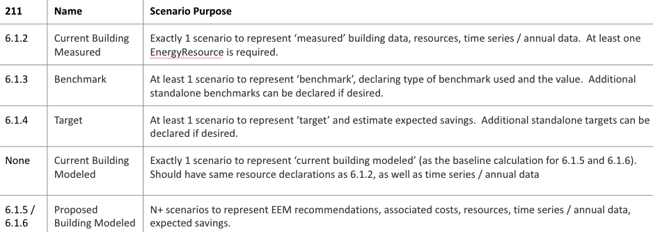
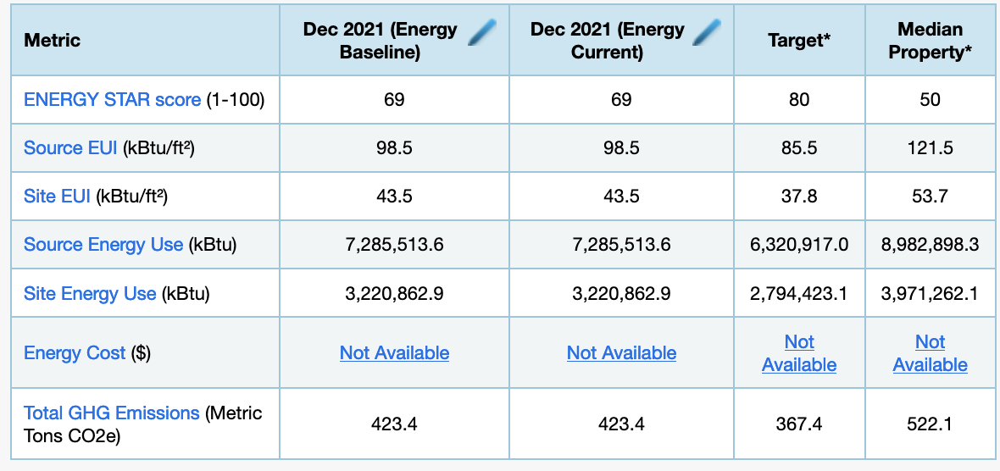
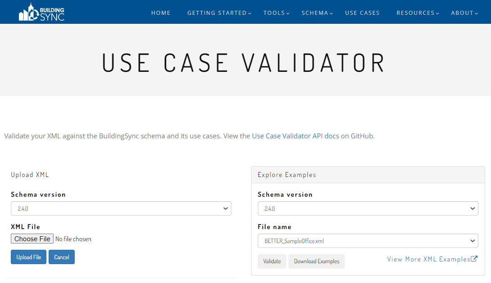
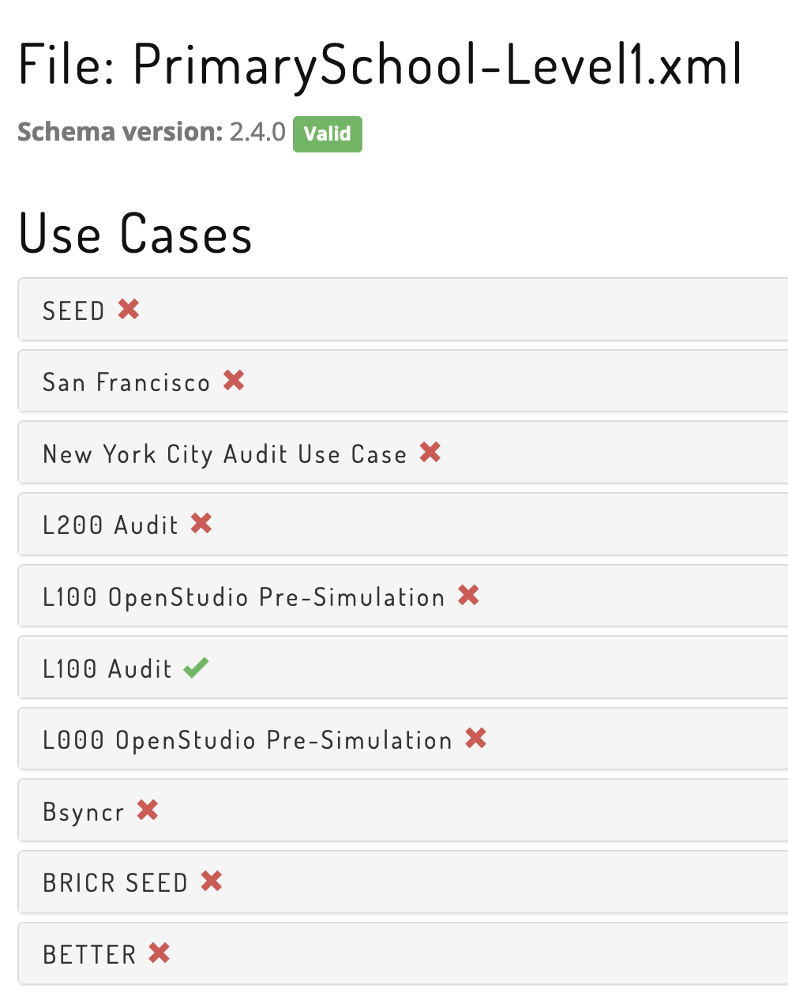

# Level 1-2 Audits of the DOE Primary School Prototype Building

This notebook will walk you through the creation of a BuildingSync file using bsyncpy. We are going to prepare a Level 1 and Level 2 audit for the DOE Primary School Prototype building.

Follow the instructions in the [README.md](../README.md) file to run this in Jupyter Lab/Notebook.

## 1. Pre-requisites

This notebook assumes that you have installed bsyncpy and all of its dependencies.

## 2. Useful information

This notebook uses resources from:

- the [DOE Commercial Prorotype buildings](https://www.energycodes.gov/prototype-building-models) repository
- ASHRAE [Standard 211](https://www.ashrae.org/technical-resources/bookstore/standards-180-and-211) for formal guidelines on energy audits
- the [BuildingSync schema documentation](https://buildingsync.net/dictionary/2.4.0/)
- the [notebook included in the bsync examples folder](./Small-Office-Level-1.md) for a comprehensive explanation on basic BuildingSync and bsyncpy concepts

## 3. Overview

This notebook is broken down into the following sections:
1) Setting up the root, or the base, of your BuildingSync file
2) Adding the information required for a Level 1 energy audit
3) Adding the information required for a Level 2 energy audit
4) Adding the information required for a Level 3 energy audit (WIP)
5) Generating a BuildingSync file and verifying it against version 2.4.0 of the BuildingSync schema


But first, let us import the required libraries and set up some useful functions:


```python
from bsyncpy import bsync
from lxml import etree
from datetime import datetime, date
import eeweather

def pretty_print(element):
    """Simple printing of an xml element from the bsync library"""
    print(etree.tostring(element.toxml(), pretty_print=True).decode('utf-8'))
    
def bsync_dump(root_element, file="example1.xml"):
    """Write the element to the specified file"""
    doctype = '<?xml version="1.0" encoding="UTF-8"?>'
    as_etree = root_element.toxml()
    as_etree.set("xmlns", "http://buildingsync.net/schemas/bedes-auc/2019")
 

    # Have to manually set the version right now. Align release of bsyncpy to this version.
    as_etree.set("version", "2.4.0")  
    output = etree.tostring(as_etree, doctype=doctype, pretty_print=True)
    with open(file, 'wb+') as f:
        f.write(output)
        return True
```

## 4. Setting up the root of the BuildingSync file

We are going to define the basic building blocks (ha!) of our representation of the primary school prototype building. For that, we need to define a buiding, which belongs to a site, which belongs to a facility, which belongs to the highest-level of our BuildingSync file: the BuildingSync root. It will look like this:
<BuildingSync>
  <Facilities>
    <Facility ID="My-Nice-Facility">
      <Sites>
        <Site ID="My-Beautiful-Site">
          <Buildings>
            <Building ID="My-Awesome-Building">
            </Building>
          </Buildings>
        </Site>
      </Sites>
    </Facility>
  </Facilities>
</BuildingSync>
For that, we will:
- define the BuildingSync root
- add a Facilities entity to it - as BuildingSync lets us define several facilities at once, should we need to
- add a Facility to our Facilities
- define a Sites entity for our Facility - because a Facility might have several sites
- define a Site within our Sites
- define a Buildings entity for our site - again, we might have several buildings
- finally, define the Primary School building


```python
# Defining the root is as easy as that
xmlargs = {
    'xmlns:xsi' : "http://www.w3.org/2001/XMLSchema-instance",
    'xsi:SchemaLocation' : "http://buildingsync.net/schemas/bedes-auc/2019 ../../../BuildingSync.xsd"
}

# xmlns:xsi = "http://www.w3.org/2001/XMLSchema-instance"
    # xsi:SchemaLocation = "http://buildingsync.net/schemas/bedes-auc/2019 ../../../BuildingSync.xsd"
root = bsync.BuildingSync()#**kwargs=xmlargs)
# We add facilities
facs = bsync.Facilities()
# We add a single facility within our facilities. Here, we need to define an ID for the facility
f1 = bsync.Facilities.Facility(ID="Facility-1")
# We do the same for the Sites that contain a Site which contains Buildings which include our Primary School building.
sites = bsync.Sites()
s1 = bsync.Sites.Site(ID="Site-1")
bldgs = bsync.Buildings()
b1 = bsync.Buildings.Building(ID="Building-Primary-School-Prototype")
```

We now have several entities, but we have not yet defined the relationship between them. How does BuildingSync know that "Facilities" belongs to the root? How does it know that the building belongs to the buildings which belong to... I am going to stop there, you now get the idea.

Well, bsyncpy just lets us "add" an element to another, quite literally:


```python
# we add the facilities (facs) to the root
root += facs
# and then we add Facility-1 (f1) to the facilities (facs)
facs += f1
# and we continue adding children to the parent elements, following the tree's branches all the way down to our building
f1 += sites
sites += s1
s1 += bldgs
bldgs += b1
```

And we verify the output of what we just did:


```python
pretty_print(root)
```

    <BuildingSync>
      <Facilities>
        <Facility ID="Facility-1">
          <Sites>
            <Site ID="Site-1">
              <Buildings>
                <Building ID="Building-Primary-School-Prototype"/>
              </Buildings>
            </Site>
          </Sites>
        </Facility>
      </Facilities>
    </BuildingSync>
    


This looks exactly like it was supposed to look. If you needed to add a different site, you would just need to add a child to the appropriate parent, in that case a Site to a group of Sites.
Now, let us carry on and start the Level 1 audit.

## 5. Level 1 audit

We refer to ASHRAE Standard 211, section 5.3, relevant to the Level 1 energy audit procedures.
For this audit, we will need to report:
1) a facility description (section 6.1.1.1)
2) the historical energy use (section 6.1.1.2)
3) a benchmark of the site EUI (section 6.1.1.3)
4) the target and estimate savings (section 6.1.1.4)
5) low-cost and no-cost energy efficiency measure recommendations (section 6.1.1.5)
6) potential capital energy efficiency measure recommendations (section 6.1.1.6)

In order to compile all this information, we will start by defining a Report entity for our Level 1 audit.


```python
reports = bsync.Reports()

# we create a linked building ID for our building (b1) which we will use in our Level 1 report
linkedbldgid = bsync.LinkedBuildingID(IDref=b1["ID"])

# we link this ID to a Building
linkedbldg = bsync.LinkedPremisesOrSystem.Building(linkedbldgid)

# and we link this building to a premise
premise = bsync.LinkedPremisesOrSystem(linkedbldg)

# and finally, we create a report linked to this premise
r1 = bsync.Report(premise, ID='Report-L1-Audit')

# Now, we link the report (r1) to the reports, and link those to the facility (f1)
f1 += reports
reports += r1


```

Now, we link the report to the facility, and the remaining elements where they belong according to the BuildingSync schema.


```python

```

### 5.1 Site description (Section 6.1.1)

ASHRAE Standard 211 requires that we describe the site in detail, so let us walk through section 6.1.1 and add the relevant elements.
First, we include elements that are direct children of the Building entity:


```python
# 6.1.1.1.a - name
b1 += bsync.PremisesName('Primary School Prototype')

# 6.1.1.1.m 
b1 += bsync.PremisesNotes("Here we record general problems / issues identified in a walkthrough survey.")

# 6.1.1.1.d - address
b1 += bsync.Address(
    bsync.StreetAddressDetail(
        bsync.Simplified(
            bsync.StreetAddress("15013 Denver West Parkway")
        )
    ),
    bsync.Address.State("CO"),
    bsync.City("Golden"),
    bsync.PostalCode("80401")
)

# 6.1.1.1.e - gross and conditioned floor area
b1_gfa = bsync.FloorArea(
    bsync.FloorAreaType("Gross"),
    bsync.FloorAreaValue(73960.0),
)
b1_cfa = bsync.FloorArea(
    bsync.FloorAreaType("Conditioned"),
    bsync.FloorAreaValue(73960.0),
)

b1 += bsync.FloorAreas(
    b1_gfa,
    b1_cfa
)

# 6.1.1.1.f - classification of the uses
b1 += bsync.BuildingClassification("Commercial")
b1 += bsync.OccupancyClassification("Education-Primary")
b1 += bsync.HistoricalLandmark(False)

# 6.1.1.1.h - for completeness, we spell this out explicitly
b1 += bsync.FloorsAboveGrade(1)
b1 += bsync.FloorsBelowGrade(0)
b1 += bsync.ConditionedFloorsAboveGrade(1)
b1 += bsync.ConditionedFloorsBelowGrade(0)

# 6.1.1.1.i - again, to be explicit, we define the latest remodel / retrofit year
# to be the same as the original build year to indicate nothing has happened since original construction
b1 += bsync.YearOfConstruction(2018)
b1 += bsync.YearOccupied(2018)
b1 += bsync.YearOfLastMajorRemodel(2018)

pretty_print(root)
```

    <BuildingSync>
      <Facilities>
        <Facility ID="Facility-1">
          <Sites>
            <Site ID="Site-1">
              <Buildings>
                <Building ID="Building-Primary-School-Prototype">
                  <PremisesName>Primary School Prototype</PremisesName>
                  <PremisesNotes>Here we record general problems / issues identified in a walkthrough survey.</PremisesNotes>
                  <Address>
                    <StreetAddressDetail>
                      <Simplified>
                        <StreetAddress>15013 Denver West Parkway</StreetAddress>
                      </Simplified>
                    </StreetAddressDetail>
                    <City>Golden</City>
                    <State>CO</State>
                    <PostalCode>80401</PostalCode>
                  </Address>
                  <BuildingClassification>Commercial</BuildingClassification>
                  <OccupancyClassification>Education-Primary</OccupancyClassification>
                  <FloorsAboveGrade>1</FloorsAboveGrade>
                  <FloorsBelowGrade>0</FloorsBelowGrade>
                  <ConditionedFloorsAboveGrade>1</ConditionedFloorsAboveGrade>
                  <ConditionedFloorsBelowGrade>0</ConditionedFloorsBelowGrade>
                  <HistoricalLandmark>false</HistoricalLandmark>
                  <FloorAreas>
                    <FloorArea>
                      <FloorAreaType>Gross</FloorAreaType>
                      <FloorAreaValue>73960.000000</FloorAreaValue>
                    </FloorArea>
                    <FloorArea>
                      <FloorAreaType>Conditioned</FloorAreaType>
                      <FloorAreaValue>73960.000000</FloorAreaValue>
                    </FloorArea>
                  </FloorAreas>
                  <YearOfConstruction>2018</YearOfConstruction>
                  <YearOccupied>2018</YearOccupied>
                  <YearOfLastMajorRemodel>2018</YearOfLastMajorRemodel>
                </Building>
              </Buildings>
            </Site>
          </Sites>
          <Reports>
            <Report ID="Report-L1-Audit">
              <LinkedPremisesOrSystem>
                <Building>
                  <LinkedBuildingID IDref="Building-Primary-School-Prototype"/>
                </Building>
              </LinkedPremisesOrSystem>
            </Report>
          </Reports>
        </Facility>
      </Facilities>
    </BuildingSync>
    


Now, let us add the contact information. Standard 211 requires that we define a building owner and an auditor. Contacts are created as "Contact" entities, then linked to the building (for the owner) or the report (for the auditor). 


```python
# we create a "Contacts" entity and link it to the facility
contacts = bsync.Contacts()
f1 += contacts

# 6.1.1.1.b - Owner and auditor contact info
c1 = bsync.Contact(
    bsync.ContactName("Bill Dean O'Nerr"),
    bsync.ContactCompany("ACME"),
    bsync.ContactRoles(
        bsync.ContactRole('Owner')
    ),
    bsync.ContactEmailAddresses(
        bsync.ContactEmailAddress(
            bsync.EmailAddress("bd.onerr@acme.net")
        )
    ),
    ID='Contact-Owner'
)
c2 = bsync.Contact(
    bsync.ContactName('Odette Or'),
    bsync.ContactCompany("La Audit Compagnie"),
    bsync.ContactRoles(
        bsync.ContactRole('Energy Auditor')
    ),
    bsync.ContactEmailAddresses(
        bsync.ContactEmailAddress(
            bsync.EmailAddress("odette.orr@la-audit-co.fr")
        )
    ),
    ID='Contact-Auditor'
)
# We add the two contacts to the correct parent
contacts += c1
contacts += c2

# We 'assign' (link) the owner as the primary contact for the building, though this
# could be an owners rep or some other contact type.
b1 += bsync.PrimaryContactID(IDref=c1['ID'])

# We link the auditor contact to the report
r1 += bsync.AuditorContactID(IDref=c2['ID'])
pretty_print(root)
```

    <BuildingSync>
      <Facilities>
        <Facility ID="Facility-1">
          <Sites>
            <Site ID="Site-1">
              <Buildings>
                <Building ID="Building-Primary-School-Prototype">
                  <PremisesName>Primary School Prototype</PremisesName>
                  <PremisesNotes>Here we record general problems / issues identified in a walkthrough survey.</PremisesNotes>
                  <Address>
                    <StreetAddressDetail>
                      <Simplified>
                        <StreetAddress>15013 Denver West Parkway</StreetAddress>
                      </Simplified>
                    </StreetAddressDetail>
                    <City>Golden</City>
                    <State>CO</State>
                    <PostalCode>80401</PostalCode>
                  </Address>
                  <BuildingClassification>Commercial</BuildingClassification>
                  <OccupancyClassification>Education-Primary</OccupancyClassification>
                  <PrimaryContactID IDref="Contact-Owner"/>
                  <FloorsAboveGrade>1</FloorsAboveGrade>
                  <FloorsBelowGrade>0</FloorsBelowGrade>
                  <ConditionedFloorsAboveGrade>1</ConditionedFloorsAboveGrade>
                  <ConditionedFloorsBelowGrade>0</ConditionedFloorsBelowGrade>
                  <HistoricalLandmark>false</HistoricalLandmark>
                  <FloorAreas>
                    <FloorArea>
                      <FloorAreaType>Gross</FloorAreaType>
                      <FloorAreaValue>73960.000000</FloorAreaValue>
                    </FloorArea>
                    <FloorArea>
                      <FloorAreaType>Conditioned</FloorAreaType>
                      <FloorAreaValue>73960.000000</FloorAreaValue>
                    </FloorArea>
                  </FloorAreas>
                  <YearOfConstruction>2018</YearOfConstruction>
                  <YearOccupied>2018</YearOccupied>
                  <YearOfLastMajorRemodel>2018</YearOfLastMajorRemodel>
                </Building>
              </Buildings>
            </Site>
          </Sites>
          <Reports>
            <Report ID="Report-L1-Audit">
              <AuditorContactID IDref="Contact-Auditor"/>
              <LinkedPremisesOrSystem>
                <Building>
                  <LinkedBuildingID IDref="Building-Primary-School-Prototype"/>
                </Building>
              </LinkedPremisesOrSystem>
            </Report>
          </Reports>
          <Contacts>
            <Contact ID="Contact-Owner">
              <ContactRoles>
                <ContactRole>Owner</ContactRole>
              </ContactRoles>
              <ContactName>Bill Dean O'Nerr</ContactName>
              <ContactCompany>ACME</ContactCompany>
              <ContactEmailAddresses>
                <ContactEmailAddress>
                  <EmailAddress>bd.onerr@acme.net</EmailAddress>
                </ContactEmailAddress>
              </ContactEmailAddresses>
            </Contact>
            <Contact ID="Contact-Auditor">
              <ContactRoles>
                <ContactRole>Energy Auditor</ContactRole>
              </ContactRoles>
              <ContactName>Odette Or</ContactName>
              <ContactCompany>La Audit Compagnie</ContactCompany>
              <ContactEmailAddresses>
                <ContactEmailAddress>
                  <EmailAddress>odette.orr@la-audit-co.fr</EmailAddress>
                </ContactEmailAddress>
              </ContactEmailAddresses>
            </Contact>
          </Contacts>
        </Facility>
      </Facilities>
    </BuildingSync>
    


### 5.2 Space Function Analysis
Relevant Standard 211 Sections:
- 5.3.4 Space Function Analysis

Space functions are used to define sections of a building used for different purposes. The classic example of this is a mixed use commercial real estate, with retail space on the bottom floor and offices in the remainder of the building. We do this in BuildingSync via the following:
- Each space functions gets its own `Section` element
- Each `Section` element should specify the `Section/SectionType` as "Space function"


```python
# We create a "Sections" entity that belongs to our building (b1)
sections = bsync.Sections()
b1 += sections
```

Let us break down the school into sections. We have:
- 12 classrooms
- one computer lab
- one bathroom
- one cafeteria
- one gym
- one kitchen
- one library
- one mechanical room
- one office
- 4 corridors

We need to create a definition for each of these sections. We will aggregate the classrooms together (TK check that).

#### 5.2.1 Office space


```python
# create a new section
office_sec = bsync.Sections.Section(ID="Offices")
office_sec += bsync.SectionType('Space function')
office_sec += bsync.OccupancyClassification("Office work area")
office_sec += bsync.OriginalOccupancyClassification("Education-Primary")
sections += office_sec

# add the floor area

# 5.3.4.a Gross floor area for the section (we also add conditioned for 5.3.4.f)
office_fas = bsync.FloorAreas(
    bsync.FloorArea(
        bsync.FloorAreaType("Gross"),
        bsync.FloorAreaValue(4746.88)
    ),
    bsync.FloorArea(
        bsync.FloorAreaType("Conditioned"),
        bsync.FloorAreaValue(4746.88)
    )
)

# 5.3.4.b and 5.3.4.c are asking for typical operating hours for the section
office_tous = bsync.TypicalOccupantUsages()
office_tou_hpw = bsync.TypicalOccupantUsage(
    bsync.TypicalOccupantUsageUnits("Hours per week"),
    bsync.TypicalOccupantUsageValue(45.0)
)
office_tou_wpy = bsync.TypicalOccupantUsage(
    bsync.TypicalOccupantUsageUnits("Weeks per year"),
    bsync.TypicalOccupantUsageValue(50.)
)
office_tous += office_tou_hpw
office_tous += office_tou_wpy

# 5.3.4.d looks for normal / design or peak occupancy.
office_occ_levels = bsync.OccupancyLevels()
office_occ_design = bsync.OccupancyLevel(
    bsync.OccupantQuantityType("Peak total occupants"),
    bsync.OccupantQuantity(23.73)
)
office_occ_levels += office_occ_design


# finally, we add these to the actual section element
office_sec += office_fas
office_sec += office_tous
office_sec += office_occ_levels
```

#### 5.2.2 Mechanical Room


```python
# create a new section
mech_sec = bsync.Sections.Section(ID="Mechanical-room")
mech_sec += bsync.SectionType('Space function')
mech_sec += bsync.OccupancyClassification("Mechanical room")
mech_sec += bsync.OriginalOccupancyClassification("Education-Primary")
sections += mech_sec

# add the floor area

# 5.3.4.a Gross floor area for the section (we also add conditioned for 5.3.4.f)
mech_fas = bsync.FloorAreas(
    bsync.FloorArea(
        bsync.FloorAreaType("Gross"),
        bsync.FloorAreaValue(2712.51)
    ),
    bsync.FloorArea(
        bsync.FloorAreaType("Conditioned"),
        bsync.FloorAreaValue(2712.51)
    )
)

# 5.3.4.b and 5.3.4.c are asking for typical operating hours for the section
mech_tous = bsync.TypicalOccupantUsages()
mech_tou_hpw = bsync.TypicalOccupantUsage(
    bsync.TypicalOccupantUsageUnits("Hours per week"),
    bsync.TypicalOccupantUsageValue(30.0)
)
mech_tou_wpy = bsync.TypicalOccupantUsage(
    bsync.TypicalOccupantUsageUnits("Weeks per year"),
    bsync.TypicalOccupantUsageValue(50.)
)
mech_tous += mech_tou_hpw
mech_tous += mech_tou_wpy

# 5.3.4.d looks for normal / design or peak occupancy.
# Here, we take values from the IDF as the building has been modelled: with no occupants in the mech room, bathroom or corridors.
mech_occ_levels = bsync.OccupancyLevels()
mech_occ_design = bsync.OccupancyLevel(
    bsync.OccupantQuantityType("Peak total occupants"),
    bsync.OccupantQuantity(0.)
)
mech_occ_levels += mech_occ_design

# finally, we add these to the actual section element
mech_sec += mech_fas
mech_sec += mech_tous
mech_sec += mech_occ_levels
```

#### 5.2.3 Library


```python
# create a new section
lib_sec = bsync.Sections.Section(ID="Library")
lib_sec += bsync.SectionType('Space function')
lib_sec += bsync.OccupancyClassification("Media center")
lib_sec += bsync.OriginalOccupancyClassification("Education-Primary")
sections += lib_sec

# add the floor area

# 5.3.4.a Gross floor area for the section (we also add conditioned for 5.3.4.f)
lib_fas = bsync.FloorAreas(
    bsync.FloorArea(
        bsync.FloorAreaType("Gross"),
        bsync.FloorAreaValue(4294.80)
    ),
    bsync.FloorArea(
        bsync.FloorAreaType("Conditioned"),
        bsync.FloorAreaValue(4294.80)
    )
)

# 5.3.4.b and 5.3.4.c are asking for typical operating hours for the section
lib_tous = bsync.TypicalOccupantUsages()
lib_tou_hpw = bsync.TypicalOccupantUsage(
    bsync.TypicalOccupantUsageUnits("Hours per week"),
    bsync.TypicalOccupantUsageValue(45.0)
)
lib_tou_wpy = bsync.TypicalOccupantUsage(
    bsync.TypicalOccupantUsageUnits("Weeks per year"),
    bsync.TypicalOccupantUsageValue(50.)
)
lib_tous += lib_tou_hpw
lib_tous += lib_tou_wpy

# 5.3.4.d looks for normal / design or peak occupancy.
# Here, we take values from the IDF as the building has been modelled: with no occupants in the mech room, bathroom or corridors.
lib_occ_levels = bsync.OccupancyLevels()
lib_occ_design = bsync.OccupancyLevel(
    bsync.OccupantQuantityType("Peak total occupants"),
    bsync.OccupantQuantity(42.9)
)
lib_occ_levels += lib_occ_design

# finally, we add these to the actual section element
lib_sec += lib_fas
lib_sec += lib_tous
lib_sec += lib_occ_levels
```

#### 5.2.4 Kitchen


```python
# create a new section
kitchen_sec = bsync.Sections.Section(ID="Kitchen")
kitchen_sec += bsync.SectionType('Space function')
kitchen_sec += bsync.OccupancyClassification("Kitchen")
kitchen_sec += bsync.OriginalOccupancyClassification("Education-Primary")
sections += kitchen_sec

# add the floor area

# 5.3.4.a Gross floor area for the section (we also add conditioned for 5.3.4.f)
kitchen_fas = bsync.FloorAreas(
    bsync.FloorArea(
        bsync.FloorAreaType("Gross"),
        bsync.FloorAreaValue(1808.33)
    ),
    bsync.FloorArea(
        bsync.FloorAreaType("Conditioned"),
        bsync.FloorAreaValue(1808.33)
    )
)

# 5.3.4.b and 5.3.4.c are asking for typical operating hours for the section
kitchen_tous = bsync.TypicalOccupantUsages()
kitchen_tou_hpw = bsync.TypicalOccupantUsage(
    bsync.TypicalOccupantUsageUnits("Hours per week"),
    bsync.TypicalOccupantUsageValue(45.0)
)
kitchen_tou_wpy = bsync.TypicalOccupantUsage(
    bsync.TypicalOccupantUsageUnits("Weeks per year"),
    bsync.TypicalOccupantUsageValue(50.)
)
kitchen_tous += kitchen_tou_hpw
kitchen_tous += kitchen_tou_wpy

# 5.3.4.d looks for normal / design or peak occupancy.
# Here, we take values from the IDF as the building has been modelled: with no occupants in the mech room, bathroom or corridors.
kitchen_occ_levels = bsync.OccupancyLevels()
kitchen_occ_design = bsync.OccupancyLevel(
    bsync.OccupantQuantityType("Peak total occupants"),
    bsync.OccupantQuantity(27.)
)
kitchen_occ_levels += kitchen_occ_design

# finally, we add these to the actual section element
kitchen_sec += kitchen_fas
kitchen_sec += kitchen_tous
kitchen_sec += kitchen_occ_levels
```

#### 5.2.5 Gym


```python
# create a new section
gym_sec = bsync.Sections.Section(ID="Gym")
gym_sec += bsync.SectionType('Space function')
gym_sec += bsync.OccupancyClassification("Sport play area")
gym_sec += bsync.OriginalOccupancyClassification("Education-Primary")
sections += gym_sec

# add the floor area

# 5.3.4.a Gross floor area for the section (we also add conditioned for 5.3.4.f)
gym_fas = bsync.FloorAreas(
    bsync.FloorArea(
        bsync.FloorAreaType("Gross"),
        bsync.FloorAreaValue(3842.71)
    ),
    bsync.FloorArea(
        bsync.FloorAreaType("Conditioned"),
        bsync.FloorAreaValue(3842.71)
    )
)

# 5.3.4.b and 5.3.4.c are asking for typical operating hours for the section
gym_tous = bsync.TypicalOccupantUsages()
gym_tou_hpw = bsync.TypicalOccupantUsage(
    bsync.TypicalOccupantUsageUnits("Hours per week"),
    bsync.TypicalOccupantUsageValue(25.0)
)
gym_tou_wpy = bsync.TypicalOccupantUsage(
    bsync.TypicalOccupantUsageUnits("Weeks per year"),
    bsync.TypicalOccupantUsageValue(50.)
)
gym_tous += gym_tou_hpw
gym_tous += gym_tou_wpy

# 5.3.4.d looks for normal / design or peak occupancy.
# Here, we take values from the IDF as the building has been modelled: with no occupants in the mech room, bathroom or corridors.
gym_occ_levels = bsync.OccupancyLevels()
gym_occ_design = bsync.OccupancyLevel(
    bsync.OccupantQuantityType("Peak total occupants"),
    bsync.OccupantQuantity(115.16)
)
gym_occ_levels += gym_occ_design

# finally, we add these to the actual section element
gym_sec += gym_fas
gym_sec += gym_tous
gym_sec += gym_occ_levels
```

##### 5.2.6 Cafeteria


```python
# create a new section
cafeteria_sec = bsync.Sections.Section(ID="Cafeteria")
cafeteria_sec += bsync.SectionType('Space function')
cafeteria_sec += bsync.OccupancyClassification("Dining area")
cafeteria_sec += bsync.OriginalOccupancyClassification("Education-Primary")
sections += cafeteria_sec

# add the floor area

# 5.3.4.a Gross floor area for the section (we also add conditioned for 5.3.4.f)
cafeteria_fas = bsync.FloorAreas(
    bsync.FloorArea(
        bsync.FloorAreaType("Gross"),
        bsync.FloorAreaValue(3390.63)
    ),
    bsync.FloorArea(
        bsync.FloorAreaType("Conditioned"),
        bsync.FloorAreaValue(3390.63)
    )
)

# 5.3.4.b and 5.3.4.c are asking for typical operating hours for the section
cafeteria_tous = bsync.TypicalOccupantUsages()
cafeteria_tou_hpw = bsync.TypicalOccupantUsage(
    bsync.TypicalOccupantUsageUnits("Hours per week"),
    bsync.TypicalOccupantUsageValue(30.0)
)
cafeteria_tou_wpy = bsync.TypicalOccupantUsage(
    bsync.TypicalOccupantUsageUnits("Weeks per year"),
    bsync.TypicalOccupantUsageValue(50.)
)
cafeteria_tous += cafeteria_tou_hpw
cafeteria_tous += cafeteria_tou_wpy

# 5.3.4.d looks for normal / design or peak occupancy.
# Here, we take values from the IDF as the building has been modelled: with no occupants in the mech room, bathroom or corridors.
cafeteria_occ_levels = bsync.OccupancyLevels()
cafeteria_occ_design = bsync.OccupancyLevel(
    bsync.OccupantQuantityType("Peak total occupants"),
    bsync.OccupantQuantity(338.7)
)
cafeteria_occ_levels += cafeteria_occ_design

# finally, we add these to the actual section element
cafeteria_sec += cafeteria_fas
cafeteria_sec += cafeteria_tous
cafeteria_sec += cafeteria_occ_levels
```

#### 5.2.7 Bathroom


```python
# create a new section
bath_sec = bsync.Sections.Section(ID="Bathroom")
bath_sec += bsync.SectionType('Space function')
bath_sec += bsync.OccupancyClassification("Restroom")
bath_sec += bsync.OriginalOccupancyClassification("Education-Primary")
sections += bath_sec

# add the floor area

# 5.3.4.a Gross floor area for the section (we also add conditioned for 5.3.4.f)
bath_fas = bsync.FloorAreas(
    bsync.FloorArea(
        bsync.FloorAreaType("Gross"),
        bsync.FloorAreaValue(2045.14)
    ),
    bsync.FloorArea(
        bsync.FloorAreaType("Conditioned"),
        bsync.FloorAreaValue(2045.14)
    )
)

# 5.3.4.b and 5.3.4.c are asking for typical operating hours for the section
bath_tous = bsync.TypicalOccupantUsages()
bath_tou_hpw = bsync.TypicalOccupantUsage(
    bsync.TypicalOccupantUsageUnits("Hours per week"),
    bsync.TypicalOccupantUsageValue(45.0)
)
bath_tou_wpy = bsync.TypicalOccupantUsage(
    bsync.TypicalOccupantUsageUnits("Weeks per year"),
    bsync.TypicalOccupantUsageValue(50.)
)
bath_tous += bath_tou_hpw
bath_tous += bath_tou_wpy

# 5.3.4.d looks for normal / design or peak occupancy.
# Here, we take values from the IDF as the building has been modelled: with no occupants in the mech room, bathroom or corridors.
bath_occ_levels = bsync.OccupancyLevels()
bath_occ_design = bsync.OccupancyLevel(
    bsync.OccupantQuantityType("Peak total occupants"),
    bsync.OccupantQuantity(0.)
)
bath_occ_levels += bath_occ_design

# finally, we add these to the actual section element
bath_sec += bath_fas
bath_sec += bath_tous
bath_sec += bath_occ_levels
```

#### 5.2.8 Computer Lab


```python
# create a new section
computerlab_sec = bsync.Sections.Section(ID="Computer-Lab")
computerlab_sec += bsync.SectionType('Space function')
computerlab_sec += bsync.OccupancyClassification("Computer lab")
computerlab_sec += bsync.OriginalOccupancyClassification("Education-Primary")
sections += computerlab_sec

# add the floor area

# 5.3.4.a Gross floor area for the section (we also add conditioned for 5.3.4.f)
computerlab_fas = bsync.FloorAreas(
    bsync.FloorArea(
        bsync.FloorAreaType("Gross"),
        bsync.FloorAreaValue(1743.75)
    ),
    bsync.FloorArea(
        bsync.FloorAreaType("Conditioned"),
        bsync.FloorAreaValue(1743.75)
    )
)

# 5.3.4.b and 5.3.4.c are asking for typical operating hours for the section
computerlab_tous = bsync.TypicalOccupantUsages()
computerlab_tou_hpw = bsync.TypicalOccupantUsage(
    bsync.TypicalOccupantUsageUnits("Hours per week"),
    bsync.TypicalOccupantUsageValue(65.0)
)
computerlab_tou_wpy = bsync.TypicalOccupantUsage(
    bsync.TypicalOccupantUsageUnits("Weeks per year"),
    bsync.TypicalOccupantUsageValue(50.)
)
computerlab_tous += computerlab_tou_hpw
computerlab_tous += computerlab_tou_wpy

# 5.3.4.d looks for normal / design or peak occupancy.
# Here, we take values from the IDF as the building has been modelled: with no occupants in the mech room, bathroom or corridors.
computerlab_occ_levels = bsync.OccupancyLevels()
computerlab_occ_design = bsync.OccupancyLevel(
    bsync.OccupantQuantityType("Peak total occupants"),
    bsync.OccupantQuantity(43.64)
)
computerlab_occ_levels += computerlab_occ_design

# finally, we add these to the actual section element
computerlab_sec += computerlab_fas
computerlab_sec += computerlab_tous
computerlab_sec += computerlab_occ_levels
```

#### 5.2.9 Classrooms

Here, we need to group the classrooms depending on which HVAC unit serves them. There are 3 "pods" defined in the Primary School prototype building, so we create them here.


```python
# create a new section
classroom1_sec = bsync.Sections.Section(ID="Classroom-Pod1")
classroom1_sec += bsync.SectionType('Space function')
classroom1_sec += bsync.OccupancyClassification("Classroom")
classroom1_sec += bsync.OriginalOccupancyClassification("Education-Primary")
sections += classroom1_sec

# add the floor area

# 5.3.4.a Gross floor area for the section (we also add conditioned for 5.3.4.f)
classroom1_fas = bsync.FloorAreas(
    bsync.FloorArea(
        bsync.FloorAreaType("Gross"),
        bsync.FloorAreaValue(12400.02)
    ),
    bsync.FloorArea(
        bsync.FloorAreaType("Conditioned"),
        bsync.FloorAreaValue(12400.02)
    )
)

# 5.3.4.b and 5.3.4.c are asking for typical operating hours for the section
classroom1_tous = bsync.TypicalOccupantUsages()
classroom1_tou_hpw = bsync.TypicalOccupantUsage(
    bsync.TypicalOccupantUsageUnits("Hours per week"),
    bsync.TypicalOccupantUsageValue(45.0)
)
classroom1_tou_wpy = bsync.TypicalOccupantUsage(
    bsync.TypicalOccupantUsageUnits("Weeks per year"),
    bsync.TypicalOccupantUsageValue(50.)
)
classroom1_tous += classroom1_tou_hpw
classroom1_tous += classroom1_tou_wpy

# 5.3.4.d looks for normal / design or peak occupancy.
# Here, we take values from the IDF as the building has been modelled: with no occupants in the mech room, bathroom or corridors.
classroom1_occ_levels = bsync.OccupancyLevels()
classroom1_occ_design = bsync.OccupancyLevel(
    bsync.OccupantQuantityType("Peak total occupants"),
    bsync.OccupantQuantity(309.7)
)
classroom1_occ_levels += classroom1_occ_design

# finally, we add these to the actual section element
classroom1_sec += classroom1_fas
classroom1_sec += classroom1_tous
classroom1_sec += classroom1_occ_levels
```


```python
# create a new section
classroom2_sec = bsync.Sections.Section(ID="Classroom-Pod2")
classroom2_sec += bsync.SectionType('Space function')
classroom2_sec += bsync.OccupancyClassification("Classroom")
classroom2_sec += bsync.OriginalOccupancyClassification("Education-Primary")
sections += classroom2_sec

# add the floor area

# 5.3.4.a Gross floor area for the section (we also add conditioned for 5.3.4.f)
classroom2_fas = bsync.FloorAreas(
    bsync.FloorArea(
        bsync.FloorAreaType("Gross"),
        bsync.FloorAreaValue(12400.02)
    ),
    bsync.FloorArea(
        bsync.FloorAreaType("Conditioned"),
        bsync.FloorAreaValue(12400.02)
    )
)

# 5.3.4.b and 5.3.4.c are asking for typical operating hours for the section
classroom2_tous = bsync.TypicalOccupantUsages()
classroom2_tou_hpw = bsync.TypicalOccupantUsage(
    bsync.TypicalOccupantUsageUnits("Hours per week"),
    bsync.TypicalOccupantUsageValue(45.0)
)
classroom2_tou_wpy = bsync.TypicalOccupantUsage(
    bsync.TypicalOccupantUsageUnits("Weeks per year"),
    bsync.TypicalOccupantUsageValue(50.)
)
classroom2_tous += classroom2_tou_hpw
classroom2_tous += classroom2_tou_wpy

# 5.3.4.d looks for normal / design or peak occupancy.
# Here, we take values from the IDF as the building has been modelled: with no occupants in the mech room, bathroom or corridors.
classroom2_occ_levels = bsync.OccupancyLevels()
classroom2_occ_design = bsync.OccupancyLevel(
    bsync.OccupantQuantityType("Peak total occupants"),
    bsync.OccupantQuantity(309.7)
)
classroom2_occ_levels += classroom2_occ_design

# finally, we add these to the actual section element
classroom2_sec += classroom2_fas
classroom2_sec += classroom2_tous
classroom2_sec += classroom2_occ_levels
```


```python
# create a new section
classroom3_sec = bsync.Sections.Section(ID="Classroom-Pod3")
classroom3_sec += bsync.SectionType('Space function')
classroom3_sec += bsync.OccupancyClassification("Classroom")
classroom3_sec += bsync.OriginalOccupancyClassification("Education-Primary")
sections += classroom3_sec

# add the floor area

# 5.3.4.a Gross floor area for the section (we also add conditioned for 5.3.4.f)
classroom3_fas = bsync.FloorAreas(
    bsync.FloorArea(
        bsync.FloorAreaType("Gross"),
        bsync.FloorAreaValue(10656.27)
    ),
    bsync.FloorArea(
        bsync.FloorAreaType("Conditioned"),
        bsync.FloorAreaValue(10656.27)
    )
)

# 5.3.4.b and 5.3.4.c are asking for typical operating hours for the section
classroom3_tous = bsync.TypicalOccupantUsages()
classroom3_tou_hpw = bsync.TypicalOccupantUsage(
    bsync.TypicalOccupantUsageUnits("Hours per week"),
    bsync.TypicalOccupantUsageValue(45.0)
)
classroom3_tou_wpy = bsync.TypicalOccupantUsage(
    bsync.TypicalOccupantUsageUnits("Weeks per year"),
    bsync.TypicalOccupantUsageValue(50.)
)
classroom3_tous += classroom3_tou_hpw
classroom3_tous += classroom3_tou_wpy

# 5.3.4.d looks for normal / design or peak occupancy.
# Here, we take values from the IDF as the building has been modelled: with no occupants in the mech room, bathroom or corridors.
classroom3_occ_levels = bsync.OccupancyLevels()
classroom3_occ_design = bsync.OccupancyLevel(
    bsync.OccupantQuantityType("Peak total occupants"),
    bsync.OccupantQuantity(266.12)
)
classroom3_occ_levels += classroom3_occ_design

# finally, we add these to the actual section element
classroom3_sec += classroom3_fas
classroom3_sec += classroom3_tous
classroom3_sec += classroom3_occ_levels
```

#### 5.2.10 Corridors

We need to do the same for the 4 corridor spaces, as each is serviced by a different VAV.


```python
# create a new section
corridor1_sec = bsync.Sections.Section(ID="Corridor-Pod1")
corridor1_sec += bsync.SectionType('Space function')
corridor1_sec += bsync.OccupancyClassification("Corridor")
corridor1_sec += bsync.OriginalOccupancyClassification("Education-Primary")
sections += corridor1_sec

# add the floor area

# 5.3.4.a Gross floor area for the section (we also add conditioned for 5.3.4.f)
corridor1_fas = bsync.FloorAreas(
    bsync.FloorArea(
        bsync.FloorAreaType("Gross"),
        bsync.FloorAreaValue(2066.67)
    ),
    bsync.FloorArea(
        bsync.FloorAreaType("Conditioned"),
        bsync.FloorAreaValue(2066.67)
    )
)

# 5.3.4.b and 5.3.4.c are asking for typical operating hours for the section
corridor1_tous = bsync.TypicalOccupantUsages()
corridor1_tou_hpw = bsync.TypicalOccupantUsage(
    bsync.TypicalOccupantUsageUnits("Hours per week"),
    bsync.TypicalOccupantUsageValue(45.0)
)
corridor1_tou_wpy = bsync.TypicalOccupantUsage(
    bsync.TypicalOccupantUsageUnits("Weeks per year"),
    bsync.TypicalOccupantUsageValue(50.)
)
corridor1_tous += corridor1_tou_hpw
corridor1_tous += corridor1_tou_wpy

# 5.3.4.d looks for normal / design or peak occupancy.
# Here, we take values from the IDF as the building has been modelled: with no occupants in the mech room, bathroom or corridors.
corridor1_occ_levels = bsync.OccupancyLevels()
corridor1_occ_design = bsync.OccupancyLevel(
    bsync.OccupantQuantityType("Peak total occupants"),
    bsync.OccupantQuantity(0.)
)
corridor1_occ_levels += corridor1_occ_design

# finally, we add these to the actual section element
corridor1_sec += corridor1_fas
corridor1_sec += corridor1_tous
corridor1_sec += corridor1_occ_levels
```


```python
# create a new section
corridor2_sec = bsync.Sections.Section(ID="Corridor-Pod2")
corridor2_sec += bsync.SectionType('Space function')
corridor2_sec += bsync.OccupancyClassification("Corridor")
corridor2_sec += bsync.OriginalOccupancyClassification("Education-Primary")
sections += corridor2_sec

# add the floor area

# 5.3.4.a Gross floor area for the section (we also add conditioned for 5.3.4.f)
corridor2_fas = bsync.FloorAreas(
    bsync.FloorArea(
        bsync.FloorAreaType("Gross"),
        bsync.FloorAreaValue(2066.67)
    ),
    bsync.FloorArea(
        bsync.FloorAreaType("Conditioned"),
        bsync.FloorAreaValue(2066.67)
    )
)

# 5.3.4.b and 5.3.4.c are asking for typical operating hours for the section
corridor2_tous = bsync.TypicalOccupantUsages()
corridor2_tou_hpw = bsync.TypicalOccupantUsage(
    bsync.TypicalOccupantUsageUnits("Hours per week"),
    bsync.TypicalOccupantUsageValue(45.0)
)
corridor2_tou_wpy = bsync.TypicalOccupantUsage(
    bsync.TypicalOccupantUsageUnits("Weeks per year"),
    bsync.TypicalOccupantUsageValue(50.)
)
corridor2_tous += corridor2_tou_hpw
corridor2_tous += corridor2_tou_wpy

# 5.3.4.d looks for normal / design or peak occupancy.
# Here, we take values from the IDF as the building has been modelled: with no occupants in the mech room, bathroom or corridors.
corridor2_occ_levels = bsync.OccupancyLevels()
corridor2_occ_design = bsync.OccupancyLevel(
    bsync.OccupantQuantityType("Peak total occupants"),
    bsync.OccupantQuantity(0.)
)
corridor2_occ_levels += corridor2_occ_design

# finally, we add these to the actual section element
corridor2_sec += corridor2_fas
corridor2_sec += corridor2_tous
corridor2_sec += corridor2_occ_levels
```


```python
# create a new section
corridor3_sec = bsync.Sections.Section(ID="Corridor-Pod3")
corridor3_sec += bsync.SectionType('Space function')
corridor3_sec += bsync.OccupancyClassification("Corridor")
corridor3_sec += bsync.OriginalOccupancyClassification("Education-Primary")
sections += corridor3_sec

# add the floor area

# 5.3.4.a Gross floor area for the section (we also add conditioned for 5.3.4.f)
corridor3_fas = bsync.FloorAreas(
    bsync.FloorArea(
        bsync.FloorAreaType("Gross"),
        bsync.FloorAreaValue(2066.67)
    ),
    bsync.FloorArea(
        bsync.FloorAreaType("Conditioned"),
        bsync.FloorAreaValue(2066.67)
    )
)

# 5.3.4.b and 5.3.4.c are asking for typical operating hours for the section
corridor3_tous = bsync.TypicalOccupantUsages()
corridor3_tou_hpw = bsync.TypicalOccupantUsage(
    bsync.TypicalOccupantUsageUnits("Hours per week"),
    bsync.TypicalOccupantUsageValue(45.0)
)
corridor3_tou_wpy = bsync.TypicalOccupantUsage(
    bsync.TypicalOccupantUsageUnits("Weeks per year"),
    bsync.TypicalOccupantUsageValue(50.)
)
corridor3_tous += corridor3_tou_hpw
corridor3_tous += corridor3_tou_wpy

# 5.3.4.d looks for normal / design or peak occupancy.
# Here, we take values from the IDF as the building has been modelled: with no occupants in the mech room, bathroom or corridors.
corridor3_occ_levels = bsync.OccupancyLevels()
corridor3_occ_design = bsync.OccupancyLevel(
    bsync.OccupantQuantityType("Peak total occupants"),
    bsync.OccupantQuantity(0.)
)
corridor3_occ_levels += corridor3_occ_design

# finally, we add these to the actual section element
corridor3_sec += corridor3_fas
corridor3_sec += corridor3_tous
corridor3_sec += corridor3_occ_levels
```


```python
# create a new section
corridormain_sec = bsync.Sections.Section(ID="Corridor-Main")
corridormain_sec += bsync.SectionType('Space function')
corridormain_sec += bsync.OccupancyClassification("Corridor")
corridormain_sec += bsync.OriginalOccupancyClassification("Education-Primary")
sections += corridormain_sec

# add the floor area

# 5.3.4.a Gross floor area for the section (we also add conditioned for 5.3.4.f)
corridormain_fas = bsync.FloorAreas(
    bsync.FloorArea(
        bsync.FloorAreaType("Gross"),
        bsync.FloorAreaValue(2066.67)
    ),
    bsync.FloorArea(
        bsync.FloorAreaType("Conditioned"),
        bsync.FloorAreaValue(2066.67)
    )
)

# 5.3.4.b and 5.3.4.c are asking for typical operating hours for the section
corridormain_tous = bsync.TypicalOccupantUsages()
corridormain_tou_hpw = bsync.TypicalOccupantUsage(
    bsync.TypicalOccupantUsageUnits("Hours per week"),
    bsync.TypicalOccupantUsageValue(45.0)
)
corridormain_tou_wpy = bsync.TypicalOccupantUsage(
    bsync.TypicalOccupantUsageUnits("Weeks per year"),
    bsync.TypicalOccupantUsageValue(50.)
)
corridormain_tous += corridormain_tou_hpw
corridormain_tous += corridormain_tou_wpy

# 5.3.4.d looks for normal / design or peak occupancy.
# Here, we take values from the IDF as the building has been modelled: with no occupants in the mech room, bathroom or corridors.
corridormain_occ_levels = bsync.OccupancyLevels()
corridormain_occ_design = bsync.OccupancyLevel(
    bsync.OccupantQuantityType("Peak total occupants"),
    bsync.OccupantQuantity(0.)
)
corridormain_occ_levels += corridormain_occ_design

# finally, we add these to the actual section element
corridormain_sec += corridormain_fas
corridormain_sec += corridormain_tous
corridormain_sec += corridormain_occ_levels
```

#### 5.2.11 Lobby


```python
# create a new section
lobby_sec = bsync.Sections.Section(ID="Lobby")
lobby_sec += bsync.SectionType('Space function')
lobby_sec += bsync.OccupancyClassification("Lobby")
lobby_sec += bsync.OriginalOccupancyClassification("Education-Primary")
sections += lobby_sec

# add the floor area

# 5.3.4.a Gross floor area for the section (we also add conditioned for 5.3.4.f)
lobby_fas = bsync.FloorAreas(
    bsync.FloorArea(
        bsync.FloorAreaType("Gross"),
        bsync.FloorAreaValue(1840.62)
    ),
    bsync.FloorArea(
        bsync.FloorAreaType("Conditioned"),
        bsync.FloorAreaValue(1840.62)
    )
)

# 5.3.4.b and 5.3.4.c are asking for typical operating hours for the section
lobby_tous = bsync.TypicalOccupantUsages()
lobby_tou_hpw = bsync.TypicalOccupantUsage(
    bsync.TypicalOccupantUsageUnits("Hours per week"),
    bsync.TypicalOccupantUsageValue(45.0)
)
lobby_tou_wpy = bsync.TypicalOccupantUsage(
    bsync.TypicalOccupantUsageUnits("Weeks per year"),
    bsync.TypicalOccupantUsageValue(50.)
)
lobby_tous += lobby_tou_hpw
lobby_tous += lobby_tou_wpy

# 5.3.4.d looks for normal / design or peak occupancy.
# Here, we take values from the IDF as the building has been modelled: with no occupants in the mech room, bathroom, lobby or corridors.
lobby_occ_levels = bsync.OccupancyLevels()
lobby_occ_design = bsync.OccupancyLevel(
    bsync.OccupantQuantityType("Peak total occupants"),
    bsync.OccupantQuantity(0.)
)
lobby_occ_levels += lobby_occ_design

# finally, we add these to the actual section element
lobby_sec += lobby_fas
lobby_sec += lobby_tous
lobby_sec += lobby_occ_levels
```

#### 5.2.12 Whole Building
Bsync requires that we specify a whole building section, so we do just that.


```python
# create a new section
wb_sec = bsync.Sections.Section(ID="Whole-Building")
wb_sec += bsync.SectionType('Whole building')
wb_sec += bsync.OccupancyClassification("Education-Primary")
#wb_sec += bsync.OriginalOccupancyClassification("Education-Primary")
sections += wb_sec

# add the floor area

# 5.3.4.a Gross floor area for the section (we also add conditioned for 5.3.4.f)
wb_fas = bsync.FloorAreas(
    bsync.FloorArea(
        bsync.FloorAreaType("Gross"),
        bsync.FloorAreaValue(73960.)
    ),
    bsync.FloorArea(
        bsync.FloorAreaType("Conditioned"),
        bsync.FloorAreaValue(73960.)
    )
)

# 5.3.4.b and 5.3.4.c are asking for typical operating hours for the section
wb_tous = bsync.TypicalOccupantUsages()
wb_tou_hpw = bsync.TypicalOccupantUsage(
    bsync.TypicalOccupantUsageUnits("Hours per week"),
    bsync.TypicalOccupantUsageValue(45.0)
)
wb_tou_wpy = bsync.TypicalOccupantUsage(
    bsync.TypicalOccupantUsageUnits("Weeks per year"),
    bsync.TypicalOccupantUsageValue(50.)
)
wb_tous += wb_tou_hpw
wb_tous += wb_tou_wpy

# 5.3.4.d looks for normal / design or peak occupancy.
# Here, we take values from the IDF as the building has been modelled: with no occupants in the mech room, bathroom, lobby or corridors.
wb_occ_levels = bsync.OccupancyLevels()
wb_occ_design = bsync.OccupancyLevel(
    bsync.OccupantQuantityType("Peak total occupants"),
    bsync.OccupantQuantity(1849.)
)
wb_occ_levels += wb_occ_design

# finally, we add these to the actual section element
wb_sec += wb_fas
wb_sec += wb_tous
wb_sec += wb_occ_levels
```

### 5.3 Plugs, lighting and HVAC

Level 1 and Level 2 energy audits require information about the primary systems serving a specific section, but with very different degrees of specificity. Taking guidance from the 211 Normative spreadsheet:
- A Level 1 audit just requires high level information
- A Level 2 audit requires doing some more detailed modeling of the actual system of interest (mainly for HVAC).


```python
systems = bsync.Systems()
# Systems, measures, reports and contacts belong to our facility (f1)
f1 += systems

# Let us automate the task this time
# We first create a list of dictionaries that contains information on space IDs and the appropriate plug load. The plug load is taken from the Primary School Prototype ASHRAE Standard 90.1-2016 model
# We take the IDs from the sections we created earlier
plugloads = [{'spaceid' : lobby_sec["ID"], 'plugload' : 4.0},
             {'spaceid' : corridor1_sec["ID"], 'plugload' : 4.0},
             {'spaceid' : corridor2_sec["ID"], 'plugload' : 4.0},
             {'spaceid' : corridor3_sec["ID"], 'plugload' : 4.0},
             {'spaceid' : corridormain_sec["ID"], 'plugload' : 4.0},
             {'spaceid' : classroom1_sec["ID"], 'plugload' : 15.0},
             {'spaceid' : classroom2_sec["ID"], 'plugload' : 15.0},
             {'spaceid' : classroom3_sec["ID"], 'plugload' : 15.0},
             {'spaceid' : computerlab_sec["ID"], 'plugload' : 20.0},
             {'spaceid' : bath_sec["ID"], 'plugload' : 4.0},
             {'spaceid' : cafeteria_sec["ID"], 'plugload' : 25.39},
             {'spaceid' : gym_sec["ID"], 'plugload' : 5.0},
             {'spaceid' : kitchen_sec["ID"], 'plugload' : 1630.3893},
             {'spaceid' : lib_sec["ID"], 'plugload' : 15.0},
             {'spaceid' : mech_sec["ID"], 'plugload' : 10.0},
             {'spaceid' : office_sec["ID"], 'plugload' : 10.8},
]

# Now we create a loop to assign the corresponding plug and process load to the appropriate section

plug_systems = bsync.PlugLoads()
systems += plug_systems

for section in plugloads:
    lp_pl = bsync.LinkedSectionID(IDref=section['spaceid'])
    psys = bsync.PlugLoad(
        bsync.WeightedAverageLoad(section['plugload']),
        bsync.LinkedPremises(
                bsync.LinkedPremises.Section(
                    lp_pl
                )
            ),
        ID=f"PlugLoad-{section['spaceid']}"
    )
    globals()[f"{section['spaceid'].lower().replace('-', '_')}_plugs_lp"] = lp_pl # we create a new variable so that we can add information later on
    plug_systems += psys
```


```python
# For the lighting systems, this is a bit different. When 
# performing an audit, it is atypical to know the LPD of a space / zone
# as you would in 'Energy Modeling' world / design world.
# Assuming drawings are unavailable and we go in to check,
# based on the vintage it's likely we will find T8 linear
# fluorescents (thanks Jay Wratten!). So we add that information
light_systems = bsync.LightingSystems()
systems += light_systems
for section in plugloads:
    lp_ls = bsync.LinkedSectionID(IDref=section['spaceid'])
    ls = bsync.LightingSystem(
        bsync.LampType(
            bsync.LinearFluorescent(
                bsync.LinearFluorescent.LampLabel("T8")
            )
        ),
        bsync.BallastType("Standard Electronic"),
        bsync.LinkedPremises(
            bsync.LinkedPremises.Section(
                lp_ls
            )
        ),
        ID=f"LightingSystem-{section['spaceid']}"
    )
    globals()[f"{section['spaceid'].lower().replace('-', '_')}_lights_lp"] = lp_ls
    globals()[f"lights_{section['spaceid'].lower().replace('-', '_')}"] = ls
    light_systems += ls
```


```python
# The Primary School prototype model has 3 packaged rooftop units (single-speed dx cooling and fuel fired furnace) and 4 packaged rooftop VAV with hot water reheat.
# We create them and link them back to the sections of interest.
# At this point, we aren't modeling separate HVAC zones.
# This level of detail fulfills requirements for a Level 1 audit

hvac_systems = bsync.HVACSystems()
systems+=hvac_systems
plugloads = [{'spaceid' : lobby_sec["ID"], 'plugload' : 4.0},
             {'spaceid' : corridor1_sec["ID"], 'plugload' : 4.0},
             {'spaceid' : corridor2_sec["ID"], 'plugload' : 4.0},
             {'spaceid' : corridor3_sec["ID"], 'plugload' : 4.0},
             {'spaceid' : corridormain_sec["ID"], 'plugload' : 4.0},
             {'spaceid' : classroom1_sec["ID"], 'plugload' : 15.0},
             {'spaceid' : classroom2_sec["ID"], 'plugload' : 15.0},
             {'spaceid' : classroom3_sec["ID"], 'plugload' : 15.0},
             {'spaceid' : computerlab_sec["ID"], 'plugload' : 20.0},
             {'spaceid' : bath_sec["ID"], 'plugload' : 4.0},
             {'spaceid' : cafeteria_sec["ID"], 'plugload' : 25.39},
             {'spaceid' : gym_sec["ID"], 'plugload' : 5.0},
             {'spaceid' : kitchen_sec["ID"], 'plugload' : 1630.3893},
             {'spaceid' : lib_sec["ID"], 'plugload' : 15.0},
             {'spaceid' : mech_sec["ID"], 'plugload' : 10.0},
             {'spaceid' : office_sec["ID"], 'plugload' : 10.8},
]

# First, the VAVs

# For the first VAV servicing pod 1:

vav1premises = bsync.LinkedPremises()
vav1sections = bsync.LinkedPremises.Section()
vav1premises += vav1sections
for section in [corridor1_sec["ID"], classroom1_sec["ID"]]:
    sid = bsync.LinkedSectionID(IDref=section)
    globals()[f"vav1_{section.lower().replace('-', '_')}_ls"] = sid
    vav1sections += sid

vav_pod1 = bsync.HVACSystem(
        bsync.PrincipalHVACSystemType("Packaged Rooftop VAV with Hot Water Reheat"),
        vav1premises,
        ID="VAV-Pod1"
    )

# For the second VAV servicing pod 2:

vav2premises = bsync.LinkedPremises()
vav2sections = bsync.LinkedPremises.Section()
vav2premises += vav2sections
for section in [corridor2_sec["ID"], classroom2_sec["ID"]]:
    sid = bsync.LinkedSectionID(IDref=section)
    globals()[f"vav2_{section.lower().replace('-', '_')}_ls"] = sid
    vav2sections += sid

vav_pod2 = bsync.HVACSystem(
        bsync.PrincipalHVACSystemType("Packaged Rooftop VAV with Hot Water Reheat"),
        vav2premises,
        ID="VAV-Pod2"
    )

# For the third VAV servicing pod 3:
vav3premises = bsync.LinkedPremises()
vav3sections = bsync.LinkedPremises.Section()
vav3premises += vav3sections
for section in [corridor3_sec["ID"], classroom3_sec["ID"]]:
    sid = bsync.LinkedSectionID(IDref=section)
    globals()[f"vav3_{section.lower().replace('-', '_')}_ls"] = sid
    vav3sections += sid

vav_pod3 = bsync.HVACSystem(
        bsync.PrincipalHVACSystemType("Packaged Rooftop VAV with Hot Water Reheat"),
        vav3premises,
        ID="VAV-Pod3"
    )

# For the last VAV servicing other rooms:
vav4premises = bsync.LinkedPremises()
vav4sections = bsync.LinkedPremises.Section()
vav4premises += vav4sections
for section in [computerlab_sec["ID"], corridormain_sec["ID"], lobby_sec["ID"], mech_sec["ID"],
               bath_sec["ID"], office_sec["ID"], lib_sec["ID"]]:
    sid = bsync.LinkedSectionID(IDref=section)
    globals()[f"vav4_{section.lower().replace('-', '_')}_ls"] = sid
    vav4sections += sid

vav_other = bsync.HVACSystem(
        bsync.PrincipalHVACSystemType("Packaged Rooftop VAV with Hot Water Reheat"),
        vav4premises,
        ID="VAV-other"
    )

# Now, the packaged single-zone constant air volume rooftop units with multi speed DX coil and fuel-fired furnace

# For the first PSZ-AC:
pszac_gym_ls = bsync.LinkedSectionID(IDref=gym_sec["ID"])
pszac_1 = bsync.HVACSystem(
        bsync.PrincipalHVACSystemType("Packaged Rooftop Air Conditioner"),
        bsync.LinkedPremises(bsync.LinkedPremises.Section(pszac_gym_ls)),
        ID="PSZAC-Gym"
    )

# For the second PSZ-AC:
pszac_kitchen_ls = bsync.LinkedSectionID(IDref=kitchen_sec["ID"])
pszac_2 = bsync.HVACSystem(
        bsync.PrincipalHVACSystemType("Packaged Rooftop Air Conditioner"),
        bsync.LinkedPremises(bsync.LinkedPremises.Section(pszac_kitchen_ls)),
        ID="PSZAC-Kitchen"
    )

# For the last PSZ-AC:
pszac_cafeteria_ls = bsync.LinkedSectionID(IDref=cafeteria_sec["ID"])
pszac_3 = bsync.HVACSystem(
        bsync.PrincipalHVACSystemType("Packaged Rooftop Air Conditioner"),
        bsync.LinkedPremises(bsync.LinkedPremises.Section(pszac_cafeteria_ls)),
        ID="PSZAC-Cafeteria"
    )

hvac_systems += vav_pod1
hvac_systems += vav_pod2
hvac_systems += vav_pod3
hvac_systems += vav_other
hvac_systems += pszac_1
hvac_systems += pszac_2
hvac_systems += pszac_3

    
```

### 5.4 Current Building Measured Scenario
Relevant Standard 211 Sections:
- 6.1.2

Now that we have a quick sense of the building, let's start off by looking at the requirements for an ASHRAE 211 Level 1 audit. This leads us to the concept of a [Scenario](https://buildingsync.net/schema/v2.3.0/documentation/BuildingSync_xsd.html#ScenarioType). A Scenario in BuildingSync is used to refer to energy and timeseries data associated with a particular, well, scenario. Specifically, there are 5 primary Scenarios used in BuildingSync, all which relate back to Standard 211:



We will repeatedly come back to the concept of a Scenario, as they are core to organizing information in a BuildingSync document. 

The current building measured scenario is intended to capture true measured historical data. Typically this refers to utility bill data, but AMI type data can also be captured (later).  We start off by creating a new scenario element and defining its type as follows:
- `Scenario[ScenarioType/CurrentBuilding/CalculationMethod/Measured]`. This is an XPath expression that can be interpreted as "A Scenario that has the child elements ScenarioType/CurrentBuilding/CalculationMethod/Measured".  The XML for this would look like:

<Scenario>
    <ScenarioType>
        <CurrentBuilding>
            <CalculationMethod>
                <Measured/>
            </CalculationMethod>
        </CurrentBuilding>
    </ScenarioType>
</Scenario>


We build this scenario up programatically as follows:


```python
# Create a section for scenarios
scenarios = bsync.Scenarios()
r1 += scenarios
# define the current building measured scenario (cbms)
cbms = bsync.Scenario(
    bsync.Scenario.ScenarioType(
        bsync.CurrentBuilding(
            bsync.CalculationMethod(
                bsync.Measured()
            )
        )
    ),
    bsync.LinkedPremises(
        bsync.LinkedPremises.Building(
            bsync.LinkedBuildingID(IDref=b1["ID"])
        )
    )
)
cbms['ID'] = 'Scenario-1'

# add the scenario to the audit report and scenarios parent grouping
scenarios += cbms
```

#### 5.4.1 Utilities
Relevant Standard 211 Sections: 6.1.2
In the next section, we will create resource use elements to define energy data. First, we need to get add utility information. Utility information gets added at the report level. Specific information required includes:
- Rate schedules (you can get very expressive in BuildingSync with Rate Schedules - we keep it pretty minimal here)
- Utility account numbers


```python
# we define two flat rate periods
utilities = bsync.Utilities()
r1 += utilities
elec_ut = bsync.Utility(
    bsync.RateSchedules(
        bsync.RateSchedule(
            bsync.TypeOfRateStructure(
                bsync.FlatRate(
                    bsync.FlatRate.RatePeriods(
                        bsync.FlatRate.RatePeriods.RatePeriod(
                                bsync.ApplicableStartDateForEnergyRate(date(2019,1,1)),
                                bsync.ApplicableEndDateForEnergyRate(date(2020,1,1)),
                                bsync.EnergyCostRate(0.00461),
                                bsync.ApplicableStartDateForDemandRate(date(2019,1,1)),
                                bsync.ApplicableEndDateForDemandRate(date(2020,1,1)),
                                bsync.ElectricDemandRate(5.63)
                        )
                    )
                    
                )
            ),
            bsync.ReferenceForRateStructure("https://www.xcelenergy.com/staticfiles/xe/Regulatory/COBusRates.pdf"),
            bsync.FixedMonthlyCharge(36.17),
            ID="RateSchedule-Electricity"
        )
    ),
    bsync.UtilityName("XCEL Energy"),
    bsync.UtilityAccountNumber("some-account-number"),
    ID="Utility-Electric"
)
ng_ut = bsync.Utility(
    bsync.RateSchedules(
        bsync.RateSchedule(
            bsync.TypeOfRateStructure(
                bsync.FlatRate(
                    bsync.FlatRate.RatePeriods(
                        bsync.FlatRate.RatePeriods.RatePeriod(
                            bsync.ApplicableStartDateForEnergyRate(date(2019,1,1)),
                            bsync.ApplicableEndDateForEnergyRate(date(2020,1,1)),
                            bsync.EnergyCostRate(1.158) # $/MMBtu
                        )
                    )
                )
            ),
            bsync.ReferenceForRateStructure("https://www.xcelenergy.com/staticfiles/xe/Regulatory/COBusRates.pdf"),
            ID="RateSchedule-Natural-Gas"
        )
    ),
    bsync.UtilityName("XCEL Energy"),
    bsync.UtilityAccountNumber("some-other-account-number"),
    ID="Utility-Natural-Gas"
)

utilities += elec_ut
utilities += ng_ut

```


#### 5.4.2 ResourceUses and TimeSeries Data
Now that we have a current building measured scenario, we want to declare energy and monthly billing data. Per Std 211 6.1.2.1, a minimum of 12 months (preferably up to 3 years) of energy use data is required. We run an example simulation to get estimates for this, which come out as follows:

| Resource Type | Jan | Feb | Mar | Apr | May | Jun | Jul | Aug | Sep | Oct | Nov | Dec |
| --- | --- | --- | --- | --- | --- | --- | --- | --- | --- | --- | --- | --- |
| Electricity (kWh) | 52651.67 | 46018.33 | 52645.00 | 49929.17 | 58176.39 | 66276.94 | 52738.06 | 56057.78 | 60436.11 | 57091.67 | 51428.89 | 50311.11 |
| Natural Gas (MMBtu) | 164.43 | 143.11 | 102.60 | 59.73 | 49.42 | 39.98 | 36.71 | 40.76 | 37.69 | 60.47 | 86.44 | 168.89 |
| GHG Emissions (MtCO2e) | 250.0 | 240.0 | 260.0 | 250.0 | 260.0 | 230.0 | 280.0 | 270.0 | 260.0 | 250.0 | 240.0 | 250.0 |

In BuildingSync land, we need to declare an resource use for each resource type. Standard, allowable enumerations exist for this already. We do this as follows:


```python
all_ru = bsync.ResourceUses()

# create a resource use for electricity, units of kWh, all end uses
# we also add info about the 'peak' units
# we also connect it up to a utility
elec_ru = bsync.ResourceUse(
    bsync.EnergyResource('Electricity'),
    bsync.ResourceUseNotes("This is required for L1 to document irregularities in monthly energy patterns (Std 211 6.1.2.1.j). No irregularities found."),
    bsync.ResourceUnits('kWh'),
    bsync.PeakResourceUnits('kW'),
    bsync.EndUse('All end uses'),
    bsync.UtilityIDs(
        bsync.UtilityID(IDref=elec_ut['ID'])
    )
)

# given the above, we add the annual totals
elec_ru += bsync.AnnualFuelUseNativeUnits(653761.11)
elec_ru += bsync.AnnualFuelUseConsistentUnits(2230.84) #convert to MMBTU
elec_ru += bsync.AnnualPeakNativeUnits(248431.13) # kW as specified above
elec_ru += bsync.AnnualPeakConsistentUnits(248431.13) # already in kW, same as above
elec_ru += bsync.AnnualFuelCost(16412.13)

# create a resource use for greenhouse gas emissions, units of MtCO2e, all end uses


elec_ru += bsync.Emissions(
            bsync.Emission(
                bsync.EmissionBoundary("Indirect"), 
                bsync.EmissionsType("CO2e"),
                bsync.EmissionsFactor(0.000506662677),
                bsync.EmissionsFactorSource('Utility'),
                bsync.GHGEmissions(331.23635),
        )
    )

# create a resource use for natural gas, units of MMBtu, all end uses
# additional connect it up to the utility
ng_ru = bsync.ResourceUse(
    bsync.EnergyResource('Natural gas'),
    bsync.ResourceUseNotes("No irregularities in monthly energy consumption found."),
    bsync.ResourceUnits('MMBtu'),
    bsync.EndUse('All end uses'),
    bsync.UtilityIDs(
        bsync.UtilityID(IDref=ng_ut['ID'])
    )
)

ng_ru += bsync.Emissions(
            bsync.Emission(
                bsync.EmissionBoundary("Indirect"), 
                bsync.EmissionsType("CO2e"),
                bsync.EmissionsFactor(14.43),
                bsync.EmissionsFactorSource('US EPA'),
                bsync.GHGEmissions(14357.1285),
        )
    )

# given the above, we add the annual totals
ng_ru += bsync.AnnualFuelUseNativeUnits(994.95)
ng_ru += bsync.AnnualFuelUseConsistentUnits(994.95) # already in MMBTU
ng_ru += bsync.AnnualFuelCost(1152.52) # ~ $1.158/MMBtu

# add these to the ResourceUses parent element
all_ru += elec_ru
all_ru += ng_ru

# we can still add information to the child elements
elec_ru['ID'] = 'ResourceUse-Electricity'
ng_ru['ID'] = 'ResourceUse-Natural-gas'

# ResourceUses are child elements of a specific scenario:
cbms += all_ru
```

#### Example TimeSeries Walkthrough
Now that we have resource uses, we want to associate timeseries data to those specific resources. We will assume the utility billing data is nicely segmented for us and each billing period starts on the 1st of the month and ends on the last day. We use BuildingSync TimeSeries elements to store temporal data. We walk through creating a simple timeseries element to capture January's electricity consumption.


```python
# all timeseries is captured in a TimeSeriesData parent
ts_data = bsync.TimeSeriesData()

# Create a new TimeSeries element for Electricity
jan_elec = bsync.TimeSeries(ID="TS-Example")

# a ReadingType of 'Total' signifies a summation / integral over the time period specified
jan_elec += bsync.ReadingType('Total')

# A TimeSeriesReadingQuantity isn't necessary for timeseries specific to a ResourceUse since we will 'point back to'
# the resource use later, however, verbosity never hurts
jan_elec += bsync.TimeSeriesReadingQuantity('Energy')

# Add start and end timestamps. XSD datatypes are translated into python datatypes
# within the bsync package. For example, the xs:dateTime datatype, we need to provide python datetime object

# this_will_fail = bsync.TimeSeriesData.TimeSeries.StartTimestamp('2019-01-01T00:00:00')

# we need to do something like this
start_dt = datetime(2021, 1, 1, 0, 0)
end_dt = datetime(2021, 2, 1, 0, 0)

# in bsync, a StartTimetamp is inclusive and an EndTimestamp is exclusive
# the interval notation for the above would be like:
# [ start, end ) 
jan_elec += bsync.StartTimestamp(start_dt)
jan_elec += bsync.EndTimestamp(end_dt)

# next, we convey the IntervalReading, i.e. the value.
# The value should use the same units as declared by the ResourceUse/ResourceUnits
jan_elec += bsync.IntervalReading(52651.67)

# finally, we need to convey to which resource this timeseries element is 'connected',
# i.e. the value represented by this reading conveys information for the Electricity resource use
jan_elec += bsync.ResourceUseID(IDref=elec_ru['ID'])

# and we add this as a child to the TimeSeriesData element
ts_data += jan_elec
pretty_print(ts_data)
```

    <TimeSeriesData>
      <TimeSeries ID="TS-Example">
        <ReadingType>Total</ReadingType>
        <TimeSeriesReadingQuantity>Energy</TimeSeriesReadingQuantity>
        <StartTimestamp>2021-01-01T00:00:00</StartTimestamp>
        <EndTimestamp>2021-02-01T00:00:00</EndTimestamp>
        <IntervalReading>52651.670000</IntervalReading>
        <ResourceUseID IDref="ResourceUse-Electricity"/>
      </TimeSeries>
    </TimeSeriesData>
    


```python
# Create a new TimeSeries element now for GHG Emissions
jan_ghg_elec = bsync.TimeSeries(ID="TS-ResourceUse-MtCO2e-1")

# a ReadingType of 'Total' signifies a summation / integral over the time period specified
jan_ghg_elec += bsync.ReadingType('Total')

# A TimeSeriesReadingQuantity isn't necessary for timeseries specific to a ResourceUse since we will 'point back to'
# the resource use later, however, verbosity never hurts
jan_ghg_elec += bsync.TimeSeriesReadingQuantity('Other')

# Add start and end timestamps. XSD datatypes are translated into python datatypes
# within the bsync package. For example, the xs:dateTime datatype, we need to provide python datetime object

# this_will_fail = bsync.TimeSeriesData.TimeSeries.StartTimestamp('2019-01-01T00:00:00')

# we need to do something like this
start_dt = datetime(2021, 1, 1, 0, 0)
end_dt = datetime(2021, 2, 1, 0, 0)

# in bsync, a StartTimetamp is inclusive and an EndTimestamp is exclusive
# the interval notation for the above would be like:
# [ start, end ) 
jan_ghg_elec += bsync.StartTimestamp(start_dt)
jan_ghg_elec += bsync.EndTimestamp(end_dt)

# next, we convey the IntervalReading, i.e. the value.
# The value should use the same units as declared by the ResourceUse/ResourceUnits
jan_ghg_elec += bsync.IntervalReading(250.0)

# finally, we need to convey to which resource this timeseries element is 'connected',
# i.e. the value represented by this reading conveys information for the GHG Emissions resource use
jan_ghg_elec += bsync.ResourceUseID(IDref=elec_ru['ID'])

# and we add this as a child to the TimeSeriesData element
ts_data += jan_ghg_elec
pretty_print(ts_data)
```

    <TimeSeriesData>
      <TimeSeries ID="TS-Example">
        <ReadingType>Total</ReadingType>
        <TimeSeriesReadingQuantity>Energy</TimeSeriesReadingQuantity>
        <StartTimestamp>2021-01-01T00:00:00</StartTimestamp>
        <EndTimestamp>2021-02-01T00:00:00</EndTimestamp>
        <IntervalReading>52651.670000</IntervalReading>
        <ResourceUseID IDref="ResourceUse-Electricity"/>
      </TimeSeries>
      <TimeSeries ID="TS-ResourceUse-MtCO2e-1">
        <ReadingType>Total</ReadingType>
        <TimeSeriesReadingQuantity>Other</TimeSeriesReadingQuantity>
        <StartTimestamp>2021-01-01T00:00:00</StartTimestamp>
        <EndTimestamp>2021-02-01T00:00:00</EndTimestamp>
        <IntervalReading>250.000000</IntervalReading>
        <ResourceUseID IDref="ResourceUse-Electricity"/>
      </TimeSeries>
    </TimeSeriesData>
    


#### 5.4.3 All TimeSeries Data
The following cell simply performs the following:
1. Create a simple function to generate monthly timeseries elements for each resource use
2. Add it to a `TimeSeriesData` parent element
3. Add this back to the previously defined current building measured scenario (i.e. Scenario-1)


```python
full_ts_data = bsync.TimeSeriesData()

# usage and peak data
monthly_elec = [
    52651.67,
    46018.33,
    52645.00,
    49929.17,
    58176.39,
    66276.94,
    52738.06,
    56057.78,
    60436.11,
    57091.67,
    51428.89,
    50311.11
]
monthly_ng = [
    165.21,
    143.79,
    103.09,
    60.02,
    49.66,
    40.18,
    36.89,
    40.95,
    37.87,
    60.75,
    86.85,
    169.70
]
monthly_elec_peak = [
    167.37499,
    155.85146,
    165.63322,
    191.06624,
    219.52640,
    248.43113,
    181.33196,
    178.14853,
    227.07502,
    223.75804,
    194.37702,
    150.13532

]

# costs data
monthly_elec_cost = [
    1221.22,
    1125.76,
    1211.38,
    1342.05,
    1540.30,
    1740.37,
    1300.19,
    1297.57,
    1593.21,
    1559.12,
    1367.60,
    1113.37

]
monthly_ng_cost = [
    191.31,
    166.50,
    119.38,
    69.50,
    57.50,
    46.52,
    42.72,
    47.43,
    43.86,
    70.35,
    100.58,
    196.51
]

elec_ids = []
ng_ids = []
def create_monthly(values, resource_use_id, start_year, tsrq='Energy', rt='Total'):
    """
    tsrq: One of Energy, Power, Cost, Greenhouse Gas Emissions
    rt: One of Total, Peak, Cost
    """
    monthly = []
    end_year = start_year
    for i, val in enumerate(values, start=1):
        if i % 12 == 0:
            start_month = 12
            end_month = 1
            end_year += 1
        else:
            start_month = i % 12
            end_month = start_month + 1
        start_dt = datetime(start_year, start_month, 1)
        end_dt = datetime(end_year, end_month, 1)

        if tsrq == 'Other':
            my_id = f"TS-{resource_use_id}-{start_month}"
        else:
            my_id = f"TS-{resource_use_id}-{tsrq.replace(' ', '-')}-{start_month}"
        ts = bsync.TimeSeries(
            bsync.ReadingType(rt),
            bsync.TimeSeriesReadingQuantity(tsrq),
            bsync.StartTimestamp(start_dt),
            bsync.EndTimestamp(end_dt),
            bsync.IntervalDuration(1),
            bsync.IntervalDurationUnits("Month"),
            bsync.IntervalFrequency("Month"),
            bsync.IntervalReading(float(val)),
            bsync.ResourceUseID(IDref=resource_use_id),
            ID=my_id
        )
        if rt == 'Peak':
            ts += bsync.PeakType("Unknown")
        monthly.append(ts)
        
        if tsrq == 'Energy':
            if 'Electricity' in resource_use_id:
                elec_ids.append(my_id)
            else:
                ng_ids.append(my_id)
    return monthly
    
elec_ts = create_monthly(monthly_elec, elec_ru['ID'], 2021)
ng_ts = create_monthly(monthly_ng, ng_ru['ID'], 2021)
elec_peak_ts = create_monthly(monthly_elec_peak, elec_ru['ID'], 2021, 'Power', 'Peak')

elec_cost_ts = create_monthly(monthly_elec_cost, elec_ru['ID'], 2021, 'Cost', 'Cost')
ng_cost_ts = create_monthly(monthly_ng_cost, ng_ru['ID'], 2021, 'Cost', 'Cost')
 
def add_to_full(months, full):
    for month in months:
        full += month

add_to_full(elec_ts, full_ts_data)
add_to_full(ng_ts, full_ts_data)
add_to_full(elec_peak_ts, full_ts_data)
add_to_full(elec_cost_ts, full_ts_data)
add_to_full(ng_cost_ts, full_ts_data)

    
cbms += full_ts_data
```

#### 5.4.5 Linked TimeSeriesIDs
Due to the fact that annual data reporting is dependent on which months / utility bill periods were used to calculate the annual total, the `AnnualFuelUseLinkedTimeSeriesIDs` element was introduced. It is required to specify exactly which months for each resource use were used in the calculation of the `AnnualFuelUseNativeUnits` and `AnnualFuelUseConsistentUnits` elements. We add this element below.


```python
elec_linked_ids = bsync.AnnualFuelUseLinkedTimeSeriesIDs()
for each_id in elec_ids:
    elec_linked_ids += bsync.LinkedTimeSeriesID(IDref=each_id)
    

ng_linked_ids = bsync.AnnualFuelUseLinkedTimeSeriesIDs()
for each_id in ng_ids:
    ng_linked_ids += bsync.LinkedTimeSeriesID(IDref=each_id)
    
elec_ru += elec_linked_ids
ng_ru += ng_linked_ids
```

#### 5.4.6 All Resource Totals

We have defined monthly electricity (energy, power, cost) and natural gas (energy, cost) usage as timeseries elements. Now we basically just need to summarize these into site and source energy use totals. We use the `Scenario/AllResourceTotals/AllResourceTotal` element to achieve this. The Level 1 use case requires annual energy reporting to follow Standard 105s methodology including:

- `SiteEnergyUse`: Corresponds to $E_{site}$
- `BuildingEnergyUse`: Corresponds to $E_{bld}$
- `ImportedEnergyConsistentUnits`: Corresponds to $E_{imp}$
- `OnsiteEnergyProductionConsistentUnits`: Corresponds to $E_{g}$
- `ExportedEnergyConsistentUnits`: Corresponds to $E_{exp}$
- `NetIncreaseInStoredEnergyConsistentUnits`: Corresponds to $E_{s}$


```python
art = bsync.AllResourceTotals(
    bsync.AllResourceTotal(
        bsync.AllResourceTotal.SiteEnergyUse(3236419.05), # reported in kBtu
        bsync.SiteEnergyUseIntensity(43.75), # reported in kbtu/ft2
        
        # Since there is no energy generated onsite, there is no difference btw site and building energy usage / intensity
        bsync.BuildingEnergyUse(3236419.05), 
        bsync.BuildingEnergyUseIntensity(43.75),
        
        bsync.ImportedEnergyConsistentUnits(3236.41905),  # in this case, same as building and site energy, but in MMBTU
        bsync.OnsiteEnergyProductionConsistentUnits(0.), # no energy produced onsite, MMBtu
        bsync.ExportedEnergyConsistentUnits(0.), # no energy exported, MMBtu
        bsync.NetIncreaseInStoredEnergyConsistentUnits(0.),  # no energy stored, MMBtu
        
        bsync.AllResourceTotal.SourceEnergyUse(8177253.314), # reported in kBtu. Assume site -> source: elec = 3.167, ng = 1.084
        bsync.SourceEnergyUseIntensity(110.56), # kbtu/ft2
        bsync.EnergyCost(17564.29),
        bsync.EnergyCostIndex(0.2375), # $/ft2
        ID="AllResourceTotal-1"
    )
)
cbms += art
```

### 5.5 Benchmark Scenario
Relevant Standard 211 Sections:
- 6.1.3

We inserted the above information (electricity, natural gas, square footage, etc.) into the Energy Star Portfolio Manager and got a score of 69. We can add this information into BuildingSync with our benchmark scenario.




```python
# define the benchmark scenario
bench_sc = bsync.Scenario(
    bsync.AllResourceTotals(
        bsync.AllResourceTotal(
            bsync.AllResourceTotal.SiteEnergyUse(3236419.05),  
            bsync.SiteEnergyUseIntensity(43.5),
            ID="AllResourceTotal-Benchmark"
        )
    ),
    bsync.LinkedPremises(
        bsync.LinkedPremises.Building(
            bsync.LinkedBuildingID(IDref=b1["ID"])
        )
    ),
    ID="Scenario-Benchmark"
)
bench_st = bsync.Scenario.ScenarioType()
bench = bsync.Benchmark(
    bsync.BenchmarkType(
        bsync.PortfolioManager(
            bsync.PMBenchmarkDate(date(2021, 3, 24))
        )
    ),
    bsync.BenchmarkTool("Portfolio Manager"),
    bsync.BenchmarkYear(2021),  # I believe this is the year of the data for which WE entered...TODO check this.
    bsync.BenchmarkValue(69.)
)

# 
scenarios += bench_sc
bench_sc += bench_st
bench_st += bench
```


### 5.6 Target Scenario
Relevant Standard 211 Sections:
- 6.1.4

Since we used a PM score in the baseline, we will also use that for our target. Let's say we are shooting for a target score of 80.


```python
# define the target scenario in reference to the benchmark scenario
target_sc = bsync.Scenario(
    bsync.AllResourceTotals(
        bsync.AllResourceTotal(
            bsync.AllResourceTotal.SiteEnergyUse(207643.5),  
            bsync.SiteEnergyUseIntensity(37.8),
            bsync.EnergyCost(4451.51),
            bsync.EnergyCostIndex(0.81),
            ID="AllResourceTotal-Target"
        )
    ),
    bsync.LinkedPremises(
        bsync.LinkedPremises.Building(
            bsync.LinkedBuildingID(IDref=b1["ID"])
        )
    ),
    ID="Scenario-Target"
)
target_st = bsync.Scenario.ScenarioType()
target = bsync.Target(
    bsync.ReferenceCase(IDref=bench_sc["ID"]),
    bsync.AnnualSavingsSiteEnergy(67181.5),
    bsync.AnnualSavingsCost(931),
    bsync.ENERGYSTARScore(70.),
)

# 
scenarios += target_sc
target_sc += target_st
target_st += target
```

### 5.7 Current Building Modeled Scenario
Relevant Standard 211 Sections:
- 6.1.5 & 6.1.6

Although not explicitly called out in Standard 211, the current building modeled scenario is mostly implied as part of a Level 2 energy audit when doing more detailed savings estimates / calculations for potential measure(s) implementation. This is because when an energy / cost savings claim is made for a package of measures scenario, it needs to be _in reference_ to something, i.e. a current building modeled scenario (also often referred to as a baseline modeled scenario). The baseline modeled scenario should be interpreted as the expected performance of your building on an average or typical year. This is assuming the baseline modeled scenario is performed with TMY3 data, although they are likely first calibrated with AMY data.

Since we are already using an energy model for this example and providing details for implementing a Standard 211 Level 1 energy audit, we will not go into this too much at this point. It should be addressed in future examples.

### Package of Measures Scenario
Relevant Standard 211 Sections:
- 6.1.5 & 6.1.6

Standard 211 breaks out recommendations into low / no-cost (6.1.5) or capital (6.1.6). On the BuildingSync side, we don't change the data modeling between these two situations significantly, we simply change the value of the `Scenario/ScenarioType/PackageOfMeasures/CostCategory` element, while the majority of other features remain the same.
- Low / no-cost scenario: `CostCategory>Low-Cost or No-Cost</CostCategory>`
- Capital scenario: `CostCategory>Capital</CostCategory>`

For Level 1 audits, since the reporting only requires estimated costs, savings, and ROI, we don't specifically need a current building modeled scenario to be our reference case.

#### 5.7.1 Measures

Packages of measures first require measures to be instantiated inside the BuildingSync document in order to correctly 'incorporate' them into the scenario. BuildingSync provides a significant number of already enumerated measures that can easily be used. We will first add some of these to our doc.

The scope of an individual measure is primarily conveyed by a few elements:
- `SystemCategoryAffected`: select one of an enumerated set of strings representing the general scope of system, i.e. Refrigeration, Fan, Lighting, etc.
- `TechnologyCategories/TechnologyCategory/*/MeasureName`: Select a very specific measure to implement


```python
measures = bsync.Measures()
f1 += measures

# A measure to upgrade the lighting system to LEDs
lights_replaced = bsync.Replacement()
for section in plugloads:
    lights_replaced += bsync.ExistingSystemReplaced(IDref=f"LightingSystem-{section['spaceid']}")
led_measure = bsync.Measure(
    bsync.TypeOfMeasure(
        bsync.Replacements(
            lights_replaced
        )
    ),
    bsync.SystemCategoryAffected("Lighting"),
    bsync.TechnologyCategories(
        bsync.TechnologyCategory(
            bsync.LightingImprovements(
                bsync.LightingImprovements.MeasureName("Retrofit with light emitting diode technologies")
            )
        )
    ),
    bsync.LongDescription("This measure is designed to replace all fluorescent bulbs with LEDs"),
    ID="Measure-LEDs"
)

# A measure to upgrade the fans in the RTUs to use VFDs
# instead of simple on/off fans.
# The CFMs for each of the RTUs are around ~ 700-800cfm,
# so there is no obvious choice of fans to upgrade to vfds.
# Here, we just recommend upgrading all of them.

vsd_retrofit = bsync.ModificationRetrocommissioning()
for section in ['Gym', 'Kitchen', 'Cafeteria']:
    vsd_retrofit += bsync.ExistingSystemAffected(IDref=f"PSZAC-{section}")
vsd_measure = bsync.Measure(
    bsync.TypeOfMeasure(
        bsync.ModificationRetrocommissions(
            vsd_retrofit
        )
    ),
    # could have also used Air Distribution or Motor, this seemed ok too.
    bsync.SystemCategoryAffected("Fan"),
    bsync.TechnologyCategories(
        bsync.TechnologyCategory(
            bsync.OtherElectricMotorsAndDrives(
                bsync.OtherElectricMotorsAndDrives.MeasureName("Add VSD motor controller")
            )
        )
    ),
    bsync.LongDescription("This measure is designed to retrofit all RTU fans with a VSD"),
    ID="Measure-VSDs"
)
measures += led_measure
measures += vsd_measure
```

#### 5.7.2 POM Scenarios
Now that the measures have been added, we create three potential POM scenarios, and add the necessary attributes per Standard 211 6.1.5 and 6.1.6
1. LEDs only
2. VSDs only
3. LEDs and VSDs


```python
pom_led = bsync.PackageOfMeasures(
    bsync.ReferenceCase(IDref=cbms['ID']),
    bsync.MeasureIDs(
        bsync.MeasureID(IDref="Measure-LEDs")
    ),
    bsync.CostCategory("Capital"),
    bsync.SimpleImpactAnalysis(
        bsync.ImpactOnOccupantComfort("Low"),
        bsync.EstimatedCost("Medium"),
        bsync.EstimatedAnnualSavings("Medium"),
        bsync.EstimatedROI("High"),
        bsync.SimpleImpactAnalysis.Priority("Medium")
    ),
    ID="POM-LEDs"
)

sc_1 = bsync.Scenario(
    bsync.Scenario.ScenarioType(
        pom_led
    ),
    bsync.LinkedPremises(
        bsync.LinkedPremises.Building(
            bsync.LinkedBuildingID(IDref=b1["ID"])
        )
    ),
    ID="Scenario-POM-LEDs"
)

pom_vsd = bsync.PackageOfMeasures(
    bsync.ReferenceCase(IDref=cbms['ID']),
    bsync.MeasureIDs(
        bsync.MeasureID(IDref="Measure-VSDs")
    ),
    bsync.CostCategory("Capital"),
    bsync.SimpleImpactAnalysis(
        bsync.ImpactOnOccupantComfort("Low"),
        bsync.EstimatedCost("Medium"),
        bsync.EstimatedAnnualSavings("Medium"),
        bsync.EstimatedROI("High"),
        bsync.SimpleImpactAnalysis.Priority("Medium")
    ),
    ID="POM-VSDs"
)
sc_2 = bsync.Scenario(
    bsync.Scenario.ScenarioType(
        pom_vsd
    ),
    bsync.LinkedPremises(
        bsync.LinkedPremises.Building(
            bsync.LinkedBuildingID(IDref=b1["ID"])
        )
    ),
    ID="Scenario-POM-VSDs"
)

pom_led_vsd = bsync.PackageOfMeasures(
    bsync.ReferenceCase(IDref=cbms['ID']),
    bsync.MeasureIDs(
        bsync.MeasureID(IDref="Measure-LEDs"),
        bsync.MeasureID(IDref="Measure-VSDs")
    ),
    bsync.CostCategory("Capital"),
    bsync.SimpleImpactAnalysis(
        bsync.ImpactOnOccupantComfort("Low"),
        bsync.EstimatedCost("Medium"),
        bsync.EstimatedAnnualSavings("Medium"),
        bsync.EstimatedROI("High"),
        bsync.SimpleImpactAnalysis.Priority("Medium")
    ),
    ID="POM-LEDs-VSDs"
)

sc_3 = bsync.Scenario(
    bsync.Scenario.ScenarioType(
        pom_led_vsd
    ),
    bsync.LinkedPremises(
        bsync.LinkedPremises.Building(
            bsync.LinkedBuildingID(IDref=b1["ID"])
        )
    ),
    ID="Scenario-POM-LEDs-VSDs"
)

```


```python
scenarios += sc_1
scenarios += sc_2
scenarios += sc_3
```

## 5.8 Level 1 Audit Validation

So did what we just went through actually work? Do we have the required information for a Level 1 Audit? Head over to the [use case validator](https://buildingsync.net/validator) to find out!



Use the line below to write the file to disk


```python
bsync_dump(root, file='Reference-PrimarySchool-L100-Audit.xml')
```


    True


You should see a green check mark for the L100 AUDIT use case!



## 6. Level 2 Audit

Now that we have set up the level 1 audit, we can move on to level 2. Great!

Level 2 audits include all elements from level 1 audits, and add quite a few details to them. Let us walk through the report requirements in order as they appear in ASHRAE Standard 211, Section 6.2.

### 6.1 Facility Description

For section 6.2.1.1, Building Information, we can use the information we collected during the level 1 audit. 
We just need to add schedules (occupancy, lighting, process and plug loads, and equipment). 

#### 6.1.1 Schedules

We have to define several schedules here, for several pieces of equipment and space types. Let us start with occupancy.

##### 6.1.1.1 Occupancy

If we follow the protptype building's schedule set, we need to define:
- a general building occupancy schedule
- one specific to office spaces
- one specific to the gym
- one specific to the cafeteria
- one specific to the computer lab

For the first schedule, the general one, we are going to break this down into steps.
This schedule has several time periods: a spring and fall period which are identical, and a summer period with reduced occupancy. After all, kids get a summer break.
Therefore, we are going to define three schedules with different time periods. We start with the spring schedule, which runs from Jan 1 to Jun 15.


```python
# We define the schedule element first
schedule_occ_general_spring = bsync.Schedule(ID="Schedule-Occupancy-General-spring")

# We add the period begin and end dates

schedule_occ_general_spring += bsync.SchedulePeriodBeginDate(date(2021, 1, 1))
schedule_occ_general_spring += bsync.SchedulePeriodEndDate(date(2021, 6, 15))
```

We add the occupancy levels for weekdays, weekends and holidays, using the ScheduleDetails element.


```python
schedule_occ_general_spring += bsync.ScheduleDetails(
    bsync.ScheduleDetail(
        bsync.DayType("Weekday"),
        bsync.ScheduleCategory("Occupied"),
        bsync.DayStartTime(datetime.strptime("08:00:00", "%H:%M:%S").time()),
        bsync.DayEndTime(datetime.strptime("16:00:00", "%H:%M:%S").time()),
        bsync.PartialOperationPercentage(95.)
    ),
    bsync.ScheduleDetail(
        bsync.DayType("Weekday"),
        bsync.ScheduleCategory("Occupied"),
        bsync.DayStartTime(datetime.strptime("16:00:00", "%H:%M:%S").time()),
        bsync.DayEndTime(datetime.strptime("21:00:00", "%H:%M:%S").time()),
        bsync.PartialOperationPercentage(15.)
    ),
    bsync.ScheduleDetail(
        bsync.DayType("Weekend"),
        bsync.ScheduleCategory("Occupied"),
        bsync.DayStartTime(datetime.strptime("00:00:00", "%H:%M:%S").time()),
        bsync.DayEndTime(datetime.strptime("23:59:59", "%H:%M:%S").time()),
        bsync.PartialOperationPercentage(0.)
    ),
    bsync.ScheduleDetail(
        bsync.DayType("Holiday"),
        bsync.ScheduleCategory("Occupied"),
        bsync.DayStartTime(datetime.strptime("00:00:00", "%H:%M:%S").time()),
        bsync.DayEndTime(datetime.strptime("23:59:59", "%H:%M:%S").time()),
        bsync.PartialOperationPercentage(0.)
    )
)
```

We rinse and repeat for the summer schedule. As you see, peak occupancy dropped from 95% to only 15%. Some unlucky adults have been left behind.


```python
schedule_occ_general_summer = bsync.Schedule(ID="Schedule-Occupancy-General-summer")
schedule_occ_general_summer += bsync.SchedulePeriodBeginDate(date(2021, 6, 16))
schedule_occ_general_summer += bsync.SchedulePeriodEndDate(date(2021, 9, 15))
schedule_occ_general_summer += bsync.ScheduleDetails(
    bsync.ScheduleDetail(
        bsync.DayType("Weekday"),
        bsync.ScheduleCategory("Occupied"),
        bsync.DayStartTime(datetime.strptime("08:00:00", "%H:%M:%S").time()),
        bsync.DayEndTime(datetime.strptime("21:00:00", "%H:%M:%S").time()),
        bsync.PartialOperationPercentage(15.)
    ),
    bsync.ScheduleDetail(
        bsync.DayType("Weekend"),
        bsync.ScheduleCategory("Occupied"),
        bsync.DayStartTime(datetime.strptime("00:00:00", "%H:%M:%S").time()),
        bsync.DayEndTime(datetime.strptime("23:59:59", "%H:%M:%S").time()),
        bsync.PartialOperationPercentage(0.)
    ),
    bsync.ScheduleDetail(
        bsync.DayType("Holiday"),
        bsync.ScheduleCategory("Occupied"),
        bsync.DayStartTime(datetime.strptime("00:00:00", "%H:%M:%S").time()),
        bsync.DayEndTime(datetime.strptime("23:59:59", "%H:%M:%S").time()),
        bsync.PartialOperationPercentage(0.)
    )
)
```

For the fall schedule, we just re-use the spring schedule and give it a new ID and dates


```python
schedule_occ_general_fall = bsync.Schedule(ID="Schedule-Occupancy-General-fall")
schedule_occ_general_fall += bsync.SchedulePeriodBeginDate(date(2021, 9, 16))
schedule_occ_general_fall += bsync.SchedulePeriodEndDate(date(2021, 12, 31))
schedule_occ_general_fall += bsync.ScheduleDetails(
    bsync.ScheduleDetail(
        bsync.DayType("Weekday"),
        bsync.ScheduleCategory("Occupied"),
        bsync.DayStartTime(datetime.strptime("08:00:00", "%H:%M:%S").time()),
        bsync.DayEndTime(datetime.strptime("16:00:00", "%H:%M:%S").time()),
        bsync.PartialOperationPercentage(95.)
    ),
    bsync.ScheduleDetail(
        bsync.DayType("Weekday"),
        bsync.ScheduleCategory("Occupied"),
        bsync.DayStartTime(datetime.strptime("16:00:00", "%H:%M:%S").time()),
        bsync.DayEndTime(datetime.strptime("21:00:00", "%H:%M:%S").time()),
        bsync.PartialOperationPercentage(15.)
    ),
    bsync.ScheduleDetail(
        bsync.DayType("Weekend"),
        bsync.ScheduleCategory("Occupied"),
        bsync.DayStartTime(datetime.strptime("00:00:00", "%H:%M:%S").time()),
        bsync.DayEndTime(datetime.strptime("23:59:59", "%H:%M:%S").time()),
        bsync.PartialOperationPercentage(0.)
    ),
    bsync.ScheduleDetail(
        bsync.DayType("Holiday"),
        bsync.ScheduleCategory("Occupied"),
        bsync.DayStartTime(datetime.strptime("00:00:00", "%H:%M:%S").time()),
        bsync.DayEndTime(datetime.strptime("23:59:59", "%H:%M:%S").time()),
        bsync.PartialOperationPercentage(0.)
    )
)
```

Now, we define the premises these schedules are linked to. Since they all have the same linked premises, we will first define a new variable and then assign it to the three schedules.


```python
schedule_occ_general_premises = bsync.LinkedPremises(
    bsync.LinkedPremises.Section(
        bsync.LinkedSectionID(IDref=mech_sec["ID"]),
        bsync.LinkedSectionID(IDref=lib_sec["ID"]),
        bsync.LinkedSectionID(IDref=kitchen_sec["ID"]),
        bsync.LinkedSectionID(IDref=bath_sec["ID"]),
        bsync.LinkedSectionID(IDref=classroom1_sec["ID"]),
        bsync.LinkedSectionID(IDref=classroom2_sec["ID"]),
        bsync.LinkedSectionID(IDref=classroom3_sec["ID"]),
        bsync.LinkedSectionID(IDref=corridor1_sec["ID"]),
        bsync.LinkedSectionID(IDref=corridor2_sec["ID"]),
        bsync.LinkedSectionID(IDref=corridor3_sec["ID"]),
        bsync.LinkedSectionID(IDref=corridormain_sec["ID"]),
        bsync.LinkedSectionID(IDref=lobby_sec["ID"])
    )
)

# We add the linked premises to the three schedules
schedule_occ_general_spring += schedule_occ_general_premises
schedule_occ_general_summer += schedule_occ_general_premises
schedule_occ_general_fall += schedule_occ_general_premises
```

And finally, we create a BSync.Schedules element to store our schedules, and add our schedules to it.


```python
schedules = bsync.Schedules()
schedules += schedule_occ_general_spring
schedules += schedule_occ_general_summer
schedules += schedule_occ_general_fall
f1 += schedules
```

Great! Now, we rinse and repeat for the office, gym, cafeteria and computer lab schedules.
The office schedule:


```python
# Spring
schedule_occ_office_spring = bsync.Schedule(ID="Schedule-Occupancy-Office-spring")
schedule_occ_office_spring += bsync.SchedulePeriodBeginDate(date(2021, 1, 1))
schedule_occ_office_spring += bsync.SchedulePeriodEndDate(date(2021, 6, 30))
schedule_occ_office_spring += bsync.ScheduleDetails(
    bsync.ScheduleDetail(
        bsync.DayType("Weekday"),
        bsync.ScheduleCategory("Occupied"),
        bsync.DayStartTime(datetime.strptime("08:00:00", "%H:%M:%S").time()),
        bsync.DayEndTime(datetime.strptime("12:00:00", "%H:%M:%S").time()),
        bsync.PartialOperationPercentage(95.)
    ),
    bsync.ScheduleDetail(
        bsync.DayType("Weekday"),
        bsync.ScheduleCategory("Occupied"),
        bsync.DayStartTime(datetime.strptime("12:00:00", "%H:%M:%S").time()),
        bsync.DayEndTime(datetime.strptime("13:00:00", "%H:%M:%S").time()),
        bsync.PartialOperationPercentage(0.)
    ),
    bsync.ScheduleDetail(
        bsync.DayType("Weekday"),
        bsync.ScheduleCategory("Occupied"),
        bsync.DayStartTime(datetime.strptime("13:00:00", "%H:%M:%S").time()),
        bsync.DayEndTime(datetime.strptime("14:00:00", "%H:%M:%S").time()),
        bsync.PartialOperationPercentage(95.)
    ),
    bsync.ScheduleDetail(
        bsync.DayType("Weekday"),
        bsync.ScheduleCategory("Occupied"),
        bsync.DayStartTime(datetime.strptime("14:00:00", "%H:%M:%S").time()),
        bsync.DayEndTime(datetime.strptime("15:00:00", "%H:%M:%S").time()),
        bsync.PartialOperationPercentage(0.)
    ),
    bsync.ScheduleDetail(
        bsync.DayType("Weekday"),
        bsync.ScheduleCategory("Occupied"),
        bsync.DayStartTime(datetime.strptime("15:00:00", "%H:%M:%S").time()),
        bsync.DayEndTime(datetime.strptime("17:00:00", "%H:%M:%S").time()),
        bsync.PartialOperationPercentage(95.)
    ),
    bsync.ScheduleDetail(
        bsync.DayType("Weekday"),
        bsync.ScheduleCategory("Occupied"),
        bsync.DayStartTime(datetime.strptime("17:00:00", "%H:%M:%S").time()),
        bsync.DayEndTime(datetime.strptime("21:00:00", "%H:%M:%S").time()),
        bsync.PartialOperationPercentage(15.)
    ),
    bsync.ScheduleDetail(
        bsync.DayType("Weekend"),
        bsync.ScheduleCategory("Occupied"),
        bsync.DayStartTime(datetime.strptime("00:00:00", "%H:%M:%S").time()),
        bsync.DayEndTime(datetime.strptime("23:59:59", "%H:%M:%S").time()),
        bsync.PartialOperationPercentage(0.)
    ),
    bsync.ScheduleDetail(
        bsync.DayType("Holiday"),
        bsync.ScheduleCategory("Occupied"),
        bsync.DayStartTime(datetime.strptime("00:00:00", "%H:%M:%S").time()),
        bsync.DayEndTime(datetime.strptime("23:59:59", "%H:%M:%S").time()),
        bsync.PartialOperationPercentage(0.)
    )
)

# Summer

schedule_occ_office_summer = bsync.Schedule(ID="Schedule-Occupancy-Office-summer")
schedule_occ_office_summer += bsync.SchedulePeriodBeginDate(date(2021, 7, 1))
schedule_occ_office_summer += bsync.SchedulePeriodEndDate(date(2021, 9, 1))
schedule_occ_office_summer += bsync.ScheduleDetails(
    bsync.ScheduleDetail(
        bsync.DayType("Weekday"),
        bsync.ScheduleCategory("Occupied"),
        bsync.DayStartTime(datetime.strptime("08:00:00", "%H:%M:%S").time()),
        bsync.DayEndTime(datetime.strptime("11:00:00", "%H:%M:%S").time()),
        bsync.PartialOperationPercentage(50.)
    ),
    bsync.ScheduleDetail(
        bsync.DayType("Weekday"),
        bsync.ScheduleCategory("Occupied"),
        bsync.DayStartTime(datetime.strptime("11:00:00", "%H:%M:%S").time()),
        bsync.DayEndTime(datetime.strptime("12:00:00", "%H:%M:%S").time()),
        bsync.PartialOperationPercentage(0.)
    ),
    bsync.ScheduleDetail(
        bsync.DayType("Weekday"),
        bsync.ScheduleCategory("Occupied"),
        bsync.DayStartTime(datetime.strptime("12:00:00", "%H:%M:%S").time()),
        bsync.DayEndTime(datetime.strptime("14:00:00", "%H:%M:%S").time()),
        bsync.PartialOperationPercentage(50.)
    ),
    bsync.ScheduleDetail(
        bsync.DayType("Weekday"),
        bsync.ScheduleCategory("Occupied"),
        bsync.DayStartTime(datetime.strptime("14:00:00", "%H:%M:%S").time()),
        bsync.DayEndTime(datetime.strptime("15:00:00", "%H:%M:%S").time()),
        bsync.PartialOperationPercentage(0.)
    ),
    bsync.ScheduleDetail(
        bsync.DayType("Weekday"),
        bsync.ScheduleCategory("Occupied"),
        bsync.DayStartTime(datetime.strptime("15:00:00", "%H:%M:%S").time()),
        bsync.DayEndTime(datetime.strptime("17:00:00", "%H:%M:%S").time()),
        bsync.PartialOperationPercentage(50.)
    ),
    bsync.ScheduleDetail(
        bsync.DayType("Weekday"),
        bsync.ScheduleCategory("Occupied"),
        bsync.DayStartTime(datetime.strptime("17:00:00", "%H:%M:%S").time()),
        bsync.DayEndTime(datetime.strptime("21:00:00", "%H:%M:%S").time()),
        bsync.PartialOperationPercentage(15.)
    ),
    bsync.ScheduleDetail(
        bsync.DayType("Weekend"),
        bsync.ScheduleCategory("Occupied"),
        bsync.DayStartTime(datetime.strptime("00:00:00", "%H:%M:%S").time()),
        bsync.DayEndTime(datetime.strptime("23:59:59", "%H:%M:%S").time()),
        bsync.PartialOperationPercentage(0.)
    ),
    bsync.ScheduleDetail(
        bsync.DayType("Holiday"),
        bsync.ScheduleCategory("Occupied"),
        bsync.DayStartTime(datetime.strptime("00:00:00", "%H:%M:%S").time()),
        bsync.DayEndTime(datetime.strptime("23:59:59", "%H:%M:%S").time()),
        bsync.PartialOperationPercentage(0.)
    )
)

# Fall

schedule_occ_office_fall = bsync.Schedule(ID="Schedule-Occupancy-Office-fall")
schedule_occ_office_fall += bsync.SchedulePeriodBeginDate(date(2021, 9, 2))
schedule_occ_office_fall += bsync.SchedulePeriodEndDate(date(2021, 12, 31))
schedule_occ_office_fall += bsync.ScheduleDetails(
    bsync.ScheduleDetail(
        bsync.DayType("Weekday"),
        bsync.ScheduleCategory("Occupied"),
        bsync.DayStartTime(datetime.strptime("08:00:00", "%H:%M:%S").time()),
        bsync.DayEndTime(datetime.strptime("12:00:00", "%H:%M:%S").time()),
        bsync.PartialOperationPercentage(95.)
    ),
    bsync.ScheduleDetail(
        bsync.DayType("Weekday"),
        bsync.ScheduleCategory("Occupied"),
        bsync.DayStartTime(datetime.strptime("12:00:00", "%H:%M:%S").time()),
        bsync.DayEndTime(datetime.strptime("13:00:00", "%H:%M:%S").time()),
        bsync.PartialOperationPercentage(0.)
    ),
    bsync.ScheduleDetail(
        bsync.DayType("Weekday"),
        bsync.ScheduleCategory("Occupied"),
        bsync.DayStartTime(datetime.strptime("13:00:00", "%H:%M:%S").time()),
        bsync.DayEndTime(datetime.strptime("14:00:00", "%H:%M:%S").time()),
        bsync.PartialOperationPercentage(95.)
    ),
    bsync.ScheduleDetail(
        bsync.DayType("Weekday"),
        bsync.ScheduleCategory("Occupied"),
        bsync.DayStartTime(datetime.strptime("14:00:00", "%H:%M:%S").time()),
        bsync.DayEndTime(datetime.strptime("15:00:00", "%H:%M:%S").time()),
        bsync.PartialOperationPercentage(0.)
    ),
    bsync.ScheduleDetail(
        bsync.DayType("Weekday"),
        bsync.ScheduleCategory("Occupied"),
        bsync.DayStartTime(datetime.strptime("15:00:00", "%H:%M:%S").time()),
        bsync.DayEndTime(datetime.strptime("17:00:00", "%H:%M:%S").time()),
        bsync.PartialOperationPercentage(95.)
    ),
    bsync.ScheduleDetail(
        bsync.DayType("Weekday"),
        bsync.ScheduleCategory("Occupied"),
        bsync.DayStartTime(datetime.strptime("17:00:00", "%H:%M:%S").time()),
        bsync.DayEndTime(datetime.strptime("21:00:00", "%H:%M:%S").time()),
        bsync.PartialOperationPercentage(15.)
    ),
    bsync.ScheduleDetail(
        bsync.DayType("Weekend"),
        bsync.ScheduleCategory("Occupied"),
        bsync.DayStartTime(datetime.strptime("00:00:00", "%H:%M:%S").time()),
        bsync.DayEndTime(datetime.strptime("23:59:59", "%H:%M:%S").time()),
        bsync.PartialOperationPercentage(0.)
    ),
    bsync.ScheduleDetail(
        bsync.DayType("Holiday"),
        bsync.ScheduleCategory("Occupied"),
        bsync.DayStartTime(datetime.strptime("00:00:00", "%H:%M:%S").time()),
        bsync.DayEndTime(datetime.strptime("23:59:59", "%H:%M:%S").time()),
        bsync.PartialOperationPercentage(0.)
    )
)

# Linked premises

schedule_occ_office_premises = bsync.LinkedPremises(
    bsync.LinkedPremises.Section(
        bsync.LinkedSectionID(IDref=office_sec["ID"])
    )
)

schedule_occ_office_spring += schedule_occ_office_premises
schedule_occ_office_summer += schedule_occ_office_premises
schedule_occ_office_fall += schedule_occ_office_premises

# And we add to the schedules

schedules += schedule_occ_office_spring
schedules += schedule_occ_office_summer
schedules += schedule_occ_office_fall
```

The gym schedule:


```python
# Spring
schedule_occ_gym_spring = bsync.Schedule(ID="Schedule-Occupancy-Gym-spring")
schedule_occ_gym_spring += bsync.SchedulePeriodBeginDate(date(2021, 1, 1))
schedule_occ_gym_spring += bsync.SchedulePeriodEndDate(date(2021, 6, 30))
schedule_occ_gym_spring += bsync.ScheduleDetails(
    bsync.ScheduleDetail(
        bsync.DayType("Weekday"),
        bsync.ScheduleCategory("Occupied"),
        bsync.DayStartTime(datetime.strptime("08:00:00", "%H:%M:%S").time()),
        bsync.DayEndTime(datetime.strptime("16:00:00", "%H:%M:%S").time()),
        bsync.PartialOperationPercentage(35.)
    ),
    bsync.ScheduleDetail(
        bsync.DayType("Weekday"),
        bsync.ScheduleCategory("Occupied"),
        bsync.DayStartTime(datetime.strptime("16:00:00", "%H:%M:%S").time()),
        bsync.DayEndTime(datetime.strptime("21:00:00", "%H:%M:%S").time()),
        bsync.PartialOperationPercentage(95.)
    ),
    bsync.ScheduleDetail(
        bsync.DayType("Weekend"),
        bsync.ScheduleCategory("Occupied"),
        bsync.DayStartTime(datetime.strptime("00:00:00", "%H:%M:%S").time()),
        bsync.DayEndTime(datetime.strptime("23:59:59", "%H:%M:%S").time()),
        bsync.PartialOperationPercentage(0.)
    ),
    bsync.ScheduleDetail(
        bsync.DayType("Holiday"),
        bsync.ScheduleCategory("Occupied"),
        bsync.DayStartTime(datetime.strptime("00:00:00", "%H:%M:%S").time()),
        bsync.DayEndTime(datetime.strptime("23:59:59", "%H:%M:%S").time()),
        bsync.PartialOperationPercentage(0.)
    )
)

# Summer

schedule_occ_gym_summer = bsync.Schedule(ID="Schedule-Occupancy-Gym-summer")
schedule_occ_gym_summer += bsync.SchedulePeriodBeginDate(date(2021, 7, 1))
schedule_occ_gym_summer += bsync.SchedulePeriodEndDate(date(2021, 9, 1))
schedule_occ_gym_summer += bsync.ScheduleDetails(
    bsync.ScheduleDetail(
        bsync.DayType("Weekday"),
        bsync.ScheduleCategory("Occupied"),
        bsync.DayStartTime(datetime.strptime("08:00:00", "%H:%M:%S").time()),
        bsync.DayEndTime(datetime.strptime("21:00:00", "%H:%M:%S").time()),
        bsync.PartialOperationPercentage(35.)
    ),
    bsync.ScheduleDetail(
        bsync.DayType("Weekend"),
        bsync.ScheduleCategory("Occupied"),
        bsync.DayStartTime(datetime.strptime("00:00:00", "%H:%M:%S").time()),
        bsync.DayEndTime(datetime.strptime("23:59:59", "%H:%M:%S").time()),
        bsync.PartialOperationPercentage(0.)
    ),
    bsync.ScheduleDetail(
        bsync.DayType("Holiday"),
        bsync.ScheduleCategory("Occupied"),
        bsync.DayStartTime(datetime.strptime("00:00:00", "%H:%M:%S").time()),
        bsync.DayEndTime(datetime.strptime("23:59:59", "%H:%M:%S").time()),
        bsync.PartialOperationPercentage(0.)
    )
)

# Fall

schedule_occ_gym_fall = bsync.Schedule(ID="Schedule-Occupancy-Gym-fall")
schedule_occ_gym_fall += bsync.SchedulePeriodBeginDate(date(2021, 9, 2))
schedule_occ_gym_fall += bsync.SchedulePeriodEndDate(date(2021, 12, 31))
schedule_occ_gym_fall += bsync.ScheduleDetails(
    bsync.ScheduleDetail(
        bsync.DayType("Weekday"),
        bsync.ScheduleCategory("Occupied"),
        bsync.DayStartTime(datetime.strptime("08:00:00", "%H:%M:%S").time()),
        bsync.DayEndTime(datetime.strptime("16:00:00", "%H:%M:%S").time()),
        bsync.PartialOperationPercentage(35.)
    ),
    bsync.ScheduleDetail(
        bsync.DayType("Weekday"),
        bsync.ScheduleCategory("Occupied"),
        bsync.DayStartTime(datetime.strptime("16:00:00", "%H:%M:%S").time()),
        bsync.DayEndTime(datetime.strptime("21:00:00", "%H:%M:%S").time()),
        bsync.PartialOperationPercentage(95.)
    ),
    bsync.ScheduleDetail(
        bsync.DayType("Weekend"),
        bsync.ScheduleCategory("Occupied"),
        bsync.DayStartTime(datetime.strptime("00:00:00", "%H:%M:%S").time()),
        bsync.DayEndTime(datetime.strptime("23:59:59", "%H:%M:%S").time()),
        bsync.PartialOperationPercentage(0.)
    ),
    bsync.ScheduleDetail(
        bsync.DayType("Holiday"),
        bsync.ScheduleCategory("Occupied"),
        bsync.DayStartTime(datetime.strptime("00:00:00", "%H:%M:%S").time()),
        bsync.DayEndTime(datetime.strptime("23:59:59", "%H:%M:%S").time()),
        bsync.PartialOperationPercentage(0.)
    )
)

# Linked premises

schedule_occ_gym_premises = bsync.LinkedPremises(
    bsync.LinkedPremises.Section(
        bsync.LinkedSectionID(IDref=gym_sec["ID"])
    )
)

schedule_occ_gym_spring += schedule_occ_gym_premises
schedule_occ_gym_summer += schedule_occ_gym_premises
schedule_occ_gym_fall += schedule_occ_gym_premises

# And we add to the schedules

schedules += schedule_occ_gym_spring
schedules += schedule_occ_gym_summer
schedules += schedule_occ_gym_fall
```

Now, the cafeteria schedule:


```python
# Spring
schedule_occ_cafeteria_spring = bsync.Schedule(ID="Schedule-Occupancy-Cafeteria-spring")
schedule_occ_cafeteria_spring += bsync.SchedulePeriodBeginDate(date(2021, 1, 1))
schedule_occ_cafeteria_spring += bsync.SchedulePeriodEndDate(date(2021, 6, 30))
schedule_occ_cafeteria_spring += bsync.ScheduleDetails(
    bsync.ScheduleDetail(
        bsync.DayType("Weekday"),
        bsync.ScheduleCategory("Occupied"),
        bsync.DayStartTime(datetime.strptime("09:00:00", "%H:%M:%S").time()),
        bsync.DayEndTime(datetime.strptime("15:00:00", "%H:%M:%S").time()),
        bsync.PartialOperationPercentage(95.)
    ),
    bsync.ScheduleDetail(
        bsync.DayType("Weekday"),
        bsync.ScheduleCategory("Occupied"),
        bsync.DayStartTime(datetime.strptime("15:00:00", "%H:%M:%S").time()),
        bsync.DayEndTime(datetime.strptime("20:00:00", "%H:%M:%S").time()),
        bsync.PartialOperationPercentage(35.)
    ),
    bsync.ScheduleDetail(
        bsync.DayType("Weekend"),
        bsync.ScheduleCategory("Occupied"),
        bsync.DayStartTime(datetime.strptime("00:00:00", "%H:%M:%S").time()),
        bsync.DayEndTime(datetime.strptime("23:59:59", "%H:%M:%S").time()),
        bsync.PartialOperationPercentage(0.)
    ),
    bsync.ScheduleDetail(
        bsync.DayType("Holiday"),
        bsync.ScheduleCategory("Occupied"),
        bsync.DayStartTime(datetime.strptime("00:00:00", "%H:%M:%S").time()),
        bsync.DayEndTime(datetime.strptime("23:59:59", "%H:%M:%S").time()),
        bsync.PartialOperationPercentage(0.)
    )
)

# Summer

schedule_occ_cafeteria_summer = bsync.Schedule(ID="Schedule-Occupancy-Cafeteria-summer")
schedule_occ_cafeteria_summer += bsync.SchedulePeriodBeginDate(date(2021, 7, 1))
schedule_occ_cafeteria_summer += bsync.SchedulePeriodEndDate(date(2021, 9, 1))
schedule_occ_cafeteria_summer += bsync.ScheduleDetails(
    bsync.ScheduleDetail(
        bsync.DayType("Weekday"),
        bsync.ScheduleCategory("Occupied"),
        bsync.DayStartTime(datetime.strptime("09:00:00", "%H:%M:%S").time()),
        bsync.DayEndTime(datetime.strptime("17:00:00", "%H:%M:%S").time()),
        bsync.PartialOperationPercentage(15.)
    ),
    bsync.ScheduleDetail(
        bsync.DayType("Weekday"),
        bsync.ScheduleCategory("Occupied"),
        bsync.DayStartTime(datetime.strptime("17:00:00", "%H:%M:%S").time()),
        bsync.DayEndTime(datetime.strptime("19:00:00", "%H:%M:%S").time()),
        bsync.PartialOperationPercentage(35.)
    ),
    bsync.ScheduleDetail(
        bsync.DayType("Weekend"),
        bsync.ScheduleCategory("Occupied"),
        bsync.DayStartTime(datetime.strptime("00:00:00", "%H:%M:%S").time()),
        bsync.DayEndTime(datetime.strptime("23:59:59", "%H:%M:%S").time()),
        bsync.PartialOperationPercentage(0.)
    ),
    bsync.ScheduleDetail(
        bsync.DayType("Holiday"),
        bsync.ScheduleCategory("Occupied"),
        bsync.DayStartTime(datetime.strptime("00:00:00", "%H:%M:%S").time()),
        bsync.DayEndTime(datetime.strptime("23:59:59", "%H:%M:%S").time()),
        bsync.PartialOperationPercentage(0.)
    )
)

# Fall

schedule_occ_cafeteria_fall = bsync.Schedule(ID="Schedule-Occupancy-Cafeteria-fall")
schedule_occ_cafeteria_fall += bsync.SchedulePeriodBeginDate(date(2021, 9, 2))
schedule_occ_cafeteria_fall += bsync.SchedulePeriodEndDate(date(2021, 12, 31))
schedule_occ_cafeteria_fall += bsync.ScheduleDetails(
    bsync.ScheduleDetail(
        bsync.DayType("Weekday"),
        bsync.ScheduleCategory("Occupied"),
        bsync.DayStartTime(datetime.strptime("09:00:00", "%H:%M:%S").time()),
        bsync.DayEndTime(datetime.strptime("15:00:00", "%H:%M:%S").time()),
        bsync.PartialOperationPercentage(95.)
    ),
    bsync.ScheduleDetail(
        bsync.DayType("Weekday"),
        bsync.ScheduleCategory("Occupied"),
        bsync.DayStartTime(datetime.strptime("15:00:00", "%H:%M:%S").time()),
        bsync.DayEndTime(datetime.strptime("20:00:00", "%H:%M:%S").time()),
        bsync.PartialOperationPercentage(35.)
    ),
    bsync.ScheduleDetail(
        bsync.DayType("Weekend"),
        bsync.ScheduleCategory("Occupied"),
        bsync.DayStartTime(datetime.strptime("00:00:00", "%H:%M:%S").time()),
        bsync.DayEndTime(datetime.strptime("23:59:59", "%H:%M:%S").time()),
        bsync.PartialOperationPercentage(0.)
    ),
    bsync.ScheduleDetail(
        bsync.DayType("Holiday"),
        bsync.ScheduleCategory("Occupied"),
        bsync.DayStartTime(datetime.strptime("00:00:00", "%H:%M:%S").time()),
        bsync.DayEndTime(datetime.strptime("23:59:59", "%H:%M:%S").time()),
        bsync.PartialOperationPercentage(0.)
    )
)

# Linked premises

schedule_occ_cafeteria_premises = bsync.LinkedPremises(
    bsync.LinkedPremises.Section(
        bsync.LinkedSectionID(IDref=cafeteria_sec["ID"])
    )
)

schedule_occ_cafeteria_spring += schedule_occ_cafeteria_premises
schedule_occ_cafeteria_summer += schedule_occ_cafeteria_premises
schedule_occ_cafeteria_fall += schedule_occ_cafeteria_premises

# And we add to the schedules

schedules += schedule_occ_cafeteria_spring
schedules += schedule_occ_cafeteria_summer
schedules += schedule_occ_cafeteria_fall
```

Almost there! At last, the computer lab:


```python
# Spring
schedule_occ_computerlab_spring = bsync.Schedule(ID="Schedule-Occupancy-Computer-Lab-spring")
schedule_occ_computerlab_spring += bsync.SchedulePeriodBeginDate(date(2021, 1, 1))
schedule_occ_computerlab_spring += bsync.SchedulePeriodEndDate(date(2021, 6, 30))
schedule_occ_computerlab_spring += bsync.ScheduleDetails(
    bsync.ScheduleDetail(
        bsync.DayType("Weekday"),
        bsync.ScheduleCategory("Occupied"),
        bsync.DayStartTime(datetime.strptime("08:00:00", "%H:%M:%S").time()),
        bsync.DayEndTime(datetime.strptime("21:00:00", "%H:%M:%S").time()),
        bsync.PartialOperationPercentage(95.)
    ),
    bsync.ScheduleDetail(
        bsync.DayType("Weekend"),
        bsync.ScheduleCategory("Occupied"),
        bsync.DayStartTime(datetime.strptime("00:00:00", "%H:%M:%S").time()),
        bsync.DayEndTime(datetime.strptime("23:59:59", "%H:%M:%S").time()),
        bsync.PartialOperationPercentage(0.)
    ),
    bsync.ScheduleDetail(
        bsync.DayType("Holiday"),
        bsync.ScheduleCategory("Occupied"),
        bsync.DayStartTime(datetime.strptime("00:00:00", "%H:%M:%S").time()),
        bsync.DayEndTime(datetime.strptime("23:59:59", "%H:%M:%S").time()),
        bsync.PartialOperationPercentage(0.)
    )
)

# Summer

schedule_occ_computerlab_summer = bsync.Schedule(ID="Schedule-Occupancy-Computer-Lab-summer")
schedule_occ_computerlab_summer += bsync.SchedulePeriodBeginDate(date(2021, 7, 1))
schedule_occ_computerlab_summer += bsync.SchedulePeriodEndDate(date(2021, 9, 1))
schedule_occ_computerlab_summer += bsync.ScheduleDetails(
    bsync.ScheduleDetail(
        bsync.DayType("Weekday"),
        bsync.ScheduleCategory("Occupied"),
        bsync.DayStartTime(datetime.strptime("08:00:00", "%H:%M:%S").time()),
        bsync.DayEndTime(datetime.strptime("21:00:00", "%H:%M:%S").time()),
        bsync.PartialOperationPercentage(50.)
    ),
    bsync.ScheduleDetail(
        bsync.DayType("Weekend"),
        bsync.ScheduleCategory("Occupied"),
        bsync.DayStartTime(datetime.strptime("00:00:00", "%H:%M:%S").time()),
        bsync.DayEndTime(datetime.strptime("23:59:59", "%H:%M:%S").time()),
        bsync.PartialOperationPercentage(0.)
    ),
    bsync.ScheduleDetail(
        bsync.DayType("Holiday"),
        bsync.ScheduleCategory("Occupied"),
        bsync.DayStartTime(datetime.strptime("00:00:00", "%H:%M:%S").time()),
        bsync.DayEndTime(datetime.strptime("23:59:59", "%H:%M:%S").time()),
        bsync.PartialOperationPercentage(0.)
    )
)

# Fall

schedule_occ_computerlab_fall = bsync.Schedule(ID="Schedule-Occupancy-Computer-Lab-fall")
schedule_occ_computerlab_fall += bsync.SchedulePeriodBeginDate(date(2021, 9, 2))
schedule_occ_computerlab_fall += bsync.SchedulePeriodEndDate(date(2021, 6, 30))
schedule_occ_computerlab_fall += bsync.ScheduleDetails(
    bsync.ScheduleDetail(
        bsync.DayType("Weekday"),
        bsync.ScheduleCategory("Occupied"),
        bsync.DayStartTime(datetime.strptime("08:00:00", "%H:%M:%S").time()),
        bsync.DayEndTime(datetime.strptime("21:00:00", "%H:%M:%S").time()),
        bsync.PartialOperationPercentage(95.)
    ),
    bsync.ScheduleDetail(
        bsync.DayType("Weekend"),
        bsync.ScheduleCategory("Occupied"),
        bsync.DayStartTime(datetime.strptime("00:00:00", "%H:%M:%S").time()),
        bsync.DayEndTime(datetime.strptime("23:59:59", "%H:%M:%S").time()),
        bsync.PartialOperationPercentage(0.)
    ),
    bsync.ScheduleDetail(
        bsync.DayType("Holiday"),
        bsync.ScheduleCategory("Occupied"),
        bsync.DayStartTime(datetime.strptime("00:00:00", "%H:%M:%S").time()),
        bsync.DayEndTime(datetime.strptime("23:59:59", "%H:%M:%S").time()),
        bsync.PartialOperationPercentage(0.)
    )
)

# Linked premises

schedule_occ_computerlab_premises = bsync.LinkedPremises(
    bsync.LinkedPremises.Section(
        bsync.LinkedSectionID(IDref=computerlab_sec["ID"])
    )
)

schedule_occ_computerlab_spring += schedule_occ_computerlab_premises
schedule_occ_computerlab_summer += schedule_occ_computerlab_premises
schedule_occ_computerlab_fall += schedule_occ_computerlab_premises

# And we add to the schedules

schedules += schedule_occ_computerlab_spring
schedules += schedule_occ_computerlab_summer
schedules += schedule_occ_computerlab_fall
```

##### 6.1.1.2 Lighting schedules

We will repeat the process for lights schedules. The primary school has 7 different schedules:
- bathroom
- classrooms
- corridors
- gym
- lobby
- office
- a general schedule used in the cafeteria, kitchen, mechanical room and computer lab

These schedules are declared like the occupancy schedules, except that the ScheduleCategory variable is "Lighting" rather than "Occupied".
To make this notebook a little shorter, we will declare these schedules without intermediate variables.
First, the bathroom lighting schedule:


```python
# Spring schedule
schedules += bsync.Schedule(
    bsync.SchedulePeriodBeginDate(date(2021, 1, 1)),
    bsync.SchedulePeriodEndDate(date(2021, 6, 30)),
    bsync.LinkedPremises(
        bsync.LinkedPremises.Section(
            bsync.LinkedSectionID(IDref=bath_sec["ID"])
        )
    ),
    bsync.ScheduleDetails(
        bsync.ScheduleDetail(
            bsync.DayType("Weekday"),
            bsync.ScheduleCategory("Lighting"),
            bsync.DayStartTime(datetime.strptime("00:00:00", "%H:%M:%S").time()),
            bsync.DayEndTime(datetime.strptime("07:00:00", "%H:%M:%S").time()),
            bsync.PartialOperationPercentage(17.73)
        ),
        bsync.ScheduleDetail(
            bsync.DayType("Weekday"),
            bsync.ScheduleCategory("Lighting"),
            bsync.DayStartTime(datetime.strptime("07:00:00", "%H:%M:%S").time()),
            bsync.DayEndTime(datetime.strptime("08:00:00", "%H:%M:%S").time()),
            bsync.PartialOperationPercentage(90.)
        ),
        bsync.ScheduleDetail(
            bsync.DayType("Weekday"),
            bsync.ScheduleCategory("Lighting"),
            bsync.DayStartTime(datetime.strptime("08:00:00", "%H:%M:%S").time()),
            bsync.DayEndTime(datetime.strptime("21:00:00", "%H:%M:%S").time()),
            bsync.PartialOperationPercentage(59.4)
        ),
        bsync.ScheduleDetail(
            bsync.DayType("Weekday"),
            bsync.ScheduleCategory("Lighting"),
            bsync.DayStartTime(datetime.strptime("21:00:00", "%H:%M:%S").time()),
            bsync.DayEndTime(datetime.strptime("23:59:59", "%H:%M:%S").time()),
            bsync.PartialOperationPercentage(17.73)
        ),
        bsync.ScheduleDetail(
            bsync.DayType("Weekend"),
            bsync.ScheduleCategory("Lighting"),
            bsync.DayStartTime(datetime.strptime("00:00:00", "%H:%M:%S").time()),
            bsync.DayEndTime(datetime.strptime("23:59:59", "%H:%M:%S").time()),
            bsync.PartialOperationPercentage(17.73)
        ),
        bsync.ScheduleDetail(
            bsync.DayType("Holiday"),
            bsync.ScheduleCategory("Lighting"),
            bsync.DayStartTime(datetime.strptime("00:00:00", "%H:%M:%S").time()),
            bsync.DayEndTime(datetime.strptime("23:59:59", "%H:%M:%S").time()),
            bsync.PartialOperationPercentage(17.73)
        )
    ),
    ID="Schedule-Lighting-Bathroom-spring"
)
# Summer schedule
schedules += bsync.Schedule(
    bsync.SchedulePeriodBeginDate(date(2021, 7, 1)),
    bsync.SchedulePeriodEndDate(date(2021, 9, 1)),
    bsync.LinkedPremises(
        bsync.LinkedPremises.Section(
            bsync.LinkedSectionID(IDref=bath_sec["ID"])
        )
    ),
    bsync.ScheduleDetails(
        bsync.ScheduleDetail(
            bsync.DayType("Weekday"),
            bsync.ScheduleCategory("Lighting"),
            bsync.DayStartTime(datetime.strptime("00:00:00", "%H:%M:%S").time()),
            bsync.DayEndTime(datetime.strptime("08:00:00", "%H:%M:%S").time()),
            bsync.PartialOperationPercentage(17.73)
        ),
        bsync.ScheduleDetail(
            bsync.DayType("Weekday"),
            bsync.ScheduleCategory("Lighting"),
            bsync.DayStartTime(datetime.strptime("08:00:00", "%H:%M:%S").time()),
            bsync.DayEndTime(datetime.strptime("20:00:00", "%H:%M:%S").time()),
            bsync.PartialOperationPercentage(33.)
        ),
        bsync.ScheduleDetail(
            bsync.DayType("Weekday"),
            bsync.ScheduleCategory("Lighting"),
            bsync.DayStartTime(datetime.strptime("20:00:00", "%H:%M:%S").time()),
            bsync.DayEndTime(datetime.strptime("21:00:00", "%H:%M:%S").time()),
            bsync.PartialOperationPercentage(11.7018)
        ),
        bsync.ScheduleDetail(
            bsync.DayType("Weekday"),
            bsync.ScheduleCategory("Lighting"),
            bsync.DayStartTime(datetime.strptime("21:00:00", "%H:%M:%S").time()),
            bsync.DayEndTime(datetime.strptime("23:59:59", "%H:%M:%S").time()),
            bsync.PartialOperationPercentage(17.73)
        ),
        bsync.ScheduleDetail(
            bsync.DayType("Weekend"),
            bsync.ScheduleCategory("Lighting"),
            bsync.DayStartTime(datetime.strptime("00:00:00", "%H:%M:%S").time()),
            bsync.DayEndTime(datetime.strptime("23:59:59", "%H:%M:%S").time()),
            bsync.PartialOperationPercentage(17.73)
        ),
        bsync.ScheduleDetail(
            bsync.DayType("Holiday"),
            bsync.ScheduleCategory("Lighting"),
            bsync.DayStartTime(datetime.strptime("00:00:00", "%H:%M:%S").time()),
            bsync.DayEndTime(datetime.strptime("23:59:59", "%H:%M:%S").time()),
            bsync.PartialOperationPercentage(17.73)
        )
    ),
    ID="Schedule-Lighting-Bathroom-summer"
)
# Fall schedule
schedules += bsync.Schedule(
    bsync.SchedulePeriodBeginDate(date(2021, 9, 2)),
    bsync.SchedulePeriodEndDate(date(2021, 12, 31)),
    bsync.LinkedPremises(
        bsync.LinkedPremises.Section(
            bsync.LinkedSectionID(IDref=bath_sec["ID"])
        )
    ),
    bsync.ScheduleDetails(
        bsync.ScheduleDetail(
            bsync.DayType("Weekday"),
            bsync.ScheduleCategory("Lighting"),
            bsync.DayStartTime(datetime.strptime("00:00:00", "%H:%M:%S").time()),
            bsync.DayEndTime(datetime.strptime("07:00:00", "%H:%M:%S").time()),
            bsync.PartialOperationPercentage(17.73)
        ),
        bsync.ScheduleDetail(
            bsync.DayType("Weekday"),
            bsync.ScheduleCategory("Lighting"),
            bsync.DayStartTime(datetime.strptime("07:00:00", "%H:%M:%S").time()),
            bsync.DayEndTime(datetime.strptime("08:00:00", "%H:%M:%S").time()),
            bsync.PartialOperationPercentage(90.)
        ),
        bsync.ScheduleDetail(
            bsync.DayType("Weekday"),
            bsync.ScheduleCategory("Lighting"),
            bsync.DayStartTime(datetime.strptime("08:00:00", "%H:%M:%S").time()),
            bsync.DayEndTime(datetime.strptime("21:00:00", "%H:%M:%S").time()),
            bsync.PartialOperationPercentage(59.4)
        ),
        bsync.ScheduleDetail(
            bsync.DayType("Weekday"),
            bsync.ScheduleCategory("Lighting"),
            bsync.DayStartTime(datetime.strptime("21:00:00", "%H:%M:%S").time()),
            bsync.DayEndTime(datetime.strptime("23:59:59", "%H:%M:%S").time()),
            bsync.PartialOperationPercentage(17.73)
        ),
        bsync.ScheduleDetail(
            bsync.DayType("Weekend"),
            bsync.ScheduleCategory("Lighting"),
            bsync.DayStartTime(datetime.strptime("00:00:00", "%H:%M:%S").time()),
            bsync.DayEndTime(datetime.strptime("23:59:59", "%H:%M:%S").time()),
            bsync.PartialOperationPercentage(17.73)
        ),
        bsync.ScheduleDetail(
            bsync.DayType("Holiday"),
            bsync.ScheduleCategory("Lighting"),
            bsync.DayStartTime(datetime.strptime("00:00:00", "%H:%M:%S").time()),
            bsync.DayEndTime(datetime.strptime("23:59:59", "%H:%M:%S").time()),
            bsync.PartialOperationPercentage(17.73)
        )
    ),
    ID="Schedule-Lighting-Bathroom-fall",
)

```

The classrooms:


```python
# Spring schedule
schedules += bsync.Schedule(
    bsync.SchedulePeriodBeginDate(date(2021, 1, 1)),
    bsync.SchedulePeriodEndDate(date(2021, 6, 30)),
    bsync.LinkedPremises(
        bsync.LinkedPremises.Section(
            bsync.LinkedSectionID(IDref=classroom1_sec["ID"]),
            bsync.LinkedSectionID(IDref=classroom2_sec["ID"]),
            bsync.LinkedSectionID(IDref=classroom3_sec["ID"])
        )
    ),
    bsync.ScheduleDetails(
        bsync.ScheduleDetail(
            bsync.DayType("Weekday"),
            bsync.ScheduleCategory("Lighting"),
            bsync.DayStartTime(datetime.strptime("00:00:00", "%H:%M:%S").time()),
            bsync.DayEndTime(datetime.strptime("07:00:00", "%H:%M:%S").time()),
            bsync.PartialOperationPercentage(17.73)
        ),
        bsync.ScheduleDetail(
            bsync.DayType("Weekday"),
            bsync.ScheduleCategory("Lighting"),
            bsync.DayStartTime(datetime.strptime("07:00:00", "%H:%M:%S").time()),
            bsync.DayEndTime(datetime.strptime("08:00:00", "%H:%M:%S").time()),
            bsync.PartialOperationPercentage(90.)
        ),
        bsync.ScheduleDetail(
            bsync.DayType("Weekday"),
            bsync.ScheduleCategory("Lighting"),
            bsync.DayStartTime(datetime.strptime("08:00:00", "%H:%M:%S").time()),
            bsync.DayEndTime(datetime.strptime("21:00:00", "%H:%M:%S").time()),
            bsync.PartialOperationPercentage(59.829)
        ),
        bsync.ScheduleDetail(
            bsync.DayType("Weekday"),
            bsync.ScheduleCategory("Lighting"),
            bsync.DayStartTime(datetime.strptime("21:00:00", "%H:%M:%S").time()),
            bsync.DayEndTime(datetime.strptime("23:59:59", "%H:%M:%S").time()),
            bsync.PartialOperationPercentage(17.73)
        ),
        bsync.ScheduleDetail(
            bsync.DayType("Weekend"),
            bsync.ScheduleCategory("Lighting"),
            bsync.DayStartTime(datetime.strptime("00:00:00", "%H:%M:%S").time()),
            bsync.DayEndTime(datetime.strptime("23:59:59", "%H:%M:%S").time()),
            bsync.PartialOperationPercentage(17.73)
        ),
        bsync.ScheduleDetail(
            bsync.DayType("Holiday"),
            bsync.ScheduleCategory("Lighting"),
            bsync.DayStartTime(datetime.strptime("00:00:00", "%H:%M:%S").time()),
            bsync.DayEndTime(datetime.strptime("23:59:59", "%H:%M:%S").time()),
            bsync.PartialOperationPercentage(17.73)
        )
    ),
    ID="Schedule-Lighting-Classrooms-spring"
)
# Summer schedule
schedules += bsync.Schedule(
    bsync.SchedulePeriodBeginDate(date(2021, 7, 1)),
    bsync.SchedulePeriodEndDate(date(2021, 9, 1)),
    bsync.LinkedPremises(
        bsync.LinkedPremises.Section(
            bsync.LinkedSectionID(IDref=classroom1_sec["ID"]),
            bsync.LinkedSectionID(IDref=classroom2_sec["ID"]),
            bsync.LinkedSectionID(IDref=classroom3_sec["ID"])
        )
    ),
    bsync.ScheduleDetails(
        bsync.ScheduleDetail(
            bsync.DayType("Weekday"),
            bsync.ScheduleCategory("Lighting"),
            bsync.DayStartTime(datetime.strptime("00:00:00", "%H:%M:%S").time()),
            bsync.DayEndTime(datetime.strptime("08:00:00", "%H:%M:%S").time()),
            bsync.PartialOperationPercentage(17.73)
        ),
        bsync.ScheduleDetail(
            bsync.DayType("Weekday"),
            bsync.ScheduleCategory("Lighting"),
            bsync.DayStartTime(datetime.strptime("08:00:00", "%H:%M:%S").time()),
            bsync.DayEndTime(datetime.strptime("20:00:00", "%H:%M:%S").time()),
            bsync.PartialOperationPercentage(33.23)
        ),
        bsync.ScheduleDetail(
            bsync.DayType("Weekday"),
            bsync.ScheduleCategory("Lighting"),
            bsync.DayStartTime(datetime.strptime("20:00:00", "%H:%M:%S").time()),
            bsync.DayEndTime(datetime.strptime("21:00:00", "%H:%M:%S").time()),
            bsync.PartialOperationPercentage(11.786)
        ),
        bsync.ScheduleDetail(
            bsync.DayType("Weekday"),
            bsync.ScheduleCategory("Lighting"),
            bsync.DayStartTime(datetime.strptime("21:00:00", "%H:%M:%S").time()),
            bsync.DayEndTime(datetime.strptime("23:59:59", "%H:%M:%S").time()),
            bsync.PartialOperationPercentage(17.73)
        ),
        bsync.ScheduleDetail(
            bsync.DayType("Weekend"),
            bsync.ScheduleCategory("Lighting"),
            bsync.DayStartTime(datetime.strptime("00:00:00", "%H:%M:%S").time()),
            bsync.DayEndTime(datetime.strptime("23:59:59", "%H:%M:%S").time()),
            bsync.PartialOperationPercentage(17.73)
        ),
        bsync.ScheduleDetail(
            bsync.DayType("Holiday"),
            bsync.ScheduleCategory("Lighting"),
            bsync.DayStartTime(datetime.strptime("00:00:00", "%H:%M:%S").time()),
            bsync.DayEndTime(datetime.strptime("23:59:59", "%H:%M:%S").time()),
            bsync.PartialOperationPercentage(17.73)
        )
    ),
    ID="Schedule-Lighting-Classrooms-summer"
)
# Fall schedule
schedules += bsync.Schedule(
    bsync.SchedulePeriodBeginDate(date(2021, 9, 2)),
    bsync.SchedulePeriodEndDate(date(2021, 12, 31)),
    bsync.LinkedPremises(
        bsync.LinkedPremises.Section(
            bsync.LinkedSectionID(IDref=classroom1_sec["ID"]),
            bsync.LinkedSectionID(IDref=classroom2_sec["ID"]),
            bsync.LinkedSectionID(IDref=classroom3_sec["ID"])
        )
    ),
    bsync.ScheduleDetails(
        bsync.ScheduleDetail(
            bsync.DayType("Weekday"),
            bsync.ScheduleCategory("Lighting"),
            bsync.DayStartTime(datetime.strptime("00:00:00", "%H:%M:%S").time()),
            bsync.DayEndTime(datetime.strptime("07:00:00", "%H:%M:%S").time()),
            bsync.PartialOperationPercentage(17.73)
        ),
        bsync.ScheduleDetail(
            bsync.DayType("Weekday"),
            bsync.ScheduleCategory("Lighting"),
            bsync.DayStartTime(datetime.strptime("07:00:00", "%H:%M:%S").time()),
            bsync.DayEndTime(datetime.strptime("08:00:00", "%H:%M:%S").time()),
            bsync.PartialOperationPercentage(90.)
        ),
        bsync.ScheduleDetail(
            bsync.DayType("Weekday"),
            bsync.ScheduleCategory("Lighting"),
            bsync.DayStartTime(datetime.strptime("08:00:00", "%H:%M:%S").time()),
            bsync.DayEndTime(datetime.strptime("21:00:00", "%H:%M:%S").time()),
            bsync.PartialOperationPercentage(59.829)
        ),
        bsync.ScheduleDetail(
            bsync.DayType("Weekday"),
            bsync.ScheduleCategory("Lighting"),
            bsync.DayStartTime(datetime.strptime("21:00:00", "%H:%M:%S").time()),
            bsync.DayEndTime(datetime.strptime("23:59:59", "%H:%M:%S").time()),
            bsync.PartialOperationPercentage(17.73)
        ),
        bsync.ScheduleDetail(
            bsync.DayType("Weekend"),
            bsync.ScheduleCategory("Lighting"),
            bsync.DayStartTime(datetime.strptime("00:00:00", "%H:%M:%S").time()),
            bsync.DayEndTime(datetime.strptime("23:59:59", "%H:%M:%S").time()),
            bsync.PartialOperationPercentage(17.73)
        ),
        bsync.ScheduleDetail(
            bsync.DayType("Holiday"),
            bsync.ScheduleCategory("Lighting"),
            bsync.DayStartTime(datetime.strptime("00:00:00", "%H:%M:%S").time()),
            bsync.DayEndTime(datetime.strptime("23:59:59", "%H:%M:%S").time()),
            bsync.PartialOperationPercentage(17.73)
        )
    ),
    ID="Schedule-Lighting-Classrooms-fall"
)

```

The corridors:


```python
# Spring schedule
schedules += bsync.Schedule(
    bsync.SchedulePeriodBeginDate(date(2021, 1, 1)),
    bsync.SchedulePeriodEndDate(date(2021, 6, 30)),
    bsync.LinkedPremises(
        bsync.LinkedPremises.Section(
            bsync.LinkedSectionID(IDref=corridor1_sec["ID"]),
            bsync.LinkedSectionID(IDref=corridor2_sec["ID"]),
            bsync.LinkedSectionID(IDref=corridor3_sec["ID"]),
            bsync.LinkedSectionID(IDref=corridormain_sec["ID"])
        )
    ),
    bsync.ScheduleDetails(
        bsync.ScheduleDetail(
            bsync.DayType("Weekday"),
            bsync.ScheduleCategory("Lighting"),
            bsync.DayStartTime(datetime.strptime("00:00:00", "%H:%M:%S").time()),
            bsync.DayEndTime(datetime.strptime("07:00:00", "%H:%M:%S").time()),
            bsync.PartialOperationPercentage(17.73)
        ),
        bsync.ScheduleDetail(
            bsync.DayType("Weekday"),
            bsync.ScheduleCategory("Lighting"),
            bsync.DayStartTime(datetime.strptime("07:00:00", "%H:%M:%S").time()),
            bsync.DayEndTime(datetime.strptime("08:00:00", "%H:%M:%S").time()),
            bsync.PartialOperationPercentage(90.)
        ),
        bsync.ScheduleDetail(
            bsync.DayType("Weekday"),
            bsync.ScheduleCategory("Lighting"),
            bsync.DayStartTime(datetime.strptime("08:00:00", "%H:%M:%S").time()),
            bsync.DayEndTime(datetime.strptime("21:00:00", "%H:%M:%S").time()),
            bsync.PartialOperationPercentage(56.078)
        ),
        bsync.ScheduleDetail(
            bsync.DayType("Weekday"),
            bsync.ScheduleCategory("Lighting"),
            bsync.DayStartTime(datetime.strptime("21:00:00", "%H:%M:%S").time()),
            bsync.DayEndTime(datetime.strptime("23:59:59", "%H:%M:%S").time()),
            bsync.PartialOperationPercentage(17.73)
        ),
        bsync.ScheduleDetail(
            bsync.DayType("Weekend"),
            bsync.ScheduleCategory("Lighting"),
            bsync.DayStartTime(datetime.strptime("00:00:00", "%H:%M:%S").time()),
            bsync.DayEndTime(datetime.strptime("23:59:59", "%H:%M:%S").time()),
            bsync.PartialOperationPercentage(17.73)
        ),
        bsync.ScheduleDetail(
            bsync.DayType("Holiday"),
            bsync.ScheduleCategory("Lighting"),
            bsync.DayStartTime(datetime.strptime("00:00:00", "%H:%M:%S").time()),
            bsync.DayEndTime(datetime.strptime("23:59:59", "%H:%M:%S").time()),
            bsync.PartialOperationPercentage(17.73)
        )
    ),
    ID="Schedule-Lighting-Corridors-spring"
)
# Summer schedule
schedules += bsync.Schedule(
    bsync.SchedulePeriodBeginDate(date(2021, 7, 1)),
    bsync.SchedulePeriodEndDate(date(2021, 9, 1)),
    bsync.LinkedPremises(
        bsync.LinkedPremises.Section(
            bsync.LinkedSectionID(IDref=corridor1_sec["ID"]),
            bsync.LinkedSectionID(IDref=corridor2_sec["ID"]),
            bsync.LinkedSectionID(IDref=corridor3_sec["ID"]),
            bsync.LinkedSectionID(IDref=corridormain_sec["ID"])
        )
    ),
    bsync.ScheduleDetails(
        bsync.ScheduleDetail(
            bsync.DayType("Weekday"),
            bsync.ScheduleCategory("Lighting"),
            bsync.DayStartTime(datetime.strptime("00:00:00", "%H:%M:%S").time()),
            bsync.DayEndTime(datetime.strptime("08:00:00", "%H:%M:%S").time()),
            bsync.PartialOperationPercentage(17.73)
        ),
        bsync.ScheduleDetail(
            bsync.DayType("Weekday"),
            bsync.ScheduleCategory("Lighting"),
            bsync.DayStartTime(datetime.strptime("08:00:00", "%H:%M:%S").time()),
            bsync.DayEndTime(datetime.strptime("20:00:00", "%H:%M:%S").time()),
            bsync.PartialOperationPercentage(31.15)
        ),
        bsync.ScheduleDetail(
            bsync.DayType("Weekday"),
            bsync.ScheduleCategory("Lighting"),
            bsync.DayStartTime(datetime.strptime("20:00:00", "%H:%M:%S").time()),
            bsync.DayEndTime(datetime.strptime("21:00:00", "%H:%M:%S").time()),
            bsync.PartialOperationPercentage(11.047)
        ),
        bsync.ScheduleDetail(
            bsync.DayType("Weekday"),
            bsync.ScheduleCategory("Lighting"),
            bsync.DayStartTime(datetime.strptime("21:00:00", "%H:%M:%S").time()),
            bsync.DayEndTime(datetime.strptime("23:59:59", "%H:%M:%S").time()),
            bsync.PartialOperationPercentage(17.73)
        ),
        bsync.ScheduleDetail(
            bsync.DayType("Weekend"),
            bsync.ScheduleCategory("Lighting"),
            bsync.DayStartTime(datetime.strptime("00:00:00", "%H:%M:%S").time()),
            bsync.DayEndTime(datetime.strptime("23:59:59", "%H:%M:%S").time()),
            bsync.PartialOperationPercentage(17.73)
        ),
        bsync.ScheduleDetail(
            bsync.DayType("Holiday"),
            bsync.ScheduleCategory("Lighting"),
            bsync.DayStartTime(datetime.strptime("00:00:00", "%H:%M:%S").time()),
            bsync.DayEndTime(datetime.strptime("23:59:59", "%H:%M:%S").time()),
            bsync.PartialOperationPercentage(17.73)
        )
    ),
    ID="Schedule-Lighting-Corridors-summer"
)
# Fall schedule
schedules += bsync.Schedule(
    bsync.SchedulePeriodBeginDate(date(2021, 9, 2)),
    bsync.SchedulePeriodEndDate(date(2021, 12, 31)),
    bsync.LinkedPremises(
        bsync.LinkedPremises.Section(
            bsync.LinkedSectionID(IDref=corridor1_sec["ID"]),
            bsync.LinkedSectionID(IDref=corridor2_sec["ID"]),
            bsync.LinkedSectionID(IDref=corridor3_sec["ID"]),
            bsync.LinkedSectionID(IDref=corridormain_sec["ID"])
        )
    ),
    bsync.ScheduleDetails(
        bsync.ScheduleDetail(
            bsync.DayType("Weekday"),
            bsync.ScheduleCategory("Lighting"),
            bsync.DayStartTime(datetime.strptime("00:00:00", "%H:%M:%S").time()),
            bsync.DayEndTime(datetime.strptime("07:00:00", "%H:%M:%S").time()),
            bsync.PartialOperationPercentage(17.73)
        ),
        bsync.ScheduleDetail(
            bsync.DayType("Weekday"),
            bsync.ScheduleCategory("Lighting"),
            bsync.DayStartTime(datetime.strptime("07:00:00", "%H:%M:%S").time()),
            bsync.DayEndTime(datetime.strptime("08:00:00", "%H:%M:%S").time()),
            bsync.PartialOperationPercentage(90.)
        ),
        bsync.ScheduleDetail(
            bsync.DayType("Weekday"),
            bsync.ScheduleCategory("Lighting"),
            bsync.DayStartTime(datetime.strptime("08:00:00", "%H:%M:%S").time()),
            bsync.DayEndTime(datetime.strptime("21:00:00", "%H:%M:%S").time()),
            bsync.PartialOperationPercentage(56.078)
        ),
        bsync.ScheduleDetail(
            bsync.DayType("Weekday"),
            bsync.ScheduleCategory("Lighting"),
            bsync.DayStartTime(datetime.strptime("21:00:00", "%H:%M:%S").time()),
            bsync.DayEndTime(datetime.strptime("23:59:59", "%H:%M:%S").time()),
            bsync.PartialOperationPercentage(17.73)
        ),
        bsync.ScheduleDetail(
            bsync.DayType("Weekend"),
            bsync.ScheduleCategory("Lighting"),
            bsync.DayStartTime(datetime.strptime("00:00:00", "%H:%M:%S").time()),
            bsync.DayEndTime(datetime.strptime("23:59:59", "%H:%M:%S").time()),
            bsync.PartialOperationPercentage(17.73)
        ),
        bsync.ScheduleDetail(
            bsync.DayType("Holiday"),
            bsync.ScheduleCategory("Lighting"),
            bsync.DayStartTime(datetime.strptime("00:00:00", "%H:%M:%S").time()),
            bsync.DayEndTime(datetime.strptime("23:59:59", "%H:%M:%S").time()),
            bsync.PartialOperationPercentage(17.73)
        )
    ),
    ID="Schedule-Lighting-Corridors-fall"
)

```

The gym:


```python
# Spring schedule
schedules += bsync.Schedule(
    bsync.SchedulePeriodBeginDate(date(2021, 1, 1)),
    bsync.SchedulePeriodEndDate(date(2021, 6, 30)),
    bsync.LinkedPremises(
        bsync.LinkedPremises.Section(
            bsync.LinkedSectionID(IDref=gym_sec["ID"])
        )
    ),
    bsync.ScheduleDetails(
        bsync.ScheduleDetail(
            bsync.DayType("Weekday"),
            bsync.ScheduleCategory("Lighting"),
            bsync.DayStartTime(datetime.strptime("00:00:00", "%H:%M:%S").time()),
            bsync.DayEndTime(datetime.strptime("07:00:00", "%H:%M:%S").time()),
            bsync.PartialOperationPercentage(17.73)
        ),
        bsync.ScheduleDetail(
            bsync.DayType("Weekday"),
            bsync.ScheduleCategory("Lighting"),
            bsync.DayStartTime(datetime.strptime("07:00:00", "%H:%M:%S").time()),
            bsync.DayEndTime(datetime.strptime("08:00:00", "%H:%M:%S").time()),
            bsync.PartialOperationPercentage(90.)
        ),
        bsync.ScheduleDetail(
            bsync.DayType("Weekday"),
            bsync.ScheduleCategory("Lighting"),
            bsync.DayStartTime(datetime.strptime("08:00:00", "%H:%M:%S").time()),
            bsync.DayEndTime(datetime.strptime("21:00:00", "%H:%M:%S").time()),
            bsync.PartialOperationPercentage(88.605)
        ),
        bsync.ScheduleDetail(
            bsync.DayType("Weekday"),
            bsync.ScheduleCategory("Lighting"),
            bsync.DayStartTime(datetime.strptime("21:00:00", "%H:%M:%S").time()),
            bsync.DayEndTime(datetime.strptime("23:59:59", "%H:%M:%S").time()),
            bsync.PartialOperationPercentage(17.73)
        ),
        bsync.ScheduleDetail(
            bsync.DayType("Weekend"),
            bsync.ScheduleCategory("Lighting"),
            bsync.DayStartTime(datetime.strptime("00:00:00", "%H:%M:%S").time()),
            bsync.DayEndTime(datetime.strptime("23:59:59", "%H:%M:%S").time()),
            bsync.PartialOperationPercentage(17.73)
        ),
        bsync.ScheduleDetail(
            bsync.DayType("Holiday"),
            bsync.ScheduleCategory("Lighting"),
            bsync.DayStartTime(datetime.strptime("00:00:00", "%H:%M:%S").time()),
            bsync.DayEndTime(datetime.strptime("23:59:59", "%H:%M:%S").time()),
            bsync.PartialOperationPercentage(17.73)
        )
    ),
    ID="Schedule-Lighting-Gym-spring"
)
# Summer schedule
schedules += bsync.Schedule(
    bsync.SchedulePeriodBeginDate(date(2021, 7, 1)),
    bsync.SchedulePeriodEndDate(date(2021, 9, 1)),
    bsync.LinkedPremises(
        bsync.LinkedPremises.Section(
            bsync.LinkedSectionID(IDref=gym_sec["ID"])
        )
    ),
    bsync.ScheduleDetails(
        bsync.ScheduleDetail(
            bsync.DayType("Weekday"),
            bsync.ScheduleCategory("Lighting"),
            bsync.DayStartTime(datetime.strptime("00:00:00", "%H:%M:%S").time()),
            bsync.DayEndTime(datetime.strptime("08:00:00", "%H:%M:%S").time()),
            bsync.PartialOperationPercentage(17.73)
        ),
        bsync.ScheduleDetail(
            bsync.DayType("Weekday"),
            bsync.ScheduleCategory("Lighting"),
            bsync.DayStartTime(datetime.strptime("08:00:00", "%H:%M:%S").time()),
            bsync.DayEndTime(datetime.strptime("20:00:00", "%H:%M:%S").time()),
            bsync.PartialOperationPercentage(49.225)
        ),
        bsync.ScheduleDetail(
            bsync.DayType("Weekday"),
            bsync.ScheduleCategory("Lighting"),
            bsync.DayStartTime(datetime.strptime("20:00:00", "%H:%M:%S").time()),
            bsync.DayEndTime(datetime.strptime("21:00:00", "%H:%M:%S").time()),
            bsync.PartialOperationPercentage(17.45)
        ),
        bsync.ScheduleDetail(
            bsync.DayType("Weekday"),
            bsync.ScheduleCategory("Lighting"),
            bsync.DayStartTime(datetime.strptime("21:00:00", "%H:%M:%S").time()),
            bsync.DayEndTime(datetime.strptime("23:59:59", "%H:%M:%S").time()),
            bsync.PartialOperationPercentage(17.73)
        ),
        bsync.ScheduleDetail(
            bsync.DayType("Weekend"),
            bsync.ScheduleCategory("Lighting"),
            bsync.DayStartTime(datetime.strptime("00:00:00", "%H:%M:%S").time()),
            bsync.DayEndTime(datetime.strptime("23:59:59", "%H:%M:%S").time()),
            bsync.PartialOperationPercentage(17.73)
        ),
        bsync.ScheduleDetail(
            bsync.DayType("Holiday"),
            bsync.ScheduleCategory("Lighting"),
            bsync.DayStartTime(datetime.strptime("00:00:00", "%H:%M:%S").time()),
            bsync.DayEndTime(datetime.strptime("23:59:59", "%H:%M:%S").time()),
            bsync.PartialOperationPercentage(17.73)
        )
    ),
    ID="Schedule-Lighting-Gym-summer"
)
# Fall schedule
schedules += bsync.Schedule(
    bsync.SchedulePeriodBeginDate(date(2021, 9, 2)),
    bsync.SchedulePeriodEndDate(date(2021, 12, 31)),
    bsync.LinkedPremises(
        bsync.LinkedPremises.Section(
            bsync.LinkedSectionID(IDref=gym_sec["ID"])
        )
    ),
    bsync.ScheduleDetails(
        bsync.ScheduleDetail(
            bsync.DayType("Weekday"),
            bsync.ScheduleCategory("Lighting"),
            bsync.DayStartTime(datetime.strptime("00:00:00", "%H:%M:%S").time()),
            bsync.DayEndTime(datetime.strptime("07:00:00", "%H:%M:%S").time()),
            bsync.PartialOperationPercentage(17.73)
        ),
        bsync.ScheduleDetail(
            bsync.DayType("Weekday"),
            bsync.ScheduleCategory("Lighting"),
            bsync.DayStartTime(datetime.strptime("07:00:00", "%H:%M:%S").time()),
            bsync.DayEndTime(datetime.strptime("08:00:00", "%H:%M:%S").time()),
            bsync.PartialOperationPercentage(90.)
        ),
        bsync.ScheduleDetail(
            bsync.DayType("Weekday"),
            bsync.ScheduleCategory("Lighting"),
            bsync.DayStartTime(datetime.strptime("08:00:00", "%H:%M:%S").time()),
            bsync.DayEndTime(datetime.strptime("21:00:00", "%H:%M:%S").time()),
            bsync.PartialOperationPercentage(88.605)
        ),
        bsync.ScheduleDetail(
            bsync.DayType("Weekday"),
            bsync.ScheduleCategory("Lighting"),
            bsync.DayStartTime(datetime.strptime("21:00:00", "%H:%M:%S").time()),
            bsync.DayEndTime(datetime.strptime("23:59:59", "%H:%M:%S").time()),
            bsync.PartialOperationPercentage(17.73)
        ),
        bsync.ScheduleDetail(
            bsync.DayType("Weekend"),
            bsync.ScheduleCategory("Lighting"),
            bsync.DayStartTime(datetime.strptime("00:00:00", "%H:%M:%S").time()),
            bsync.DayEndTime(datetime.strptime("23:59:59", "%H:%M:%S").time()),
            bsync.PartialOperationPercentage(17.73)
        ),
        bsync.ScheduleDetail(
            bsync.DayType("Holiday"),
            bsync.ScheduleCategory("Lighting"),
            bsync.DayStartTime(datetime.strptime("00:00:00", "%H:%M:%S").time()),
            bsync.DayEndTime(datetime.strptime("23:59:59", "%H:%M:%S").time()),
            bsync.PartialOperationPercentage(17.73)
        )
    ),
    ID="Schedule-Lighting-Gym-fall"
)


```

The lobby:


```python
# Spring schedule
schedules += bsync.Schedule(
    bsync.SchedulePeriodBeginDate(date(2021, 1, 1)),
    bsync.SchedulePeriodEndDate(date(2021, 6, 30)),
    bsync.LinkedPremises(
        bsync.LinkedPremises.Section(
            bsync.LinkedSectionID(IDref=lobby_sec["ID"])
        )
    ),
    bsync.ScheduleDetails(
        bsync.ScheduleDetail(
            bsync.DayType("Weekday"),
            bsync.ScheduleCategory("Lighting"),
            bsync.DayStartTime(datetime.strptime("00:00:00", "%H:%M:%S").time()),
            bsync.DayEndTime(datetime.strptime("07:00:00", "%H:%M:%S").time()),
            bsync.PartialOperationPercentage(17.73)
        ),
        bsync.ScheduleDetail(
            bsync.DayType("Weekday"),
            bsync.ScheduleCategory("Lighting"),
            bsync.DayStartTime(datetime.strptime("07:00:00", "%H:%M:%S").time()),
            bsync.DayEndTime(datetime.strptime("08:00:00", "%H:%M:%S").time()),
            bsync.PartialOperationPercentage(90.)
        ),
        bsync.ScheduleDetail(
            bsync.DayType("Weekday"),
            bsync.ScheduleCategory("Lighting"),
            bsync.DayStartTime(datetime.strptime("08:00:00", "%H:%M:%S").time()),
            bsync.DayEndTime(datetime.strptime("21:00:00", "%H:%M:%S").time()),
            bsync.PartialOperationPercentage(85.5)
        ),
        bsync.ScheduleDetail(
            bsync.DayType("Weekday"),
            bsync.ScheduleCategory("Lighting"),
            bsync.DayStartTime(datetime.strptime("21:00:00", "%H:%M:%S").time()),
            bsync.DayEndTime(datetime.strptime("23:59:59", "%H:%M:%S").time()),
            bsync.PartialOperationPercentage(17.73)
        ),
        bsync.ScheduleDetail(
            bsync.DayType("Weekend"),
            bsync.ScheduleCategory("Lighting"),
            bsync.DayStartTime(datetime.strptime("00:00:00", "%H:%M:%S").time()),
            bsync.DayEndTime(datetime.strptime("23:59:59", "%H:%M:%S").time()),
            bsync.PartialOperationPercentage(17.73)
        ),
        bsync.ScheduleDetail(
            bsync.DayType("Holiday"),
            bsync.ScheduleCategory("Lighting"),
            bsync.DayStartTime(datetime.strptime("00:00:00", "%H:%M:%S").time()),
            bsync.DayEndTime(datetime.strptime("23:59:59", "%H:%M:%S").time()),
            bsync.PartialOperationPercentage(17.73)
        )
    ),
    ID="Schedule-Lighting-Lobby-spring"
)
# Summer schedule
schedules += bsync.Schedule(
    bsync.SchedulePeriodBeginDate(date(2021, 7, 1)),
    bsync.SchedulePeriodEndDate(date(2021, 9, 1)),
    bsync.LinkedPremises(
        bsync.LinkedPremises.Section(
            bsync.LinkedSectionID(IDref=lobby_sec["ID"])
        )
    ),
    bsync.ScheduleDetails(
        bsync.ScheduleDetail(
            bsync.DayType("Weekday"),
            bsync.ScheduleCategory("Lighting"),
            bsync.DayStartTime(datetime.strptime("00:00:00", "%H:%M:%S").time()),
            bsync.DayEndTime(datetime.strptime("08:00:00", "%H:%M:%S").time()),
            bsync.PartialOperationPercentage(17.73)
        ),
        bsync.ScheduleDetail(
            bsync.DayType("Weekday"),
            bsync.ScheduleCategory("Lighting"),
            bsync.DayStartTime(datetime.strptime("08:00:00", "%H:%M:%S").time()),
            bsync.DayEndTime(datetime.strptime("20:00:00", "%H:%M:%S").time()),
            bsync.PartialOperationPercentage(47.5)
        ),
        bsync.ScheduleDetail(
            bsync.DayType("Weekday"),
            bsync.ScheduleCategory("Lighting"),
            bsync.DayStartTime(datetime.strptime("20:00:00", "%H:%M:%S").time()),
            bsync.DayEndTime(datetime.strptime("21:00:00", "%H:%M:%S").time()),
            bsync.PartialOperationPercentage(16.8435)
        ),
        bsync.ScheduleDetail(
            bsync.DayType("Weekday"),
            bsync.ScheduleCategory("Lighting"),
            bsync.DayStartTime(datetime.strptime("21:00:00", "%H:%M:%S").time()),
            bsync.DayEndTime(datetime.strptime("23:59:59", "%H:%M:%S").time()),
            bsync.PartialOperationPercentage(17.73)
        ),
        bsync.ScheduleDetail(
            bsync.DayType("Weekend"),
            bsync.ScheduleCategory("Lighting"),
            bsync.DayStartTime(datetime.strptime("00:00:00", "%H:%M:%S").time()),
            bsync.DayEndTime(datetime.strptime("23:59:59", "%H:%M:%S").time()),
            bsync.PartialOperationPercentage(17.73)
        ),
        bsync.ScheduleDetail(
            bsync.DayType("Holiday"),
            bsync.ScheduleCategory("Lighting"),
            bsync.DayStartTime(datetime.strptime("00:00:00", "%H:%M:%S").time()),
            bsync.DayEndTime(datetime.strptime("23:59:59", "%H:%M:%S").time()),
            bsync.PartialOperationPercentage(17.73)
        )
    ),
    ID="Schedule-Lighting-Lobby-summer"
)
# Fall schedule
schedules += bsync.Schedule(
    bsync.SchedulePeriodBeginDate(date(2021, 9, 2)),
    bsync.SchedulePeriodEndDate(date(2021, 12, 31)),
    bsync.LinkedPremises(
        bsync.LinkedPremises.Section(
            bsync.LinkedSectionID(IDref=lobby_sec["ID"])
        )
    ),
    bsync.ScheduleDetails(
        bsync.ScheduleDetail(
            bsync.DayType("Weekday"),
            bsync.ScheduleCategory("Lighting"),
            bsync.DayStartTime(datetime.strptime("00:00:00", "%H:%M:%S").time()),
            bsync.DayEndTime(datetime.strptime("07:00:00", "%H:%M:%S").time()),
            bsync.PartialOperationPercentage(17.73)
        ),
        bsync.ScheduleDetail(
            bsync.DayType("Weekday"),
            bsync.ScheduleCategory("Lighting"),
            bsync.DayStartTime(datetime.strptime("07:00:00", "%H:%M:%S").time()),
            bsync.DayEndTime(datetime.strptime("08:00:00", "%H:%M:%S").time()),
            bsync.PartialOperationPercentage(90.)
        ),
        bsync.ScheduleDetail(
            bsync.DayType("Weekday"),
            bsync.ScheduleCategory("Lighting"),
            bsync.DayStartTime(datetime.strptime("08:00:00", "%H:%M:%S").time()),
            bsync.DayEndTime(datetime.strptime("21:00:00", "%H:%M:%S").time()),
            bsync.PartialOperationPercentage(85.5)
        ),
        bsync.ScheduleDetail(
            bsync.DayType("Weekday"),
            bsync.ScheduleCategory("Lighting"),
            bsync.DayStartTime(datetime.strptime("21:00:00", "%H:%M:%S").time()),
            bsync.DayEndTime(datetime.strptime("23:59:59", "%H:%M:%S").time()),
            bsync.PartialOperationPercentage(17.73)
        ),
        bsync.ScheduleDetail(
            bsync.DayType("Weekend"),
            bsync.ScheduleCategory("Lighting"),
            bsync.DayStartTime(datetime.strptime("00:00:00", "%H:%M:%S").time()),
            bsync.DayEndTime(datetime.strptime("23:59:59", "%H:%M:%S").time()),
            bsync.PartialOperationPercentage(17.73)
        ),
        bsync.ScheduleDetail(
            bsync.DayType("Holiday"),
            bsync.ScheduleCategory("Lighting"),
            bsync.DayStartTime(datetime.strptime("00:00:00", "%H:%M:%S").time()),
            bsync.DayEndTime(datetime.strptime("23:59:59", "%H:%M:%S").time()),
            bsync.PartialOperationPercentage(17.73)
        )
    ),
    ID="Schedule-Lighting-Lobby-fall"
)
```

The office:


```python
# Spring schedule
schedules += bsync.Schedule(
    bsync.SchedulePeriodBeginDate(date(2021, 1, 1)),
    bsync.SchedulePeriodEndDate(date(2021, 6, 30)),
    bsync.LinkedPremises(
        bsync.LinkedPremises.Section(
            bsync.LinkedSectionID(IDref=office_sec["ID"])
        )
    ),
    bsync.ScheduleDetails(
        bsync.ScheduleDetail(
            bsync.DayType("Weekday"),
            bsync.ScheduleCategory("Lighting"),
            bsync.DayStartTime(datetime.strptime("00:00:00", "%H:%M:%S").time()),
            bsync.DayEndTime(datetime.strptime("07:00:00", "%H:%M:%S").time()),
            bsync.PartialOperationPercentage(17.73)
        ),
        bsync.ScheduleDetail(
            bsync.DayType("Weekday"),
            bsync.ScheduleCategory("Lighting"),
            bsync.DayStartTime(datetime.strptime("07:00:00", "%H:%M:%S").time()),
            bsync.DayEndTime(datetime.strptime("08:00:00", "%H:%M:%S").time()),
            bsync.PartialOperationPercentage(90.)
        ),
        bsync.ScheduleDetail(
            bsync.DayType("Weekday"),
            bsync.ScheduleCategory("Lighting"),
            bsync.DayStartTime(datetime.strptime("08:00:00", "%H:%M:%S").time()),
            bsync.DayEndTime(datetime.strptime("21:00:00", "%H:%M:%S").time()),
            bsync.PartialOperationPercentage(75.49)
        ),
        bsync.ScheduleDetail(
            bsync.DayType("Weekday"),
            bsync.ScheduleCategory("Lighting"),
            bsync.DayStartTime(datetime.strptime("21:00:00", "%H:%M:%S").time()),
            bsync.DayEndTime(datetime.strptime("23:59:59", "%H:%M:%S").time()),
            bsync.PartialOperationPercentage(17.73)
        ),
        bsync.ScheduleDetail(
            bsync.DayType("Weekend"),
            bsync.ScheduleCategory("Lighting"),
            bsync.DayStartTime(datetime.strptime("00:00:00", "%H:%M:%S").time()),
            bsync.DayEndTime(datetime.strptime("23:59:59", "%H:%M:%S").time()),
            bsync.PartialOperationPercentage(17.73)
        ),
        bsync.ScheduleDetail(
            bsync.DayType("Holiday"),
            bsync.ScheduleCategory("Lighting"),
            bsync.DayStartTime(datetime.strptime("00:00:00", "%H:%M:%S").time()),
            bsync.DayEndTime(datetime.strptime("23:59:59", "%H:%M:%S").time()),
            bsync.PartialOperationPercentage(17.73)
        )
    ),
    ID="Schedule-Lighting-Office-spring"
)
# Summer schedule
schedules += bsync.Schedule(
    bsync.SchedulePeriodBeginDate(date(2021, 7, 1)),
    bsync.SchedulePeriodEndDate(date(2021, 9, 1)),
    bsync.LinkedPremises(
        bsync.LinkedPremises.Section(
            bsync.LinkedSectionID(IDref=office_sec["ID"])
        )
    ),
    bsync.ScheduleDetails(
        bsync.ScheduleDetail(
            bsync.DayType("Weekday"),
            bsync.ScheduleCategory("Lighting"),
            bsync.DayStartTime(datetime.strptime("00:00:00", "%H:%M:%S").time()),
            bsync.DayEndTime(datetime.strptime("08:00:00", "%H:%M:%S").time()),
            bsync.PartialOperationPercentage(17.73)
        ),
        bsync.ScheduleDetail(
            bsync.DayType("Weekday"),
            bsync.ScheduleCategory("Lighting"),
            bsync.DayStartTime(datetime.strptime("08:00:00", "%H:%M:%S").time()),
            bsync.DayEndTime(datetime.strptime("20:00:00", "%H:%M:%S").time()),
            bsync.PartialOperationPercentage(41.94)
        ),
        bsync.ScheduleDetail(
            bsync.DayType("Weekday"),
            bsync.ScheduleCategory("Lighting"),
            bsync.DayStartTime(datetime.strptime("20:00:00", "%H:%M:%S").time()),
            bsync.DayEndTime(datetime.strptime("21:00:00", "%H:%M:%S").time()),
            bsync.PartialOperationPercentage(14.9)
        ),
        bsync.ScheduleDetail(
            bsync.DayType("Weekday"),
            bsync.ScheduleCategory("Lighting"),
            bsync.DayStartTime(datetime.strptime("21:00:00", "%H:%M:%S").time()),
            bsync.DayEndTime(datetime.strptime("23:59:59", "%H:%M:%S").time()),
            bsync.PartialOperationPercentage(17.73)
        ),
        bsync.ScheduleDetail(
            bsync.DayType("Weekend"),
            bsync.ScheduleCategory("Lighting"),
            bsync.DayStartTime(datetime.strptime("00:00:00", "%H:%M:%S").time()),
            bsync.DayEndTime(datetime.strptime("23:59:59", "%H:%M:%S").time()),
            bsync.PartialOperationPercentage(17.73)
        ),
        bsync.ScheduleDetail(
            bsync.DayType("Holiday"),
            bsync.ScheduleCategory("Lighting"),
            bsync.DayStartTime(datetime.strptime("00:00:00", "%H:%M:%S").time()),
            bsync.DayEndTime(datetime.strptime("23:59:59", "%H:%M:%S").time()),
            bsync.PartialOperationPercentage(17.73)
        )
    ),
    ID="Schedule-Lighting-Office-summer"
)
# Fall schedule
schedules += bsync.Schedule(
    bsync.SchedulePeriodBeginDate(date(2021, 9, 2)),
    bsync.SchedulePeriodEndDate(date(2021, 12, 31)),
    bsync.LinkedPremises(
        bsync.LinkedPremises.Section(
            bsync.LinkedSectionID(IDref=office_sec["ID"])
        )
    ),
    bsync.ScheduleDetails(
        bsync.ScheduleDetail(
            bsync.DayType("Weekday"),
            bsync.ScheduleCategory("Lighting"),
            bsync.DayStartTime(datetime.strptime("00:00:00", "%H:%M:%S").time()),
            bsync.DayEndTime(datetime.strptime("07:00:00", "%H:%M:%S").time()),
            bsync.PartialOperationPercentage(17.73)
        ),
        bsync.ScheduleDetail(
            bsync.DayType("Weekday"),
            bsync.ScheduleCategory("Lighting"),
            bsync.DayStartTime(datetime.strptime("07:00:00", "%H:%M:%S").time()),
            bsync.DayEndTime(datetime.strptime("08:00:00", "%H:%M:%S").time()),
            bsync.PartialOperationPercentage(90.)
        ),
        bsync.ScheduleDetail(
            bsync.DayType("Weekday"),
            bsync.ScheduleCategory("Lighting"),
            bsync.DayStartTime(datetime.strptime("08:00:00", "%H:%M:%S").time()),
            bsync.DayEndTime(datetime.strptime("21:00:00", "%H:%M:%S").time()),
            bsync.PartialOperationPercentage(75.49)
        ),
        bsync.ScheduleDetail(
            bsync.DayType("Weekday"),
            bsync.ScheduleCategory("Lighting"),
            bsync.DayStartTime(datetime.strptime("21:00:00", "%H:%M:%S").time()),
            bsync.DayEndTime(datetime.strptime("23:59:59", "%H:%M:%S").time()),
            bsync.PartialOperationPercentage(17.73)
        ),
        bsync.ScheduleDetail(
            bsync.DayType("Weekend"),
            bsync.ScheduleCategory("Lighting"),
            bsync.DayStartTime(datetime.strptime("00:00:00", "%H:%M:%S").time()),
            bsync.DayEndTime(datetime.strptime("23:59:59", "%H:%M:%S").time()),
            bsync.PartialOperationPercentage(17.73)
        ),
        bsync.ScheduleDetail(
            bsync.DayType("Holiday"),
            bsync.ScheduleCategory("Lighting"),
            bsync.DayStartTime(datetime.strptime("00:00:00", "%H:%M:%S").time()),
            bsync.DayEndTime(datetime.strptime("23:59:59", "%H:%M:%S").time()),
            bsync.PartialOperationPercentage(17.73)
        )
    ),
    ID="Schedule-Lighting-Office-fall"
)
```

And finally, the general lighting schedule used in the cafeteria, kitchen, mechanical room, computer lab and library:


```python
# Spring schedule
schedules += bsync.Schedule(
    bsync.SchedulePeriodBeginDate(date(2021, 1, 1)),
    bsync.SchedulePeriodEndDate(date(2021, 6, 30)),
    bsync.LinkedPremises(
        bsync.LinkedPremises.Section(
            bsync.LinkedSectionID(IDref=cafeteria_sec["ID"]),
            bsync.LinkedSectionID(IDref=kitchen_sec["ID"]),
            bsync.LinkedSectionID(IDref=mech_sec["ID"]),
            bsync.LinkedSectionID(IDref=computerlab_sec["ID"]),
            bsync.LinkedSectionID(IDref=lib_sec["ID"])
        )
    ),
    bsync.ScheduleDetails(
        bsync.ScheduleDetail(
            bsync.DayType("Weekday"),
            bsync.ScheduleCategory("Lighting"),
            bsync.DayStartTime(datetime.strptime("00:00:00", "%H:%M:%S").time()),
            bsync.DayEndTime(datetime.strptime("07:00:00", "%H:%M:%S").time()),
            bsync.PartialOperationPercentage(17.73)
        ),
        bsync.ScheduleDetail(
            bsync.DayType("Weekday"),
            bsync.ScheduleCategory("Lighting"),
            bsync.DayStartTime(datetime.strptime("07:00:00", "%H:%M:%S").time()),
            bsync.DayEndTime(datetime.strptime("21:00:00", "%H:%M:%S").time()),
            bsync.PartialOperationPercentage(90.)
        ),
        bsync.ScheduleDetail(
            bsync.DayType("Weekday"),
            bsync.ScheduleCategory("Lighting"),
            bsync.DayStartTime(datetime.strptime("21:00:00", "%H:%M:%S").time()),
            bsync.DayEndTime(datetime.strptime("23:59:59", "%H:%M:%S").time()),
            bsync.PartialOperationPercentage(17.73)
        ),
        bsync.ScheduleDetail(
            bsync.DayType("Weekend"),
            bsync.ScheduleCategory("Lighting"),
            bsync.DayStartTime(datetime.strptime("00:00:00", "%H:%M:%S").time()),
            bsync.DayEndTime(datetime.strptime("23:59:59", "%H:%M:%S").time()),
            bsync.PartialOperationPercentage(17.73)
        ),
        bsync.ScheduleDetail(
            bsync.DayType("Holiday"),
            bsync.ScheduleCategory("Lighting"),
            bsync.DayStartTime(datetime.strptime("00:00:00", "%H:%M:%S").time()),
            bsync.DayEndTime(datetime.strptime("23:59:59", "%H:%M:%S").time()),
            bsync.PartialOperationPercentage(17.73)
        )
    ),
    ID="Schedule-Lighting-General-spring"
)
# Summer schedule
schedules += bsync.Schedule(
    bsync.SchedulePeriodBeginDate(date(2021, 7, 1)),
    bsync.SchedulePeriodEndDate(date(2021, 9, 1)),
    bsync.LinkedPremises(
        bsync.LinkedPremises.Section(
            bsync.LinkedSectionID(IDref=cafeteria_sec["ID"]),
            bsync.LinkedSectionID(IDref=kitchen_sec["ID"]),
            bsync.LinkedSectionID(IDref=mech_sec["ID"]),
            bsync.LinkedSectionID(IDref=computerlab_sec["ID"]),
            bsync.LinkedSectionID(IDref=lib_sec["ID"])
        )
    ),
    bsync.ScheduleDetails(
        bsync.ScheduleDetail(
            bsync.DayType("Weekday"),
            bsync.ScheduleCategory("Lighting"),
            bsync.DayStartTime(datetime.strptime("00:00:00", "%H:%M:%S").time()),
            bsync.DayEndTime(datetime.strptime("08:00:00", "%H:%M:%S").time()),
            bsync.PartialOperationPercentage(17.73)
        ),
        bsync.ScheduleDetail(
            bsync.DayType("Weekday"),
            bsync.ScheduleCategory("Lighting"),
            bsync.DayStartTime(datetime.strptime("08:00:00", "%H:%M:%S").time()),
            bsync.DayEndTime(datetime.strptime("20:00:00", "%H:%M:%S").time()),
            bsync.PartialOperationPercentage(50.)
        ),
        bsync.ScheduleDetail(
            bsync.DayType("Weekday"),
            bsync.ScheduleCategory("Lighting"),
            bsync.DayStartTime(datetime.strptime("21:00:00", "%H:%M:%S").time()),
            bsync.DayEndTime(datetime.strptime("23:59:59", "%H:%M:%S").time()),
            bsync.PartialOperationPercentage(17.73)
        ),
        bsync.ScheduleDetail(
            bsync.DayType("Weekend"),
            bsync.ScheduleCategory("Lighting"),
            bsync.DayStartTime(datetime.strptime("00:00:00", "%H:%M:%S").time()),
            bsync.DayEndTime(datetime.strptime("23:59:59", "%H:%M:%S").time()),
            bsync.PartialOperationPercentage(17.73)
        ),
        bsync.ScheduleDetail(
            bsync.DayType("Holiday"),
            bsync.ScheduleCategory("Lighting"),
            bsync.DayStartTime(datetime.strptime("00:00:00", "%H:%M:%S").time()),
            bsync.DayEndTime(datetime.strptime("23:59:59", "%H:%M:%S").time()),
            bsync.PartialOperationPercentage(17.73)
        )
    ),
    ID="Schedule-Lighting-General-summer"
)
# Fall schedule
schedules += bsync.Schedule(
    bsync.SchedulePeriodBeginDate(date(2021, 9, 2)),
    bsync.SchedulePeriodEndDate(date(2021, 12, 31)),
    bsync.LinkedPremises(
        bsync.LinkedPremises.Section(
            bsync.LinkedSectionID(IDref=cafeteria_sec["ID"]),
            bsync.LinkedSectionID(IDref=kitchen_sec["ID"]),
            bsync.LinkedSectionID(IDref=mech_sec["ID"]),
            bsync.LinkedSectionID(IDref=computerlab_sec["ID"]),
            bsync.LinkedSectionID(IDref=lib_sec["ID"])
        )
    ),
    bsync.ScheduleDetails(
        bsync.ScheduleDetail(
            bsync.DayType("Weekday"),
            bsync.ScheduleCategory("Lighting"),
            bsync.DayStartTime(datetime.strptime("00:00:00", "%H:%M:%S").time()),
            bsync.DayEndTime(datetime.strptime("07:00:00", "%H:%M:%S").time()),
            bsync.PartialOperationPercentage(17.73)
        ),
        bsync.ScheduleDetail(
            bsync.DayType("Weekday"),
            bsync.ScheduleCategory("Lighting"),
            bsync.DayStartTime(datetime.strptime("07:00:00", "%H:%M:%S").time()),
            bsync.DayEndTime(datetime.strptime("21:00:00", "%H:%M:%S").time()),
            bsync.PartialOperationPercentage(90.)
        ),
        bsync.ScheduleDetail(
            bsync.DayType("Weekday"),
            bsync.ScheduleCategory("Lighting"),
            bsync.DayStartTime(datetime.strptime("21:00:00", "%H:%M:%S").time()),
            bsync.DayEndTime(datetime.strptime("23:59:59", "%H:%M:%S").time()),
            bsync.PartialOperationPercentage(17.73)
        ),
        bsync.ScheduleDetail(
            bsync.DayType("Weekend"),
            bsync.ScheduleCategory("Lighting"),
            bsync.DayStartTime(datetime.strptime("00:00:00", "%H:%M:%S").time()),
            bsync.DayEndTime(datetime.strptime("23:59:59", "%H:%M:%S").time()),
            bsync.PartialOperationPercentage(17.73)
        ),
        bsync.ScheduleDetail(
            bsync.DayType("Holiday"),
            bsync.ScheduleCategory("Lighting"),
            bsync.DayStartTime(datetime.strptime("00:00:00", "%H:%M:%S").time()),
            bsync.DayEndTime(datetime.strptime("23:59:59", "%H:%M:%S").time()),
            bsync.PartialOperationPercentage(17.73)
        )
    ),
    ID="Schedule-Lighting-General-fall"
)
```

We must now reference the schedule IDs in the LinkedPremises.Section object for each lighting system.
Luckily, we programmatically generated variables for each of these objects, so we just need to add the references.


```python
schedule_ls =[
    {'sectionids' : [lobby_sec["ID"]], 'schedule' : 'Lobby'},
    {'sectionids' : [corridor1_sec["ID"], corridor2_sec["ID"], corridor3_sec["ID"], corridormain_sec["ID"]], 
     'schedule' : 'Corridors'},
    {'sectionids' : [classroom1_sec["ID"], classroom2_sec["ID"], classroom3_sec["ID"]], 'schedule' : 'Classrooms'},
    {'sectionids' : [computerlab_sec["ID"], cafeteria_sec["ID"], kitchen_sec["ID"], lib_sec["ID"], mech_sec["ID"]], 
     'schedule' : 'General'},
    {'sectionids' : [bath_sec["ID"]], 'schedule' : 'Bathroom'},
    {'sectionids' : [gym_sec["ID"]], 'schedule' : 'Gym'},
    {'sectionids' : [office_sec["ID"]], 'schedule' : 'Office'},
]


for entry in schedule_ls:
    sectionids = entry['sectionids']
    scheduleref = entry['schedule']
    for section in sectionids:
        globals()[f"{section.lower().replace('-', '_')}_lights_lp"] += bsync.LinkedScheduleIDs(
            bsync.LinkedScheduleID(IDref=f"Schedule-Lighting-{scheduleref}-spring"),
            bsync.LinkedScheduleID(IDref=f"Schedule-Lighting-{scheduleref}-summer"),
            bsync.LinkedScheduleID(IDref=f"Schedule-Lighting-{scheduleref}-fall"),

        )
```

##### 6.1.1.3 Equipment Schedules

This test case has three equipment schedules:
- a kitchen electric equipment schedule
- a kitchen natural gas equipment schedule
- a general equipment schedule for the other spaces

This is similar to previous schedules, except we use the "Miscellaneous Equipment" ScheduleCategory for the general schedule, and the "Cooking Equipment" one for kitchen equipment.
We start with the kitchen electric equipment schedule, which this time is constant year-round:


```python
schedules += bsync.Schedule(
    bsync.SchedulePeriodBeginDate(date(2021, 1, 1)),
    bsync.SchedulePeriodEndDate(date(2021, 12, 31)),
    bsync.LinkedPremises(
        bsync.LinkedPremises.Section(
            bsync.LinkedSectionID(IDref=kitchen_sec["ID"])
        )
    ),
    bsync.ScheduleDetails(
        bsync.ScheduleDetail(
            bsync.DayType("Weekday"),
            bsync.ScheduleCategory("Cooking equipment"),
            bsync.DayStartTime(datetime.strptime("00:00:00", "%H:%M:%S").time()),
            bsync.DayEndTime(datetime.strptime("08:00:00", "%H:%M:%S").time()),
            bsync.PartialOperationPercentage(10.)
        ),
        bsync.ScheduleDetail(
            bsync.DayType("Weekday"),
            bsync.ScheduleCategory("Cooking equipment"),
            bsync.DayStartTime(datetime.strptime("08:00:00", "%H:%M:%S").time()),
            bsync.DayEndTime(datetime.strptime("10:00:00", "%H:%M:%S").time()),
            bsync.PartialOperationPercentage(15.)
        ),
        bsync.ScheduleDetail(
            bsync.DayType("Weekday"),
            bsync.ScheduleCategory("Cooking equipment"),
            bsync.DayStartTime(datetime.strptime("10:00:00", "%H:%M:%S").time()),
            bsync.DayEndTime(datetime.strptime("13:00:00", "%H:%M:%S").time()),
            bsync.PartialOperationPercentage(25.)
        ),
        bsync.ScheduleDetail(
            bsync.DayType("Weekday"),
            bsync.ScheduleCategory("Cooking equipment"),
            bsync.DayStartTime(datetime.strptime("13:00:00", "%H:%M:%S").time()),
            bsync.DayEndTime(datetime.strptime("15:00:00", "%H:%M:%S").time()),
            bsync.PartialOperationPercentage(15.)
        ),
        bsync.ScheduleDetail(
            bsync.DayType("Weekday"),
            bsync.ScheduleCategory("Cooking equipment"),
            bsync.DayStartTime(datetime.strptime("15:00:00", "%H:%M:%S").time()),
            bsync.DayEndTime(datetime.strptime("23:59:59", "%H:%M:%S").time()),
            bsync.PartialOperationPercentage(10.)
        ),
        bsync.ScheduleDetail(
            bsync.DayType("Weekend"),
            bsync.ScheduleCategory("Cooking equipment"),
            bsync.DayStartTime(datetime.strptime("00:00:00", "%H:%M:%S").time()),
            bsync.DayEndTime(datetime.strptime("23:59:59", "%H:%M:%S").time()),
            bsync.PartialOperationPercentage(10.)
        ),
        bsync.ScheduleDetail(
            bsync.DayType("Holiday"),
            bsync.ScheduleCategory("Cooking equipment"),
            bsync.DayStartTime(datetime.strptime("00:00:00", "%H:%M:%S").time()),
            bsync.DayEndTime(datetime.strptime("23:59:59", "%H:%M:%S").time()),
            bsync.PartialOperationPercentage(10.)
        )
    ),
    ID="Schedule-Equipment-Kitchen-electric"
)
```

The kitchen natural gas equipment schedule:


```python
schedules += bsync.Schedule(
    bsync.SchedulePeriodBeginDate(date(2021, 1, 1)),
    bsync.SchedulePeriodEndDate(date(2021, 12, 31)),
    bsync.LinkedPremises(
        bsync.LinkedPremises.Section(
            bsync.LinkedSectionID(IDref=kitchen_sec["ID"])
        )
    ),
    bsync.ScheduleDetails(
        bsync.ScheduleDetail(
            bsync.DayType("Weekday"),
            bsync.ScheduleCategory("Cooking equipment"),
            bsync.DayStartTime(datetime.strptime("00:00:00", "%H:%M:%S").time()),
            bsync.DayEndTime(datetime.strptime("08:00:00", "%H:%M:%S").time()),
            bsync.PartialOperationPercentage(2.)
        ),
        bsync.ScheduleDetail(
            bsync.DayType("Weekday"),
            bsync.ScheduleCategory("Cooking equipment"),
            bsync.DayStartTime(datetime.strptime("08:00:00", "%H:%M:%S").time()),
            bsync.DayEndTime(datetime.strptime("10:00:00", "%H:%M:%S").time()),
            bsync.PartialOperationPercentage(15.)
        ),
        bsync.ScheduleDetail(
            bsync.DayType("Weekday"),
            bsync.ScheduleCategory("Cooking equipment"),
            bsync.DayStartTime(datetime.strptime("10:00:00", "%H:%M:%S").time()),
            bsync.DayEndTime(datetime.strptime("13:00:00", "%H:%M:%S").time()),
            bsync.PartialOperationPercentage(20.)
        ),
        bsync.ScheduleDetail(
            bsync.DayType("Weekday"),
            bsync.ScheduleCategory("Cooking equipment"),
            bsync.DayStartTime(datetime.strptime("13:00:00", "%H:%M:%S").time()),
            bsync.DayEndTime(datetime.strptime("15:00:00", "%H:%M:%S").time()),
            bsync.PartialOperationPercentage(10.)
        ),
        bsync.ScheduleDetail(
            bsync.DayType("Weekday"),
            bsync.ScheduleCategory("Cooking equipment"),
            bsync.DayStartTime(datetime.strptime("15:00:00", "%H:%M:%S").time()),
            bsync.DayEndTime(datetime.strptime("23:59:59", "%H:%M:%S").time()),
            bsync.PartialOperationPercentage(2.)
        ),
        bsync.ScheduleDetail(
            bsync.DayType("Weekend"),
            bsync.ScheduleCategory("Cooking equipment"),
            bsync.DayStartTime(datetime.strptime("00:00:00", "%H:%M:%S").time()),
            bsync.DayEndTime(datetime.strptime("23:59:59", "%H:%M:%S").time()),
            bsync.PartialOperationPercentage(2.)
        ),
        bsync.ScheduleDetail(
            bsync.DayType("Holiday"),
            bsync.ScheduleCategory("Cooking equipment"),
            bsync.DayStartTime(datetime.strptime("00:00:00", "%H:%M:%S").time()),
            bsync.DayEndTime(datetime.strptime("23:59:59", "%H:%M:%S").time()),
            bsync.PartialOperationPercentage(2.)
        )
    ),
    ID="Schedule-Equipment-Kitchen-ng"
)
```

And finally, the general electric equipment schedule, valid in the rest of the building:


```python
# Spring schedule
schedules += bsync.Schedule(
    bsync.SchedulePeriodBeginDate(date(2021, 1, 1)),
    bsync.SchedulePeriodEndDate(date(2021, 6, 30)),
    bsync.LinkedPremises(
        bsync.LinkedPremises.Section(
            bsync.LinkedSectionID(IDref=lobby_sec["ID"]),
            bsync.LinkedSectionID(IDref=corridor1_sec["ID"]),
            bsync.LinkedSectionID(IDref=corridor2_sec["ID"]),
            bsync.LinkedSectionID(IDref=corridor3_sec["ID"]),
            bsync.LinkedSectionID(IDref=corridormain_sec["ID"]),
            bsync.LinkedSectionID(IDref=classroom1_sec["ID"]),
            bsync.LinkedSectionID(IDref=classroom2_sec["ID"]),
            bsync.LinkedSectionID(IDref=classroom3_sec["ID"]),
            bsync.LinkedSectionID(IDref=computerlab_sec["ID"]),
            bsync.LinkedSectionID(IDref=bath_sec["ID"]),
            bsync.LinkedSectionID(IDref=cafeteria_sec["ID"]),
            bsync.LinkedSectionID(IDref=gym_sec["ID"]),
            bsync.LinkedSectionID(IDref=lib_sec["ID"]),
            bsync.LinkedSectionID(IDref=mech_sec["ID"]),
            bsync.LinkedSectionID(IDref=office_sec["ID"])
        )
    ),
    bsync.ScheduleDetails(
        bsync.ScheduleDetail(
            bsync.DayType("Weekday"),
            bsync.ScheduleCategory("Miscellaneous equipment"),
            bsync.DayStartTime(datetime.strptime("00:00:00", "%H:%M:%S").time()),
            bsync.DayEndTime(datetime.strptime("08:00:00", "%H:%M:%S").time()),
            bsync.PartialOperationPercentage(27.3)
        ),
        bsync.ScheduleDetail(
            bsync.DayType("Weekday"),
            bsync.ScheduleCategory("Miscellaneous equipment"),
            bsync.DayStartTime(datetime.strptime("08:00:00", "%H:%M:%S").time()),
            bsync.DayEndTime(datetime.strptime("17:00:00", "%H:%M:%S").time()),
            bsync.PartialOperationPercentage(88.4)
        ),
        bsync.ScheduleDetail(
            bsync.DayType("Weekday"),
            bsync.ScheduleCategory("Miscellaneous equipment"),
            bsync.DayStartTime(datetime.strptime("17:00:00", "%H:%M:%S").time()),
            bsync.DayEndTime(datetime.strptime("21:00:00", "%H:%M:%S").time()),
            bsync.PartialOperationPercentage(32.57)
        ),
        bsync.ScheduleDetail(
            bsync.DayType("Weekday"),
            bsync.ScheduleCategory("Miscellaneous equipment"),
            bsync.DayStartTime(datetime.strptime("17:00:00", "%H:%M:%S").time()),
            bsync.DayEndTime(datetime.strptime("23:59:59", "%H:%M:%S").time()),
            bsync.PartialOperationPercentage(27.3)
        ),
        bsync.ScheduleDetail(
            bsync.DayType("Weekend"),
            bsync.ScheduleCategory("Miscellaneous equipment"),
            bsync.DayStartTime(datetime.strptime("00:00:00", "%H:%M:%S").time()),
            bsync.DayEndTime(datetime.strptime("23:59:59", "%H:%M:%S").time()),
            bsync.PartialOperationPercentage(27.3)
        ),
        bsync.ScheduleDetail(
            bsync.DayType("Holiday"),
            bsync.ScheduleCategory("Miscellaneous equipment"),
            bsync.DayStartTime(datetime.strptime("00:00:00", "%H:%M:%S").time()),
            bsync.DayEndTime(datetime.strptime("23:59:59", "%H:%M:%S").time()),
            bsync.PartialOperationPercentage(27.3)
        )
    ),
    ID="Schedule-Equipment-General-spring"
)

# Summer schedule
schedules += bsync.Schedule(
    bsync.SchedulePeriodBeginDate(date(2021, 7, 1)),
    bsync.SchedulePeriodEndDate(date(2021, 9, 1)),
    bsync.LinkedPremises(
        bsync.LinkedPremises.Section(
            bsync.LinkedSectionID(IDref=lobby_sec["ID"]),
            bsync.LinkedSectionID(IDref=corridor1_sec["ID"]),
            bsync.LinkedSectionID(IDref=corridor2_sec["ID"]),
            bsync.LinkedSectionID(IDref=corridor3_sec["ID"]),
            bsync.LinkedSectionID(IDref=corridormain_sec["ID"]),
            bsync.LinkedSectionID(IDref=classroom1_sec["ID"]),
            bsync.LinkedSectionID(IDref=classroom2_sec["ID"]),
            bsync.LinkedSectionID(IDref=classroom3_sec["ID"]),
            bsync.LinkedSectionID(IDref=computerlab_sec["ID"]),
            bsync.LinkedSectionID(IDref=bath_sec["ID"]),
            bsync.LinkedSectionID(IDref=cafeteria_sec["ID"]),
            bsync.LinkedSectionID(IDref=gym_sec["ID"]),
            bsync.LinkedSectionID(IDref=lib_sec["ID"]),
            bsync.LinkedSectionID(IDref=mech_sec["ID"]),
            bsync.LinkedSectionID(IDref=office_sec["ID"])
        )
    ),
    bsync.ScheduleDetails(
        bsync.ScheduleDetail(
            bsync.DayType("Weekday"),
            bsync.ScheduleCategory("Miscellaneous equipment"),
            bsync.DayStartTime(datetime.strptime("00:00:00", "%H:%M:%S").time()),
            bsync.DayEndTime(datetime.strptime("08:00:00", "%H:%M:%S").time()),
            bsync.PartialOperationPercentage(19.5)
        ),
        bsync.ScheduleDetail(
            bsync.DayType("Weekday"),
            bsync.ScheduleCategory("Miscellaneous equipment"),
            bsync.DayStartTime(datetime.strptime("08:00:00", "%H:%M:%S").time()),
            bsync.DayEndTime(datetime.strptime("17:00:00", "%H:%M:%S").time()),
            bsync.PartialOperationPercentage(46.5)
        ),
        bsync.ScheduleDetail(
            bsync.DayType("Weekday"),
            bsync.ScheduleCategory("Miscellaneous equipment"),
            bsync.DayStartTime(datetime.strptime("17:00:00", "%H:%M:%S").time()),
            bsync.DayEndTime(datetime.strptime("21:00:00", "%H:%M:%S").time()),
            bsync.PartialOperationPercentage(23.26)
        ),
        bsync.ScheduleDetail(
            bsync.DayType("Weekday"),
            bsync.ScheduleCategory("Miscellaneous equipment"),
            bsync.DayStartTime(datetime.strptime("17:00:00", "%H:%M:%S").time()),
            bsync.DayEndTime(datetime.strptime("23:59:59", "%H:%M:%S").time()),
            bsync.PartialOperationPercentage(19.5)
        ),
        bsync.ScheduleDetail(
            bsync.DayType("Weekend"),
            bsync.ScheduleCategory("Miscellaneous equipment"),
            bsync.DayStartTime(datetime.strptime("00:00:00", "%H:%M:%S").time()),
            bsync.DayEndTime(datetime.strptime("23:59:59", "%H:%M:%S").time()),
            bsync.PartialOperationPercentage(19.5)
        ),
        bsync.ScheduleDetail(
            bsync.DayType("Holiday"),
            bsync.ScheduleCategory("Miscellaneous equipment"),
            bsync.DayStartTime(datetime.strptime("00:00:00", "%H:%M:%S").time()),
            bsync.DayEndTime(datetime.strptime("23:59:59", "%H:%M:%S").time()),
            bsync.PartialOperationPercentage(19.5)
        )
    ),
    ID="Schedule-Equipment-General-summer"
)

schedules += bsync.Schedule(
    bsync.SchedulePeriodBeginDate(date(2021, 9, 2)),
    bsync.SchedulePeriodEndDate(date(2021, 12, 31)),
    bsync.LinkedPremises(
        bsync.LinkedPremises.Section(
            bsync.LinkedSectionID(IDref=lobby_sec["ID"]),
            bsync.LinkedSectionID(IDref=corridor1_sec["ID"]),
            bsync.LinkedSectionID(IDref=corridor2_sec["ID"]),
            bsync.LinkedSectionID(IDref=corridor3_sec["ID"]),
            bsync.LinkedSectionID(IDref=corridormain_sec["ID"]),
            bsync.LinkedSectionID(IDref=classroom1_sec["ID"]),
            bsync.LinkedSectionID(IDref=classroom2_sec["ID"]),
            bsync.LinkedSectionID(IDref=classroom3_sec["ID"]),
            bsync.LinkedSectionID(IDref=computerlab_sec["ID"]),
            bsync.LinkedSectionID(IDref=bath_sec["ID"]),
            bsync.LinkedSectionID(IDref=cafeteria_sec["ID"]),
            bsync.LinkedSectionID(IDref=gym_sec["ID"]),
            bsync.LinkedSectionID(IDref=lib_sec["ID"]),
            bsync.LinkedSectionID(IDref=mech_sec["ID"]),
            bsync.LinkedSectionID(IDref=office_sec["ID"])
        )
    ),
    bsync.ScheduleDetails(
        bsync.ScheduleDetail(
            bsync.DayType("Weekday"),
            bsync.ScheduleCategory("Miscellaneous equipment"),
            bsync.DayStartTime(datetime.strptime("00:00:00", "%H:%M:%S").time()),
            bsync.DayEndTime(datetime.strptime("08:00:00", "%H:%M:%S").time()),
            bsync.PartialOperationPercentage(27.3)
        ),
        bsync.ScheduleDetail(
            bsync.DayType("Weekday"),
            bsync.ScheduleCategory("Miscellaneous equipment"),
            bsync.DayStartTime(datetime.strptime("08:00:00", "%H:%M:%S").time()),
            bsync.DayEndTime(datetime.strptime("17:00:00", "%H:%M:%S").time()),
            bsync.PartialOperationPercentage(88.4)
        ),
        bsync.ScheduleDetail(
            bsync.DayType("Weekday"),
            bsync.ScheduleCategory("Miscellaneous equipment"),
            bsync.DayStartTime(datetime.strptime("17:00:00", "%H:%M:%S").time()),
            bsync.DayEndTime(datetime.strptime("21:00:00", "%H:%M:%S").time()),
            bsync.PartialOperationPercentage(32.57)
        ),
        bsync.ScheduleDetail(
            bsync.DayType("Weekday"),
            bsync.ScheduleCategory("Miscellaneous equipment"),
            bsync.DayStartTime(datetime.strptime("17:00:00", "%H:%M:%S").time()),
            bsync.DayEndTime(datetime.strptime("23:59:59", "%H:%M:%S").time()),
            bsync.PartialOperationPercentage(27.3)
        ),
        bsync.ScheduleDetail(
            bsync.DayType("Weekend"),
            bsync.ScheduleCategory("Miscellaneous equipment"),
            bsync.DayStartTime(datetime.strptime("00:00:00", "%H:%M:%S").time()),
            bsync.DayEndTime(datetime.strptime("23:59:59", "%H:%M:%S").time()),
            bsync.PartialOperationPercentage(27.3)
        ),
        bsync.ScheduleDetail(
            bsync.DayType("Holiday"),
            bsync.ScheduleCategory("Miscellaneous equipment"),
            bsync.DayStartTime(datetime.strptime("00:00:00", "%H:%M:%S").time()),
            bsync.DayEndTime(datetime.strptime("23:59:59", "%H:%M:%S").time()),
            bsync.PartialOperationPercentage(27.3)
        )
    ),
    ID="Schedule-Equipment-General-fall"
)
```


```python
sections_general = [
    lobby_sec["ID"],
    corridor1_sec["ID"], 
    corridor2_sec["ID"], 
    corridor3_sec["ID"], 
    corridormain_sec["ID"],
    classroom1_sec["ID"], 
    classroom2_sec["ID"], 
    classroom3_sec["ID"],
    computerlab_sec["ID"], 
    cafeteria_sec["ID"],  
    lib_sec["ID"], 
    mech_sec["ID"],
    bath_sec["ID"],
    gym_sec["ID"],
    office_sec["ID"]
]

kitchen_plugs_lp += bsync.LinkedScheduleIDs(
    bsync.LinkedScheduleID(IDref="Schedule-Equipment-Kitchen-electric")

)


for section in sections_general:
    globals()[f"{section.lower().replace('-', '_')}_plugs_lp"] += bsync.LinkedScheduleIDs(
        bsync.LinkedScheduleID(IDref="Schedule-Equipment-General-spring"),
        bsync.LinkedScheduleID(IDref="Schedule-Equipment-General-summer"),
        bsync.LinkedScheduleID(IDref="Schedule-Equipment-General-fall"),

    )
```

##### 6.1.1.4 HVAC Schedule

The test case defines only one schedule for the HVAC equipment, so we define it for the whole building


```python
schedules += bsync.Schedule(
    bsync.SchedulePeriodBeginDate(date(2021, 1, 1)),
    bsync.SchedulePeriodEndDate(date(2021, 12, 31)),
    bsync.LinkedPremises(
        bsync.LinkedPremises.Section(
            bsync.LinkedSectionID(IDref=lobby_sec["ID"]),
            bsync.LinkedSectionID(IDref=corridor1_sec["ID"]),
            bsync.LinkedSectionID(IDref=corridor2_sec["ID"]),
            bsync.LinkedSectionID(IDref=corridor3_sec["ID"]),
            bsync.LinkedSectionID(IDref=corridormain_sec["ID"]),
            bsync.LinkedSectionID(IDref=classroom1_sec["ID"]),
            bsync.LinkedSectionID(IDref=classroom2_sec["ID"]),
            bsync.LinkedSectionID(IDref=classroom3_sec["ID"]),
            bsync.LinkedSectionID(IDref=computerlab_sec["ID"]),
            bsync.LinkedSectionID(IDref=bath_sec["ID"]),
            bsync.LinkedSectionID(IDref=cafeteria_sec["ID"]),
            bsync.LinkedSectionID(IDref=gym_sec["ID"]),
            bsync.LinkedSectionID(IDref=lib_sec["ID"]),
            bsync.LinkedSectionID(IDref=mech_sec["ID"]),
            bsync.LinkedSectionID(IDref=office_sec["ID"]),
            bsync.LinkedSectionID(IDref=kitchen_sec["ID"])
            
        )
    ),
    bsync.ScheduleDetails(
        bsync.ScheduleDetail(
            bsync.DayType("Weekday"),
            bsync.ScheduleCategory("HVAC equipment"),
            bsync.DayStartTime(datetime.strptime("07:00:00", "%H:%M:%S").time()),
            bsync.DayEndTime(datetime.strptime("21:00:00", "%H:%M:%S").time()),
            bsync.PartialOperationPercentage(100.)
        ),
        bsync.ScheduleDetail(
            bsync.DayType("Weekend"),
            bsync.ScheduleCategory("HVAC equipment"),
            bsync.DayStartTime(datetime.strptime("00:00:00", "%H:%M:%S").time()),
            bsync.DayEndTime(datetime.strptime("23:59:59", "%H:%M:%S").time()),
            bsync.PartialOperationPercentage(0.)
        ),
        bsync.ScheduleDetail(
            bsync.DayType("Holiday"),
            bsync.ScheduleCategory("HVAC equipment"),
            bsync.DayStartTime(datetime.strptime("00:00:00", "%H:%M:%S").time()),
            bsync.DayEndTime(datetime.strptime("23:59:59", "%H:%M:%S").time()),
            bsync.PartialOperationPercentage(0.)
        ),
    ),
    ID="Schedule-Equipment-HVAC"
)

schedules += bsync.Schedule(
    bsync.SchedulePeriodBeginDate(date(2021, 1, 1)),
    bsync.SchedulePeriodEndDate(date(2021, 12, 31)),
    bsync.LinkedPremises(
        bsync.LinkedPremises.Section(
            bsync.LinkedSectionID(IDref=lobby_sec["ID"]),
            bsync.LinkedSectionID(IDref=corridor1_sec["ID"]),
            bsync.LinkedSectionID(IDref=corridor2_sec["ID"]),
            bsync.LinkedSectionID(IDref=corridor3_sec["ID"]),
            bsync.LinkedSectionID(IDref=corridormain_sec["ID"]),
            bsync.LinkedSectionID(IDref=classroom1_sec["ID"]),
            bsync.LinkedSectionID(IDref=classroom2_sec["ID"]),
            bsync.LinkedSectionID(IDref=classroom3_sec["ID"]),
            bsync.LinkedSectionID(IDref=computerlab_sec["ID"]),
            bsync.LinkedSectionID(IDref=bath_sec["ID"]),
            bsync.LinkedSectionID(IDref=cafeteria_sec["ID"]),
            bsync.LinkedSectionID(IDref=gym_sec["ID"]),
            bsync.LinkedSectionID(IDref=lib_sec["ID"]),
            bsync.LinkedSectionID(IDref=mech_sec["ID"]),
            bsync.LinkedSectionID(IDref=office_sec["ID"]),
            bsync.LinkedSectionID(IDref=kitchen_sec["ID"])
        )
    ),
    bsync.ScheduleDetails(
        bsync.ScheduleDetail(
            bsync.DayType("Weekday"),
            bsync.ScheduleCategory("HVAC equipment"),
            bsync.DayStartTime(datetime.strptime("08:00:00", "%H:%M:%S").time()),
            bsync.DayEndTime(datetime.strptime("21:00:00", "%H:%M:%S").time()),
            bsync.PartialOperationPercentage(100.)
        ),
        bsync.ScheduleDetail(
            bsync.DayType("Weekend"),
            bsync.ScheduleCategory("HVAC equipment"),
            bsync.DayStartTime(datetime.strptime("00:00:00", "%H:%M:%S").time()),
            bsync.DayEndTime(datetime.strptime("23:59:59", "%H:%M:%S").time()),
            bsync.PartialOperationPercentage(0.)
        ),
        bsync.ScheduleDetail(
            bsync.DayType("Holiday"),
            bsync.ScheduleCategory("HVAC equipment"),
            bsync.DayStartTime(datetime.strptime("00:00:00", "%H:%M:%S").time()),
            bsync.DayEndTime(datetime.strptime("23:59:59", "%H:%M:%S").time()),
            bsync.PartialOperationPercentage(0.)
        ),
    ),
    ID="Schedule-MinOA"
)
```


```python
for section in [corridor1_sec["ID"], classroom1_sec["ID"]]:
    globals()[f"vav1_{section.lower().replace('-', '_')}_ls"] += bsync.LinkedScheduleIDs(
        bsync.LinkedScheduleID(IDref="Schedule-Equipment-HVAC")
    )
    
for section in [corridor2_sec["ID"], classroom2_sec["ID"]]:
    globals()[f"vav2_{section.lower().replace('-', '_')}_ls"] += bsync.LinkedScheduleIDs(
        bsync.LinkedScheduleID(IDref="Schedule-Equipment-HVAC")
    )
    
for section in [corridor3_sec["ID"], classroom3_sec["ID"]]:
    globals()[f"vav3_{section.lower().replace('-', '_')}_ls"] += bsync.LinkedScheduleIDs(
        bsync.LinkedScheduleID(IDref="Schedule-Equipment-HVAC")
    )
    
for section in [corridormain_sec["ID"], lobby_sec["ID"], computerlab_sec["ID"], bath_sec["ID"], 
                lib_sec["ID"], mech_sec["ID"], office_sec["ID"]]:
    globals()[f"vav4_{section.lower().replace('-', '_')}_ls"] += bsync.LinkedScheduleIDs(
        bsync.LinkedScheduleID(IDref="Schedule-Equipment-HVAC")
    )
    
for section in [pszac_gym_ls, pszac_kitchen_ls, pszac_cafeteria_ls]:
    section += bsync.LinkedScheduleIDs(
        bsync.LinkedScheduleID(IDref="Schedule-Equipment-HVAC")
    )
```

#### 6.2 Building Envelope

Level 2 audits require a description of the building envelope. These are described in section 6.2.1.2.

##### 6.2.1 Thermal zones

To fully describe the building envelope, we are going to add thermal zones to the sections we defined during the L100 audit.
For some sections, such as the offices and gym, each space has a single thermal zone. For others, such as the classrooms, we have lumped them by pods and now need to specify a thermal zone for each classroom.

We will start with the single zone sections:
- cafeteria
- lobby
- corridors
- computer lab
- bathroom
- kitchen
- library
- mechanical room
- office
- gym

The cafeteria:


```python
cafeteria_tz = bsync.ThermalZones.ThermalZone(
    bsync.PremisesName("Cafeteria"),
    bsync.HVACScheduleIDs(
        bsync.HVACScheduleID(IDref="Schedule-Equipment-HVAC"),
        bsync.HVACScheduleID(IDref="Schedule-MinOA")
    ),
    bsync.SetpointTemperatureHeating(70.),
    bsync.SetbackTemperatureHeating(60.),
    bsync.HeatLowered("At night"),
    bsync.SetpointTemperatureCooling(75.),
    bsync.SetupTemperatureCooling(80.),
    bsync.ACAdjusted("At night"),
    bsync.Spaces(
        bsync.Spaces.Space(
            bsync.PremisesName("Cafeteria"),
            bsync.OccupancyClassification("Dining area"),
            bsync.OccupancyLevels(
                bsync.OccupancyLevel(
                    bsync.OccupantType("Student community"),
                    bsync.OccupantQuantityType("Children"),
                    bsync.OccupantQuantity(339.)
                )
            ),
            bsync.OccupancyScheduleIDs(
                bsync.OccupancyScheduleID(IDref="Schedule-Occupancy-Cafeteria-spring"),
                bsync.OccupancyScheduleID(IDref="Schedule-Occupancy-Cafeteria-summer"),
                bsync.OccupancyScheduleID(IDref="Schedule-Occupancy-Cafeteria-fall")
            ),
            bsync.OccupantsActivityLevel("Low"),
            bsync.DaylightingIlluminanceSetpoint(27.88),
            bsync.FloorAreas(
                bsync.FloorArea(
                    bsync.FloorAreaType("Gross"),
                    bsync.FloorAreaValue(3391.)
                ),
                bsync.FloorArea(
                    bsync.FloorAreaType("Conditioned"),
                    bsync.FloorAreaValue(3391.)
                )
            ),
            bsync.ConditionedVolume(44503),
            ID="Cafeteria-Space"
        )
    ),
    ID="Cafeteria-TZ"
)
cafeteria_sec += bsync.ThermalZones(cafeteria_tz)
cafeteria_sec += bsync.ThermalZoneLayout("Single zone")
```

We populate the other single zone sections programmatically:


```python
tz_params = {
    'lobby_tz' : {
        'name' : "Lobby",
        'occ_class' : "Lobby",
        'occ_q_type' : "Children",
        'occ_quantity' : 0.,
        'occ_sch' : "General",
        'ceil' : 4.,
        'volume' : 684,
        'section' : lobby_sec,
        'tz_layout' : "Single zone"
    },
    'computerlab_tz' : {
        'name' : "Computer-Lab",
        'occ_class' : "Computer lab",
        'occ_q_type' : "Children",
        'occ_quantity' : 0.,
        'occ_sch' : "Computer-Lab",
        'ceil' : 4.,
        'volume' : 648,
        'section' : computerlab_sec,
        'tz_layout' : "Single zone"
    },
    'bathroom_tz' : {
        'name' : "Bathroom",
        'occ_class' : "Restroom",
        'occ_q_type' : "Children",
        'occ_quantity' : 0.,
        'occ_sch' : "General",
        'ceil' : 4.,
        'volume' : 760,
        'section' : bath_sec,
        'tz_layout' : "Single zone"
    },
    'kitchen_tz' : {
        'name' : "Kitchen",
        'occ_class' : "Kitchen",
        'occ_q_type' : "Adults",
        'occ_quantity' : 0.,
        'occ_sch' : "General",
        'ceil' : 4.,
        'volume' : 672,
        'section' : kitchen_sec,
        'tz_layout' : "Single zone"
    },
    'library_tz' : {
        'name' : "Library",
        'occ_class' : "Media center",
        'occ_q_type' : "Children",
        'occ_quantity' : 0.,
        'occ_sch' : "General",
        'ceil' : 4.,
        'volume' : 1596,
        'section' : lib_sec,
        'tz_layout' : "Single zone"
    },
    'mech_tz' : {
        'name' : "Mechanical-Room",
        'occ_class' : "Mechanical room",
        'occ_q_type' : "Adults",
        'occ_quantity' : 0.,
        'occ_sch' : "General",
        'ceil' : 4.,
        'volume' : 1008,
        'section' : mech_sec,
        'tz_layout' : "Single zone"
    },
    'office_tz' : {
        'name' : "Office",
        'occ_class' : "Office",
        'occ_q_type' : "Adults",
        'occ_quantity' : 0.,
        'occ_sch' : "Office",
        'ceil' : 4.,
        'volume' : 1764,
        'section' : office_sec,
        'tz_layout' : "Single zone"
    },
    'gym_tz' : {
        'name' : "Gym",
        'occ_class' : "Sport play area",
        'occ_q_type' : "Children",
        'occ_quantity' : 0.,
        'occ_sch' : "Gym",
        'ceil' : 4.,
        'volume' : 1428,
        'section' : gym_sec,
        'tz_layout' : "Single zone"
    },
    'corridor1_tz' : {
        'name' : "Corridor-1",
        'occ_class' : "Corridor",
        'occ_q_type' : "Children",
        'occ_quantity' : 0.,
        'occ_sch' : "General",
        'ceil' : 4.,
        'volume' : 768,
        'section' : corridor1_sec,
        'tz_layout' : "Single zone"
    },
    'corridor2_tz' : {
        'name' : "Corridor-2",
        'occ_class' : "Corridor",
        'occ_q_type' : "Children",
        'occ_quantity' : 0.,
        'occ_sch' : "General",
        'ceil' : 4.,
        'volume' : 768,
        'section' : corridor2_sec,
        'tz_layout' : "Single zone"
    },
    'corridor3_tz' : {
        'name' : "Corridor-3",
        'occ_class' : "Corridor",
        'occ_q_type' : "Children",
        'occ_quantity' : 0.,
        'occ_sch' : "General",
        'ceil' : 4.,
        'volume' : 768,
        'section' : corridor3_sec,
        'tz_layout' : "Single zone"
    },
    'corridormain_tz' : {
        'name' : "Corridor-Main",
        'occ_class' : "Corridor",
        'occ_q_type' : "Children",
        'occ_quantity' : 0.,
        'occ_sch' : "General",
        'ceil' : 4.,
        'volume' : 2184,
        'section' : corridormain_sec,
        'tz_layout' : "Single zone"
    },
    
}

for tz in tz_params.keys():
    thermalzone = bsync.ThermalZones.ThermalZone(
        bsync.PremisesName(tz_params[tz]['name']),
        bsync.HVACScheduleIDs(
            bsync.HVACScheduleID(IDref="Schedule-Equipment-HVAC"),
            bsync.HVACScheduleID(IDref="Schedule-MinOA")
        ),
        bsync.SetpointTemperatureHeating(70.),
        bsync.SetbackTemperatureHeating(60.),
        bsync.HeatLowered("At night"),
        bsync.SetpointTemperatureCooling(75.),
        bsync.SetupTemperatureCooling(80.),
        bsync.ACAdjusted("At night"),
        bsync.Spaces(
            bsync.Spaces.Space(
                bsync.PremisesName(tz_params[tz]['name']),
                bsync.OccupancyClassification(tz_params[tz]['occ_class']),
                bsync.OccupancyLevels(
                    bsync.OccupancyLevel(
                        bsync.OccupantType("Student community"),
                        bsync.OccupantQuantityType(tz_params[tz]['occ_q_type']),
                        bsync.OccupantQuantity(tz_params[tz]['occ_quantity'])
                    )
                ),
                bsync.OccupancyScheduleIDs(
                    bsync.OccupancyScheduleID(IDref=f"Schedule-Occupancy-{tz_params[tz]['occ_sch']}-spring"),
                    bsync.OccupancyScheduleID(IDref=f"Schedule-Occupancy-{tz_params[tz]['occ_sch']}-summer"),
                    bsync.OccupancyScheduleID(IDref=f"Schedule-Occupancy-{tz_params[tz]['occ_sch']}-fall")
                ),
                bsync.OccupantsActivityLevel("Low"),
                bsync.DaylightingIlluminanceSetpoint(27.88),
                bsync.FloorAreas(
                    bsync.FloorArea(
                        bsync.FloorAreaType("Gross"),
                        bsync.FloorAreaValue(tz_params[tz]['volume']/tz_params[tz]['ceil']*35.315)
                    ),
                    bsync.FloorArea(
                        bsync.FloorAreaType("Conditioned"),
                        bsync.FloorAreaValue(tz_params[tz]['volume']/tz_params[tz]['ceil']*35.315)
                    )
                ),
                bsync.ConditionedVolume(tz_params[tz]['volume']),
                ID=f"{tz_params[tz]['name']}-Space"
            )
        ),
        ID=f"{tz_params[tz]['name']}-TZ"
    )
    tz_params[tz]['section'] += bsync.ThermalZones(thermalzone)
    tz_params[tz]['section'] += bsync.ThermalZoneLayout(tz_params[tz]['tz_layout'])
    globals()[tz] = thermalzone
```

We finally specify the multi-zone sections. It is the same as above, except that we add several zones to each section.


```python
tz_params = {
    'classroom1_sec' : {
        'class_corner1_1_tz' : {
            'name' : "Classroom-Corner1-Pod1",
            'occ_class' : "Classroom",
            'occ_q_type' : "Children",
            'occ_quantity' : 0.,
            'occ_sch' : "General",
            'ceil' : 4.,
            'volume' : 396,
        },
        'class_multi1_1_tz' : {
            'name' : "Classroom-Multi1-Pod1",
            'occ_class' : "Classroom",
            'occ_q_type' : "Children",
            'occ_quantity' : 0.,
            'occ_sch' : "General",
            'ceil' : 4.,
            'volume' : 1908,
        },
        'class_corner2_1_tz' : {
            'name' : "Classroom-Corner2-Pod1",
            'occ_class' : "Classroom",
            'occ_q_type' : "Children",
            'occ_quantity' : 0.,
            'occ_sch' : "General",
            'ceil' : 4.,
            'volume' : 396,
        },
        'class_multi2_1_tz' : {
            'name' : "Classroom-Multi2-Pod1",
            'occ_class' : "Classroom",
            'occ_q_type' : "Children",
            'occ_quantity' : 0.,
            'occ_sch' : "General",
            'ceil' : 4.,
            'volume' : 1908,
        }
    },
    'classroom2_sec':{
        'class_corner1_2_tz' : {
            'name' : "Classroom-Corner1-Pod2",
            'occ_class' : "Classroom",
            'occ_q_type' : "Children",
            'occ_quantity' : 0.,
            'occ_sch' : "General",
            'ceil' : 4.,
            'volume' : 396,
        },
        'class_multi1_2_tz' : {
            'name' : "Classroom-Multi1-Pod2",
            'occ_class' : "Classroom",
            'occ_q_type' : "Children",
            'occ_quantity' : 0.,
            'occ_sch' : "General",
            'ceil' : 4.,
            'volume' : 1908,
        },
        'class_corner2_2_tz' : {
            'name' : "Classroom-Corner2-Pod2",
            'occ_class' : "Classroom",
            'occ_q_type' : "Children",
            'occ_quantity' : 0.,
            'occ_sch' : "General",
            'ceil' : 4.,
            'volume' : 396,
        },
        'class_multi2_2_tz' : {
            'name' : "Classroom-Multi2-Pod2",
            'occ_class' : "Classroom",
            'occ_q_type' : "Children",
            'occ_quantity' : 0.,
            'occ_sch' : "General",
            'ceil' : 4.,
            'volume' : 1908,
        }
    },
    'classroom3_sec' : {
        'class_corner1_3_tz' : {
            'name' : "Classroom-Corner1-Pod3",
            'occ_class' : "Classroom",
            'occ_q_type' : "Children",
            'occ_quantity' : 0.,
            'occ_sch' : "General",
            'ceil' : 4.,
            'volume' : 396,
        },
        'class_multi1_3_tz' : {
            'name' : "Classroom-Multi1-Pod3",
            'occ_class' : "Classroom",
            'occ_q_type' : "Children",
            'occ_quantity' : 0.,
            'occ_sch' : "General",
            'ceil' : 4.,
            'volume' : 1908,
        },
        'class_corner2_3_tz' : {
            'name' : "Classroom-Corner2-Pod3",
            'occ_class' : "Classroom",
            'occ_q_type' : "Children",
            'occ_quantity' : 0.,
            'occ_sch' : "General",
            'ceil' : 4.,
            'volume' : 396,
        },
        'class_multi2_3_tz' : {
            'name' : "Classroom-Multi2-Pod3",
            'occ_class' : "Classroom",
            'occ_q_type' : "Children",
            'occ_quantity' : 0.,
            'occ_sch' : "General",
            'ceil' : 4.,
            'volume' : 1908,
        }
    }
    
}

for section in tz_params.keys():
    section_tzs = bsync.ThermalZones()
    
    for tz in tz_params[section].keys():
        thermalzone = bsync.ThermalZones.ThermalZone(
            bsync.PremisesName(tz_params[section][tz]['name']),
            bsync.HVACScheduleIDs(
                bsync.HVACScheduleID(IDref="Schedule-Equipment-HVAC"),
                bsync.HVACScheduleID(IDref="Schedule-MinOA")
            ),
            bsync.SetpointTemperatureHeating(70.),
            bsync.SetbackTemperatureHeating(60.),
            bsync.HeatLowered("At night"),
            bsync.SetpointTemperatureCooling(75.),
            bsync.SetupTemperatureCooling(80.),
            bsync.ACAdjusted("At night"),
            bsync.Spaces(
                bsync.Spaces.Space(
                    bsync.PremisesName(tz_params[section][tz]['name']),
                    bsync.OccupancyClassification(tz_params[section][tz]['occ_class']),
                    bsync.OccupancyLevels(
                        bsync.OccupancyLevel(
                            bsync.OccupantType("Student community"),
                            bsync.OccupantQuantityType(tz_params[section][tz]['occ_q_type']),
                            bsync.OccupantQuantity(tz_params[section][tz]['occ_quantity'])
                        )
                    ),
                    bsync.OccupancyScheduleIDs(
                        bsync.OccupancyScheduleID(IDref=f"Schedule-Occupancy-{tz_params[section][tz]['occ_sch']}-spring"),
                        bsync.OccupancyScheduleID(IDref=f"Schedule-Occupancy-{tz_params[section][tz]['occ_sch']}-summer"),
                        bsync.OccupancyScheduleID(IDref=f"Schedule-Occupancy-{tz_params[section][tz]['occ_sch']}-fall")
                    ),
                    bsync.OccupantsActivityLevel("Low"),
                    bsync.DaylightingIlluminanceSetpoint(27.88),
                    bsync.FloorAreas(
                        bsync.FloorArea(
                            bsync.FloorAreaType("Gross"),
                            bsync.FloorAreaValue(tz_params[section][tz]['volume']/tz_params[section][tz]['ceil']*10.7639)
                        ),
                        bsync.FloorArea(
                            bsync.FloorAreaType("Conditioned"),
                            bsync.FloorAreaValue(tz_params[section][tz]['volume']/tz_params[section][tz]['ceil']*10.7639)
                        )
                    ),
                    bsync.ConditionedVolume(int(tz_params[section][tz]['volume']*35.315)),
                    ID=f"{tz_params[section][tz]['name']}-Space"
                )
            ),
            ID=f"{tz_params[section][tz]['name']}-TZ"
        )
        section_tzs += thermalzone
        globals()[tz] = thermalzone
    globals()[section] += section_tzs
    globals()[section] += bsync.ThermalZoneLayout("Other")
    
pretty_print(classroom1_sec)
```

    <Section ID="Classroom-Pod1">
      <SectionType>Space function</SectionType>
      <OccupancyClassification>Classroom</OccupancyClassification>
      <OriginalOccupancyClassification>Education-Primary</OriginalOccupancyClassification>
      <OccupancyLevels>
        <OccupancyLevel>
          <OccupantQuantityType>Peak total occupants</OccupantQuantityType>
          <OccupantQuantity>309.700000</OccupantQuantity>
        </OccupancyLevel>
      </OccupancyLevels>
      <TypicalOccupantUsages>
        <TypicalOccupantUsage>
          <TypicalOccupantUsageValue>45.000000</TypicalOccupantUsageValue>
          <TypicalOccupantUsageUnits>Hours per week</TypicalOccupantUsageUnits>
        </TypicalOccupantUsage>
        <TypicalOccupantUsage>
          <TypicalOccupantUsageValue>50.000000</TypicalOccupantUsageValue>
          <TypicalOccupantUsageUnits>Weeks per year</TypicalOccupantUsageUnits>
        </TypicalOccupantUsage>
      </TypicalOccupantUsages>
      <FloorAreas>
        <FloorArea>
          <FloorAreaType>Gross</FloorAreaType>
          <FloorAreaValue>12400.020000</FloorAreaValue>
        </FloorArea>
        <FloorArea>
          <FloorAreaType>Conditioned</FloorAreaType>
          <FloorAreaValue>12400.020000</FloorAreaValue>
        </FloorArea>
      </FloorAreas>
      <ThermalZoneLayout>Other</ThermalZoneLayout>
      <ThermalZones>
        <ThermalZone ID="Classroom-Corner1-Pod1-TZ">
          <PremisesName>Classroom-Corner1-Pod1</PremisesName>
          <HVACScheduleIDs>
            <HVACScheduleID IDref="Schedule-Equipment-HVAC"/>
            <HVACScheduleID IDref="Schedule-MinOA"/>
          </HVACScheduleIDs>
          <SetpointTemperatureHeating>70.000000</SetpointTemperatureHeating>
          <SetbackTemperatureHeating>60.000000</SetbackTemperatureHeating>
          <HeatLowered>At night</HeatLowered>
          <SetpointTemperatureCooling>75.000000</SetpointTemperatureCooling>
          <SetupTemperatureCooling>80.000000</SetupTemperatureCooling>
          <ACAdjusted>At night</ACAdjusted>
          <Spaces>
            <Space ID="Classroom-Corner1-Pod1-Space">
              <PremisesName>Classroom-Corner1-Pod1</PremisesName>
              <OccupancyClassification>Classroom</OccupancyClassification>
              <OccupancyLevels>
                <OccupancyLevel>
                  <OccupantType>Student community</OccupantType>
                  <OccupantQuantityType>Children</OccupantQuantityType>
                  <OccupantQuantity>0.000000</OccupantQuantity>
                </OccupancyLevel>
              </OccupancyLevels>
              <OccupancyScheduleIDs>
                <OccupancyScheduleID IDref="Schedule-Occupancy-General-spring"/>
                <OccupancyScheduleID IDref="Schedule-Occupancy-General-summer"/>
                <OccupancyScheduleID IDref="Schedule-Occupancy-General-fall"/>
              </OccupancyScheduleIDs>
              <OccupantsActivityLevel>Low</OccupantsActivityLevel>
              <DaylightingIlluminanceSetpoint>27.880000</DaylightingIlluminanceSetpoint>
              <FloorAreas>
                <FloorArea>
                  <FloorAreaType>Gross</FloorAreaType>
                  <FloorAreaValue>1065.626100</FloorAreaValue>
                </FloorArea>
                <FloorArea>
                  <FloorAreaType>Conditioned</FloorAreaType>
                  <FloorAreaValue>1065.626100</FloorAreaValue>
                </FloorArea>
              </FloorAreas>
              <ConditionedVolume>13984</ConditionedVolume>
            </Space>
          </Spaces>
        </ThermalZone>
        <ThermalZone ID="Classroom-Multi1-Pod1-TZ">
          <PremisesName>Classroom-Multi1-Pod1</PremisesName>
          <HVACScheduleIDs>
            <HVACScheduleID IDref="Schedule-Equipment-HVAC"/>
            <HVACScheduleID IDref="Schedule-MinOA"/>
          </HVACScheduleIDs>
          <SetpointTemperatureHeating>70.000000</SetpointTemperatureHeating>
          <SetbackTemperatureHeating>60.000000</SetbackTemperatureHeating>
          <HeatLowered>At night</HeatLowered>
          <SetpointTemperatureCooling>75.000000</SetpointTemperatureCooling>
          <SetupTemperatureCooling>80.000000</SetupTemperatureCooling>
          <ACAdjusted>At night</ACAdjusted>
          <Spaces>
            <Space ID="Classroom-Multi1-Pod1-Space">
              <PremisesName>Classroom-Multi1-Pod1</PremisesName>
              <OccupancyClassification>Classroom</OccupancyClassification>
              <OccupancyLevels>
                <OccupancyLevel>
                  <OccupantType>Student community</OccupantType>
                  <OccupantQuantityType>Children</OccupantQuantityType>
                  <OccupantQuantity>0.000000</OccupantQuantity>
                </OccupancyLevel>
              </OccupancyLevels>
              <OccupancyScheduleIDs>
                <OccupancyScheduleID IDref="Schedule-Occupancy-General-spring"/>
                <OccupancyScheduleID IDref="Schedule-Occupancy-General-summer"/>
                <OccupancyScheduleID IDref="Schedule-Occupancy-General-fall"/>
              </OccupancyScheduleIDs>
              <OccupantsActivityLevel>Low</OccupantsActivityLevel>
              <DaylightingIlluminanceSetpoint>27.880000</DaylightingIlluminanceSetpoint>
              <FloorAreas>
                <FloorArea>
                  <FloorAreaType>Gross</FloorAreaType>
                  <FloorAreaValue>5134.380300</FloorAreaValue>
                </FloorArea>
                <FloorArea>
                  <FloorAreaType>Conditioned</FloorAreaType>
                  <FloorAreaValue>5134.380300</FloorAreaValue>
                </FloorArea>
              </FloorAreas>
              <ConditionedVolume>67381</ConditionedVolume>
            </Space>
          </Spaces>
        </ThermalZone>
        <ThermalZone ID="Classroom-Corner2-Pod1-TZ">
          <PremisesName>Classroom-Corner2-Pod1</PremisesName>
          <HVACScheduleIDs>
            <HVACScheduleID IDref="Schedule-Equipment-HVAC"/>
            <HVACScheduleID IDref="Schedule-MinOA"/>
          </HVACScheduleIDs>
          <SetpointTemperatureHeating>70.000000</SetpointTemperatureHeating>
          <SetbackTemperatureHeating>60.000000</SetbackTemperatureHeating>
          <HeatLowered>At night</HeatLowered>
          <SetpointTemperatureCooling>75.000000</SetpointTemperatureCooling>
          <SetupTemperatureCooling>80.000000</SetupTemperatureCooling>
          <ACAdjusted>At night</ACAdjusted>
          <Spaces>
            <Space ID="Classroom-Corner2-Pod1-Space">
              <PremisesName>Classroom-Corner2-Pod1</PremisesName>
              <OccupancyClassification>Classroom</OccupancyClassification>
              <OccupancyLevels>
                <OccupancyLevel>
                  <OccupantType>Student community</OccupantType>
                  <OccupantQuantityType>Children</OccupantQuantityType>
                  <OccupantQuantity>0.000000</OccupantQuantity>
                </OccupancyLevel>
              </OccupancyLevels>
              <OccupancyScheduleIDs>
                <OccupancyScheduleID IDref="Schedule-Occupancy-General-spring"/>
                <OccupancyScheduleID IDref="Schedule-Occupancy-General-summer"/>
                <OccupancyScheduleID IDref="Schedule-Occupancy-General-fall"/>
              </OccupancyScheduleIDs>
              <OccupantsActivityLevel>Low</OccupantsActivityLevel>
              <DaylightingIlluminanceSetpoint>27.880000</DaylightingIlluminanceSetpoint>
              <FloorAreas>
                <FloorArea>
                  <FloorAreaType>Gross</FloorAreaType>
                  <FloorAreaValue>1065.626100</FloorAreaValue>
                </FloorArea>
                <FloorArea>
                  <FloorAreaType>Conditioned</FloorAreaType>
                  <FloorAreaValue>1065.626100</FloorAreaValue>
                </FloorArea>
              </FloorAreas>
              <ConditionedVolume>13984</ConditionedVolume>
            </Space>
          </Spaces>
        </ThermalZone>
        <ThermalZone ID="Classroom-Multi2-Pod1-TZ">
          <PremisesName>Classroom-Multi2-Pod1</PremisesName>
          <HVACScheduleIDs>
            <HVACScheduleID IDref="Schedule-Equipment-HVAC"/>
            <HVACScheduleID IDref="Schedule-MinOA"/>
          </HVACScheduleIDs>
          <SetpointTemperatureHeating>70.000000</SetpointTemperatureHeating>
          <SetbackTemperatureHeating>60.000000</SetbackTemperatureHeating>
          <HeatLowered>At night</HeatLowered>
          <SetpointTemperatureCooling>75.000000</SetpointTemperatureCooling>
          <SetupTemperatureCooling>80.000000</SetupTemperatureCooling>
          <ACAdjusted>At night</ACAdjusted>
          <Spaces>
            <Space ID="Classroom-Multi2-Pod1-Space">
              <PremisesName>Classroom-Multi2-Pod1</PremisesName>
              <OccupancyClassification>Classroom</OccupancyClassification>
              <OccupancyLevels>
                <OccupancyLevel>
                  <OccupantType>Student community</OccupantType>
                  <OccupantQuantityType>Children</OccupantQuantityType>
                  <OccupantQuantity>0.000000</OccupantQuantity>
                </OccupancyLevel>
              </OccupancyLevels>
              <OccupancyScheduleIDs>
                <OccupancyScheduleID IDref="Schedule-Occupancy-General-spring"/>
                <OccupancyScheduleID IDref="Schedule-Occupancy-General-summer"/>
                <OccupancyScheduleID IDref="Schedule-Occupancy-General-fall"/>
              </OccupancyScheduleIDs>
              <OccupantsActivityLevel>Low</OccupantsActivityLevel>
              <DaylightingIlluminanceSetpoint>27.880000</DaylightingIlluminanceSetpoint>
              <FloorAreas>
                <FloorArea>
                  <FloorAreaType>Gross</FloorAreaType>
                  <FloorAreaValue>5134.380300</FloorAreaValue>
                </FloorArea>
                <FloorArea>
                  <FloorAreaType>Conditioned</FloorAreaType>
                  <FloorAreaValue>5134.380300</FloorAreaValue>
                </FloorArea>
              </FloorAreas>
              <ConditionedVolume>67381</ConditionedVolume>
            </Space>
          </Spaces>
        </ThermalZone>
      </ThermalZones>
    </Section>
    


##### 6.2.2 Roofs

We describe the roof properties:
- gross roof area
- roof condition
- exterior material
- insulation level

We need to create a RoofSystem object, and add a roof to each section. First, the RoofSystem:


```python
roof_sys = bsync.RoofSystems()
roof_sys += bsync.RoofSystem(
    bsync.RoofConstruction("Built up"),
    bsync.RoofRValue(15.84),
    bsync.RoofExteriorSolarAbsorptance(0.77),
    bsync.RoofExteriorThermalAbsorptance(0.9),
    ID="Roof"
)
systems += roof_sys
```

Now, we add this roof to each section of our building:


```python
sections = [
    lobby_sec, 
    corridor1_sec,
    corridor2_sec,
    corridor3_sec,
    corridormain_sec,
    classroom1_sec,
    classroom2_sec,
    classroom3_sec,
    computerlab_sec,
    bath_sec,
    cafeteria_sec,
    gym_sec,
    kitchen_sec,
    lib_sec,
    mech_sec,
    office_sec,
    wb_sec
]
for section in sections:
    section += bsync.Roofs(
        bsync.Roof(
            bsync.RoofID(
                bsync.RoofArea(float(section.FloorAreas.FloorArea[1].FloorAreaValue._text)),
                bsync.RoofCondition("Good"),
                IDref = 'Roof'
            )
        )
    )
```

##### 6.2.3 Walls and Windows

For characterizing the envelope, we will define wall, window, foundation and ceiling systems, then define sides to each section, and finally assign these systems to each section.

###### 6.2.3.1 Walls

We define the wall system:


```python
wall_sys = bsync.WallSystems()
wall = bsync.WallSystem(
    bsync.ExteriorWallConstruction("Steel frame"),
    bsync.ExteriorWallFinish("Other"),
    bsync.WallRValue(8.063),
    bsync.WallExteriorSolarAbsorptance(0.7),
    bsync.WallExteriorThermalAbsorptance(0.9),
    bsync.ExteriorRoughness("Smooth"),
    ID="Wall"
)
wall_sys += wall
systems += wall_sys
```

###### 6.2.3.2 Windows

We define the window system:


```python
window_sys = bsync.FenestrationSystems()
doors = bsync.FenestrationSystem(
    bsync.FenestrationType(
        bsync.Door(
            bsync.ExteriorDoorType("Uninsulated metal"),
            bsync.Vestibule(False),
            bsync.DoorOperation("NonSwinging"),
            bsync.DoorGlazedAreaFraction(0.2)
        )
    ),
    bsync.FenestrationFrameMaterial("Clad"),
    bsync.FenestrationOperation(True),
    bsync.GlassType("Tinted plus low e"),
    bsync.FenestrationGasFill("Air"),
    bsync.FenestrationGlassLayers("Double pane"),
    bsync.FenestrationUFactor(0.571),
    ID="Doors"
)

windows = bsync.FenestrationSystem(
    bsync.FenestrationType(
        bsync.Window(
            bsync.WindowLayout("Continuous"),
            bsync.WindowSillHeight(3.6),
            bsync.ExteriorShadingType("None"),
            bsync.InteriorShadingType("None")
        )
    ),
    bsync.FenestrationFrameMaterial("Clad"),
    bsync.FenestrationOperation(True),
    bsync.GlassType("Tinted plus low e"),
    bsync.FenestrationGasFill("Air"),
    bsync.FenestrationGlassLayers("Double pane"),
    bsync.FenestrationUFactor(0.571),
    ID="Windows"
)

window_sys += doors
window_sys += windows
systems += window_sys
```

###### 6.2.3.3 Foundations

We define the building foundations:


```python
foundation_sys = bsync.FoundationSystems()
foundation = bsync.FoundationSystem(
    bsync.GroundCouplings(
        bsync.GroundCoupling(
            bsync.SlabOnGrade(
                bsync.SlabInsulationOrientation("None"),
                bsync.SlabHeating("Unheated")
            )
        )
    ),
    bsync.FloorCovering("Carpet"),
    bsync.FloorConstructionType("Built up"),
    ID="Foundation"
)
foundation_sys += foundation
systems += foundation_sys
```

###### 6.2.3.4 Ceilings

We define the ceilings:


```python
ceiling_sys = bsync.CeilingSystems(
        bsync.CeilingSystem(ID="Ceiling")
    )
systems += ceiling_sys
```

###### 6.2.3.5 Assigning the envelope elements

Now, we assign envelope elements to each space. As usual, we proceed manually for the first space and we will then use a loop to generate the other envelope definitions.
Let us start with the cafeteria:


```python
# We define "sides" to each section: A1, B1, C1 and D1. We also define the orientation of side A1.

sides_cafet = bsync.Sides()
a1_cafet = bsync.Side(
    bsync.SideNumber("A1"),
    bsync.SideLength(49.21),
    bsync.WallIDs(
        bsync.WallID(
            bsync.WallArea(0.),
            IDref="Wall"
        )
    ),
    bsync.WindowIDs(
        bsync.WindowID(
            bsync.FenestrationArea(0.),
            bsync.WindowToWallRatio(.35),
            bsync.PercentOfWindowAreaShaded(0.),
            IDref="Windows"
        )
    )
)
b1_cafet = bsync.Side(
    bsync.SideNumber("B1"),
    bsync.SideLength(68.90),
    bsync.WallIDs(
        bsync.WallID(
            bsync.WallArea(582.2),
            IDref="Wall"
        )
    ),
    bsync.WindowIDs(
        bsync.WindowID(
            bsync.FenestrationArea(313.45),
            bsync.WindowToWallRatio(.35),
            bsync.PercentOfWindowAreaShaded(0.),
            IDref="Windows"
        )
    )
)
c1_cafet = bsync.Side(
    bsync.SideNumber("C1"),
    bsync.SideLength(49.21),
    bsync.WallIDs(
        bsync.WallID(
            bsync.WallArea(415.82),
            IDref="Wall"
        )
    ),
    bsync.WindowIDs(
        bsync.WindowID(
            bsync.FenestrationArea(223.91),
            bsync.WindowToWallRatio(.35),
            bsync.PercentOfWindowAreaShaded(0.),
            IDref="Windows"
        )
    )
)
d1_cafet = bsync.Side(
    bsync.SideNumber("D1"),
    bsync.SideLength(68.90),
    bsync.WallIDs(
        bsync.WallID(
            bsync.WallArea(0.),
            IDref="Wall"
        )
    ),
    bsync.WindowIDs(
        bsync.WindowID(
            bsync.FenestrationArea(0.),
            bsync.WindowToWallRatio(.35),
            bsync.PercentOfWindowAreaShaded(0.),
            IDref="Windows"
        )
    )
)

sides_cafet += a1_cafet
sides_cafet += b1_cafet
sides_cafet += c1_cafet
sides_cafet += d1_cafet

cafeteria_sec += sides_cafet
cafeteria_sec += bsync.SideA1Orientation(0.)
```

The cafeteria now has 4 walls, and some windows! We add the foundation and a ceiling, too.


```python
cafet_ceiling = bsync.Ceilings(
    bsync.Ceiling(
        bsync.CeilingID(
            bsync.SpaceIDs(
                bsync.SpaceID(IDref="Cafeteria-Space")
            ),
            IDref="Ceiling"
        )
    )
)
cafeteria_sec += cafet_ceiling

cafet_foundation = bsync.Foundations(
    bsync.Foundation(
        bsync.FoundationID(
            bsync.FoundationArea(3391.),
            bsync.SpaceIDs(
                bsync.SpaceID(IDref="Cafeteria-Space")
            ),
            IDref="Foundation"
        )
    )
)
cafeteria_sec += cafet_foundation
pretty_print(cafeteria_sec)
```

    <Section ID="Cafeteria">
      <SectionType>Space function</SectionType>
      <OccupancyClassification>Dining area</OccupancyClassification>
      <OriginalOccupancyClassification>Education-Primary</OriginalOccupancyClassification>
      <OccupancyLevels>
        <OccupancyLevel>
          <OccupantQuantityType>Peak total occupants</OccupantQuantityType>
          <OccupantQuantity>338.700000</OccupantQuantity>
        </OccupancyLevel>
      </OccupancyLevels>
      <TypicalOccupantUsages>
        <TypicalOccupantUsage>
          <TypicalOccupantUsageValue>30.000000</TypicalOccupantUsageValue>
          <TypicalOccupantUsageUnits>Hours per week</TypicalOccupantUsageUnits>
        </TypicalOccupantUsage>
        <TypicalOccupantUsage>
          <TypicalOccupantUsageValue>50.000000</TypicalOccupantUsageValue>
          <TypicalOccupantUsageUnits>Weeks per year</TypicalOccupantUsageUnits>
        </TypicalOccupantUsage>
      </TypicalOccupantUsages>
      <FloorAreas>
        <FloorArea>
          <FloorAreaType>Gross</FloorAreaType>
          <FloorAreaValue>3390.630000</FloorAreaValue>
        </FloorArea>
        <FloorArea>
          <FloorAreaType>Conditioned</FloorAreaType>
          <FloorAreaValue>3390.630000</FloorAreaValue>
        </FloorArea>
      </FloorAreas>
      <ThermalZoneLayout>Single zone</ThermalZoneLayout>
      <SideA1Orientation>0.000000</SideA1Orientation>
      <Sides>
        <Side>
          <SideNumber>A1</SideNumber>
          <SideLength>49.210000</SideLength>
          <WallIDs>
            <WallID IDref="Wall">
              <WallArea>0.000000</WallArea>
            </WallID>
          </WallIDs>
          <WindowIDs>
            <WindowID IDref="Windows">
              <FenestrationArea>0.000000</FenestrationArea>
              <WindowToWallRatio>0.350000</WindowToWallRatio>
              <PercentOfWindowAreaShaded>0.000000</PercentOfWindowAreaShaded>
            </WindowID>
          </WindowIDs>
        </Side>
        <Side>
          <SideNumber>B1</SideNumber>
          <SideLength>68.900000</SideLength>
          <WallIDs>
            <WallID IDref="Wall">
              <WallArea>582.200000</WallArea>
            </WallID>
          </WallIDs>
          <WindowIDs>
            <WindowID IDref="Windows">
              <FenestrationArea>313.450000</FenestrationArea>
              <WindowToWallRatio>0.350000</WindowToWallRatio>
              <PercentOfWindowAreaShaded>0.000000</PercentOfWindowAreaShaded>
            </WindowID>
          </WindowIDs>
        </Side>
        <Side>
          <SideNumber>C1</SideNumber>
          <SideLength>49.210000</SideLength>
          <WallIDs>
            <WallID IDref="Wall">
              <WallArea>415.820000</WallArea>
            </WallID>
          </WallIDs>
          <WindowIDs>
            <WindowID IDref="Windows">
              <FenestrationArea>223.910000</FenestrationArea>
              <WindowToWallRatio>0.350000</WindowToWallRatio>
              <PercentOfWindowAreaShaded>0.000000</PercentOfWindowAreaShaded>
            </WindowID>
          </WindowIDs>
        </Side>
        <Side>
          <SideNumber>D1</SideNumber>
          <SideLength>68.900000</SideLength>
          <WallIDs>
            <WallID IDref="Wall">
              <WallArea>0.000000</WallArea>
            </WallID>
          </WallIDs>
          <WindowIDs>
            <WindowID IDref="Windows">
              <FenestrationArea>0.000000</FenestrationArea>
              <WindowToWallRatio>0.350000</WindowToWallRatio>
              <PercentOfWindowAreaShaded>0.000000</PercentOfWindowAreaShaded>
            </WindowID>
          </WindowIDs>
        </Side>
      </Sides>
      <Roofs>
        <Roof>
          <RoofID IDref="Roof">
            <RoofArea>3390.630000</RoofArea>
            <RoofCondition>Good</RoofCondition>
          </RoofID>
        </Roof>
      </Roofs>
      <Ceilings>
        <Ceiling>
          <CeilingID IDref="Ceiling">
            <SpaceIDs>
              <SpaceID IDref="Cafeteria-Space"/>
            </SpaceIDs>
          </CeilingID>
        </Ceiling>
      </Ceilings>
      <Foundations>
        <Foundation>
          <FoundationID IDref="Foundation">
            <FoundationArea>3391.000000</FoundationArea>
            <SpaceIDs>
              <SpaceID IDref="Cafeteria-Space"/>
            </SpaceIDs>
          </FoundationID>
        </Foundation>
      </Foundations>
      <ThermalZones>
        <ThermalZone ID="Cafeteria-TZ">
          <PremisesName>Cafeteria</PremisesName>
          <HVACScheduleIDs>
            <HVACScheduleID IDref="Schedule-Equipment-HVAC"/>
            <HVACScheduleID IDref="Schedule-MinOA"/>
          </HVACScheduleIDs>
          <SetpointTemperatureHeating>70.000000</SetpointTemperatureHeating>
          <SetbackTemperatureHeating>60.000000</SetbackTemperatureHeating>
          <HeatLowered>At night</HeatLowered>
          <SetpointTemperatureCooling>75.000000</SetpointTemperatureCooling>
          <SetupTemperatureCooling>80.000000</SetupTemperatureCooling>
          <ACAdjusted>At night</ACAdjusted>
          <Spaces>
            <Space ID="Cafeteria-Space">
              <PremisesName>Cafeteria</PremisesName>
              <OccupancyClassification>Dining area</OccupancyClassification>
              <OccupancyLevels>
                <OccupancyLevel>
                  <OccupantType>Student community</OccupantType>
                  <OccupantQuantityType>Children</OccupantQuantityType>
                  <OccupantQuantity>339.000000</OccupantQuantity>
                </OccupancyLevel>
              </OccupancyLevels>
              <OccupancyScheduleIDs>
                <OccupancyScheduleID IDref="Schedule-Occupancy-Cafeteria-spring"/>
                <OccupancyScheduleID IDref="Schedule-Occupancy-Cafeteria-summer"/>
                <OccupancyScheduleID IDref="Schedule-Occupancy-Cafeteria-fall"/>
              </OccupancyScheduleIDs>
              <OccupantsActivityLevel>Low</OccupantsActivityLevel>
              <DaylightingIlluminanceSetpoint>27.880000</DaylightingIlluminanceSetpoint>
              <FloorAreas>
                <FloorArea>
                  <FloorAreaType>Gross</FloorAreaType>
                  <FloorAreaValue>3391.000000</FloorAreaValue>
                </FloorArea>
                <FloorArea>
                  <FloorAreaType>Conditioned</FloorAreaType>
                  <FloorAreaValue>3391.000000</FloorAreaValue>
                </FloorArea>
              </FloorAreas>
              <ConditionedVolume>44503</ConditionedVolume>
            </Space>
          </Spaces>
        </ThermalZone>
      </ThermalZones>
    </Section>
    


```python
sections = [
    lobby_sec, 
    corridor1_sec,
    corridor2_sec,
    corridor3_sec,
    corridormain_sec,
    classroom1_sec,
    classroom2_sec,
    classroom3_sec,
    computerlab_sec,
    bath_sec,
    cafeteria_sec,
    gym_sec,
    kitchen_sec,
    lib_sec,
    mech_sec,
    office_sec,
    wb_sec
]
```

We now assign walls, windows, roofs, ceilings and foundations programmatically to each section


```python
env_dict = {
    'Lobby' : {
        'wall_lengths' : [29.53, 62.34, 29.53, 62.34],
        'wall_areas' : [0., 0., 0., 526.77],
        'fenestration_areas' : [0., 0., 0., 283.65],
        'wtw_ratios' : [0.35, 0.35, 0.35, 0.35],
        'window_shadings' : [0., 0., 0., 0.],
        'foundation_areas' : [1841.],
        'section' : lobby_sec,
        'spaces' : ["Lobby-Space"]
        
    },
    'Corridor-1' : {
        'wall_lengths' : [9.84, 209.97, 9.84, 209.97],
        'wall_areas' : [83.15, 0., 0., 209.97],
        'fenestration_areas' : [44.77, 0., 0., 0.],
        'wtw_ratios' : [0.35, 0.35, 0.35, 0.35],
        'window_shadings' : [0., 0., 0., 0.],
        'foundation_areas' : [2067.],
        'section' : corridor1_sec,
        'spaces' : ["Corridor-1-Space"]
        
    },
    'Corridor-2' : {
        'wall_lengths' : [9.84, 209.97, 9.84, 209.97],
        'wall_areas' : [83.15, 0., 0., 209.97],
        'fenestration_areas' : [44.77, 0., 0., 0.],
        'wtw_ratios' : [0.35, 0.35, 0.35, 0.35],
        'window_shadings' : [0., 0., 0., 0.],
        'foundation_areas' : [2067.],
        'section' : corridor2_sec,
        'spaces' : ["Corridor-2-Space"]
        
    },
    'Corridor-3' : {
        'wall_lengths' : [9.84, 209.97, 9.84, 209.97],
        'wall_areas' : [83.15, 0., 0., 209.97],
        'fenestration_areas' : [44.77, 0., 0., 0.],
        'wtw_ratios' : [0.35, 0.35, 0.35, 0.35],
        'window_shadings' : [0., 0., 0., 0.],
        'foundation_areas' : [2067.],
        'section' : corridor3_sec,
        'spaces' : ["Corridor-3-Space"]
        
    },
    'Corridor-Main' : {
        'wall_lengths' : [137.79, 42.65, 137.79, 42.65],
        'wall_areas' : [249.53, 0., 0., 0.],
        'fenestration_areas' : [134.36, 0., 0., 0.],
        'wtw_ratios' : [0.35, 0.35, 0.35, 0.35],
        'window_shadings' : [0., 0., 0., 0.],
        'foundation_areas' : [5878.],
        'section' : corridormain_sec,
        'spaces' : ["Corridor-Main-Space"]
        
    },
    'Classroom-1' : {
        'wall_lengths' : [118.12, 419.94, 118.12, 419.94],
        'wall_areas' : [499.06, 1774.25, 0., 1774.25],
        'fenestration_areas' : [268.72, 956.16, 0., 956.16],
        'wtw_ratios' : [0.35, 0.35, 0.35, 0.35],
        'window_shadings' : [0., 0., 0., 0.],
        'foundation_areas' : [2067.],
        'section' : classroom1_sec,
        'spaces' : ["Classroom-Corner1-Pod1-Space", 
                    "Classroom-Corner2-Pod1-Space", 
                    "Classroom-Multi1-Pod1-Space",
                    "Classroom-Multi2-Pod1-Space"]
        
    },
    'Classroom-2' : {
        'wall_lengths' : [118.12, 419.94, 118.12, 419.94],
        'wall_areas' : [499.06, 1774.25, 0., 1774.25],
        'fenestration_areas' : [268.72, 956.16, 0., 956.16],
        'wtw_ratios' : [0.35, 0.35, 0.35, 0.35],
        'window_shadings' : [0., 0., 0., 0.],
        'foundation_areas' : [2067.],
        'section' : classroom2_sec,
        'spaces' : ["Classroom-Corner1-Pod2-Space", 
                    "Classroom-Corner2-Pod2-Space", 
                    "Classroom-Multi1-Pod2-Space",
                    "Classroom-Multi2-Pod2-Space"]
        
    },
    'Classroom-3' : {
        'wall_lengths' : [118.12, 419.94, 118.12, 419.94],
        'wall_areas' : [499.06, 1774.25, 0., 1774.25],
        'fenestration_areas' : [268.72, 956.16, 0., 956.16],
        'wtw_ratios' : [0.35, 0.35, 0.35, 0.35],
        'window_shadings' : [0., 0., 0., 0.],
        'foundation_areas' : [2067.],
        'section' : classroom3_sec,
        'spaces' : ["Classroom-Corner1-Pod3-Space", 
                    "Classroom-Corner2-Pod3-Space", 
                    "Classroom-Multi1-Pod3-Space",
                    "Classroom-Multi2-Pod3-Space"]
        
    },
    'Computer-Lab' : {
        'wall_lengths' : [29.53, 59.06, 29.53, 59.06],
        'wall_areas' : [0., 499.06, 0., 0.],
        'fenestration_areas' : [0., 268.72, 0., 0.],
        'wtw_ratios' : [0.35, 0.35, 0.35, 0.35],
        'window_shadings' : [0., 0., 0., 0.],
        'foundation_areas' : [1774.],
        'section' : computerlab_sec,
        'spaces' : ["Computer-Lab-Space"]
        
    },
    'Bathroom' : {
        'wall_lengths' : [32.81, 62.34, 32.81, 62.34],
        'wall_areas' : [277.24, 0., 0., 0.],
        'fenestration_areas' : [149.29, 0., 0., 0.],
        'wtw_ratios' : [0.35, 0.35, 0.35, 0.35],
        'window_shadings' : [0., 0., 0., 0.],
        'foundation_areas' : [2045.],
        'section' : bath_sec,
        'spaces' : ["Bathroom-Space"]
        
    },
    'Library' : {
        'wall_lengths' : [68.90, 62.34, 68.9, 62.34],
        'wall_areas' : [0., 526.77, 582.12, 0.],
        'fenestration_areas' : [0., 283.65, 313.45, 0.],
        'wtw_ratios' : [0.35, 0.35, 0.35, 0.35],
        'window_shadings' : [0., 0., 0., 0.],
        'foundation_areas' : [4295.],
        'section' : lib_sec,
        'spaces' : ["Library-Space"]
        
    },
    'Kitchen' : {
        'wall_lengths' : [26.25, 68.90, 26.25, 68.90],
        'wall_areas' : [0., 0., 221.81, 0.],
        'fenestration_areas' : [0., 0., 119.44, 0.],
        'wtw_ratios' : [0.35, 0.35, 0.35, 0.35],
        'window_shadings' : [0., 0., 0., 0.],
        'foundation_areas' : [1809.],
        'section' : kitchen_sec,
        'spaces' : ["Kitchen-Space"]
        
    },
    'Gym' : {
        'wall_lengths' : [55.77, 68.89, 55.77, 68.89],
        'wall_areas' : [0., 0., 471.26, 0.],
        'fenestration_areas' : [0., 0., 235.75, 0.],
        'wtw_ratios' : [0.35, 0.35, 0.35, 0.35],
        'window_shadings' : [0., 0., 0., 0.],
        'foundation_areas' : [3843.],
        'section' : gym_sec,
        'spaces' : ["Gym-Space"]
        
    },
    'Mech-Room' : {
        'wall_lengths' : [137.79, 19.69, 137.79, 19.69],
        'wall_areas' : [0., 0., 0., 0.],
        'fenestration_areas' : [0., 0., 0., 0.],
        'wtw_ratios' : [0.35, 0.35, 0.35, 0.35],
        'window_shadings' : [0., 0., 0., 0.],
        'foundation_areas' : [2713.],
        'section' : mech_sec,
        'spaces' : ["Mechanical-Room-Space"]
    },
    'Office' : {
        'wall_lengths' : [68.89, 68.89, 68.89, 68.89],
        'wall_areas' : [0., 0., 582.12, 582.12],
        'fenestration_areas' : [0., 0., 313.45, 313.45],
        'wtw_ratios' : [0.35, 0.35, 0.35, 0.35],
        'window_shadings' : [0., 0., 0., 0.],
        'foundation_areas' : [4747.],
        'section' : office_sec,
        'spaces' : ["Office-Space"]
        
    },
    
    # Here we assume that the building is rectangular, because no pre-set shapes fit the building shape.
    'Whole-Building' : {
        'wall_lengths' : [398.1, 185.8, 398.1, 185.8],
        'wall_areas' : [3363.9, 1570., 3363.9, 1570.],
        'fenestration_areas' : [1197.5, 549.5, 1197.5, 549.5],
        'wtw_ratios' : [0.35, 0.35, 0.35, 0.35],
        'window_shadings' : [0., 0., 0., 0.],
        'foundation_areas' : [73960.],
        'section' : wb_sec,
        'spaces' : ["Office-Space", "Mechanical-Room-Space", "Gym-Space", "Kitchen-Space", "Library-Space", "Bathroom-Space",
                    "Computer-Lab-Space", "Classroom-Corner1-Pod3-Space", "Classroom-Corner2-Pod3-Space", 
                    "Classroom-Multi1-Pod3-Space", "Classroom-Multi2-Pod3-Space", "Classroom-Corner1-Pod2-Space", 
                    "Classroom-Corner2-Pod2-Space", "Classroom-Multi1-Pod2-Space", "Classroom-Multi2-Pod2-Space", 
                    "Classroom-Corner1-Pod1-Space", "Classroom-Corner2-Pod1-Space", "Classroom-Multi1-Pod1-Space",
                    "Classroom-Multi2-Pod1-Space", "Lobby-Space", "Corridor-1-Space", "Corridor-2-Space", 
                    "Corridor-3-Space", "Corridor-Main-Space"
        ]
        
    },
    
    
}

for name, section in env_dict.items():
    section_sides = bsync.Sides()
    for index, side in enumerate(["A1", "B1", "C1", "D1"]):
        side = bsync.Side(
            bsync.SideNumber(side),
            bsync.SideLength(section['wall_lengths'][index]),
            bsync.WallIDs(
                bsync.WallID(
                    bsync.WallArea(section['wall_areas'][index]),
                    IDref="Wall"
                )
            ),
            bsync.WindowIDs(
                bsync.WindowID(
                    bsync.FenestrationArea(section['fenestration_areas'][index]),
                    bsync.WindowToWallRatio(section['wtw_ratios'][index]),
                    bsync.PercentOfWindowAreaShaded(section['window_shadings'][index]),
                    IDref="Windows"
                )
            )
        )
        if name == 'Whole-Building':
            side += bsync.DoorIDs(
                bsync.DoorID(
                    bsync.FenestrationArea(80.),
                    IDref="Doors"
                )
            )
        section_sides += side
        
    spaceids = bsync.SpaceIDs()
    for space in section['spaces']:
        spaceids += bsync.SpaceID(IDref=space)
    
    ceiling = bsync.Ceilings(
        bsync.Ceiling(
            bsync.CeilingID(
                spaceids,
                IDref="Ceiling"
            )
        )
    )
    
    foundation = bsync.Foundations(
        bsync.Foundation(
            bsync.FoundationID(
                bsync.FoundationArea(section['foundation_areas'][0]),
                spaceids,
                IDref="Foundation"
            )
        )
    )
    if name == 'Whole-Building':
        section['section'] += bsync.FootprintShape('Rectangular')
    
    #if name == 'Library':
    #    section['section'] += bsync.CriticalITSystemType()
    
    section['section'] += section_sides
    section['section'] += ceiling
    section['section'] += foundation
    section['section'] += bsync.SideA1Orientation(0.)
```


```python
pretty_print(classroom1_sec)
```

    <Section ID="Classroom-Pod1">
      <SectionType>Space function</SectionType>
      <OccupancyClassification>Classroom</OccupancyClassification>
      <OriginalOccupancyClassification>Education-Primary</OriginalOccupancyClassification>
      <OccupancyLevels>
        <OccupancyLevel>
          <OccupantQuantityType>Peak total occupants</OccupantQuantityType>
          <OccupantQuantity>309.700000</OccupantQuantity>
        </OccupancyLevel>
      </OccupancyLevels>
      <TypicalOccupantUsages>
        <TypicalOccupantUsage>
          <TypicalOccupantUsageValue>45.000000</TypicalOccupantUsageValue>
          <TypicalOccupantUsageUnits>Hours per week</TypicalOccupantUsageUnits>
        </TypicalOccupantUsage>
        <TypicalOccupantUsage>
          <TypicalOccupantUsageValue>50.000000</TypicalOccupantUsageValue>
          <TypicalOccupantUsageUnits>Weeks per year</TypicalOccupantUsageUnits>
        </TypicalOccupantUsage>
      </TypicalOccupantUsages>
      <FloorAreas>
        <FloorArea>
          <FloorAreaType>Gross</FloorAreaType>
          <FloorAreaValue>12400.020000</FloorAreaValue>
        </FloorArea>
        <FloorArea>
          <FloorAreaType>Conditioned</FloorAreaType>
          <FloorAreaValue>12400.020000</FloorAreaValue>
        </FloorArea>
      </FloorAreas>
      <ThermalZoneLayout>Other</ThermalZoneLayout>
      <SideA1Orientation>0.000000</SideA1Orientation>
      <Sides>
        <Side>
          <SideNumber>A1</SideNumber>
          <SideLength>118.120000</SideLength>
          <WallIDs>
            <WallID IDref="Wall">
              <WallArea>499.060000</WallArea>
            </WallID>
          </WallIDs>
          <WindowIDs>
            <WindowID IDref="Windows">
              <FenestrationArea>268.720000</FenestrationArea>
              <WindowToWallRatio>0.350000</WindowToWallRatio>
              <PercentOfWindowAreaShaded>0.000000</PercentOfWindowAreaShaded>
            </WindowID>
          </WindowIDs>
        </Side>
        <Side>
          <SideNumber>B1</SideNumber>
          <SideLength>419.940000</SideLength>
          <WallIDs>
            <WallID IDref="Wall">
              <WallArea>1774.250000</WallArea>
            </WallID>
          </WallIDs>
          <WindowIDs>
            <WindowID IDref="Windows">
              <FenestrationArea>956.160000</FenestrationArea>
              <WindowToWallRatio>0.350000</WindowToWallRatio>
              <PercentOfWindowAreaShaded>0.000000</PercentOfWindowAreaShaded>
            </WindowID>
          </WindowIDs>
        </Side>
        <Side>
          <SideNumber>C1</SideNumber>
          <SideLength>118.120000</SideLength>
          <WallIDs>
            <WallID IDref="Wall">
              <WallArea>0.000000</WallArea>
            </WallID>
          </WallIDs>
          <WindowIDs>
            <WindowID IDref="Windows">
              <FenestrationArea>0.000000</FenestrationArea>
              <WindowToWallRatio>0.350000</WindowToWallRatio>
              <PercentOfWindowAreaShaded>0.000000</PercentOfWindowAreaShaded>
            </WindowID>
          </WindowIDs>
        </Side>
        <Side>
          <SideNumber>D1</SideNumber>
          <SideLength>419.940000</SideLength>
          <WallIDs>
            <WallID IDref="Wall">
              <WallArea>1774.250000</WallArea>
            </WallID>
          </WallIDs>
          <WindowIDs>
            <WindowID IDref="Windows">
              <FenestrationArea>956.160000</FenestrationArea>
              <WindowToWallRatio>0.350000</WindowToWallRatio>
              <PercentOfWindowAreaShaded>0.000000</PercentOfWindowAreaShaded>
            </WindowID>
          </WindowIDs>
        </Side>
      </Sides>
      <Roofs>
        <Roof>
          <RoofID IDref="Roof">
            <RoofArea>12400.020000</RoofArea>
            <RoofCondition>Good</RoofCondition>
          </RoofID>
        </Roof>
      </Roofs>
      <Ceilings>
        <Ceiling>
          <CeilingID IDref="Ceiling">
            <SpaceIDs>
              <SpaceID IDref="Classroom-Corner1-Pod1-Space"/>
              <SpaceID IDref="Classroom-Corner2-Pod1-Space"/>
              <SpaceID IDref="Classroom-Multi1-Pod1-Space"/>
              <SpaceID IDref="Classroom-Multi2-Pod1-Space"/>
            </SpaceIDs>
          </CeilingID>
        </Ceiling>
      </Ceilings>
      <Foundations>
        <Foundation>
          <FoundationID IDref="Foundation">
            <FoundationArea>2067.000000</FoundationArea>
            <SpaceIDs>
              <SpaceID IDref="Classroom-Corner1-Pod1-Space"/>
              <SpaceID IDref="Classroom-Corner2-Pod1-Space"/>
              <SpaceID IDref="Classroom-Multi1-Pod1-Space"/>
              <SpaceID IDref="Classroom-Multi2-Pod1-Space"/>
            </SpaceIDs>
          </FoundationID>
        </Foundation>
      </Foundations>
      <ThermalZones>
        <ThermalZone ID="Classroom-Corner1-Pod1-TZ">
          <PremisesName>Classroom-Corner1-Pod1</PremisesName>
          <HVACScheduleIDs>
            <HVACScheduleID IDref="Schedule-Equipment-HVAC"/>
            <HVACScheduleID IDref="Schedule-MinOA"/>
          </HVACScheduleIDs>
          <SetpointTemperatureHeating>70.000000</SetpointTemperatureHeating>
          <SetbackTemperatureHeating>60.000000</SetbackTemperatureHeating>
          <HeatLowered>At night</HeatLowered>
          <SetpointTemperatureCooling>75.000000</SetpointTemperatureCooling>
          <SetupTemperatureCooling>80.000000</SetupTemperatureCooling>
          <ACAdjusted>At night</ACAdjusted>
          <Spaces>
            <Space ID="Classroom-Corner1-Pod1-Space">
              <PremisesName>Classroom-Corner1-Pod1</PremisesName>
              <OccupancyClassification>Classroom</OccupancyClassification>
              <OccupancyLevels>
                <OccupancyLevel>
                  <OccupantType>Student community</OccupantType>
                  <OccupantQuantityType>Children</OccupantQuantityType>
                  <OccupantQuantity>0.000000</OccupantQuantity>
                </OccupancyLevel>
              </OccupancyLevels>
              <OccupancyScheduleIDs>
                <OccupancyScheduleID IDref="Schedule-Occupancy-General-spring"/>
                <OccupancyScheduleID IDref="Schedule-Occupancy-General-summer"/>
                <OccupancyScheduleID IDref="Schedule-Occupancy-General-fall"/>
              </OccupancyScheduleIDs>
              <OccupantsActivityLevel>Low</OccupantsActivityLevel>
              <DaylightingIlluminanceSetpoint>27.880000</DaylightingIlluminanceSetpoint>
              <FloorAreas>
                <FloorArea>
                  <FloorAreaType>Gross</FloorAreaType>
                  <FloorAreaValue>1065.626100</FloorAreaValue>
                </FloorArea>
                <FloorArea>
                  <FloorAreaType>Conditioned</FloorAreaType>
                  <FloorAreaValue>1065.626100</FloorAreaValue>
                </FloorArea>
              </FloorAreas>
              <ConditionedVolume>13984</ConditionedVolume>
            </Space>
          </Spaces>
        </ThermalZone>
        <ThermalZone ID="Classroom-Multi1-Pod1-TZ">
          <PremisesName>Classroom-Multi1-Pod1</PremisesName>
          <HVACScheduleIDs>
            <HVACScheduleID IDref="Schedule-Equipment-HVAC"/>
            <HVACScheduleID IDref="Schedule-MinOA"/>
          </HVACScheduleIDs>
          <SetpointTemperatureHeating>70.000000</SetpointTemperatureHeating>
          <SetbackTemperatureHeating>60.000000</SetbackTemperatureHeating>
          <HeatLowered>At night</HeatLowered>
          <SetpointTemperatureCooling>75.000000</SetpointTemperatureCooling>
          <SetupTemperatureCooling>80.000000</SetupTemperatureCooling>
          <ACAdjusted>At night</ACAdjusted>
          <Spaces>
            <Space ID="Classroom-Multi1-Pod1-Space">
              <PremisesName>Classroom-Multi1-Pod1</PremisesName>
              <OccupancyClassification>Classroom</OccupancyClassification>
              <OccupancyLevels>
                <OccupancyLevel>
                  <OccupantType>Student community</OccupantType>
                  <OccupantQuantityType>Children</OccupantQuantityType>
                  <OccupantQuantity>0.000000</OccupantQuantity>
                </OccupancyLevel>
              </OccupancyLevels>
              <OccupancyScheduleIDs>
                <OccupancyScheduleID IDref="Schedule-Occupancy-General-spring"/>
                <OccupancyScheduleID IDref="Schedule-Occupancy-General-summer"/>
                <OccupancyScheduleID IDref="Schedule-Occupancy-General-fall"/>
              </OccupancyScheduleIDs>
              <OccupantsActivityLevel>Low</OccupantsActivityLevel>
              <DaylightingIlluminanceSetpoint>27.880000</DaylightingIlluminanceSetpoint>
              <FloorAreas>
                <FloorArea>
                  <FloorAreaType>Gross</FloorAreaType>
                  <FloorAreaValue>5134.380300</FloorAreaValue>
                </FloorArea>
                <FloorArea>
                  <FloorAreaType>Conditioned</FloorAreaType>
                  <FloorAreaValue>5134.380300</FloorAreaValue>
                </FloorArea>
              </FloorAreas>
              <ConditionedVolume>67381</ConditionedVolume>
            </Space>
          </Spaces>
        </ThermalZone>
        <ThermalZone ID="Classroom-Corner2-Pod1-TZ">
          <PremisesName>Classroom-Corner2-Pod1</PremisesName>
          <HVACScheduleIDs>
            <HVACScheduleID IDref="Schedule-Equipment-HVAC"/>
            <HVACScheduleID IDref="Schedule-MinOA"/>
          </HVACScheduleIDs>
          <SetpointTemperatureHeating>70.000000</SetpointTemperatureHeating>
          <SetbackTemperatureHeating>60.000000</SetbackTemperatureHeating>
          <HeatLowered>At night</HeatLowered>
          <SetpointTemperatureCooling>75.000000</SetpointTemperatureCooling>
          <SetupTemperatureCooling>80.000000</SetupTemperatureCooling>
          <ACAdjusted>At night</ACAdjusted>
          <Spaces>
            <Space ID="Classroom-Corner2-Pod1-Space">
              <PremisesName>Classroom-Corner2-Pod1</PremisesName>
              <OccupancyClassification>Classroom</OccupancyClassification>
              <OccupancyLevels>
                <OccupancyLevel>
                  <OccupantType>Student community</OccupantType>
                  <OccupantQuantityType>Children</OccupantQuantityType>
                  <OccupantQuantity>0.000000</OccupantQuantity>
                </OccupancyLevel>
              </OccupancyLevels>
              <OccupancyScheduleIDs>
                <OccupancyScheduleID IDref="Schedule-Occupancy-General-spring"/>
                <OccupancyScheduleID IDref="Schedule-Occupancy-General-summer"/>
                <OccupancyScheduleID IDref="Schedule-Occupancy-General-fall"/>
              </OccupancyScheduleIDs>
              <OccupantsActivityLevel>Low</OccupantsActivityLevel>
              <DaylightingIlluminanceSetpoint>27.880000</DaylightingIlluminanceSetpoint>
              <FloorAreas>
                <FloorArea>
                  <FloorAreaType>Gross</FloorAreaType>
                  <FloorAreaValue>1065.626100</FloorAreaValue>
                </FloorArea>
                <FloorArea>
                  <FloorAreaType>Conditioned</FloorAreaType>
                  <FloorAreaValue>1065.626100</FloorAreaValue>
                </FloorArea>
              </FloorAreas>
              <ConditionedVolume>13984</ConditionedVolume>
            </Space>
          </Spaces>
        </ThermalZone>
        <ThermalZone ID="Classroom-Multi2-Pod1-TZ">
          <PremisesName>Classroom-Multi2-Pod1</PremisesName>
          <HVACScheduleIDs>
            <HVACScheduleID IDref="Schedule-Equipment-HVAC"/>
            <HVACScheduleID IDref="Schedule-MinOA"/>
          </HVACScheduleIDs>
          <SetpointTemperatureHeating>70.000000</SetpointTemperatureHeating>
          <SetbackTemperatureHeating>60.000000</SetbackTemperatureHeating>
          <HeatLowered>At night</HeatLowered>
          <SetpointTemperatureCooling>75.000000</SetpointTemperatureCooling>
          <SetupTemperatureCooling>80.000000</SetupTemperatureCooling>
          <ACAdjusted>At night</ACAdjusted>
          <Spaces>
            <Space ID="Classroom-Multi2-Pod1-Space">
              <PremisesName>Classroom-Multi2-Pod1</PremisesName>
              <OccupancyClassification>Classroom</OccupancyClassification>
              <OccupancyLevels>
                <OccupancyLevel>
                  <OccupantType>Student community</OccupantType>
                  <OccupantQuantityType>Children</OccupantQuantityType>
                  <OccupantQuantity>0.000000</OccupantQuantity>
                </OccupancyLevel>
              </OccupancyLevels>
              <OccupancyScheduleIDs>
                <OccupancyScheduleID IDref="Schedule-Occupancy-General-spring"/>
                <OccupancyScheduleID IDref="Schedule-Occupancy-General-summer"/>
                <OccupancyScheduleID IDref="Schedule-Occupancy-General-fall"/>
              </OccupancyScheduleIDs>
              <OccupantsActivityLevel>Low</OccupantsActivityLevel>
              <DaylightingIlluminanceSetpoint>27.880000</DaylightingIlluminanceSetpoint>
              <FloorAreas>
                <FloorArea>
                  <FloorAreaType>Gross</FloorAreaType>
                  <FloorAreaValue>5134.380300</FloorAreaValue>
                </FloorArea>
                <FloorArea>
                  <FloorAreaType>Conditioned</FloorAreaType>
                  <FloorAreaValue>5134.380300</FloorAreaValue>
                </FloorArea>
              </FloorAreas>
              <ConditionedVolume>67381</ConditionedVolume>
            </Space>
          </Spaces>
        </ThermalZone>
      </ThermalZones>
    </Section>
    


###### 6.2.3.6 Other

We add final elements that were missing from the L100 audit.


```python
b1 += bsync.TotalExteriorAboveGradeWallArea(18538.86)
b1 += bsync.TotalExteriorBelowGradeWallArea(0.)
b1 += bsync.OverallWindowToWallRatio(0.35)
b1 += bsync.OverallDoorToWallRatio(0.1)
b1 += bsync.BuildingAutomationSystem(True)

b1_gfa += bsync.ExcludedSectionIDs(bsync.ExcludedSectionID(IDref=wb_sec["ID"]))
b1_cfa += bsync.ExcludedSectionIDs(bsync.ExcludedSectionID(IDref=wb_sec["ID"]))
```

#### 6.3 HVAC Systems, Central Plants, Air and Water Distribution Systems and Outside Air Control

This section follows the requirements of Standard 211, section 6.2.1.3.

The primary school has 4 VAV systems and 3 CAV systems.

##### 6.3.1 Central Plant and VAV systems

We will go step by step for the first VAV. We pick up where we left it for the level 1 audit, where we already defined:
- the system type
- the linked premises

We add the missing elements. The VAV system comprises of:
- A mixing box for return and outside air
- a two-speed DX cooling coil
- a water heating coil
- a splitter, and a duct leading to each zone
- a hot water reheat coil for each zone

With BSyncPy, you can simply add information to existing elements. Hence, we can use the previously-defined vav_pod1, vav_pod2, vav_pod3 and vav_other variables and enrich them with additional children elements.

Since the heating coils are supplied with hot water coming from a central plant, we define a central heating plant and its pump. We place it under one of the VAV systems, here we use the Pod 1 VAV.


```python
vav_pod1_plants = bsync.Plants()
vav_pod1 += vav_pod1_plants

vav_pod1_plants += bsync.HeatingPlants(
    bsync.HeatingPlant(
        bsync.HeatingPlantCondition("Good"),
        bsync.Boiler(
            bsync.BoilerType('Hot water'),
            bsync.BurnerControlType("On Off"),
            bsync.BurnerQuantity(1),
            bsync.InputCapacity(431299.),
            bsync.Boiler.Capacity(323474.),
            bsync.CapacityUnits('W'),
            bsync.AnnualHeatingEfficiencyValue(0.75),
            bsync.AnnualHeatingEfficiencyUnits('COP'),
            bsync.ThermalEfficiency(0.8),
            bsync.BoilerLWT(155.),
            bsync.CondensingOperation("Unknown"),
            bsync.HeatingStaging("Variable"),
            bsync.CombustionEfficiency(1.),
            bsync.Quantity(1)
        ),
        bsync.HeatingPlant.ControlSystemTypes(
            bsync.ControlSystemType(
                bsync.ControlSystemType.Other(
                    bsync.OtherCommunicationProtocolName("Unknown")
                )
            )
        ),
        bsync.YearInstalled(2018),
        bsync.PrimaryFuel('Natural gas'),
        bsync.BuildingAutomationSystem(True),
        ID="Boiler"
    )
)

schedule_occ_office_premises = bsync.LinkedPremises(
    bsync.LinkedPremises.Section(
        bsync.LinkedSectionID(IDref=office_sec["ID"])
    )
)

pump_systems = bsync.PumpSystems()
pod1_hc_pump = bsync.PumpSystem(
    bsync.PumpControlType("Constant Volume"),
    bsync.PumpEfficiency(1.),
    bsync.PumpInstalledFlowRate(0.000708),
    bsync.PumpMaximumFlowRate(0.000708),
    bsync.LinkedSystemIDs(
        bsync.LinkedSystemID(IDref="Boiler")
    ),
    ID="Boiler-Pump"
)
pump_systems += pod1_hc_pump
```

Now, onto the first VAV system. We start by defining a multi-zone heating and cooling system:


```python
# We define the heating and cooling systems
pod1_heatingandcooling = bsync.HeatingAndCoolingSystems(
    # This is a multi-zone system
    bsync.ZoningSystemType("Multi zone")
)

```

Since all our heating coils are served by the central boiler plant, we define it as the sole heating source;


```python
pod1_heatingandcooling += bsync.HeatingSources(
    bsync.HeatingSource(
        bsync.HeatingSourceType(
            # We link to the central plant
            bsync.SourceHeatingPlantID(IDref="Boiler")
        ),
        bsync.HeatingMedium("Hot water"),
        bsync.HeatingStaging("Variable"),
        bsync.PrimaryFuel("Natural gas"),
        bsync.InputCapacity(32036.),
        # We add the total capacity of the system
        bsync.HeatingSource.Capacity(32036.),
        bsync.CapacityUnits('W'),
        bsync.HeatingSourceCondition('Good'),
        bsync.AnnualHeatingEfficiencyValue(0.75),
        bsync.AnnualHeatingEfficiencyUnits('COP'),
        bsync.HeatingSource.Controls(
            bsync.HeatingSource.Controls.Control(
                bsync.Thermostat(
                    bsync.Thermostat.ControlStrategy("EMCS"),
                    bsync.ControlSystemType(
                        bsync.Digital(
                            bsync.Digital.CommunicationProtocol("BACnet")
                        )
                    )
                )
            )
        ),
        bsync.Quantity(1),
        bsync.YearInstalled(2018),
        ID="Pod1-HeatingCoil"
    )
)
```

We add the cooling coil, and we define a cooling plant for its condenser. We also add a pump to move coolant from the coil to the condenser plant.


```python
vav_pod1_plants += bsync.CondenserPlants(
    bsync.CondenserPlant(
        bsync.AirCooled(
            bsync.CondenserFanSpeedOperation("Variable Volume"),
            bsync.Capacity(79047.),
            bsync.CapacityUnits("W")
        ),
        bsync.PrimaryFuel("Electricity"),
        bsync.CondenserPlantCondition("Good"),
        bsync.YearInstalled(2018),
        bsync.CondenserPlant.ControlSystemTypes(
            bsync.ControlSystemType(
                bsync.ControlSystemType.Other(
                    bsync.OtherCommunicationProtocolName("Unknown")
                )
            )
        ),
        bsync.BuildingAutomationSystem(True),
        ID="Pod1-Condenser",
    ),
)

pod1_condenser_pump = bsync.PumpSystem(
    bsync.PumpControlType("Constant Volume"),
    bsync.PumpEfficiency(1.),
    bsync.PumpInstalledFlowRate(0.000708),
    bsync.PumpMaximumFlowRate(0.000708),
    bsync.LinkedSystemIDs(
        bsync.LinkedSystemID(IDref="Pod1-Condenser")
    ),
    ID="Pod1-Condenser-Pump"
)

pump_systems += pod1_condenser_pump

systems += pump_systems

pod1_heatingandcooling += bsync.CoolingSources(
    bsync.CoolingSource(
        bsync.CoolingSourceType(
            bsync.DX(
                bsync.DXSystemType("Packaged/unitary direct expansion/RTU"),
                bsync.CompressorType("Reciprocating"),
                bsync.CompressorStaging("Multiple discrete stages"),
                bsync.CondenserPlantIDs(
                    bsync.CondenserPlantID(IDref="Pod1-Condenser")
                )
            )
        ),
        bsync.CoolingMedium("Refrigerant"),
        bsync.AnnualCoolingEfficiencyValue(2.96),
        bsync.AnnualCoolingEfficiencyUnits('COP'),
        # We add the total capacity of the system
        bsync.Capacity(79047.),
        bsync.CapacityUnits('W'),
        # And we add each additional stage as a fraction of that total capacity
        bsync.NumberOfDiscreteCoolingStages(2),
        bsync.CoolingStageCapacity(0.33),
        bsync.RatedCoolingSensibleHeatRatio(0.73),
        bsync.CoolingSourceCondition('Good'),
        bsync.CoolingSource.Controls(
            bsync.CoolingSource.Controls.Control(
                bsync.Thermostat(
                    bsync.Thermostat.ControlStrategy("EMCS"),
                    bsync.ControlSystemType(
                        bsync.Digital(
                            bsync.Digital.CommunicationProtocol("BACnet")
                        )
                    )
                )
            )
        ),
        bsync.YearInstalled(2018),
        ID="Pod1-DXCoil"
    )
)

vav_pod1 += pod1_heatingandcooling


```

We add a fan system and its motor.


```python
fan_systems = bsync.FanSystems()
fan_pod1 = bsync.FanSystem(
    bsync.FanEfficiency(0.6006),
    bsync.FanSize(3.58),
    bsync.InstalledFlowRate(3.58),
    bsync.FanApplication("Supply"),
    bsync.FanControlType("Variable Volume"),
    bsync.MotorLocationRelativeToAirStream(True),
    bsync.FanSystem.Controls(
        bsync.FanSystem.Controls.Control(
            bsync.FanSystem.Controls.Control.Manual(
                bsync.FanSystem.Controls.Control.Manual.ControlStrategy("EMCS")
            )
        )
    ),
    bsync.Quantity(1),
    bsync.PrimaryFuel("Electricity"),
    bsync.Location("Interior"),
    bsync.YearInstalled(2018),
    ID="VAV-Pod1-Fan"
)
fan_systems += fan_pod1

motor_systems = bsync.MotorSystems()
motor_fan1 = bsync.MotorSystem(
    bsync.MotorEfficiency(0.924),
    bsync.DriveEfficiency(1.),
    bsync.MotorApplication("Fan"),
    bsync.MotorSystem.Controls(
        bsync.MotorSystem.Controls.Control(
            bsync.MotorSystem.Controls.Control.Manual(
                bsync.MotorSystem.Controls.Control.Manual.ControlStrategy("EMCS")
            )
        )
    ),
    bsync.Quantity(1),
    bsync.PrimaryFuel("Electricity"),
    bsync.Location("Interior"),
    bsync.YearInstalled(2018),
    bsync.LinkedSystemIDs(
        bsync.LinkedSystemID(IDref="VAV-Pod1-Fan")
    ),
    ID="Motor-Pod1-Fan"
)

motor_systems += motor_fan1

systems += fan_systems
systems += motor_systems
```

We now add the multi-zone delivery system. This adds the reheat coils and the air-side economizer to our VAV. Deliveries are child elements of Heating and Cooling Systems.


```python
pod1_delivery = bsync.Deliveries(
    bsync.Delivery(
        bsync.DeliveryType(
            bsync.CentralAirDistribution(
                bsync.AirDeliveryType("Central fan"),
                bsync.TerminalUnit("VAV terminal box not fan powered with reheat"),
                bsync.ReheatSource("Heating plant"),
                bsync.ReheatControlMethod("Dual Maximum"),
                bsync.ReheatPlantID(IDref="Boiler"),
                bsync.FanBased(
                    bsync.FanBasedDistributionType(),
                    bsync.AirSideEconomizer(
                        bsync.AirSideEconomizerType("Dry bulb temperature"),
                        #bsync.EconomizerControl("Differential"),
                        ID="Pod1-AirSideEconomizer"
                    ),
                    bsync.OutsideAirResetMaximumCoolingSupplyTemperature(70.),
                    bsync.OutsideAirResetMinimumCoolingSupplyTemperature(60.),
                    bsync.OutsideAirTemperatureLowerLimitCoolingResetControl(50.)
                ),   
            )
        ),
        bsync.HeatingSourceID(IDref="Pod1-HeatingCoil"),
        bsync.CoolingSourceID(IDref="Pod1-DXCoil"),
        bsync.Delivery.Controls(
            bsync.Delivery.Controls.Control(
                bsync.Thermostat(
                    bsync.Thermostat.ControlStrategy("EMCS"),
                    bsync.ControlSystemType(
                        bsync.Digital(
                            bsync.Digital.CommunicationProtocol("BACnet")
                        )
                    )
                )
            )
        ),
        bsync.Quantity(1),
        bsync.YearInstalled(2018),
        bsync.DeliveryCondition("Good"),
        ID="Pod1-Delivery"
    )


)

pod1_heatingandcooling += pod1_delivery
```

We also link the delivery ID to the thermal zones it delivers air to, as well as the fan that serves it.


```python
for zone in [class_corner1_1_tz, class_multi1_1_tz, class_corner2_1_tz, class_multi2_1_tz, corridor1_tz]:
    zone += bsync.DeliveryIDs(
        bsync.DeliveryID(IDref="Pod1-Delivery")
    )
fan_pod1 += bsync.LinkedSystemIDs(
        bsync.LinkedSystemID(IDref="Pod1-Delivery")
    )
```


```python
pretty_print(class_corner1_1_tz)
```

    <ThermalZone ID="Classroom-Corner1-Pod1-TZ">
      <PremisesName>Classroom-Corner1-Pod1</PremisesName>
      <DeliveryIDs>
        <DeliveryID IDref="Pod1-Delivery"/>
      </DeliveryIDs>
      <HVACScheduleIDs>
        <HVACScheduleID IDref="Schedule-Equipment-HVAC"/>
        <HVACScheduleID IDref="Schedule-MinOA"/>
      </HVACScheduleIDs>
      <SetpointTemperatureHeating>70.000000</SetpointTemperatureHeating>
      <SetbackTemperatureHeating>60.000000</SetbackTemperatureHeating>
      <HeatLowered>At night</HeatLowered>
      <SetpointTemperatureCooling>75.000000</SetpointTemperatureCooling>
      <SetupTemperatureCooling>80.000000</SetupTemperatureCooling>
      <ACAdjusted>At night</ACAdjusted>
      <Spaces>
        <Space ID="Classroom-Corner1-Pod1-Space">
          <PremisesName>Classroom-Corner1-Pod1</PremisesName>
          <OccupancyClassification>Classroom</OccupancyClassification>
          <OccupancyLevels>
            <OccupancyLevel>
              <OccupantType>Student community</OccupantType>
              <OccupantQuantityType>Children</OccupantQuantityType>
              <OccupantQuantity>0.000000</OccupantQuantity>
            </OccupancyLevel>
          </OccupancyLevels>
          <OccupancyScheduleIDs>
            <OccupancyScheduleID IDref="Schedule-Occupancy-General-spring"/>
            <OccupancyScheduleID IDref="Schedule-Occupancy-General-summer"/>
            <OccupancyScheduleID IDref="Schedule-Occupancy-General-fall"/>
          </OccupancyScheduleIDs>
          <OccupantsActivityLevel>Low</OccupantsActivityLevel>
          <DaylightingIlluminanceSetpoint>27.880000</DaylightingIlluminanceSetpoint>
          <FloorAreas>
            <FloorArea>
              <FloorAreaType>Gross</FloorAreaType>
              <FloorAreaValue>1065.626100</FloorAreaValue>
            </FloorArea>
            <FloorArea>
              <FloorAreaType>Conditioned</FloorAreaType>
              <FloorAreaValue>1065.626100</FloorAreaValue>
            </FloorArea>
          </FloorAreas>
          <ConditionedVolume>13984</ConditionedVolume>
        </Space>
      </Spaces>
    </ThermalZone>
    


And now, ducts! We need to deliver this air to thermal zones after all, don't we?


```python
pod1_ducts = bsync.DuctSystems(
    bsync.DuctSystem(
        bsync.DuctConfiguration("Single"),
        bsync.Quantity(1),
        bsync.Location("Interior"),
        bsync.HeatingDeliveryID(IDref="Pod1-Delivery"),
        bsync.CoolingDeliveryID(IDref="Pod1-Delivery"),
        bsync.LinkedPremises(
            bsync.LinkedPremises.ThermalZone(
                bsync.LinkedThermalZoneID(IDref="Corridor-1-TZ"),
                bsync.LinkedThermalZoneID(IDref="Classroom-Corner1-Pod1-TZ"),
                bsync.LinkedThermalZoneID(IDref="Classroom-Multi1-Pod1-TZ"),
                bsync.LinkedThermalZoneID(IDref="Classroom-Corner2-Pod1-TZ"),
                bsync.LinkedThermalZoneID(IDref="Classroom-Multi2-Pod1-TZ"),
            )
        ),
        bsync.DuctInsulationCondition("Good"),
        ID="Pod1-Duct"
    )
)

vav_pod1 += pod1_ducts
```

Finally, we add the mechanical ventilation. It is added as "Other HVAC systems".
Since we have one per thermal zone, we do this programmatically.


```python
## TODO
# Replace these by thermal zones defined under each section. Do not use section IDs
other_hvac_sys = bsync.OtherHVACSystems()
vav_pod1 += other_hvac_sys
zones = [
    "Corridor-1-TZ", 
    "Classroom-Corner1-Pod1-TZ", 
    "Classroom-Multi1-Pod1-TZ",
    "Classroom-Corner2-Pod1-TZ",
    "Classroom-Multi2-Pod1-TZ"
]
ventilations = [204., 420., 2022., 420., 2022.]
for zone, ventilation in zip(zones, ventilations):
    pod1_vent = bsync.OtherHVACSystem(
        bsync.OtherHVACType(
            bsync.MechanicalVentilation(
                bsync.VentilationRate(ventilation),
                bsync.VentilationType("Supply only"),
                bsync.DemandControlVentilation(True)
            )
        ),
        bsync.OtherHVACSystem.Controls(
            bsync.OtherHVACSystem.Controls.Control(
                bsync.Thermostat(
                    bsync.Thermostat.ControlStrategy("EMCS")
                )
            )
        ),
        bsync.LinkedPremises(
            bsync.LinkedPremises.ThermalZone(
                bsync.LinkedThermalZoneID(
                    bsync.LinkedScheduleIDs(
                        bsync.LinkedScheduleID(IDref="Schedule-MinOA")
                    ),
                    IDref=zone
                )
            )
        ),
        bsync.Integration("Integrated with central air distribution"),
        bsync.LinkedDeliveryIDs(
            bsync.LinkedDeliveryID(IDref="Pod1-Delivery")
        ),

        ID=f"Pod1-Vent-{zone[:-8]}"
    )

    other_hvac_sys += pod1_vent
```

We now repeat this for the other 3 VAV systems: Pod 2, Pod 3 and Other.
Since they are identical systems with different ratings and served zones, we can do this programmatically.


```python
# We define parameters for each VAV system
params = {
    'Pod2' : {
        'heatingcapacity' : 20828.2,
        'COP' : 2.96,
        'coolingcapacity' : 78136.7,
        'SHR' : 0.73,
        'fan_size' : 3.48,
        'tzvars' : [
            class_corner1_2_tz, 
            class_multi1_2_tz, 
            class_corner2_2_tz, 
            class_multi2_2_tz, 
            corridor2_tz             
            ],
        'thermalzones' : {
            # we input here the ventilation rate for each thermal zone
            'Corridor-2-TZ' : 204.,
            'Classroom-Corner1-Pod2-TZ' : 420.,
            'Classroom-Multi1-Pod2-TZ' : 2022.,
            'Classroom-Corner2-Pod2-TZ' :420.,
            'Classroom-Multi2-Pod2-TZ' :2022.
        }
    },
    'Pod3' : {
        'heatingcapacity' : 19520.7,
        'COP' : 3.22,
        'coolingcapacity' : 73086.7,
        'SHR' : 0.73,
        'fan_size' : 3.26,
        'tzvars' : [
            class_corner1_3_tz, 
            class_multi1_3_tz, 
            class_corner2_3_tz, 
            class_multi2_3_tz, 
            corridor3_tz             
            ],
        'thermalzones' : {
            # we input here the ventilation rate for each thermal zone
            'Corridor-3-TZ' : 204.,
            'Classroom-Corner1-Pod3-TZ' : 420.,
            'Classroom-Multi1-Pod3-TZ' : 2022.,
            'Classroom-Corner2-Pod3-TZ' :420.,
            'Classroom-Multi2-Pod3-TZ' :2022.
        }
    },
    'Other' : {
        'heatingcapacity' : 28786.6,
        'COP' : 2.85,
        'coolingcapacity' : 83569.9,
        'SHR' : 0.8,
        'fan_size' : 1.96,
        'tzvars' : [
            computerlab_tz, 
            corridormain_tz, 
            lobby_tz, 
            mech_tz, 
            bathroom_tz,
            office_tz,
            library_tz
            ],
        'thermalzones' : {
            # we input here the ventilation rate for each thermal zone
            'Computer-Lab-TZ' : 204.,
            'Corridor-Main-TZ' : 420.,
            'Lobby-TZ' : 2022.,
            'Mechanical-Room-TZ' :420.,
            'Bathroom-TZ' :2022.,
            'Office-TZ' : 0.,
            'Library-TZ' : 0.
        }
    }
}


for key in params.keys():
    # We define the heating and cooling systems
    pod_heatingandcooling = bsync.HeatingAndCoolingSystems(
        # This is a multi-zone system
        bsync.ZoningSystemType("Multi zone")
    )

    pod_heatingandcooling += bsync.HeatingSources(
        bsync.HeatingSource(
            bsync.HeatingSourceType(
                # We link to the central plant
                bsync.SourceHeatingPlantID(IDref="Boiler")
            ),
            bsync.HeatingMedium("Hot water"),
            bsync.HeatingStaging("Variable"),
            bsync.PrimaryFuel("Natural gas"),
            # We add the total capacity of the system
            bsync.InputCapacity(params[key]['heatingcapacity']),
            bsync.HeatingSource.Capacity(params[key]['heatingcapacity']),
            bsync.CapacityUnits('W'),
            bsync.HeatingSourceCondition('Good'),
            bsync.HeatingSource.Controls(
                bsync.HeatingSource.Controls.Control(
                    bsync.Thermostat(
                        bsync.Thermostat.ControlStrategy("EMCS"),
                        bsync.ControlSystemType(
                        bsync.Digital(
                            bsync.Digital.CommunicationProtocol("BACnet")
                        )
                    )
                    )
                )
            ),
            bsync.AnnualHeatingEfficiencyValue(0.75),
            bsync.AnnualHeatingEfficiencyUnits('COP'),
            bsync.Quantity(1),
            bsync.YearInstalled(2018),
            ID=f"{key}-HeatingCoil"
        )
    )

    pod_condenserplant = bsync.Plants(
        bsync.CondenserPlants(
            bsync.CondenserPlant(
                bsync.AirCooled(
                bsync.CondenserFanSpeedOperation("Variable Volume"),
                bsync.Capacity(params[key]['coolingcapacity']),
                bsync.CapacityUnits("W")
                ),
                bsync.PrimaryFuel("Electricity"),
                bsync.CondenserPlantCondition("Good"),
                bsync.YearInstalled(2018),
                bsync.CondenserPlant.ControlSystemTypes(
                bsync.ControlSystemType(
                    bsync.ControlSystemType.Other(
                        bsync.OtherCommunicationProtocolName("Unknown")
                        )
                    )
                ),
                bsync.BuildingAutomationSystem(True),
                ID=f"{key}-Condenser"
            )
        )
    )

    pod_heatingandcooling += bsync.CoolingSources(
        bsync.CoolingSource(
            bsync.CoolingSourceType(
                bsync.DX(
                    bsync.DXSystemType("Packaged/unitary direct expansion/RTU"),
                    bsync.CompressorType("Reciprocating"),
                    bsync.CompressorStaging("Multiple discrete stages"),
                    bsync.CondenserPlantIDs(
                        bsync.CondenserPlantID(IDref=f"{key}-Condenser")
                    )
                )
            ),
            bsync.CoolingMedium("Refrigerant"),
            bsync.AnnualCoolingEfficiencyValue(params[key]['COP']),
            bsync.AnnualCoolingEfficiencyUnits('COP'),
            # We add the total capacity of the system
            bsync.Capacity(params[key]['coolingcapacity']),
            bsync.CapacityUnits('W'),
            # And we add each additional stage as a fraction of that total capacity
            bsync.NumberOfDiscreteCoolingStages(2),
            bsync.CoolingStageCapacity(0.33), #All VAVs have the same stage ratio
            bsync.RatedCoolingSensibleHeatRatio(params[key]['SHR']),
            bsync.CoolingSourceCondition('Good'),
            bsync.CoolingSource.Controls(
                bsync.CoolingSource.Controls.Control(
                    bsync.Thermostat(
                        bsync.Thermostat.ControlStrategy("EMCS"),
                        bsync.ControlSystemType(
                        bsync.Digital(
                            bsync.Digital.CommunicationProtocol("BACnet")
                        )
                    )
                    )
                )
            ),
            bsync.YearInstalled(2018),
            ID=f"{key}-DXCoil"
        )
    )

    pod_delivery = bsync.Deliveries(
        bsync.Delivery(
            bsync.DeliveryType(
                bsync.CentralAirDistribution(
                    bsync.AirDeliveryType("Central fan"),
                    bsync.TerminalUnit("VAV terminal box not fan powered with reheat"),
                    bsync.ReheatSource("Heating plant"),
                    bsync.ReheatControlMethod("Dual Maximum"),
                    bsync.ReheatPlantID(IDref="Boiler"),
                    bsync.FanBased(
                        bsync.FanBasedDistributionType(),
                        bsync.AirSideEconomizer(
                            bsync.AirSideEconomizerType("Dry bulb temperature"),
                            #bsync.EconomizerControl("Differential"),
                            ID=f"{key}-AirSideEconomizer"
                        ),
                        bsync.OutsideAirResetMaximumCoolingSupplyTemperature(70.),
                        bsync.OutsideAirResetMinimumCoolingSupplyTemperature(60.),
                        bsync.OutsideAirTemperatureLowerLimitCoolingResetControl(50.)
                    ),   
                )
            ),
            bsync.HeatingSourceID(IDref=f"{key}-HeatingCoil"),
            bsync.CoolingSourceID(IDref=f"{key}-DXCoil"),
            bsync.Delivery.Controls(
                bsync.Delivery.Controls.Control(
                    bsync.Thermostat(
                        bsync.Thermostat.ControlStrategy("EMCS"),
                        bsync.ControlSystemType(
                        bsync.Digital(
                            bsync.Digital.CommunicationProtocol("BACnet")
                        )
                    )
                    )
                )
            ),
            bsync.Quantity(1),
            bsync.YearInstalled(2018),
            bsync.DeliveryCondition("Good"),
            ID=f"{key}-Delivery"
        )
    )

    pod_heatingandcooling += pod_delivery
    
    for tzs in params[key]['tzvars']:
        tzs += bsync.DeliveryIDs(
        bsync.DeliveryID(IDref=f"{key}-Delivery")
        )
    
    pod_ducts_premises = bsync.LinkedPremises()
    pod_duct_tzs = bsync.LinkedPremises.ThermalZone()
    pod_ducts_premises += pod_duct_tzs
    for zone in params[key]['thermalzones'].keys():
        pod_duct_tzs += bsync.LinkedThermalZoneID(IDref=zone)

    pod_ducts = bsync.DuctSystems(
        bsync.DuctSystem(
            bsync.DuctConfiguration("Single"),
            bsync.Quantity(1),
            bsync.Location("Interior"),
            bsync.HeatingDeliveryID(IDref=f"{key}-Delivery"),
            bsync.CoolingDeliveryID(IDref=f"{key}-Delivery"),
            pod_ducts_premises,
            bsync.DuctInsulationCondition("Good"),
            ID=f"{key}-Duct"
        )

    )
    
    pod_vent_systems = bsync.OtherHVACSystems()
    for zone in params[key]['thermalzones'].keys():
        if '-Pod' in zone:
            zoneid = zone[:-8]
        else:
            zoneid = zone[:-3]
        pod_vent_systems += bsync.OtherHVACSystem(
            bsync.OtherHVACType(
                bsync.MechanicalVentilation(
                    bsync.VentilationRate(params[key]['thermalzones'][zone]),
                    bsync.VentilationType("Supply only"),
                    bsync.DemandControlVentilation(True)
                )
            ),
            bsync.OtherHVACSystem.Controls(
                bsync.OtherHVACSystem.Controls.Control(
                    bsync.Thermostat(
                        bsync.Thermostat.ControlStrategy("EMCS")
                    )
                )
            ),
            bsync.LinkedPremises(
                bsync.LinkedPremises.ThermalZone(
                    bsync.LinkedThermalZoneID(
                        bsync.LinkedScheduleIDs(
                            bsync.LinkedScheduleID(IDref="Schedule-MinOA")
                        ),
                        IDref=zone
                    )
                )
            ),
            bsync.Integration("Integrated with central air distribution"),
            bsync.LinkedDeliveryIDs(
                bsync.LinkedDeliveryID(IDref=f"{key}-Delivery")
            ),
            ID=f"{key}-Vent-{zoneid}"
        )
    
    pod_fan = bsync.FanSystem(
        bsync.FanEfficiency(0.6006),
        bsync.InstalledFlowRate(0.6006),
        bsync.FanSize(params[key]['fan_size']),
        bsync.FanApplication("Supply"),
        bsync.FanControlType("Variable Volume"),
        bsync.MotorLocationRelativeToAirStream(True),
        bsync.FanSystem.Controls(
            bsync.FanSystem.Controls.Control(
                bsync.FanSystem.Controls.Control.Manual(
                    bsync.FanSystem.Controls.Control.Manual.ControlStrategy("EMCS")
                )
            )
        ),
        bsync.Quantity(1),
        bsync.PrimaryFuel("Electricity"),
        bsync.Location("Interior"),
        bsync.YearInstalled(2018),
        bsync.LinkedSystemIDs(
            bsync.LinkedSystemID(IDref=f"{key}-Delivery")
        ),
        ID=f"VAV-{key}-Fan"
    )
    fan_systems += pod_fan

    fan_motor = bsync.MotorSystem(
        bsync.MotorEfficiency(0.924),
        bsync.DriveEfficiency(1.),
        bsync.MotorApplication("Fan"),
        bsync.MotorSystem.Controls(
            bsync.MotorSystem.Controls.Control(
                bsync.MotorSystem.Controls.Control.Manual(
                    bsync.MotorSystem.Controls.Control.Manual.ControlStrategy("EMCS")
                )
            )
        ),
        bsync.Quantity(1),
        bsync.PrimaryFuel("Electricity"),
        bsync.Location("Interior"),
        bsync.YearInstalled(2018),
        bsync.LinkedSystemIDs(
            bsync.LinkedSystemID(IDref=f"VAV-{key}-Fan")
        ),
        ID=f"Motor-{key}-Fan"
    )

    motor_systems += fan_motor
    
    pod_condenser_pump = bsync.PumpSystem(
        bsync.PumpControlType("Constant Volume"),
        bsync.PumpEfficiency(1.),
        bsync.PumpInstalledFlowRate(0.000708),
        bsync.PumpMaximumFlowRate(0.000708),
        bsync.LinkedSystemIDs(
            bsync.LinkedSystemID(IDref=f"{key}-Condenser")
        ),
        ID=f"{key}-Condenser-Pump"
    )

    pump_systems += pod_condenser_pump
    
    if key == 'Pod2':
        vav_pod2 += pod_heatingandcooling
        vav_pod2 += pod_condenserplant
        vav_pod2 += pod_ducts
        vav_pod2 += pod_vent_systems
    elif key == 'Pod3':
        vav_pod3 += pod_heatingandcooling
        vav_pod3 += pod_condenserplant
        vav_pod3 += pod_ducts
        vav_pod3 += pod_vent_systems
    else:
        vav_other += pod_heatingandcooling
        vav_other += pod_condenserplant
        vav_other += pod_ducts
        vav_other += pod_vent_systems

```

We do the same for the 3 CAV systems.


```python
params = {
    'PSZAC-1' : {
        'heatingcapacity' : 55040.,
        'COP' : 4.12,
        'coolingcapacity' : 17300.,
        'SHR' : 0.7657,
        'fan_size' : 0.96,
        'tzvars' : [
            gym_tz             
            ],
        'thermalzones' : {
            # we input here the ventilation rate for each thermal zone
            'Gym-TZ' : 2273.,
        }
        
    },
    'PSZAC-2' : {
        'heatingcapacity' : 30610.,
        'COP' : 3.799,
        'coolingcapacity' : 26540.,
        'SHR' : 0.7979,
        'fan_size' : 1.47,
        'tzvars' : [
            kitchen_tz             
            ],
        'thermalzones' : {
            # we input here the ventilation rate for each thermal zone
            'Kitchen-TZ' : 427.,
        }
        
    },
    'PSZAC-3' : {
        'heatingcapacity' : 110510.,
        'COP' : 3.799,
        'coolingcapacity' : 29570.,
        'SHR' : 0.7373,
        'fan_size' :1.49,
        'tzvars' : [
            cafeteria_tz             
            ],
        'thermalzones' : {
            # we input here the ventilation rate for each thermal zone
            'Cafeteria-TZ' : 4792.,
        }
        
    }
}

for key in params.keys():
    # We define the heating and cooling systems
    pod_heatingandcooling = bsync.HeatingAndCoolingSystems(
        # This is a multi-zone system
        bsync.ZoningSystemType("Single zone")
    )

    pod_heatingandcooling += bsync.HeatingSources(
        bsync.HeatingSource(
            bsync.HeatingSourceType(
                bsync.Furnace(
                    bsync.FurnaceType("Other"),
                    
                )
            ),
            bsync.HeatingMedium("Air"),
            bsync.PrimaryFuel("Natural gas"),
            bsync.InputCapacity(params[key]['heatingcapacity']/0.8),
            bsync.HeatingSource.Capacity(params[key]['heatingcapacity']),
            bsync.CapacityUnits('W'),
            bsync.HeatingSourceCondition('Good'),
            bsync.HeatingSource.Controls(
                bsync.HeatingSource.Controls.Control(
                    bsync.Thermostat(
                        bsync.Thermostat.ControlStrategy("EMCS"),
                        bsync.ControlSystemType(
                        bsync.Digital(
                            bsync.Digital.CommunicationProtocol("BACnet")
                        )
                    )
                    )
                )
            ),
            bsync.AnnualHeatingEfficiencyValue(0.8),
            bsync.AnnualHeatingEfficiencyUnits('COP'),
            bsync.Quantity(1),
            bsync.YearInstalled(2018),
            ID=f"{key}-HeatingCoil"
        )
    )

    pod_condenserplant = bsync.Plants(
        bsync.CondenserPlants(
            bsync.CondenserPlant(
                bsync.AirCooled(
                bsync.CondenserFanSpeedOperation("Variable Volume"),
                bsync.Capacity(params[key]['coolingcapacity']),
                bsync.CapacityUnits("W")
                ),
                bsync.PrimaryFuel("Electricity"),
                bsync.CondenserPlantCondition("Good"),
                bsync.YearInstalled(2018),
                bsync.CondenserPlant.ControlSystemTypes(
                bsync.ControlSystemType(
                    bsync.ControlSystemType.Other(
                        bsync.OtherCommunicationProtocolName("Unknown")
                        )
                    )
                ),
                bsync.BuildingAutomationSystem(True),
                ID=f"{key}-Condenser"
            )
        )
    )
    
    pod_heatingandcooling += bsync.CoolingSources(
        bsync.CoolingSource(
            bsync.CoolingSourceType(
                bsync.DX(
                    bsync.DXSystemType("Packaged/unitary direct expansion/RTU"),
                    bsync.CompressorType("Reciprocating"),
                    bsync.CompressorStaging("Multiple discrete stages"),
                    bsync.CondenserPlantIDs(
                        bsync.CondenserPlantID(IDref=f"{key}-Condenser")
                    )
                )
            ),
            bsync.CoolingMedium("Refrigerant"),
            bsync.AnnualCoolingEfficiencyValue(params[key]['COP']),
            bsync.AnnualCoolingEfficiencyUnits('COP'),
            # We add the total capacity of the system
            bsync.Capacity(params[key]['coolingcapacity']),
            bsync.CapacityUnits('W'),
            # And we add each additional stage as a fraction of that total capacity
            bsync.NumberOfDiscreteCoolingStages(2),
            bsync.CoolingStageCapacity(0.5), #All PSZACs have the same stage ratio
            bsync.RatedCoolingSensibleHeatRatio(params[key]['SHR']),
            bsync.CoolingSourceCondition('Good'),
            bsync.CoolingSource.Controls(
                bsync.CoolingSource.Controls.Control(
                    bsync.Thermostat(
                        bsync.Thermostat.ControlStrategy("EMCS"),
                        bsync.ControlSystemType(
                        bsync.Digital(
                            bsync.Digital.CommunicationProtocol("BACnet")
                        )
                    )
                    )
                )
            ),
            bsync.YearInstalled(2018),
            ID=f"{key}-DXCoil"
        )
    )

    pod_delivery = bsync.Deliveries(
        bsync.Delivery(
            bsync.DeliveryType(
                bsync.CentralAirDistribution(
                    bsync.AirDeliveryType("Central fan"),
                    bsync.TerminalUnit("CAV terminal box no reheat"),
                    bsync.ReheatSource("None"),
                    bsync.FanBased(
                        bsync.FanBasedDistributionType(),
                        bsync.AirSideEconomizer(
                            bsync.AirSideEconomizerType("Dry bulb temperature"),
                            ID=f"{key}-AirSideEconomizer"
                        ),
                        bsync.OutsideAirResetMaximumCoolingSupplyTemperature(70.),
                        bsync.OutsideAirResetMinimumCoolingSupplyTemperature(60.),
                        bsync.OutsideAirTemperatureLowerLimitCoolingResetControl(50.)
                    ),   
                )
            ),
            bsync.HeatingSourceID(IDref=f"{key}-HeatingCoil"),
            bsync.CoolingSourceID(IDref=f"{key}-DXCoil"),
            bsync.Delivery.Controls(
                bsync.Delivery.Controls.Control(
                    bsync.Thermostat(
                        bsync.Thermostat.ControlStrategy("EMCS"),
                        bsync.ControlSystemType(
                            bsync.Digital(
                                bsync.Digital.CommunicationProtocol("BACnet")
                            )
                        )
                    )
                )
            ),
            bsync.Quantity(1),
            bsync.YearInstalled(2018),
            bsync.DeliveryCondition("Good"),
            ID=f"{key}-Delivery"
        )
    )

    pod_heatingandcooling += pod_delivery
    
    for tzs in params[key]['tzvars']:
        tzs += bsync.DeliveryIDs(
        bsync.DeliveryID(IDref=f"{key}-Delivery")
        )
    
    pod_ducts_premises = bsync.LinkedPremises()
    pod_duct_tzs = bsync.LinkedPremises.ThermalZone()
    pod_ducts_premises += pod_duct_tzs
    for zone in params[key]['thermalzones'].keys():
        pod_duct_tzs += bsync.LinkedThermalZoneID(IDref=zone)

    pod_ducts = bsync.DuctSystems(
        bsync.DuctSystem(
            bsync.DuctConfiguration("Single"),
            bsync.Quantity(1),
            bsync.Location("Interior"),
            bsync.HeatingDeliveryID(IDref=f"{key}-Delivery"),
            bsync.CoolingDeliveryID(IDref=f"{key}-Delivery"),
            pod_ducts_premises,
            bsync.DuctInsulationCondition("Good"),
            ID=f"{key}-Duct"
        )

    )
    
    pod_vent_systems = bsync.OtherHVACSystems()
    for zone in params[key]['thermalzones'].keys():
        if '-Pod' in zone:
            zoneid = zone[:-8]
        else:
            zoneid = zone[:-3]
        pod_vent_systems += bsync.OtherHVACSystem(
            bsync.OtherHVACType(
                bsync.MechanicalVentilation(
                    bsync.VentilationRate(params[key]['thermalzones'][zone]),
                    bsync.VentilationType("Supply only"),
                    bsync.DemandControlVentilation(True)
                )
            ),
            bsync.OtherHVACSystem.Controls(
                bsync.OtherHVACSystem.Controls.Control(
                    bsync.Thermostat(
                        bsync.Thermostat.ControlStrategy("EMCS")
                    )
                )
            ),
            bsync.LinkedPremises(
                bsync.LinkedPremises.ThermalZone(
                    bsync.LinkedThermalZoneID(
                        bsync.LinkedScheduleIDs(
                            bsync.LinkedScheduleID(IDref="Schedule-MinOA")
                        ),
                        IDref=zone
                    )
                )
            ),
            bsync.Integration("Integrated with central air distribution"),
            bsync.LinkedDeliveryIDs(
                bsync.LinkedDeliveryID(IDref=f"{key}-Delivery")
            ),
            ID=f"{key}-Vent-{zoneid}"
        )
    
    pod_fan = bsync.FanSystem(
        bsync.FanEfficiency(0.58),
        bsync.FanSize(params[key]['fan_size']),
        bsync.InstalledFlowRate(params[key]['fan_size']),
        bsync.FanApplication("Supply"),
        bsync.FanControlType("Constant Volume"),
        bsync.MotorLocationRelativeToAirStream(True),
        bsync.FanSystem.Controls(
            bsync.FanSystem.Controls.Control(
                bsync.FanSystem.Controls.Control.Manual(
                    bsync.FanSystem.Controls.Control.Manual.ControlStrategy("EMCS")
                )
            )
        ),
        bsync.Quantity(1),
        bsync.PrimaryFuel("Electricity"),
        bsync.Location("Interior"),
        bsync.YearInstalled(2018),
        bsync.LinkedSystemIDs(
            bsync.LinkedSystemID(IDref=f"{key}-Delivery")
        ),
        ID=f"VAV-{key}-Fan"
    )
    fan_systems += pod_fan

    fan_motor = bsync.MotorSystem(
        bsync.MotorEfficiency(0.89),
        bsync.DriveEfficiency(1.),
        bsync.MotorApplication("Fan"),
        bsync.MotorSystem.Controls(
            bsync.MotorSystem.Controls.Control(
                bsync.MotorSystem.Controls.Control.Manual(
                    bsync.MotorSystem.Controls.Control.Manual.ControlStrategy("EMCS")
                )
            )
        ),
        bsync.Quantity(1),
        bsync.PrimaryFuel("Electricity"),
        bsync.Location("Interior"),
        bsync.YearInstalled(2018),
        bsync.LinkedSystemIDs(
            bsync.LinkedSystemID(IDref=f"VAV-{key}-Fan")
        ),
        ID=f"Motor-{key}-Fan"
    )

    motor_systems += fan_motor
    
    pod_condenser_pump = bsync.PumpSystem(
        bsync.PumpControlType("Constant Volume"),
        bsync.PumpEfficiency(1.),
        bsync.PumpInstalledFlowRate(0.000708),
        bsync.PumpMaximumFlowRate(0.000708),
        bsync.LinkedSystemIDs(
            bsync.LinkedSystemID(IDref=f"{key}-Condenser")
        ),
        ID=f"{key}-Condenser-Pump"
    )

    pump_systems += pod_condenser_pump
    
    if key == 'PSZAC-1':
        pszac_1 += pod_heatingandcooling
        pszac_1 += pod_condenserplant
        pszac_1 += pod_ducts
        pszac_1 += pod_vent_systems
    elif key == 'PSZAC-2':
        pszac_2 += pod_heatingandcooling
        pszac_2 += pod_condenserplant
        pszac_2 += pod_ducts
        pszac_2 += pod_vent_systems
    else:
        pszac_3 += pod_heatingandcooling
        pszac_3 += pod_condenserplant
        pszac_3 += pod_ducts
        pszac_3 += pod_vent_systems

    
```

Finally, there are two exhausts - one for the bathroom and one for the kitchen. We add them to the VAV dedicated to Pod 1, since adding the vents under their own HVAC system would throw errors relating to missing properties (e.g. an HVAC system needs heating and cooling systems under the BSync schema).


```python
for zone, location, ventilation_rate in zip(["Bathroom", "Kitchen"], ["Bathroom", "Kitchen hood"], [600., 3302.]):
    other_hvac_sys += bsync.OtherHVACSystem(
        bsync.OtherHVACType(
            bsync.SpotExhaust(
                bsync.ExhaustLocation(location),
                bsync.VentilationRate(ventilation_rate),
                bsync.VentilationControlMethods(
                    bsync.VentilationControlMethod("Scheduled")
                )
            )
        ),
        bsync.OtherHVACSystem.Controls(
            bsync.OtherHVACSystem.Controls.Control(
                bsync.Thermostat(
                    bsync.Thermostat.ControlStrategy("EMCS")
                )
            )
        ),
        bsync.LinkedPremises(
            bsync.LinkedPremises.ThermalZone(
                bsync.LinkedThermalZoneID(
                    bsync.LinkedScheduleIDs(
                        bsync.LinkedScheduleID(IDref="Schedule-Equipment-HVAC")
                    ),
                    IDref=f"{zone}-TZ")
            )
        ),
        bsync.Integration("Stand-alone"),
        ID=f"Exhaust-{zone}"
    )
```

##### 6.3.2 Domestic Hot Water

We add the DHS description under DomesticHotWaterSystems:


```python
dhs = bsync.DomesticHotWaterSystems()

dhs += bsync.DomesticHotWaterSystem(
    bsync.DomesticHotWaterType(
        bsync.StorageTank(
            bsync.TankHeatingType(
                bsync.Direct(
                    bsync.DirectTankHeatingSource(
                        bsync.Combustion()
                    )
                )
            ),
            bsync.TankVolume(200.),
            bsync.TankHeight(96.),
            bsync.TankPerimeter(96.),
            bsync.OffCycleHeatLossCoefficient(0.2856)
        )
    ),
    bsync.Recirculation(
        bsync.RecirculationLoopCount(1),
        bsync.PipeLocation(1.),
        bsync.RecirculationEnergyLossRate(0.)
    ),
    bsync.HotWaterDistributionType("Looped"),
    bsync.WaterHeaterEfficiencyType("Thermal Efficiency"),
    bsync.WaterHeaterEfficiency(0.8),
    bsync.DailyHotWaterDraw(1203.),
    bsync.HotWaterSetpointTemperature(140.),
    bsync.ParasiticFuelConsumptionRate(2676.),
    bsync.Capacity(58614.),
    bsync.CapacityUnits("W"),
    bsync.PrimaryFuel("Natural gas"),
    bsync.Location("Interior"),
    bsync.LinkedPremises(
        bsync.LinkedPremises.Building(
            bsync.LinkedBuildingID(
                bsync.LinkedScheduleIDs(
                    bsync.LinkedScheduleID(IDRef="Schedule-Equipment-HVAC"),
                ),
                IDref="Building-Primary-School-Prototype"
            )
        )
    ),
    bsync.Quantity(1),
    bsync.DomesticHotWaterSystemCondition("Good"),
    bsync.YearInstalled(2018),
    ID="Domestic-Hot-Water"
)

```

#### 6.3 Lighting systems

We need to add detail to the lighting systems description. The individual lighting systems are defined using the lights_{section-id} format, where section_id is the section id in lowercase characters.


```python
lamps_dict = [
    {'spaceid': 'Lobby', 'area': 171., 'density': 10.7639, 'schedule': 'Lobby'},
    {'spaceid': 'Corridor-Pod1', 'area': 192., 'density': 7.1041, 'schedule': 'Corridors'},
    {'spaceid': 'Corridor-Pod2', 'area': 192., 'density': 7.1041, 'schedule': 'Corridors'},
    {'spaceid': 'Corridor-Pod3', 'area': 192., 'density': 7.1041, 'schedule': 'Corridors'},
    {'spaceid': 'Corridor-Main', 'area': 546., 'density': 7.1041, 'schedule': 'Corridors'},
    {'spaceid': 'Classroom-Pod1', 'area': 1152., 'density': 9.9027, 'schedule': 'Classrooms'},
    {'spaceid': 'Classroom-Pod2', 'area': 1152., 'density': 9.9027, 'schedule': 'Classrooms'},
    {'spaceid': 'Classroom-Pod3', 'area': 1152., 'density': 9.9027, 'schedule': 'Classrooms'},
    {'spaceid': 'Computer-Lab', 'area': 162., 'density': 9.9027, 'schedule': 'General'},
    {'spaceid': 'Bathroom', 'area': 190., 'density': 9.14, 'schedule': 'Bathroom'},
    {'spaceid': 'Cafeteria', 'area': 315., 'density': 6.7812, 'schedule': 'General'},
    {'spaceid': 'Gym', 'area': 357., 'density': 5.38, 'schedule': 'Gym'},
    {'spaceid': 'Kitchen', 'area': 168., 'density': 11.4097, 'schedule': 'General'},
    {'spaceid': 'Library', 'area': 399., 'density': 8.395, 'schedule': 'General'},
    {'spaceid': 'Mechanical-room', 'area': 252., 'density': 10.225, 'schedule': 'General'},
    {'spaceid': 'Offices', 'area': 441., 'density': 10.01, 'schedule': 'Office'}]

for lampsys in lamps_dict:
    var_name = 'lights_' + lampsys['spaceid'].lower().replace('-', '_')
    lamps = globals()[var_name]
    
    lamps += bsync.LampPower(32.)
    lamps += bsync.DimmingCapability(bsync.MinimumDimmingLightFraction(0.3))
    lamps += bsync.PercentPremisesServed(1.)
    lamps += bsync.InstalledPower(lampsys['area'] * lampsys['density'])
    lamps += bsync.LightingAutomationSystem(True)
    lamps += bsync.NumberOfLampsPerBallast(2)
    lamps += bsync.NumberOfBallastsPerLuminaire(1.)
    lamps += bsync.NumberOfLuminaires(int(lampsys['area'] * lampsys['density'] / 2 / 32))
    lamps += bsync.LightingSystem.Controls(
        bsync.LightingSystem.Controls.Control(
            bsync.Daylighting(
                bsync.ControlSystemType(
                    bsync.ControlSystemType.Other(
                        bsync.OtherCommunicationProtocolName("Unknown")
                    )
                ),
                bsync.Daylighting.ControlSensor("Photocell"),
                bsync.ControlSteps(3),
                bsync.Daylighting.ControlStrategy("Stepped Dimming")
            ),
        )
    )
    lamps += bsync.PrimaryFuel("Electricity")
    lamps += bsync.Location("Interior")
    lamps += bsync.OutsideLighting(False)
    linked_schedules = bsync.LinkedScheduleIDs(
        bsync.LinkedScheduleID(IDref=f"Schedule-Lighting-{lampsys['schedule']}-spring"),
        bsync.LinkedScheduleID(IDref=f"Schedule-Lighting-{lampsys['schedule']}-summer"),
        bsync.LinkedScheduleID(IDref=f"Schedule-Lighting-{lampsys['schedule']}-fall"),
    )
    
```

##### X.X.X.X Meters

We need to add meter numbers. We use random numbers for this example.


```python
elec_ut += bsync.UtilityMeterNumbers(
    bsync.UtilityMeterNumber("Some-Number")
)

ng_ut += bsync.UtilityMeterNumbers(
    bsync.UtilityMeterNumber("Another-Number")
)
```

#### X.X.X Measures

We must add some information to the proposed measures:
- start and end date
- whether it is recommended or discarded, and if it is discarded we provide a reason for it
- the useful life of this measure
- the scale of application
- its material and installation costs
- a detailed description of the proposed replacement

We also add more specific information on system replacements, or upgrades.

##### X.X.X.X Measure 1: Replace Fluorescent Tubes With LEDs


```python
led_measure += bsync.StartDate(date(2022, 1, 1))
led_measure += bsync.EndDate(date(2022, 12, 31))
led_measure += bsync.Recommended(True)
led_measure += bsync.MeasureScaleOfApplication("Entire building")
led_measure += bsync.MeasureMaterialCost(7960.)# 63691 Watts using 32W T8 lights = 1990 tubes to replace @ approx. $100/case of 25 LED bulb
led_measure += bsync.MeasureInstallationCost(995.) # $30/hour labor, assuming 1 minute to replace each bulb
led_measure += bsync.UsefulLife(15.)

```

We include a new LightSystem() definition for this measure, describing the same system but with LED T8 bulbs. These tubes are usually 32W in the classic version and 13-15W with LEDs. We do not trust manufacturer data, so here we use 15W. This results in a ~ 53% reduction in lighting power density.

Reminder: led_measure was the variable assigned to the whole measure, while lights_replaced was the variable assigned to the bsync.Replacement() element that described the replacement system. lights_replaced is a child of led_measure.
We use the previously-defined lamp_dict for parameters, but we multiply the density by 0.46875


```python

for lampsys in lamps_dict:
    lamps = bsync.LightingSystem(ID=f"LightingSystem-LED-{lampsys['spaceid']}")
    lamps += bsync.LampType(
        bsync.SolidStateLighting(
            bsync.SolidStateLighting.LampLabel("LED")
        )
    )
    lamps += bsync.BallastType("Standard Electronic")
    lamps += bsync.LampPower(15.)
    lamps += bsync.DimmingCapability(bsync.MinimumDimmingLightFraction(0.3))
    lamps += bsync.PercentPremisesServed(1.)
    lamps += bsync.InstalledPower(lampsys['area'] * lampsys['density'] * 0.46875)
    lamps += bsync.LightingAutomationSystem(True)
    lamps += bsync.NumberOfLampsPerBallast(2)
    lamps += bsync.NumberOfBallastsPerLuminaire(1.)
    lamps += bsync.NumberOfLuminaires(int(lampsys['area'] * lampsys['density'] / 2 / 32))
    lamps += bsync.LightingSystem.Controls(
        bsync.LightingSystem.Controls.Control(
            bsync.Daylighting(
                bsync.ControlSystemType(
                    bsync.ControlSystemType.Other(
                        bsync.OtherCommunicationProtocolName("Unknown")
                    )
                ),
                bsync.Daylighting.ControlSensor("Photocell"),
                bsync.ControlSteps(3),
                bsync.Daylighting.ControlStrategy("Stepped Dimming")
            ),
            #bsync.LightingSystem.Controls.Control.OtherControlTechnology(
            #    bsync.LightingSystem.Controls.Control.OtherControlTechnology.ControlStrategy("EMCS")
            #)
        )
    )
    lamps += bsync.PrimaryFuel("Electricity")
    lamps += bsync.Location("Interior")
    lamps += bsync.OutsideLighting(False)
    linked_schedules = bsync.LinkedScheduleIDs(
        bsync.LinkedScheduleID(IDref=f"Schedule-Lighting-{lampsys['schedule']}-spring"),
        bsync.LinkedScheduleID(IDref=f"Schedule-Lighting-{lampsys['schedule']}-summer"),
        bsync.LinkedScheduleID(IDref=f"Schedule-Lighting-{lampsys['schedule']}-fall"),
    )
    linked_sections = bsync.LinkedSectionID(
        linked_schedules,
        IDref=lampsys['spaceid']
    )
    lamps += bsync.LinkedPremises(
        bsync.LinkedPremises.Section(linked_sections)
    )
    
    globals()[f"lights_{lampsys['spaceid'].lower().replace('-', '_')}_led"] = lamps
    light_systems += lamps
    lights_replaced += bsync.AlternativeSystemReplacement(IDref=lamps["ID"])
```

##### X.X.X.X Measure 2: Replace CAV Fans With VSD


```python
vsd_measure += bsync.StartDate(date(2022, 1, 1))
vsd_measure += bsync.EndDate(date(2022, 12, 31))
vsd_measure += bsync.Recommended(True)
vsd_measure += bsync.MeasureScaleOfApplication("Entire building")
vsd_measure += bsync.MeasureMaterialCost(3000.)# approx. $1000 per VSD controller
vsd_measure += bsync.MeasureInstallationCost(960.) # $40/hour labor, assuming 8 hours per VSD
vsd_measure += bsync.UsefulLife(15.) #An internet search results in 15 to 35 years of lifespan.
```

Since we are upgrading the L100 audit, we must redefine the entire HVAC system since the original measure definition references the entire HVAC system (remember, we did not specify fans and other systems yet at that point). If we were not upgrading an existing measure definition, we could define the replaced systems as being only the fans and our job would be easier.


```python

```


```python
pszac_1_vsd = bsync.HVACSystem(
        bsync.PrincipalHVACSystemType("Packaged Rooftop Air Conditioner"),
        bsync.LinkedPremises(bsync.LinkedPremises.Section(bsync.LinkedSectionID(
            bsync.LinkedScheduleIDs(bsync.LinkedScheduleID(IDref="Schedule-Equipment-HVAC")),
            IDref=gym_sec["ID"]))),
        ID="PSZAC-Gym-VSD"
    )
pszac_2_vsd = bsync.HVACSystem(
        bsync.PrincipalHVACSystemType("Packaged Rooftop Air Conditioner"),
        bsync.LinkedPremises(bsync.LinkedPremises.Section(bsync.LinkedSectionID(
            bsync.LinkedScheduleIDs(bsync.LinkedScheduleID(IDref="Schedule-Equipment-HVAC")),
            IDref=kitchen_sec["ID"]))),
        ID="PSZAC-Kitchen-VSD"
    )
pszac_3_vsd = bsync.HVACSystem(
        bsync.PrincipalHVACSystemType("Packaged Rooftop Air Conditioner"),
        bsync.LinkedPremises(bsync.LinkedPremises.Section(bsync.LinkedSectionID(
            bsync.LinkedScheduleIDs(bsync.LinkedScheduleID(IDref="Schedule-Equipment-HVAC")),
            IDref=cafeteria_sec["ID"]))),
        ID="PSZAC-Cafeteria-VSD"
    )

hvac_systems += pszac_1_vsd
hvac_systems += pszac_2_vsd
hvac_systems += pszac_3_vsd

for key in params.keys():
    
    # We define the heating and cooling systems
    pod_heatingandcooling = bsync.HeatingAndCoolingSystems(
        # This is a multi-zone system
        bsync.ZoningSystemType("Single zone")
    )

    pod_heatingandcooling += bsync.HeatingSources(
        bsync.HeatingSource(
            bsync.HeatingSourceType(
                bsync.Furnace(
                    bsync.FurnaceType("Other"),
                    
                )
            ),
            bsync.HeatingMedium("Air"),
            bsync.PrimaryFuel("Natural gas"),
            bsync.InputCapacity(params[key]['heatingcapacity']/0.8),
            bsync.HeatingSource.Capacity(params[key]['heatingcapacity']),
            bsync.CapacityUnits('W'),
            bsync.HeatingSourceCondition('Good'),
            bsync.HeatingSource.Controls(
                bsync.HeatingSource.Controls.Control(
                    bsync.Thermostat(
                        bsync.Thermostat.ControlStrategy("EMCS"),
                        bsync.ControlSystemType(
                            bsync.Digital(
                                bsync.Digital.CommunicationProtocol("BACnet")
                            )
                        )
                    )
                )
            ),
            bsync.AnnualHeatingEfficiencyValue(0.8),
            bsync.AnnualHeatingEfficiencyUnits('COP'),
            bsync.Quantity(1),
            bsync.YearInstalled(2018),
            ID=f"{key}-HeatingCoil-VSD"
        )
    )

    pod_condenserplant = bsync.Plants(
        bsync.CondenserPlants(
            bsync.CondenserPlant(
                bsync.AirCooled(
                bsync.CondenserFanSpeedOperation("Variable Volume"),
                bsync.Capacity(params[key]['coolingcapacity']),
                bsync.CapacityUnits("W")
                ),
                bsync.PrimaryFuel("Electricity"),
                bsync.CondenserPlantCondition("Good"),
                bsync.YearInstalled(2018),
                bsync.CondenserPlant.ControlSystemTypes(
                bsync.ControlSystemType(
                    bsync.ControlSystemType.Other(
                        bsync.OtherCommunicationProtocolName("Unknown")
                        )
                    )
                ),
                bsync.BuildingAutomationSystem(True),
                ID=f"{key}-Condenser-VSD"
            )
        )
    )
    
    pod_heatingandcooling += bsync.CoolingSources(
        bsync.CoolingSource(
            bsync.CoolingSourceType(
                bsync.DX(
                    bsync.DXSystemType("Packaged/unitary direct expansion/RTU"),
                    bsync.CompressorType("Reciprocating"),
                    bsync.CompressorStaging("Multiple discrete stages"),
                    bsync.CondenserPlantIDs(
                        bsync.CondenserPlantID(IDref=f"{key}-Condenser-VSD")
                    )
                )
            ),
            bsync.CoolingMedium("Refrigerant"),
            bsync.AnnualCoolingEfficiencyValue(params[key]['COP']),
            bsync.AnnualCoolingEfficiencyUnits('COP'),
            # We add the total capacity of the system
            bsync.Capacity(params[key]['coolingcapacity']),
            bsync.CapacityUnits('W'),
            # And we add each additional stage as a fraction of that total capacity
            bsync.NumberOfDiscreteCoolingStages(2),
            bsync.CoolingStageCapacity(0.5), #All PSZACs have the same stage ratio
            bsync.RatedCoolingSensibleHeatRatio(params[key]['SHR']),
            bsync.CoolingSourceCondition('Good'),
            bsync.CoolingSource.Controls(
                bsync.CoolingSource.Controls.Control(
                    bsync.Thermostat(
                        bsync.Thermostat.ControlStrategy("EMCS"),
                        bsync.ControlSystemType(
                            bsync.Digital(
                                bsync.Digital.CommunicationProtocol("BACnet")
                            )
                        )
                    )
                )
            ),
            bsync.YearInstalled(2018),
            ID=f"{key}-DXCoil-VSD"
        )
    )

    pod_delivery = bsync.Deliveries(
        bsync.Delivery(
            bsync.DeliveryType(
                bsync.CentralAirDistribution(
                    bsync.AirDeliveryType("Central fan"),
                    bsync.TerminalUnit("CAV terminal box no reheat"),
                    bsync.ReheatSource("None"),
                    bsync.FanBased(
                        bsync.FanBasedDistributionType(),
                        bsync.AirSideEconomizer(
                            bsync.AirSideEconomizerType("Dry bulb temperature"),
                            ID=f"{key}-AirSideEconomizer-VAV"
                        ),
                        bsync.OutsideAirResetMaximumCoolingSupplyTemperature(70.),
                        bsync.OutsideAirResetMinimumCoolingSupplyTemperature(60.),
                        bsync.OutsideAirTemperatureLowerLimitCoolingResetControl(50.)
                    ),   
                )
            ),
            bsync.HeatingSourceID(IDref=f"{key}-HeatingCoil-VSD"),
            bsync.CoolingSourceID(IDref=f"{key}-DXCoil-VSD"),
            bsync.Delivery.Controls(
                bsync.Delivery.Controls.Control(
                    bsync.Thermostat(
                        bsync.Thermostat.ControlStrategy("EMCS"),
                        bsync.ControlSystemType(
                            bsync.Digital(
                                bsync.Digital.CommunicationProtocol("BACnet")
                            )
                        )
                    )
                )
            ),
            bsync.Quantity(1),
            bsync.YearInstalled(2018),
            bsync.DeliveryCondition("Good"),
            ID=f"{key}-Delivery-VSD"
        )
    )

    pod_heatingandcooling += pod_delivery
    
    #for tzs in params[key]['tzvars']:
    #    tzs += bsync.DeliveryIDs(
    #    bsync.DeliveryID(IDref=f"{key}-Delivery-VSD")
    #    )
    
    pod_ducts_premises = bsync.LinkedPremises()
    pod_duct_tzs = bsync.LinkedPremises.ThermalZone()
    pod_ducts_premises += pod_duct_tzs
    for zone in params[key]['thermalzones'].keys():
        pod_duct_tzs += bsync.LinkedThermalZoneID(IDref=zone)

    pod_ducts = bsync.DuctSystems(
        bsync.DuctSystem(
            bsync.DuctConfiguration("Single"),
            bsync.Quantity(1),
            bsync.Location("Interior"),
            bsync.HeatingDeliveryID(IDref=f"{key}-Delivery-VSD"),
            bsync.CoolingDeliveryID(IDref=f"{key}-Delivery-VSD"),
            pod_ducts_premises,
            bsync.DuctInsulationCondition("Good"),
            ID=f"{key}-Duct-VSD"
        )

    )
    
    pod_vent_systems = bsync.OtherHVACSystems()
    for zone in params[key]['thermalzones'].keys():
        if '-Pod' in zone:
            zoneid = zone[:-8]
        else:
            zoneid = zone[:-3]
        pod_vent_systems += bsync.OtherHVACSystem(
            bsync.OtherHVACType(
                bsync.MechanicalVentilation(
                    bsync.VentilationRate(params[key]['thermalzones'][zone]),
                    bsync.VentilationType("Supply only"),
                    bsync.DemandControlVentilation(True)
                )
            ),
            bsync.OtherHVACSystem.Controls(
                bsync.OtherHVACSystem.Controls.Control(
                    bsync.Thermostat(
                        bsync.Thermostat.ControlStrategy("EMCS")
                    )
                )
            ),
            bsync.LinkedPremises(
                bsync.LinkedPremises.ThermalZone(
                    bsync.LinkedThermalZoneID(
                        bsync.LinkedScheduleIDs(
                            bsync.LinkedScheduleID(IDref="Schedule-MinOA")
                        ),
                        IDref=zone
                    )
                )
            ),
            bsync.Integration("Integrated with central air distribution"),
            bsync.LinkedDeliveryIDs(
                bsync.LinkedDeliveryID(IDref=f"{key}-Delivery-VSD")
            ),
            ID=f"{key}-Vent-{zoneid}-VSD"
        )
    
    pod_fan = bsync.FanSystem(
        bsync.FanEfficiency(0.58),
        bsync.FanSize(params[key]['fan_size']),
        bsync.InstalledFlowRate(params[key]['fan_size']),
        bsync.FanApplication("Supply"),
        bsync.FanControlType("Variable Volume"),
        bsync.MotorLocationRelativeToAirStream(True),
        bsync.FanSystem.Controls(
            bsync.FanSystem.Controls.Control(
                bsync.FanSystem.Controls.Control.Manual(
                    bsync.FanSystem.Controls.Control.Manual.ControlStrategy("EMCS")
                )
            )
        ),
        bsync.Quantity(1),
        bsync.PrimaryFuel("Electricity"),
        bsync.Location("Interior"),
        bsync.YearInstalled(2018),
        bsync.LinkedSystemIDs(
            bsync.LinkedSystemID(IDref=f"{key}-Delivery-VSD")
        ),
        ID=f"VAV-{key}-Fan-VSD"
    )
    fan_systems += pod_fan

    fan_motor = bsync.MotorSystem(
        bsync.MotorEfficiency(0.89),
        bsync.DriveEfficiency(1.),
        bsync.MotorApplication("Fan"),
        bsync.MotorSystem.Controls(
            bsync.MotorSystem.Controls.Control(
                bsync.MotorSystem.Controls.Control.Manual(
                    bsync.MotorSystem.Controls.Control.Manual.ControlStrategy("EMCS")
                )
            )
        ),
        bsync.Quantity(1),
        bsync.PrimaryFuel("Electricity"),
        bsync.Location("Interior"),
        bsync.YearInstalled(2018),
        bsync.LinkedSystemIDs(
            bsync.LinkedSystemID(IDref=f"VAV-{key}-Fan-VSD")
        ),
        ID=f"Motor-{key}-Fan-VSD"
    )

    motor_systems += fan_motor
    
    pod_condenser_pump = bsync.PumpSystem(
        bsync.PumpControlType("Constant Volume"),
        bsync.PumpEfficiency(1.),
        bsync.PumpMaximumFlowRate(0.000708),
        bsync.PumpInstalledFlowRate(0.000708),
        bsync.LinkedSystemIDs(
            bsync.LinkedSystemID(IDref=f"{key}-Condenser-VSD")
        ),
        ID=f"{key}-Condenser-Pump-VSD"
    )

    pump_systems += pod_condenser_pump
    
    if key == 'PSZAC-1':
        pszac_1_vsd += pod_heatingandcooling
        pszac_1_vsd += pod_condenserplant
        pszac_1_vsd += pod_ducts
        pszac_1_vsd += pod_vent_systems
    elif key == 'PSZAC-2':
        pszac_2_vsd += pod_heatingandcooling
        pszac_2_vsd += pod_condenserplant
        pszac_2_vsd += pod_ducts
        pszac_2_vsd += pod_vent_systems
    else:
        pszac_3_vsd += pod_heatingandcooling
        pszac_3_vsd += pod_condenserplant
        pszac_3_vsd += pod_ducts
        pszac_3_vsd += pod_vent_systems

    
```


```python
vsd_retrofit += bsync.ModifiedSystem(IDref=pszac_1_vsd["ID"])
vsd_retrofit += bsync.ModifiedSystem(IDref=pszac_2_vsd["ID"])
vsd_retrofit += bsync.ModifiedSystem(IDref=pszac_3_vsd["ID"])
```

##### X.X.X.X Packages of Measures

We add more information to the previously-created packages of measures. We have 3: one with LEDs only, one with VSDs only, and one with LEDs and VSDs.


```python
pom_led += bsync.AnnualPeakElectricityReduction(0.)
pom_led += bsync.AnnualDemandSavingsCost(0)
pom_led += bsync.PackageFirstCost(0.)
pom_led += bsync.MVCost(0.)
pom_led += bsync.OMCostAnnualSavings(0.)
pom_led += bsync.AnnualWaterSavings(0.)
pom_led += bsync.AnnualWaterCostSavings(0.)
pom_led += bsync.EquipmentDisposalAndSalvageCosts(0.)
pom_led += bsync.SimplePayback(7.)
pom_led += bsync.InternalRateOfReturn(0.)
pom_led += bsync.ImplementationPeriodCostSavings(0.)
pom_led += bsync.ProjectMarkup(0.)
pom_led += bsync.FundingFromIncentives(0.)
pom_led += bsync.FundingFromTaxCredits(0.)
pom_led += bsync.RecurringIncentives(0)
pom_led += bsync.ImplementationPeriod(0)
pom_led += bsync.AnnualSavingsSiteEnergy(0.)
pom_led += bsync.AnnualSavingsCost(1269)
pom_led += bsync.AnnualSavingsByFuels(
    bsync.AnnualSavingsByFuel(
        bsync.AnnualSavingsNativeUnits(2000.),
        bsync.EnergyResource("Electricity"),
        bsync.ResourceUnits("kWh")
    ),
    bsync.AnnualSavingsByFuel(
        bsync.AnnualSavingsNativeUnits(0.),
        bsync.EnergyResource("Natural gas"),
        bsync.ResourceUnits("MMBtu")
    ),
)
pom_led += bsync.OtherFinancialIncentives(0)

pom_vsd += bsync.AnnualPeakElectricityReduction(0.)
pom_vsd += bsync.AnnualDemandSavingsCost(0)
pom_vsd += bsync.PackageFirstCost(0.)
pom_vsd += bsync.MVCost(0.)
pom_vsd += bsync.OMCostAnnualSavings(0.)
pom_vsd += bsync.AnnualWaterSavings(0.)
pom_vsd += bsync.AnnualWaterCostSavings(0.)
pom_vsd += bsync.EquipmentDisposalAndSalvageCosts(0.)
pom_vsd += bsync.SimplePayback(7.)
pom_vsd += bsync.InternalRateOfReturn(0.)
pom_vsd += bsync.ImplementationPeriodCostSavings(0.)
pom_vsd += bsync.ProjectMarkup(0.)
pom_vsd += bsync.FundingFromIncentives(0.)
pom_vsd += bsync.FundingFromTaxCredits(0.)
pom_vsd += bsync.RecurringIncentives(0)
pom_vsd += bsync.ImplementationPeriod(0)
pom_vsd += bsync.AnnualSavingsSiteEnergy(0.)
pom_vsd += bsync.AnnualSavingsCost(1269)
pom_vsd += bsync.AnnualSavingsByFuels(
    bsync.AnnualSavingsByFuel(
        bsync.AnnualSavingsNativeUnits(2000.),
        bsync.EnergyResource("Electricity"),
        bsync.ResourceUnits("kWh")
    ),
    bsync.AnnualSavingsByFuel(
        bsync.AnnualSavingsNativeUnits(0.),
        bsync.EnergyResource("Natural gas"),
        bsync.ResourceUnits("MMBtu")
    ),
)
pom_vsd += bsync.OtherFinancialIncentives(0)

pom_led_vsd += bsync.AnnualPeakElectricityReduction(0.)
pom_led_vsd += bsync.AnnualDemandSavingsCost(0)
pom_led_vsd += bsync.PackageFirstCost(0.)
pom_led_vsd += bsync.MVCost(0.)
pom_led_vsd += bsync.OMCostAnnualSavings(0.)
pom_led_vsd += bsync.AnnualWaterSavings(0.)
pom_led_vsd += bsync.AnnualWaterCostSavings(0.)
pom_led_vsd += bsync.EquipmentDisposalAndSalvageCosts(0.)
pom_led_vsd += bsync.SimplePayback(7.)
pom_led_vsd += bsync.InternalRateOfReturn(0.)
pom_led_vsd += bsync.ImplementationPeriodCostSavings(0.)
pom_led_vsd += bsync.ProjectMarkup(0.)
pom_led_vsd += bsync.FundingFromIncentives(0.)
pom_led_vsd += bsync.FundingFromTaxCredits(0.)
pom_led_vsd += bsync.RecurringIncentives(0)
pom_led_vsd += bsync.ImplementationPeriod(0)
pom_led_vsd += bsync.AnnualSavingsSiteEnergy(0.)
pom_led_vsd += bsync.AnnualSavingsCost(1269)
pom_led_vsd += bsync.AnnualSavingsByFuels(
    bsync.AnnualSavingsByFuel(
        bsync.AnnualSavingsNativeUnits(2000.),
        bsync.EnergyResource("Electricity"),
        bsync.ResourceUnits("kWh")
    ),
    bsync.AnnualSavingsByFuel(
        bsync.AnnualSavingsNativeUnits(0.),
        bsync.EnergyResource("Natural gas"),
        bsync.ResourceUnits("MMBtu")
    ),
)
pom_led_vsd += bsync.OtherFinancialIncentives(0)

```

#### X.X.X Utilities and TimeSeries


```python
import operator

def loadfactors(energy, demand):
    days = [31, 28, 31, 30, 31, 30, 31, 31, 30, 31, 30, 31]
    hours = [24 for i in range(12)]
    div = lambda a,b: map(operator.truediv, a,b)
    return list(div(div(div(energy, demand), days), hours))

elec_load_factors = loadfactors(monthly_elec, monthly_elec_peak)
elec_lf_ts = create_monthly(elec_load_factors, elec_ru['ID'], 2021, 'Power Factor', 'Load factor')

add_to_full(elec_lf_ts, full_ts_data)
```


```python
elec_ut += bsync.UtilityBillpayer("School district")
ng_ut += bsync.UtilityBillpayer("School district")
```

#### X.X.X Water and Air Infiltration


```python
systems += bsync.WaterInfiltrationSystems(
    bsync.WaterInfiltrationSystem(
        bsync.WaterInfiltrationNotes("No infiltrations to report"),
        bsync.LinkedPremises(
            bsync.LinkedPremises.Section(
                bsync.LinkedSectionID(IDref=wb_sec["ID"])
            )
        )
    )
)
```


```python
systems += bsync.AirInfiltrationSystems(
    bsync.AirInfiltrationSystem(
        bsync.AirInfiltrationSystem.Tightness("Average"),
        bsync.AirInfiltrationNotes("Walkthrough survey"),
        bsync.AirInfiltrationTest("Checklist"),
        bsync.LinkedPremises(
            bsync.LinkedPremises.Section(
                bsync.LinkedSectionID(IDref=wb_sec["ID"])
            )
        ),
        ID="System-Air-Infiltration"
    )

)
```

#### X.X.X Critical IT Sytems


```python
systems += bsync.CriticalITSystems(
    bsync.CriticalITSystem(
        bsync.ITSystemType("Networking"),
        bsync.YearInstalled(2018),
        bsync.PrimaryFuel("Electricity"),
        bsync.Location("Interior"),
        bsync.LinkedPremises(
            bsync.LinkedPremises.Section(
                bsync.LinkedSectionID(IDref=lib_sec["ID"])
            )
        ),
        ID="IT-System-Networking"
    )
)

```


```python
bsync_dump(root, file="Reference-PrimarySchool-L100-Audit.xml")
```


    True


```python
plugloads
```


    [{'spaceid': 'Lobby', 'plugload': 4.0},
     {'spaceid': 'Corridor-Pod1', 'plugload': 4.0},
     {'spaceid': 'Corridor-Pod2', 'plugload': 4.0},
     {'spaceid': 'Corridor-Pod3', 'plugload': 4.0},
     {'spaceid': 'Corridor-Main', 'plugload': 4.0},
     {'spaceid': 'Classroom-Pod1', 'plugload': 15.0},
     {'spaceid': 'Classroom-Pod2', 'plugload': 15.0},
     {'spaceid': 'Classroom-Pod3', 'plugload': 15.0},
     {'spaceid': 'Computer-Lab', 'plugload': 20.0},
     {'spaceid': 'Bathroom', 'plugload': 4.0},
     {'spaceid': 'Cafeteria', 'plugload': 25.39},
     {'spaceid': 'Gym', 'plugload': 5.0},
     {'spaceid': 'Kitchen', 'plugload': 1630.3893},
     {'spaceid': 'Library', 'plugload': 15.0},
     {'spaceid': 'Mechanical-room', 'plugload': 10.0},
     {'spaceid': 'Offices', 'plugload': 10.8}]


```python

```
