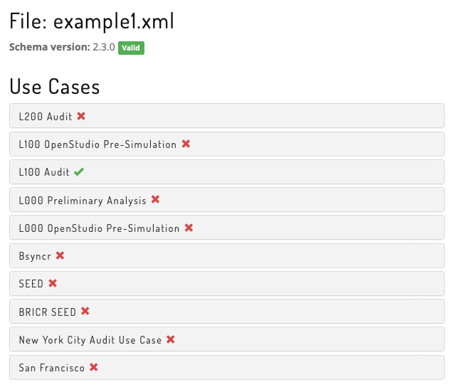

# Energy Auditing with BuildingSync

Follow the instructions in the [README.md](../README.md) file to run in Jupyter Lab/Notebook.

## Introduction
So you've been tasked with performing an energy audit that requires submission of a BuildingSync document? What does that even mean? This notebook is intended to provide an interactive and informational introduction to what BuildingSync is and how it relates to buildings, building systems, and energy audit reporting. This will be done by performing an example energy audit on the DOE Small Office Prototype building.

## Who This is For
While this notebook is setup in Python, this introduction is not reserved only for software developers. The code is more of a supplement, but doesn't need to be run. Energy auditors, mechanical engineers, AHJ's procuring audits, and software developers all have something to gain from walking through this notebook.

## Learning Objectives
By the end of this notebook, you should:
- Have a practical understanding of some XML features, namely: elements, attributes, and xpaths
- Know the main elements of the BuildingSync schema: Buildings, Systems, Reports, Scenarios, TimeSeriesData
- Be able to relate these concepts back to an ASHRAE Standard 211 energy audit
- Create a minimum viable Level 1 BuildingSync document and verify it validates using the [BuildingSync Use Case Validator](https://buildingsync.net/validator)

## For Reference: Core Concepts and Notation Used
- We will be using BuildingSync version 2.3.0. [Documentation](https://buildingsync.net/documentation/2.3.0). [Github release](https://github.com/BuildingSync/schema/releases/tag/v2.3.0).
- BuildingSync is an XML Schema Document (XSD). It defines intended structure. Referring to something as a BuildingSync document typically means the document is intended to conform to the BuildingSync schema.
- An XSD defines a hierarchical or tree-based schema, where elements are 'nested' within other elements. An XML document then looks like nested elements within one another. Similar to HTML, it uses angle brackets `<` and `>` to open and close an element tag. The example below provides a very simple example of an XML document:
```xml
<a-root-node>
    <first-child>This child element captures information in a string (text), whereas the second-child captures a numeric datatype.</first-child>
    <second-child>2</second-child>
</a-root-node>
```
- `auc:` is often used as the namespace prefix for elements in a BuildingSync document. If a document declares the BuildingSync namespace prefix to be `auc:`, an element would look like `auc:Facility`. The same element in a BuildingSync document without a namespace prefix would look like `Facility`. Going forward, we will not prefix elements with `auc` - the remaining XML content should only refer to things defined by the BuildingSync schema.
- XPath: xpath is basically a syntax for 'walking' an xml tree, mainly used for 'querying' information out of an XML document. In the simple example xml document above, to get the `<first-child>` element, we would notate this in XPath as `/a-root-node/first-child`. XPath will be used throughout this document to concisely convey where elements can be found in a BuildingSync document.

## Caveats
- These cells are meant to be run 1x through sequentially. Running a single cell multiple times may give you bad results


```python
# Import the main bsync module
from bsyncpy import bsync
from lxml import etree
from datetime import datetime, date
import eeweather

def pretty_print(element):
    """Simple printing of an xml element from the bsync library"""
    print(etree.tostring(element.toxml(), pretty_print=True).decode('utf-8'))
    
def bsync_dump(root_element, file="example1.xml"):
    """Write the element to the specified file"""
    doctype = '<?xml version="1.0" encoding="UTF-8"?>'
    as_etree = root_element.toxml()
    as_etree.set("xmlns", "http://buildingsync.net/schemas/bedes-auc/2019")
    # Have to manually set the version right now. Align release of bsyncpy to this version.
    as_etree.set("version", "2.4.0")  
    output = etree.tostring(as_etree, doctype=doctype, pretty_print=True)
    with open(file, 'wb+') as f:
        f.write(output)
        return True
```

# Starting the Audit

## Small Office Prototype Building
The small office prototype is a single story rectangular building. We will show some love to Missoula and assume this building is located at 4055 Brooks St. Missoula, MT 59804.


We can summarize the high level features as:
- Total Floor Area: 5500sf
- WWR: Southern Wall ~25%, Other Walls ~20%
- Climate Zone 6B
- Assume built year: 2006
- Let's assume this is on the 90.1-2004 code cycle

## "I have a building...where do I start"
Relevant Standard 211 Sections:
- 6.1.1 Facility Description

Let's start by defining a building. In this exercise, we will learn about some BuildingSync design patterns that will continue to propagate. In xpath terms, buildings live here: `/BuildingSync/Facilities/Facility/Sites/Site/Buildings/Building`. A few things to notice:
- The root node of a BuildingSync document is the `BuildingSync` element
- Plurals (Facilities, Sites, Buildings) are often used to indicate parents that can contain 1 <= n < infinite child elements having a non-pluralized name (Facility, Site, Building). For example:
```xml
<BuildingSync>
    <Facilities>
        <Facility ID="F-1">
            ...children stuff here...
        </Facility>
        <Facility ID="F-2">
            ...children stuff here...
        </Facility>
    </Facilities>
</BuildingSync>
```
- While the above can be done, it is __most common__ to find a single Facility, Site, and Building in a BuildingSync document. In general:
    - Facility refers to a grouping of Sites, but a Facility is still geographically proximate. Its boundary might include not building specific things (streets, sidewalks, etc.)
    - A Site is everything in and around a group of Buildings. This might be two Buildings that are connected via a tunnel, etc.
    - ** Most common is just to have a single Building


### Primary BuildingSync Structural Elements
We start by creating the primary structure of a BuildingSync document. We introduced `Facilities`, `Sites`, and `Buildings`, but there are a few additional:
- `Sections` are subportions of a `Building`. Think of a mixed-use commercial building with retail and office space, each of these would become a section. For those familiar with the ASHRAE 211 Normative Spreadsheet, a `Section` is analagous to a column in the `All - Space Functions` sheet.
- `Systems` are defined under a `Facility` and capture the energy consuming / producing assets. Each can be linked back to an individual `Facility`, `Site`, `Building`, or `Section`.
- `Reports` are defined under a `Facility` and each `Report` would contain information about reporting type requirements. Most importantly, a `Report` contains a set of `Scenario` elements, where each `Scenario` would convey building performance for one of: current / historical data, target performance, benchmark performance, baseline modeled performance, or expected performance with measure(s) implemented.


```python
# just take this for what it is at the moment. the bsync package makes
# it easier to work with xml content. All of this is mainly syntactic
# sugar around the lxml package, with some type checking, attribute 
# assignment, etc.
root = bsync.BuildingSync()
facs = bsync.Facilities()
f1 = bsync.Facilities.Facility(ID="Facility-1")
sites = bsync.Sites()
s1 = bsync.Sites.Site(ID="Site-1")
bldgs = bsync.Buildings()
b1 = bsync.Buildings.Building(ID="Building-Small-Office-Prototype")
sections = bsync.Sections()
systems = bsync.Systems()
contacts = bsync.Contacts()
reports = bsync.Reports()
measures = bsync.Measures()
utilities = bsync.Utilities()

# We link the entire report to the building
r1 = bsync.Report(
    bsync.LinkedPremisesOrSystem(
        bsync.LinkedPremisesOrSystem.Building(
            bsync.LinkedBuildingID(IDref=b1["ID"])
        )
    ),
    ID='Report-L1-Audit')
scenarios = bsync.Scenarios()

# We now combine these and pretty print the result for easy viewing of what we just made
root += facs
facs += f1

# Direct children of a facility
f1 += sites
f1 += systems
f1 += measures
f1 += reports
f1 += contacts

# Specific to a site
sites += s1
s1 += bldgs
bldgs += b1

# Direct children of a building
b1 += sections

# Specific to a report
reports += r1
r1 += scenarios
r1 += utilities

pretty_print(root)
```

    <BuildingSync>
      <Facilities>
        <Facility ID="Facility-1">
          <Sites>
            <Site ID="Site-1">
              <Buildings>
                <Building ID="Building-Small-Office-Prototype">
                  <Sections/>
                </Building>
              </Buildings>
            </Site>
          </Sites>
          <Systems/>
          <Measures/>
          <Reports>
            <Report ID="Report-L1-Audit">
              <Scenarios/>
              <Utilities/>
              <LinkedPremisesOrSystem>
                <Building>
                  <LinkedBuildingID IDref="Building-Small-Office-Prototype"/>
                </Building>
              </LinkedPremisesOrSystem>
            </Report>
          </Reports>
          <Contacts/>
        </Facility>
      </Facilities>
    </BuildingSync>
    


#### Building Description
Relevant Standard 211 Sections:
- 6.1.1.1 Site Information

This section of Standard 211 asks for lots of detail. We walk through the components of this that get added _as child elements of the building_, the discuss other information.


```python
# 6.1.1.1.a - name
b1 += bsync.PremisesName('Small Office Prototype')

# 6.1.1.1.m 
b1 += bsync.PremisesNotes("Here we record general problems / issues identified in a walkthrough survey.")

# 6.1.1.1.d - address
b1 += bsync.Address(
    bsync.StreetAddressDetail(
        bsync.Simplified(
            bsync.StreetAddress("4055 Brooks Street")
        )
    ),
    bsync.Address.State("MT"),
    bsync.City("Missoula"),
    bsync.PostalCode("59804")
)

# 6.1.1.1.e - gross and conditioned floor area
b1 += bsync.FloorAreas(
    bsync.FloorArea(
        bsync.FloorAreaType("Gross"),
        bsync.FloorAreaValue(5500.0)
    ),
    bsync.FloorArea(
        bsync.FloorAreaType("Conditioned"),
        bsync.FloorAreaValue(5500.0)
    )
)

# 6.1.1.1.f - classification of the uses
b1 += bsync.BuildingClassification("Commercial")
b1 += bsync.OccupancyClassification("Office")
b1 += bsync.HistoricalLandmark(False)

# 6.1.1.1.h - for completeness, we spell this out explicitly
b1 += bsync.FloorsAboveGrade(1)
b1 += bsync.FloorsBelowGrade(0)
b1 += bsync.ConditionedFloorsAboveGrade(1)
b1 += bsync.ConditionedFloorsBelowGrade(0)

# 6.1.1.1.i - again, to be explicit, we define the latest remodel / retrofit year
# to be the same as the original build year to indicate nothing has happened since original construction
b1 += bsync.YearOfConstruction(2006)
b1 += bsync.YearOccupied(2006)
b1 += bsync.YearOfLastMajorRemodel(2006)

pretty_print(root)
```

    <BuildingSync>
      <Facilities>
        <Facility ID="Facility-1">
          <Sites>
            <Site ID="Site-1">
              <Buildings>
                <Building ID="Building-Small-Office-Prototype">
                  <PremisesName>Small Office Prototype</PremisesName>
                  <PremisesNotes>Here we record general problems / issues identified in a walkthrough survey.</PremisesNotes>
                  <Address>
                    <StreetAddressDetail>
                      <Simplified>
                        <StreetAddress>4055 Brooks Street</StreetAddress>
                      </Simplified>
                    </StreetAddressDetail>
                    <City>Missoula</City>
                    <State>MT</State>
                    <PostalCode>59804</PostalCode>
                  </Address>
                  <BuildingClassification>Commercial</BuildingClassification>
                  <OccupancyClassification>Office</OccupancyClassification>
                  <FloorsAboveGrade>1</FloorsAboveGrade>
                  <FloorsBelowGrade>0</FloorsBelowGrade>
                  <ConditionedFloorsAboveGrade>1</ConditionedFloorsAboveGrade>
                  <ConditionedFloorsBelowGrade>0</ConditionedFloorsBelowGrade>
                  <HistoricalLandmark>false</HistoricalLandmark>
                  <FloorAreas>
                    <FloorArea>
                      <FloorAreaType>Gross</FloorAreaType>
                      <FloorAreaValue>5500.000000</FloorAreaValue>
                    </FloorArea>
                    <FloorArea>
                      <FloorAreaType>Conditioned</FloorAreaType>
                      <FloorAreaValue>5500.000000</FloorAreaValue>
                    </FloorArea>
                  </FloorAreas>
                  <YearOfConstruction>2006</YearOfConstruction>
                  <YearOccupied>2006</YearOccupied>
                  <YearOfLastMajorRemodel>2006</YearOfLastMajorRemodel>
                  <Sections/>
                </Building>
              </Buildings>
            </Site>
          </Sites>
          <Systems/>
          <Measures/>
          <Reports>
            <Report ID="Report-L1-Audit">
              <Scenarios/>
              <Utilities/>
              <LinkedPremisesOrSystem>
                <Building>
                  <LinkedBuildingID IDref="Building-Small-Office-Prototype"/>
                </Building>
              </LinkedPremisesOrSystem>
            </Report>
          </Reports>
          <Contacts/>
        </Facility>
      </Facilities>
    </BuildingSync>
    


Continuing with the information required by 6.1.1.1, we define additional content that doesn't sit as direct child elements of the Building. This includes:
- Contacts. Key contacts (1 auditor and 1 owner) __must be linked__ back to the building, even though they are not in the Building subtree:
    - Contacts live: /BuildingSync/Facilities/Facility/Contacts/Contact
    - An auditor is linked to a building at a Report level (i.e. who performed the audit)
    - Reports live: /BuildingSync/Facilities/Facility/Reports/Report
    - An audit report, with the correct links to a Building, Measures, etc. should be sufficient to meet the Standard 211 requirements spelled out in Section 6. More on this later.
- Space function breakdown by space type
- Occupied hours and number of occupants

#### Contacts


```python
# 6.1.1.1.b - Owner and auditor contact info
c1 = bsync.Contact(
    bsync.ContactName('The dude'),
    bsync.ContactCompany("Some big company"),
    bsync.ContactRoles(
        bsync.ContactRole('Owner')
    ),
    bsync.ContactEmailAddresses(
        bsync.ContactEmailAddress(
            bsync.EmailAddress("the.dude@somebigco.net")
        )
    ),
    ID='Contact-Owner'
)
c2 = bsync.Contact(
    bsync.ContactName('The lady'),
    bsync.ContactCompany("Auditeers"),
    bsync.ContactRoles(
        bsync.ContactRole('Energy Auditor')
    ),
    bsync.ContactEmailAddresses(
        bsync.ContactEmailAddress(
            bsync.EmailAddress("the.lady@the-three-auditeers.com")
        )
    ),
    ID='Contact-Auditor'
)
# We add the two contacts to the correct parent
contacts += c1
contacts += c2

# We 'assign' (link) the owner as the primary contact for the building, though this
# could be an owners rep or some other contact type.
b1 += bsync.PrimaryContactID(IDref=c1['ID'])

# We link the auditor contact to the report
r1 += bsync.AuditorContactID(IDref=c2['ID'])
```

### Space Function Analysis
Relevant Standard 211 Sections:
- 5.3.4 Space Function Analysis

Space functions are used to define sections of a building used for different purposes. The classic example of this is a mixed use commercial real estate, with retail space on the bottom floor and offices in the remainder of the building. We do this in BuildingSync via the following:
- Each space functions gets its own `Section` element
- Each `Section` element should specify the `Section/SectionType` as "Space function"

The Small Office, as its name suggests, is just an office space, and therefore we will only create one section for it.


```python
# create a new section
section = bsync.Sections.Section(ID="Section-1")
section += bsync.SectionType('Space function')
section += bsync.OccupancyClassification("Office")
section += bsync.OriginalOccupancyClassification("Office")
sections += section
pretty_print(sections)
```

    <Sections>
      <Section ID="Section-1">
        <SectionType>Space function</SectionType>
        <OccupancyClassification>Office</OccupancyClassification>
        <OriginalOccupancyClassification>Office</OriginalOccupancyClassification>
      </Section>
    </Sections>
    


Section 5.3.4 lays out specific requirements to convey for each space function. These include:
- floor area requirements
- typical occupant usages
- systems information (plugs, lighting, hvac)


```python
# 5.3.4.a Gross floor area for the section (we also add conditioned for 5.3.4.f)
section_fas = bsync.FloorAreas(
    bsync.FloorArea(
        bsync.FloorAreaType("Gross"),
        bsync.FloorAreaValue(5500.0)
    ),
    bsync.FloorArea(
        bsync.FloorAreaType("Conditioned"),
        bsync.FloorAreaValue(5500.0)
    )
)

# 5.3.4.b and 5.3.4.c are asking for typical operating hours for the section
tous = bsync.TypicalOccupantUsages()
tou_hpw = bsync.TypicalOccupantUsage(
    bsync.TypicalOccupantUsageUnits("Hours per week"),
    bsync.TypicalOccupantUsageValue(40.0)
)
tou_wpy = bsync.TypicalOccupantUsage(
    bsync.TypicalOccupantUsageUnits("Weeks per year"),
    bsync.TypicalOccupantUsageValue(50.)
)
tous += tou_hpw
tous += tou_wpy

# 5.3.4.d looks for normal / design or peak occupancy.
occ_levels = bsync.OccupancyLevels()
occ_design = bsync.OccupancyLevel(
    bsync.OccupantQuantityType("Peak total occupants"),
    bsync.OccupantQuantity(31.)
)
occ_levels += occ_design
```


```python
# finally, we add these to the actual section element
section += section_fas
section += tous
section += occ_levels
```

#### Plugs, Lighting, HVAC

Level 1 and Level 2 energy audits require information about the primary systems serving a specific section, but with very different degrees of specificity. Taking guidance from the 211 Normative spreadsheet:
- A Level 1 audit just requires high level information
- A Level 2 audit requires doing some more detailed modeling of the actual system of interest (mainly for HVAC).


```python
# The plug loads are pretty straightforwad
# Based on the Small Office 90.1-2004 prototype model,
# each zone has an EPD of 0.63 W/ft2
# Since all zones are part of the same section, we can
# just assign this EPD to the Section as a whole
plug_systems = bsync.PlugLoads()
psys = bsync.PlugLoad(
    bsync.WeightedAverageLoad(0.63),
    bsync.LinkedPremises(
            bsync.LinkedPremises.Section(
                bsync.LinkedSectionID(IDref=section["ID"])
            )
        ),
    ID="PlugLoad-1"
)
plug_systems += psys
```


```python
# Here we just create 5 very simple RTUs
# and link them back to the Section of interest.
# At this point, we aren't modeling separate HVAC zones.
# This level of detail fulfills requirements for a Level 1 audit
hvac_systems = bsync.HVACSystems()
for each in range(1,6):
    hv = bsync.HVACSystem(
        bsync.PrincipalHVACSystemType("Packaged Rooftop Heat Pump"),
        bsync.LinkedPremises(
            bsync.LinkedPremises.Section(
                bsync.LinkedSectionID(IDref=section["ID"])
            )
        ),
        ID=f"HVACSystem-{each}"
    )
    hvac_systems += hv
```


```python
# For the lighting systems, this is a bit different. When 
# performing an audit, it is atypical to know the LPD of a space / zone
# as you would in 'Energy Modeling' world / design world.
# Assuming drawings are unavailable and we go in to check,
# based on the vintage it's likely we will find T8 linear
# fluorescents (thanks Jay Wratten!). So we add that information
light_systems = bsync.LightingSystems()
ls = bsync.LightingSystem(
    bsync.LampType(
        bsync.LinearFluorescent(
            bsync.LinearFluorescent.LampLabel("T8")
        )
    ),
    bsync.BallastType("Standard Electronic"),
    bsync.LinkedPremises(
        bsync.LinkedPremises.Section(
            bsync.LinkedSectionID(IDref=section["ID"])
        )
    ),
    ID="LightingSystem-1"
)
light_systems += ls
```


```python
systems += plug_systems
systems += hvac_systems
systems += light_systems
pretty_print(root)
```

    <BuildingSync>
      <Facilities>
        <Facility ID="Facility-1">
          <Sites>
            <Site ID="Site-1">
              <Buildings>
                <Building ID="Building-Small-Office-Prototype">
                  <PremisesName>Small Office Prototype</PremisesName>
                  <PremisesNotes>Here we record general problems / issues identified in a walkthrough survey.</PremisesNotes>
                  <Address>
                    <StreetAddressDetail>
                      <Simplified>
                        <StreetAddress>4055 Brooks Street</StreetAddress>
                      </Simplified>
                    </StreetAddressDetail>
                    <City>Missoula</City>
                    <State>MT</State>
                    <PostalCode>59804</PostalCode>
                  </Address>
                  <BuildingClassification>Commercial</BuildingClassification>
                  <OccupancyClassification>Office</OccupancyClassification>
                  <PrimaryContactID IDref="Contact-Owner"/>
                  <FloorsAboveGrade>1</FloorsAboveGrade>
                  <FloorsBelowGrade>0</FloorsBelowGrade>
                  <ConditionedFloorsAboveGrade>1</ConditionedFloorsAboveGrade>
                  <ConditionedFloorsBelowGrade>0</ConditionedFloorsBelowGrade>
                  <HistoricalLandmark>false</HistoricalLandmark>
                  <FloorAreas>
                    <FloorArea>
                      <FloorAreaType>Gross</FloorAreaType>
                      <FloorAreaValue>5500.000000</FloorAreaValue>
                    </FloorArea>
                    <FloorArea>
                      <FloorAreaType>Conditioned</FloorAreaType>
                      <FloorAreaValue>5500.000000</FloorAreaValue>
                    </FloorArea>
                  </FloorAreas>
                  <YearOfConstruction>2006</YearOfConstruction>
                  <YearOccupied>2006</YearOccupied>
                  <YearOfLastMajorRemodel>2006</YearOfLastMajorRemodel>
                  <Sections>
                    <Section ID="Section-1">
                      <SectionType>Space function</SectionType>
                      <OccupancyClassification>Office</OccupancyClassification>
                      <OriginalOccupancyClassification>Office</OriginalOccupancyClassification>
                      <OccupancyLevels>
                        <OccupancyLevel>
                          <OccupantQuantityType>Peak total occupants</OccupantQuantityType>
                          <OccupantQuantity>31.000000</OccupantQuantity>
                        </OccupancyLevel>
                      </OccupancyLevels>
                      <TypicalOccupantUsages>
                        <TypicalOccupantUsage>
                          <TypicalOccupantUsageValue>40.000000</TypicalOccupantUsageValue>
                          <TypicalOccupantUsageUnits>Hours per week</TypicalOccupantUsageUnits>
                        </TypicalOccupantUsage>
                        <TypicalOccupantUsage>
                          <TypicalOccupantUsageValue>50.000000</TypicalOccupantUsageValue>
                          <TypicalOccupantUsageUnits>Weeks per year</TypicalOccupantUsageUnits>
                        </TypicalOccupantUsage>
                      </TypicalOccupantUsages>
                      <FloorAreas>
                        <FloorArea>
                          <FloorAreaType>Gross</FloorAreaType>
                          <FloorAreaValue>5500.000000</FloorAreaValue>
                        </FloorArea>
                        <FloorArea>
                          <FloorAreaType>Conditioned</FloorAreaType>
                          <FloorAreaValue>5500.000000</FloorAreaValue>
                        </FloorArea>
                      </FloorAreas>
                    </Section>
                  </Sections>
                </Building>
              </Buildings>
            </Site>
          </Sites>
          <Systems>
            <HVACSystems>
              <HVACSystem ID="HVACSystem-1">
                <PrincipalHVACSystemType>Packaged Rooftop Heat Pump</PrincipalHVACSystemType>
                <LinkedPremises>
                  <Section>
                    <LinkedSectionID IDref="Section-1"/>
                  </Section>
                </LinkedPremises>
              </HVACSystem>
              <HVACSystem ID="HVACSystem-2">
                <PrincipalHVACSystemType>Packaged Rooftop Heat Pump</PrincipalHVACSystemType>
                <LinkedPremises>
                  <Section>
                    <LinkedSectionID IDref="Section-1"/>
                  </Section>
                </LinkedPremises>
              </HVACSystem>
              <HVACSystem ID="HVACSystem-3">
                <PrincipalHVACSystemType>Packaged Rooftop Heat Pump</PrincipalHVACSystemType>
                <LinkedPremises>
                  <Section>
                    <LinkedSectionID IDref="Section-1"/>
                  </Section>
                </LinkedPremises>
              </HVACSystem>
              <HVACSystem ID="HVACSystem-4">
                <PrincipalHVACSystemType>Packaged Rooftop Heat Pump</PrincipalHVACSystemType>
                <LinkedPremises>
                  <Section>
                    <LinkedSectionID IDref="Section-1"/>
                  </Section>
                </LinkedPremises>
              </HVACSystem>
              <HVACSystem ID="HVACSystem-5">
                <PrincipalHVACSystemType>Packaged Rooftop Heat Pump</PrincipalHVACSystemType>
                <LinkedPremises>
                  <Section>
                    <LinkedSectionID IDref="Section-1"/>
                  </Section>
                </LinkedPremises>
              </HVACSystem>
            </HVACSystems>
            <LightingSystems>
              <LightingSystem ID="LightingSystem-1">
                <LampType>
                  <LinearFluorescent>
                    <LampLabel>T8</LampLabel>
                  </LinearFluorescent>
                </LampType>
                <BallastType>Standard Electronic</BallastType>
                <LinkedPremises>
                  <Section>
                    <LinkedSectionID IDref="Section-1"/>
                  </Section>
                </LinkedPremises>
              </LightingSystem>
            </LightingSystems>
            <PlugLoads>
              <PlugLoad ID="PlugLoad-1">
                <WeightedAverageLoad>0.630000</WeightedAverageLoad>
                <LinkedPremises>
                  <Section>
                    <LinkedSectionID IDref="Section-1"/>
                  </Section>
                </LinkedPremises>
              </PlugLoad>
            </PlugLoads>
          </Systems>
          <Measures/>
          <Reports>
            <Report ID="Report-L1-Audit">
              <Scenarios/>
              <Utilities/>
              <AuditorContactID IDref="Contact-Auditor"/>
              <LinkedPremisesOrSystem>
                <Building>
                  <LinkedBuildingID IDref="Building-Small-Office-Prototype"/>
                </Building>
              </LinkedPremisesOrSystem>
            </Report>
          </Reports>
          <Contacts>
            <Contact ID="Contact-Owner">
              <ContactRoles>
                <ContactRole>Owner</ContactRole>
              </ContactRoles>
              <ContactName>The dude</ContactName>
              <ContactCompany>Some big company</ContactCompany>
              <ContactEmailAddresses>
                <ContactEmailAddress>
                  <EmailAddress>the.dude@somebigco.net</EmailAddress>
                </ContactEmailAddress>
              </ContactEmailAddresses>
            </Contact>
            <Contact ID="Contact-Auditor">
              <ContactRoles>
                <ContactRole>Energy Auditor</ContactRole>
              </ContactRoles>
              <ContactName>The lady</ContactName>
              <ContactCompany>Auditeers</ContactCompany>
              <ContactEmailAddresses>
                <ContactEmailAddress>
                  <EmailAddress>the.lady@the-three-auditeers.com</EmailAddress>
                </ContactEmailAddress>
              </ContactEmailAddresses>
            </Contact>
          </Contacts>
        </Facility>
      </Facilities>
    </BuildingSync>
    


### Current Building Measured Scenario
Relevant Standard 211 Sections:
- 6.1.2

Now that we have a quick sense of the building, let's start off by looking at the requirements for an ASHRAE 211 Level 1 audit. This leads us to the concept of a [Scenario](https://buildingsync.net/schema/v2.3.0/documentation/BuildingSync_xsd.html#ScenarioType). A Scenario in BuildingSync is used to refer to energy and timeseries data associated with a particular, well, scenario. Specifically, there are 5 primary Scenarios used in BuildingSync, all which relate back to Standard 211:


We will repeatedly come back to the concept of a Scenario, as they are core to organizing information in a BuildingSync document. 

The current building measured scenario is intended to capture true measured historical data. Typically this refers to utility bill data, but AMI type data can also be captured (later).  We start off by creating a new scenario element and defining its type as follows:
- `Scenario[ScenarioType/CurrentBuilding/CalculationMethod/Measured]`. This is an XPath expression that can be interpreted as "A Scenario that has the child elements ScenarioType/CurrentBuilding/CalculationMethod/Measured".  The XML for this would look like:
```xml
<Scenario>
    <ScenarioType>
        <CurrentBuilding>
            <CalculationMethod>
                <Measured/>
            </CalculationMethod>
        </CurrentBuilding>
    </ScenarioType>
</Scenario>
```

We build this scenario up programatically as follows:


```python
# define the current building measured scenario (cbms)
cbms = bsync.Scenario(
    bsync.Scenario.ScenarioType(
        bsync.CurrentBuilding(
            bsync.CalculationMethod(
                bsync.Measured()
            )
        )
    )
)
cbms['ID'] = 'Scenario-1'

# add the scenario to the audit report and scenarios parent grouping
scenarios += cbms
```

#### Utilities
Relevant Standard 211 Sections: 6.1.2
In the next section, we will create resource use elements to define energy data. First, we need to get add utility information. Utility information gets added at the report level. Specific information required includes:
- Rate schedules (you can get very expressive in BuildingSync with Rate Schedules - we keep it pretty minimal here)
- Utility account numbers


```python
elec_ut = bsync.Utility(
    bsync.RateSchedules(
        bsync.RateSchedule(
            bsync.TypeOfRateStructure(
                bsync.FlatRate(
                    bsync.FlatRate.RatePeriods(
                        bsync.FlatRate.RatePeriods.RatePeriod(
                            bsync.ApplicableStartDateForEnergyRate(date(2019,1,1)),
                            bsync.ApplicableEndDateForEnergyRate(date(2020,1,1)),
                            bsync.EnergyCostRate(0.0725), # $0.0725/kWh
                            bsync.ApplicableStartDateForDemandRate(date(2019,1,1)),
                            bsync.ApplicableEndDateForDemandRate(date(2020,1,1)),
                            bsync.ElectricDemandRate(0.0) # no demand charge per https://missoulaelectric.com/member-care/billing-payment/rates/
                        )
                    )
                )
            ),
            bsync.ReferenceForRateStructure("https://missoulaelectric.com/member-care/billing-payment/rates/"),
            bsync.FixedMonthlyCharge(28.),
            ID="RateSchedule-Electricity"
        )
    ),
    bsync.EIAUtilityID(12692),
    bsync.UtilityName("Missoula Electric Cooperative"),
    bsync.UtilityAccountNumber("some-account-number"),
    ID="Utility-Electric"
)
ng_ut = bsync.Utility(
    bsync.RateSchedules(
        bsync.RateSchedule(
            bsync.TypeOfRateStructure(
                bsync.FlatRate(
                    bsync.FlatRate.RatePeriods(
                        bsync.FlatRate.RatePeriods.RatePeriod(
                            bsync.ApplicableStartDateForEnergyRate(date(2019,1,1)),
                            bsync.ApplicableEndDateForEnergyRate(date(2020,1,1)),
                            bsync.EnergyCostRate(5.5) # $/MMBtu
                        )
                    )
                )
            ),
            bsync.ReferenceForRateStructure("https://naturalgaslocal.com/states/montana/missoula/"),
            ID="RateSchedule-Natural-Gas"
        )
    ),
    bsync.UtilityName("NorthWestern Energy"),
    bsync.UtilityAccountNumber("some-other-account-number"),
    ID="Utility-Natural-Gas"
)
```


```python
utilities += elec_ut
utilities += ng_ut
```

#### ResourceUses and TimeSeries Data
Now that we have a current building measured scenario, we want to declare energy and monthly billing data. Per Std 211 6.1.2.1, a minimum of 12 months (preferably up to 3 years) of energy use data is required. The mechanical system of the small office prototype is a heatpump air handler with natural gas backup. We know that Missoula is cold, so likely it will use natural gas backup at some point during its operation. We run an example simulation to get estimates for this, which come out as follows:

| Resource Type | Jan | Feb | Mar | Apr | May | Jun | Jul | Aug | Sep | Oct | Nov | Dec |
| --- | --- | --- | --- | --- | --- | --- | --- | --- | --- | --- | --- | --- |
| Electricity (kWh) | 6792.89 | 5841.75 | 6025.19 | 4985.3 | 5184.04 | 5358.55 | 5755.67 | 5981.78 | 5401.94 | 5225.84 | 5672.15 | 6291.63 |
| Natural Gas (MMBtu) | 5.7 | 4.01 | 0.58 | 0.4 | 0.02 | 0 | 0 | 0 | 0 | 0.01 | 0.36 | 6.08 | 17.16 |
| GHG Emissions (MtCO2e) | 250.0 | 240.0 | 260.0 | 250.0 | 260.0 | 230.0 | 280.0 | 270.0 | 260.0 | 250.0 | 240.0 | 250.0 |

In BuildingSync land, we need to declare an resource use for each resource type. Standard, allowable enumerations exist for this already. We do this as follows:


```python
all_ru = bsync.ResourceUses()

# create a resource use for electricity, units of kWh, all end uses
# we also add info about the 'peak' units
# we also connect it up to a utility
elec_ru = bsync.ResourceUse(
    bsync.EnergyResource('Electricity'),
    bsync.ResourceUseNotes("This is required for L1 to document irregularities in monthly energy patterns (Std 211 6.1.2.1.j). No irregularities found."),
    bsync.ResourceUnits('kWh'),
    bsync.PeakResourceUnits('kW'),
    bsync.EndUse('All end uses'),
    bsync.UtilityIDs(
        bsync.UtilityID(IDref=elec_ut['ID'])
    )
)

# given the above, we add the annual totals
elec_ru += bsync.AnnualFuelUseNativeUnits(68516.73)
elec_ru += bsync.AnnualFuelUseConsistentUnits(234.) #convert to MMBTU
elec_ru += bsync.AnnualPeakNativeUnits(21.12) # kW as specified above
elec_ru += bsync.AnnualPeakConsistentUnits(21.12) # already in kW, same as above
elec_ru += bsync.AnnualFuelCost(5304.) # $28 monthly + $0.0725/kwh per https://missoulaelectric.com/member-care/billing-payment/rates/

# create a resource use for greenhouse gas emissions, units of MtCO2e, all end uses
ghg_linked_ids = bsync.EmissionsLinkedTimeSeriesIDs()
for month in range(1,13):
    ghg_linked_ids += bsync.EmissionsLinkedTimeSeriesID(IDref=f"TS-ResourceUse-GreenhouseGasEmissions-{month}")


ghg_ru = bsync.ResourceUse(
    bsync.Emissions(
        bsync.Emission(
            bsync.EmissionBoundary("Indirect"), 
            bsync.EmissionsType("CO2e"),
            bsync.GHGEmissions(25000.0),
            ghg_linked_ids
        )
    )
)

# create a resource use for natural gas, units of MMBtu, all end uses
# additional connect it up to the utility
ng_ru = bsync.ResourceUse(
    bsync.EnergyResource('Natural gas'),
    bsync.ResourceUseNotes("No irregularities in monthly energy consumption found."),
    bsync.ResourceUnits('MMBtu'),
    bsync.EndUse('All end uses'),
    bsync.UtilityIDs(
        bsync.UtilityID(IDref=ng_ut['ID'])
    )
)

# given the above, we add the annual totals
ng_ru += bsync.AnnualFuelUseNativeUnits(17.16)
ng_ru += bsync.AnnualFuelUseConsistentUnits(17.16) # already in MMBTU
ng_ru += bsync.AnnualFuelCost(91.63) # ~ $5.50/1000ft3 NG per https://naturalgaslocal.com/states/montana/missoula/

# add these to the ResourceUses parent element
all_ru += elec_ru
all_ru += ghg_ru
all_ru += ng_ru

# we can still add information to the child elements
elec_ru['ID'] = 'ResourceUse-Electricity'
ghg_ru['ID'] = 'ResourceUse-GreenhouseGasEmissions'
ng_ru['ID'] = 'ResourceUse-Natural-gas'

# ResourceUses are child elements of a specific scenario:
cbms += all_ru
```

#### Example TimeSeries Walkthrough
Now that we have resource uses, we want to associate timeseries data to those specific resources. We will assume the utility billing data is nicely segmented for us and each billing period starts on the 1st of the month and ends on the last day. We use BuildingSync TimeSeries elements to store temporal data. We walk through creating a simple timeseries element to capture January's electricity consumption.


```python
# all timeseries is captured in a TimeSeriesData parent
ts_data = bsync.TimeSeriesData()

# Create a new TimeSeries element for Electricity
jan_elec = bsync.TimeSeries(ID="TS-Example")

# a ReadingType of 'Total' signifies a summation / integral over the time period specified
jan_elec += bsync.ReadingType('Total')

# A TimeSeriesReadingQuantity isn't necessary for timeseries specific to a ResourceUse since we will 'point back to'
# the resource use later, however, verbosity never hurts
jan_elec += bsync.TimeSeriesReadingQuantity('Energy')

# Add start and end timestamps. XSD datatypes are translated into python datatypes
# within the bsync package. For example, the xs:dateTime datatype, we need to provide python datetime object

# this_will_fail = bsync.TimeSeriesData.TimeSeries.StartTimestamp('2019-01-01T00:00:00')

# we need to do something like this
start_dt = datetime(2019, 1, 1, 0, 0)
end_dt = datetime(2019, 2, 1, 0, 0)

# in bsync, a StartTimetamp is inclusive and an EndTimestamp is exclusive
# the interval notation for the above would be like:
# [ start, end ) 
jan_elec += bsync.StartTimestamp(start_dt)
jan_elec += bsync.EndTimestamp(end_dt)

# next, we convey the IntervalReading, i.e. the value.
# The value should use the same units as declared by the ResourceUse/ResourceUnits
jan_elec += bsync.IntervalReading(6792.89)

# finally, we need to convey to which resource this timeseries element is 'connected',
# i.e. the value represented by this reading conveys information for the Electricity resource use
jan_elec += bsync.ResourceUseID(IDref=elec_ru['ID'])

# and we add this as a child to the TimeSeriesData element
ts_data += jan_elec
pretty_print(ts_data)
```

    <TimeSeriesData>
      <TimeSeries ID="TS-Example">
        <ReadingType>Total</ReadingType>
        <TimeSeriesReadingQuantity>Energy</TimeSeriesReadingQuantity>
        <StartTimestamp>2019-01-01T00:00:00</StartTimestamp>
        <EndTimestamp>2019-02-01T00:00:00</EndTimestamp>
        <IntervalReading>6792.890000</IntervalReading>
        <ResourceUseID IDref="ResourceUse-Electricity"/>
      </TimeSeries>
    </TimeSeriesData>
    


```python
# Create a new TimeSeries element now for GHG Emissions
jan_ghg_elec = bsync.TimeSeries(ID="TS-ResourceUse-MtCO2e-1")

# a ReadingType of 'Total' signifies a summation / integral over the time period specified
jan_ghg_elec += bsync.ReadingType('Total')

# A TimeSeriesReadingQuantity isn't necessary for timeseries specific to a ResourceUse since we will 'point back to'
# the resource use later, however, verbosity never hurts
jan_ghg_elec += bsync.TimeSeriesReadingQuantity('Greenhouse Gas Emissions')

# Add start and end timestamps. XSD datatypes are translated into python datatypes
# within the bsync package. For example, the xs:dateTime datatype, we need to provide python datetime object

# this_will_fail = bsync.TimeSeriesData.TimeSeries.StartTimestamp('2019-01-01T00:00:00')

# we need to do something like this
start_dt = datetime(2019, 1, 1, 0, 0)
end_dt = datetime(2019, 2, 1, 0, 0)

# in bsync, a StartTimetamp is inclusive and an EndTimestamp is exclusive
# the interval notation for the above would be like:
# [ start, end ) 
jan_ghg_elec += bsync.StartTimestamp(start_dt)
jan_ghg_elec += bsync.EndTimestamp(end_dt)

# next, we convey the IntervalReading, i.e. the value.
# The value should use the same units as declared by the ResourceUse/ResourceUnits
jan_ghg_elec += bsync.IntervalReading(250.0)

# finally, we need to convey to which resource this timeseries element is 'connected',
# i.e. the value represented by this reading conveys information for the GHG Emissions resource use
jan_ghg_elec += bsync.ResourceUseID(IDref=elec_ru['ID'])

# and we add this as a child to the TimeSeriesData element
ts_data += jan_ghg_elec
pretty_print(ts_data)
```

    <TimeSeriesData>
      <TimeSeries ID="TS-Example">
        <ReadingType>Total</ReadingType>
        <TimeSeriesReadingQuantity>Energy</TimeSeriesReadingQuantity>
        <StartTimestamp>2019-01-01T00:00:00</StartTimestamp>
        <EndTimestamp>2019-02-01T00:00:00</EndTimestamp>
        <IntervalReading>6792.890000</IntervalReading>
        <ResourceUseID IDref="ResourceUse-Electricity"/>
      </TimeSeries>
      <TimeSeries ID="TS-ResourceUse-MtCO2e-1">
        <ReadingType>Total</ReadingType>
        <TimeSeriesReadingQuantity>Greenhouse Gas Emissions</TimeSeriesReadingQuantity>
        <StartTimestamp>2019-01-01T00:00:00</StartTimestamp>
        <EndTimestamp>2019-02-01T00:00:00</EndTimestamp>
        <IntervalReading>250.000000</IntervalReading>
        <ResourceUseID IDref="ResourceUse-Electricity"/>
      </TimeSeries>
    </TimeSeriesData>
    


#### All TimeSeries Data
The following cell simply performs the following:
1. Create a simple function to generate monthly timeseries elements for each resource use
1. Add it to a `TimeSeriesData` parent element
1. Add this back to the previously defined current building measured scenario (i.e. Scenario-1)


```python
full_ts_data = bsync.TimeSeriesData()

# usage and peak data
monthly_elec = [6792.89, 5841.75, 6025.19, 4985.3, 5184.04, 5358.55, 5755.67, 5981.78, 5401.94, 5225.84, 5672.15, 6291.63]
monthly_ghg = [250.0, 240.0, 260.0, 250.0, 260.0, 230.0, 280.0, 270.0, 260.0, 250.0, 240.0, 250.0]
monthly_ng = [5.7, 4.01, 0.58, 0.4, 0.02, 0, 0, 0, 0, 0.01, 0.36, 6.08]
monthly_elec_peak = [15.42, 15.5, 16.25, 16.65, 18.56, 20.01, 20.82, 21.12, 20.42, 20.08, 17.4, 16.3]

# costs data
monthly_elec_cost = [520.48, 451.53, 464.83, 389.43, 403.84, 416.49, 445.29, 461.68, 419.64, 406.87, 439.23, 484.14]
monthly_ng_cost = [30.44, 21.41, 3.10, 2.14, 0.11, 0.00, 0.00, 0.00, 0.00, 0.05, 1.92, 32.47]

elec_ids = []
ghg_ids = []
ng_ids = []
def create_monthly(values, resource_use_id, start_year, tsrq='Energy', rt='Total'):
    """
    tsrq: One of Energy, Power, Cost, Greenhouse Gas Emissions
    rt: One of Total, Peak, Cost
    """
    monthly = []
    end_year = start_year
    for i, val in enumerate(values, start=1):
        if i % 12 == 0:
            start_month = 12
            end_month = 1
            end_year += 1
        else:
            start_month = i % 12
            end_month = start_month + 1
        start_dt = datetime(start_year, start_month, 1)
        end_dt = datetime(end_year, end_month, 1)

        if tsrq == 'Greenhouse Gas Emissions':
            my_id = f"TS-{resource_use_id}-{start_month}"
        else:
            my_id = f"TS-{resource_use_id}-{tsrq}-{start_month}"
        ts = bsync.TimeSeries(
            bsync.ReadingType(rt),
            bsync.TimeSeriesReadingQuantity(tsrq),
            bsync.StartTimestamp(start_dt),
            bsync.EndTimestamp(end_dt),
            bsync.IntervalFrequency("Month"),
            bsync.IntervalReading(float(val)),
            bsync.ResourceUseID(IDref=resource_use_id),
            ID=my_id
        )
        monthly.append(ts)
        
        if tsrq == 'Greenhouse Gas Emissions':
            ghg_ids.append(my_id)
        if tsrq == 'Energy':
            if 'Electricity' in resource_use_id:
                elec_ids.append(my_id)
            else:
                ng_ids.append(my_id)
    return monthly
    
elec_ts = create_monthly(monthly_elec, elec_ru['ID'], 2019)
ghg_ts = create_monthly(monthly_ghg, ghg_ru['ID'], 2019, tsrq="Greenhouse Gas Emissions")
ng_ts = create_monthly(monthly_ng, ng_ru['ID'], 2019)
elec_peak_ts = create_monthly(monthly_elec_peak, elec_ru['ID'], 2019, 'Power', 'Peak')

elec_cost_ts = create_monthly(monthly_elec_cost, elec_ru['ID'], 2019, 'Cost', 'Cost')
ng_cost_ts = create_monthly(monthly_ng_cost, ng_ru['ID'], 2019, 'Cost', 'Cost')
 
def add_to_full(months, full):
    for month in months:
        full += month

add_to_full(elec_ts, full_ts_data)
add_to_full(ghg_ts, full_ts_data)
add_to_full(ng_ts, full_ts_data)
add_to_full(elec_peak_ts, full_ts_data)
add_to_full(elec_cost_ts, full_ts_data)
add_to_full(ng_cost_ts, full_ts_data)

    
cbms += full_ts_data
```

#### Linked TimeSeriesIDs
Due to the fact that annual data reporting is dependent on which months / utility bill periods were used to calculate the annual total, the `AnnualFuelUseLinkedTimeSeriesIDs` element was introduced. It is required to specify exactly which months for each resource use were used in the calculation of the `AnnualFuelUseNativeUnits` and `AnnualFuelUseConsistentUnits` elements. We add this element below.


```python
elec_linked_ids = bsync.AnnualFuelUseLinkedTimeSeriesIDs()
for each_id in elec_ids:
    elec_linked_ids += bsync.LinkedTimeSeriesID(IDref=each_id)
    

ng_linked_ids = bsync.AnnualFuelUseLinkedTimeSeriesIDs()
for each_id in ng_ids:
    ng_linked_ids += bsync.LinkedTimeSeriesID(IDref=each_id)
    
elec_ru += elec_linked_ids
ng_ru += ng_linked_ids
```

#### All Resource Totals

We have defined monthly electricity (energy, power, cost) and natural gas (energy, cost) usage as timeseries elements. Now we basically just need to summarize these into site and source energy use totals. We use the `Scenario/AllResourceTotals/AllResourceTotal` element to achieve this. The Level 1 use case requires annual energy reporting to follow Standard 105s methodology including:

- `SiteEnergyUse`: Corresponds to $E_{site}$
- `BuildingEnergyUse`: Corresponds to $E_{bld}$
- `ImportedEnergyConsistentUnits`: Corresponds to $E_{imp}$
- `OnsiteEnergyProductionConsistentUnits`: Corresponds to $E_{g}$
- `ExportedEnergyConsistentUnits`: Corresponds to $E_{exp}$
- `NetIncreaseInStoredEnergyConsistentUnits`: Corresponds to $E_{s}$


```python
art = bsync.AllResourceTotals(
    bsync.AllResourceTotal(
        bsync.AllResourceTotal.SiteEnergyUse(250953.5), # reported in kBtu
        bsync.SiteEnergyUseIntensity(45.6), # reported in kbtu/ft2
        
        # Since there is no energy generated onsite, there is no difference btw site and building energy usage / intensity
        bsync.BuildingEnergyUse(250953.5), 
        bsync.BuildingEnergyUseIntensity(45.6),
        
        bsync.ImportedEnergyConsistentUnits(250.9535),  # in this case, same as building and site energy, but in MMBTU
        bsync.OnsiteEnergyProductionConsistentUnits(0.), # no energy produced onsite, MMBtu
        bsync.ExportedEnergyConsistentUnits(0.), # no energy exported, MMBtu
        bsync.NetIncreaseInStoredEnergyConsistentUnits(0.),  # no energy stored, MMBtu
        
        bsync.AllResourceTotal.SourceEnergyUse(759011.9), # reported in kBtu. Assume site -> source: elec = 3.167, ng = 1.084
        bsync.SourceEnergyUseIntensity(138.0), # kbtu/ft2
        bsync.EnergyCost(5395.),
        bsync.EnergyCostIndex(0.98), # $/ft2
        ID="AllResourceTotal-1"
    )
)
```


```python
cbms += art
```

### Benchmark Scenario
Relevant Standard 211 Sections:
- 6.1.3

We inserted the above information (electricity, natural gas, square footage, etc.) into the Energy Star Portfolio Manager and got a score of 56. We can add this information into BuildingSync with our benchmark scenario.
TODO: Figure this out:
1. Entered info into ESPM. Got the following:


1. So, the ES score for the _current building measured_ should be 56? And then 50 is used as the benchmark value here...? And 274,825 kBtu as the SiteEnergyUse...? Confused.


```python
# define the benchmark scenario
bench_sc = bsync.Scenario(
    bsync.AllResourceTotals(
        bsync.AllResourceTotal(
            bsync.AllResourceTotal.SiteEnergyUse(274825.),  
            bsync.SiteEnergyUseIntensity(50.),
            ID="AllResourceTotal-Benchmark"
        )
    ),
    
    ID="Scenario-Benchmark"
)
bench_st = bsync.Scenario.ScenarioType()
bench = bsync.Benchmark(
    bsync.BenchmarkType(
        bsync.PortfolioManager(
            bsync.PMBenchmarkDate(date(2021, 3, 24))
        )
    ),
    bsync.BenchmarkTool("Portfolio Manager"),
    bsync.BenchmarkYear(2019),  # I believe this is the year of the data for which WE entered...TODO check this.
    bsync.BenchmarkValue(56.)
)

# 
scenarios += bench_sc
bench_sc += bench_st
bench_st += bench
```

### Target Scenario
Relevant Standard 211 Sections:
- 6.1.4

Since we used a PM score in the baseline, we will also use that for our target. Let's say we are shooting for a target score of 70.


```python
# define the target scenario in reference to the benchmark scenario
target_sc = bsync.Scenario(
    bsync.AllResourceTotals(
        bsync.AllResourceTotal(
            bsync.AllResourceTotal.SiteEnergyUse(207643.5),  
            bsync.SiteEnergyUseIntensity(37.8),
            bsync.EnergyCost(4451.51),
            bsync.EnergyCostIndex(0.81),
            ID="AllResourceTotal-Target"
        )
    ),
    ID="Scenario-Target"
)
target_st = bsync.Scenario.ScenarioType()
target = bsync.Target(
    bsync.ReferenceCase(IDref=bench_sc["ID"]),
    bsync.AnnualSavingsSiteEnergy(67181.5),
    bsync.AnnualSavingsCost(931),
    bsync.ENERGYSTARScore(70.),
)

# 
scenarios += target_sc
target_sc += target_st
target_st += target
```

### Current Building Modeled Scenario
Relevant Standard 211 Sections:
- 6.1.5 & 6.1.6

Although not explicitly called out in Standard 211, the current building modeled scenario is mostly implied as part of a Level 2 energy audit when doing more detailed savings estimates / calculations for potential measure(s) implementation. This is because when an energy / cost savings claim is made for a package of measures scenario, it needs to be _in reference_ to something, i.e. a current building modeled scenario (also often referred to as a baseline modeled scenario). The baseline modeled scenario should be interpreted as the expected performance of your building on an average or typical year. This is assuming the baseline modeled scenario is performed with TMY3 data, although they are likely first calibrated with AMY data.

Since we are already using an energy model for this example and providing details for implementing a Standard 211 Level 1 energy audit, we will not go into this too much at this point. It should be addressed in future examples.

### Package of Measures Scenario
Relevant Standard 211 Sections:
- 6.1.5 & 6.1.6

Standard 211 breaks out recommendations into low / no-cost (6.1.5) or capital (6.1.6). On the BuildingSync side, we don't change the data modeling between these two situations significantly, we simply change the value of the `Scenario/ScenarioType/PackageOfMeasures/CostCategory` element, while the majority of other features remain the same.
- Low / no-cost scenario: `CostCategory>Low-Cost or No-Cost</CostCategory>`
- Capital scenario: `CostCategory>Capital</CostCategory>`

For Level 1 audits, since the reporting only requires estimated costs, savings, and ROI, we don't specifically need a current building modeled scenario to be our reference case.

#### Measures

Packages of measures first require measures to be instantiated inside the BuildingSync document in order to correctly 'incorporate' them into the scenario. BuildingSync provides a significant number of already enumerated measures that can easily be used. We will first add some of these to our doc.

The scope of an individual measure is primarily conveyed by a few elements:
- `SystemCategoryAffected`: select one of an enumerated set of strings representing the general scope of system, i.e. Refrigeration, Fan, Lighting, etc.
- `TechnologyCategories/TechnologyCategory/*/MeasureName`: Select a very specific measure to implement


```python
# A measure to upgrade the lighting system to LEDs
led_measure = bsync.Measure(
    bsync.TypeOfMeasure(
        bsync.Replacements(
            bsync.Replacement(
                bsync.ExistingSystemReplaced(IDref="LightingSystem-1")
            )
        )
    ),
    bsync.SystemCategoryAffected("Lighting"),
    bsync.TechnologyCategories(
        bsync.TechnologyCategory(
            bsync.LightingImprovements(
                bsync.LightingImprovements.MeasureName("Retrofit with light emitting diode technologies")
            )
        )
    ),
    bsync.LongDescription("This measure is designed to replace all fluorescent bulbs with LEDs"),
    ID="Measure-LEDs"
)

# A measure to upgrade the fans in the RTUs to use VFDs
# instead of simple on/off fans.
# The CFMs for each of the RTUs are around ~ 700-800cfm,
# so there is no obvious choice of fans to upgrade to vfds.
# Here, we just recommend upgrading all of them.
vsd_measure = bsync.Measure(
    bsync.TypeOfMeasure(
        bsync.ModificationRetrocommissions(
            bsync.ModificationRetrocommissioning(
                bsync.ExistingSystemAffected(IDref="HVACSystem-1"),
                bsync.ExistingSystemAffected(IDref="HVACSystem-2"),
                bsync.ExistingSystemAffected(IDref="HVACSystem-3"),
                bsync.ExistingSystemAffected(IDref="HVACSystem-4"),
                bsync.ExistingSystemAffected(IDref="HVACSystem-5")
            )
        )
    ),
    # could have also used Air Distribution or Motor, this seemed ok too.
    bsync.SystemCategoryAffected("Fan"),
    bsync.TechnologyCategories(
        bsync.TechnologyCategory(
            bsync.OtherElectricMotorsAndDrives(
                bsync.OtherElectricMotorsAndDrives.MeasureName("Add VSD motor controller")
            )
        )
    ),
    bsync.LongDescription("This measure is designed to retrofit all RTU fans with a VSD"),
    ID="Measure-VSDs"
)
```


```python
measures += led_measure
measures += vsd_measure
```

#### POM Scenarios
Now that the measures have been added, we create three potential POM scenarios, and add the necessary attributes per Standard 211 6.1.5 and 6.1.6
1. LEDs only
1. VSDs only
1. LEDs and VSDs


```python
pom_sc_1 = bsync.Scenario(
    bsync.Scenario.ScenarioType(
        bsync.PackageOfMeasures(
            bsync.ReferenceCase(IDref=cbms['ID']),
            bsync.MeasureIDs(
                bsync.MeasureID(IDref="Measure-LEDs")
            ),
            bsync.CostCategory("Capital"),
            bsync.SimpleImpactAnalysis(
                bsync.ImpactOnOccupantComfort("Low"),
                bsync.EstimatedCost("Medium"),
                bsync.EstimatedAnnualSavings("Medium"),
                bsync.EstimatedROI("High"),
                bsync.SimpleImpactAnalysis.Priority("Medium")
            ),
            ID="POM-LEDs"
        )
    ),
    ID="Scenario-POM-LEDs"
)

pom_sc_2 = bsync.Scenario(
    bsync.Scenario.ScenarioType(
        bsync.PackageOfMeasures(
            bsync.ReferenceCase(IDref=cbms['ID']),
            bsync.MeasureIDs(
                bsync.MeasureID(IDref="Measure-VSDs")
            ),
            bsync.CostCategory("Capital"),
            bsync.SimpleImpactAnalysis(
                bsync.ImpactOnOccupantComfort("Low"),
                bsync.EstimatedCost("Medium"),
                bsync.EstimatedAnnualSavings("Medium"),
                bsync.EstimatedROI("High"),
                bsync.SimpleImpactAnalysis.Priority("Medium")
            ),
            ID="POM-VSDs"
        )
    ),
    ID="Scenario-POM-VSDs"
)

pom_sc_3 = bsync.Scenario(
    bsync.Scenario.ScenarioType(
        bsync.PackageOfMeasures(
            bsync.ReferenceCase(IDref=cbms['ID']),
            bsync.MeasureIDs(
                bsync.MeasureID(IDref="Measure-LEDs"),
                bsync.MeasureID(IDref="Measure-VSDs")
            ),
            bsync.CostCategory("Capital"),
            bsync.SimpleImpactAnalysis(
                bsync.ImpactOnOccupantComfort("Low"),
                bsync.EstimatedCost("Medium"),
                bsync.EstimatedAnnualSavings("Medium"),
                bsync.EstimatedROI("High"),
                bsync.SimpleImpactAnalysis.Priority("Medium")
            ),
            ID="POM-LEDs-VSDs"
        )
    ),
    ID="Scenario-POM-LEDs-VSDs"
)

pom_sc_4 = bsync.Scenario(
    bsync.Scenario.ScenarioType(
        bsync.PackageOfMeasures(
            bsync.ReferenceCase(IDref=cbms['ID']),
            bsync.MeasureIDs(
                bsync.MeasureID(IDref="Measure-LEDs"),
                bsync.MeasureID(IDref="Measure-VSDs")
            ),
            bsync.CostCategory("Capital"),
            bsync.SimpleImpactAnalysis(
                bsync.ImpactOnOccupantComfort("Low"),
                bsync.EstimatedCost("Medium"),
                bsync.EstimatedAnnualSavings("Medium"),
                bsync.EstimatedROI("High"),
                bsync.SimpleImpactAnalysis.Priority("Medium")
            ),
            ID="POM-LEDs-VSDs"
        )
    ),
    ID="Scenario-POM-LEDs-VSDs"
)
```


```python
scenarios += pom_sc_1
scenarios += pom_sc_2
scenarios += pom_sc_3
```

# Validation

So did what we just went through actually work? Do we have the required information for a Level 1 Audit? Head over to the [use case validator](https://buildingsync.net/validator) to find out!


Use the line below to write the file to disk


```python
bsync_dump(root)
```


    True


You should see a green check mark for the L100 AUDIT use case!




```python

```
