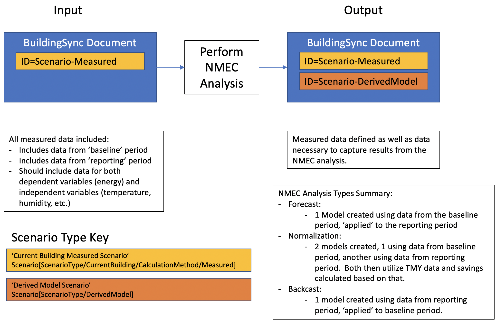

# NMEC Implementation

## Overview

This proposal is to provide a mechanism for storing the results of an NMEC (normalized metered energy consumption) calculation (or similar regression based analyses) within the BuildingSync schema. Specifically, how can model inputs, outputs, and metrics for the models be stored in a standardized fashion.

## Justification

Using BuildingSync to represent data inputs and outputs for Advanced Measurement & Verification analyses can be highly useful for people needing to streamline reporting of energy efficiency savings. BuildingSync will not _implement_ any methodology (i.e. it is NOT an application and does not do the analysis), but will provide support for serializing the analysis from different methodologies in a standardized way and identify input expectations for different analysis tools (formal Schematron docs will be defined in the TestSuite repo).

# Implementation

To tackle this, we introduce the `DerivedModelType` as follows:

- An `auc:DerivedModelType` is defined as a child of `auc:Scenario/auc:ScenarioType` as a `auc:DerivedModel` element.
- A `auc:DerivedModel` will refer to data from the 'Current Building Measured' Scenario and SHALL NOT DUPLICATE data.
- The most important data contained by an `auc:DerivedModel` is:
  - `auc:Models/auc:Model` - each model represents an analysis of the timeseries data present in the 'Current Building Measured' Scenario. See [Model Details](#model-details)
  - `auc:SavingsSummaries/auc:SavingsSummary` - a summary provides a mechanism to store data related to either:
    - a comparison between two `auc:Model` elements (consider a [Normalized Savings Case](https://github.com/kW-Labs/nmecr/blob/master/inst/vignettes/nmecr_normalized_savings.pdf)).
    - an extrapolation of an `auc:Model` to a past / future point in time (consider a implementation of Energy Efficiency Measures and having a ['Baseline' and 'Reporting' period](https://github.com/kW-Labs/nmecr/blob/master/inst/vignettes/nmecr_overview.pdf)). This is also relevant in the use case where an `auc:Model` might be defined for successive years (2015, 2016, 2017, etc.) and comparison of year over year savings is relevant (i.e. % change btw 2015-2016, 2016-2017, etc.) OR comparison to a 'baseline' year is relevant (i.e. 2015 is baseline year, looking at the % change btw. 2015 & 2016, 2015 & 2017, etc.)

## Model Details

The majority of the details concerning the implemented analysis are stored as part of an individual `auc:DerivedModel/auc:Models/auc:Model`. Each model should be self contained (i.e. fully descriptive) EXCEPT for the data necessary to pull in from the 'Current Building Measured' Scenario. This descriptive data includes:

- `auc:Model/auc:DerivedModelCoefficients`: Calculated coefficients for the model. Currently, only `auc:DerivedModelCoefficients/auc:Guideline14Model` coefficients have been explicitly defined (in reference to ASHRAE Guideline 14-2014 Figure D-1). A stub element to support `auc:TimeOfWeekTemperatureModel` has been created, but needs work.
- `auc:Model/auc:DerivedModelInputs`: Whereas `auc:Model/auc:DerivedModelCoefficients` represent actual parameters calculated for the model, this element captures more generic information about the model inputs.
  - `auc:Model/auc:DerivedModelInputs/auc:IntervalFrequency`: Frequency of data used for analysis (monthly, daily, hourly, etc.)
  - `auc:Model/auc:DerivedModelInputs/auc:ResponseVariable`: Store general information about what the response variable is (i.e Electricity), its end use, and the units used in the model (i.e. kWh).
  - `auc:Model/auc:DerivedModelInputs/auc:ExplanatoryVariables`: Store general information about the variables used in the regression / model.
- `auc:Model/auc:DerivedModelPerformance`: Store values associated with the characterized performance of the model, including `RSquared`, `RMSE`, etc.
- `auc:Model/auc:TrainingPredictions`: Predictions of the response variable (yhat) using the model information defined withinfor the time intervals analyzed can be stored here.

# Important Notes

- A 'Current Building Measured' Scenario is defined as: `auc:Scenario[auc:ScenarioType/auc:CurrentBuilding/auc:CalculationMethod/auc:Measured]`
- For NMEC analysis, we expect the 'Current Building Measured' Scenario to capture **all** time series data used in the analysis. This includes data for **both** the Baseline Period and the Reporting Period. This is to clarify that an `auc:Scenario[auc:ScenarioType/auc:PackageOfMeasures]` is NOT used to store data related to the analysis. While it may be included to define which measures were implemented, this has not been fully baked and details for how these should interplay will be provided at a further date.

# Examples

We provide an example BuildingSync document with commentary containing output data for:

1. Forecast Method (Report-1) - based on analysis performed in the [nmecr overview](https://github.com/kW-Labs/nmecr/blob/master/inst/vignettes/nmecr_overview.pdf)
2. Standard Conditions Method (Report-2) - based on the analysis performed in the [nmecr normalized savings](https://github.com/kW-Labs/nmecr/blob/master/inst/vignettes/nmecr_normalized_savings.pdf).

Our examples are performed using the SLR model instead of a TOWT model. The snippet is available as [example-1](./NMEC-Implementation/SLR-Example.xml).

| Model            | Start Time | End Time   |
| :--------------- | :--------- | :--------- |
| Baseline Period  | 2012-03-01 | 2013-02-28 |
| Reporting Period | 2014-03-01 | 2015-02-28 |

We assume the workflow will look as follows

## Report-1 - Forecast Method

- A 'Current Building Measured' Scenario is created to store current building measured data (energy and temperature) (`ID=Scenario-Measured`)
- For the dependent variable of interest (electricity), an `auc:ResourceUse` is declared and timeseries data associated with it using the `auc:ResourceUseID` element.
- For independent variables used, these are also captured as timeseries elements.
- The `auc:DerivedModel` contains a single `auc:Model` and a single `auc:SavingsSummary`.
- The `auc:Model` contains:
  - Timespan used for the model analysis
  - Characteristics of the model
  - Coefficients for the model
  - Model performance
  - Model time series data for the baseline period
- The `auc:SavingsSummary` contains:
  - Reference to the BaselinePeriodModelID
  - Timespan used for the reporting period analysis
  - Savings and aggregate energy uses
  - Timeseries data for the reporting period (ComparisonPeriod)

## Report-2 - Standard Conditions Method

- The majority of this is similar to Report-1 except for the addition of a second `auc:Model` created during the reporting period
- The `auc:SavingsSummary` differs in that:
  - It refers to two model IDs (baseline & reporting)
  - The comparison period used is that defined by 'Standard Conditions' or 'typical' data.
  - It stores timeseries and aggregate energy use _modeled_ by the baseline and reporting periods.
  - It stores timeseries data (i.e. temperature) for the 'Standard Conditions' timeperiods.

# Definitions and Concept Clarification

**Note: italicized words after a reference identify the name of the concept used in the reference**

- Baseline period:
  - period of time selected as representative of facility operations before retrofit. CPUC defines this specifically as 12-months [1] **baseline period**
  - The baseline period is the 12-month period leading up to the energy efficiency intervention or retrofit. [2] **baseline period**
- Implementation period:
  - period of time during which the energy conservation measures are being installed.
- Reporting period / performance period:
  - period of time following implementation of an energy conservation measure when savings reports adhere to the guideline. This period may be as short as the time for an instantaneous measurement of a constant quantity, long enough to reflect all normal operating modes of a system or facility with variable operations, the length of the financial payback period for an investment, the duration of a perfor- mance measurement period under an energy performance contract, or indefinite. [1] **reporting period**
  - The Reporting Period is the period of time over which the savings from energy efficiency interventions
    and retrofits are measured. The reporting period immediately follows the implementation period. [2] **reporting period** / **post-implementation performance monitoring** / **performance period**
- Baseline period actual energy use (BAE) [1] **baseline energy**
- Reporting period actual energy use (RAE)
- Reporting period calculated energy use (RCE), also referred to as the Adjusted Baseline Energy Use [4]
- Baseline period calculated energy use at standard conditions (BCESC)
- Reporting period calculated energy use at standard conditions (RCESC)
- Avoided Energy Use (AEU):
  - Equation: RCE - RAE
  - Avoided Energy Use is the amount of energy (or peak demand) that was not consumed or realized as a
    result of the energy efficiency project or program intervention. Avoided energy use is the difference
    between actual energy consumption in the “reporting period” and the consumption that is forecast for
    the same period using the “baseline energy consumption model,” and where the baseline energy
    consumption model use is adjusted to reflect reporting period conditions. The Avoided Energy Use
    approach is used as the basis of customer incentive calculations and embedded M&V reporting of
    savings [2] **avoided energy use**
  - reduction in energy use during the reporting period relative to what would have occurred if the facility had been equipped and operated as it was in the base- line period but under reporting period operating conditions. Cost avoidance is the monetary equivalent of avoided energy use. Both are commonly called “savings.” See also, energy savings and normalized savings. [1] **avoided energy use**
- Normalized savings:
  - Equation: RCESC - BCESC
  - Normalized energy savings is the reduction in energy consumption or demand that occurs in the
    reporting period, relative to the baseline period, after both have been adjusted to a common set of
    normal operating conditions. Normalized Savings are used for the final reporting of energy and demand
    savings claims that are filed with the CPUC. [2] **normalized energy savings**
  - Standard condition normalization results in two adjustment models: one of baseline period
    energy consumption and one for reporting period energy consumption. Standard conditions are
    applied to each of the models to calculate adjusted energy consumption values. The adjusted energy consumption for each period is the estimated energy consumption that would have been expected at a standard set of conditions (relevant variable values) in both the baseline and reporting periods. [3] **standard condition normalization**
- Normal operating conditions:
  - Normal operating conditions should reflect expected operating conditions and occupancy. This includes
    long-term average weather conditions for the climate zone corresponding to the building location.
    Normal production and occupancy should be based on observed pre and post-treatment values [2]

# References

[1] ASHRAE Guideline 14-2014
[2] CPUC NMEC Rulebook, v2.0, 07 Jan. 2020
[3] California Industrial SEM M&V Guide, v1.0, 08 Feb. 2017
[4] https://github.com/kW-Labs/nmecr/blob/master/inst/vignettes/nmecr_overview.pdf
