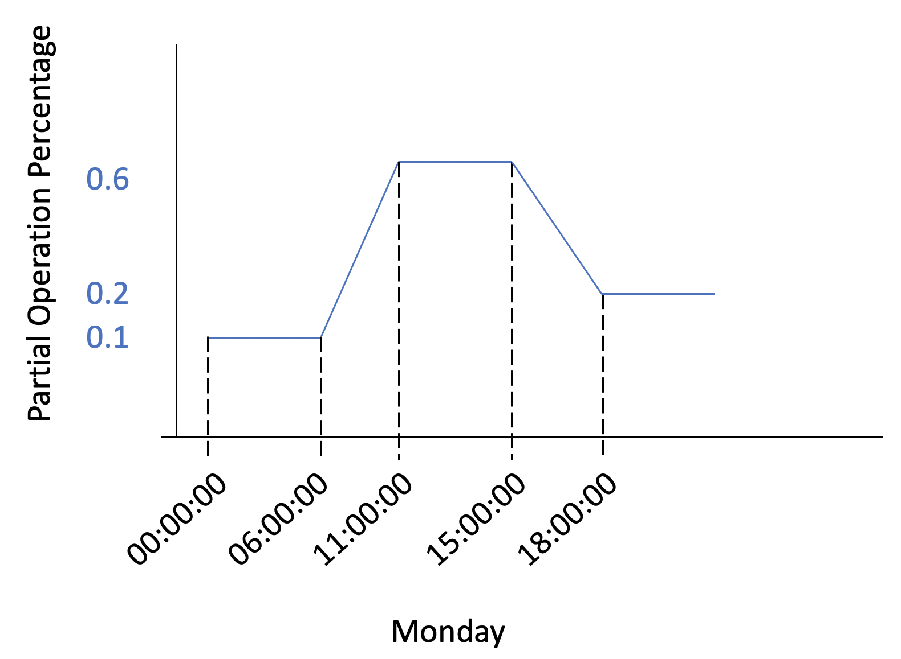

# Support changes in occupancy schedule

## Overview

The desire to be able to model an occupancy schedule with a 'linear ramping rate' was desired.  To accomplish this, four new elements are proposed as children of `auc:ScheduleDetail`:
- `auc:StartTime`
- `auc:EndTime`
- `auc:PartialOperationPercentageAtStartTime`
- `auc:PartialOperationPercentageAtEndTime`


## Justification

Currently within the `auc:ScheduleDetail` element, the following children exist:
- `auc:DayType`
- `auc:ScheduleCategory`
- `auc:DayStartTime`
- `auc:DayEndTime`
- `auc:PartialOperationPercentage`

This conveys that each `auc:ScheduleDetail` element is primarily designed to capture information at a 'day' level.  But how to model, say, multiple periods for the same day or day type, or when there is a change in partial operation percentage that is not a step function?  

## Example
This example shows how for a single day we might have an occupancy schedule that looks like the following:



```xml
          <auc:ScheduleDetails>
            <auc:ScheduleDetail>
              <auc:DayType>Monday</auc:DayType>
              <auc:ScheduleCategory>Occupied</auc:ScheduleCategory>
              <auc:StartTime>00:00:00</auc:StartTime>
              <auc:EndTime>06:00:00</auc:EndTime>
              <auc:PartialOperationPercentage>0.1</auc:PartialOperationPercentage>
            </auc:ScheduleDetail>
            <auc:ScheduleDetail>
              <auc:DayType>Monday</auc:DayType>
              <auc:ScheduleCategory>Occupied</auc:ScheduleCategory>
              <auc:StartTime>06:00:00</auc:StartTime>
              <auc:EndTime>11:00:00</auc:EndTime>
              <auc:PartialOperationPercentageAtStartTime>0.1</auc:PartialOperationPercentageAtStartTime>
              <auc:PartialOperationPercentageAtEndTime>0.6</auc:PartialOperationPercentageAtEndTime>
            </auc:ScheduleDetail>
            <auc:ScheduleDetail>
              <auc:DayType>Monday</auc:DayType>
              <auc:ScheduleCategory>Occupied</auc:ScheduleCategory>
              <auc:StartTime>11:00:00</auc:StartTime>
              <auc:EndTime>15:00:00</auc:EndTime>
              <auc:PartialOperationPercentage>0.6</auc:PartialOperationPercentage>
            </auc:ScheduleDetail>
            <auc:ScheduleDetail>
              <auc:DayType>Monday</auc:DayType>
              <auc:ScheduleCategory>Occupied</auc:ScheduleCategory>
              <auc:StartTime>15:00:00</auc:StartTime>
              <auc:EndTime>18:00:00</auc:EndTime>
              <auc:PartialOperationPercentageAtStartTime>0.6</auc:PartialOperationPercentageAtStartTime>
              <auc:PartialOperationPercentageAtEndTime>0.2</auc:PartialOperationPercentageAtEndTime>
            </auc:ScheduleDetail>
            <auc:ScheduleDetail>
              <auc:DayType>Monday</auc:DayType>
              <auc:ScheduleCategory>Occupied</auc:ScheduleCategory>
              <auc:StartTime>18:00:00</auc:StartTime>
              <auc:EndTime>24:00:00</auc:EndTime>
              <auc:PartialOperationPercentage>0.2</auc:PartialOperationPercentage>
            </auc:ScheduleDetail>
          </auc:ScheduleDetails>
```


## Implementation

```xml
<xs:element name="ScheduleDetail" minOccurs="0" maxOccurs="unbounded">
  <xs:annotation>
    <xs:documentation>Type of day for which the schedule will be specified.</xs:documentation>
  </xs:annotation>
  <xs:complexType>
    <xs:sequence>
      <xs:element name="DayType" minOccurs="0">
      ...
      </xs:element>
      <xs:element name="ScheduleCategory" minOccurs="0">
      ...
      </xs:element>
      !! Two new elements !!
      <xs:element name="StartTime" type="xs:time" minOccurs="0"/>
      <xs:element name="EndTime" type="xs:time" minOccurs="0"/>

      <xs:element name="DayStartTime" type="xs:time" minOccurs="0">
      ...
      </xs:element>
      <xs:element name="DayEndTime" type="xs:time" minOccurs="0">
      ...
      </xs:element>
      <xs:element name="PartialOperationPercentage" minOccurs="0">
      ...
      </xs:element>
      !! Two new elements !!
      <xs:element name="PartialOperationPercentageAtStartTime" type="xs:decimal"/>
      <xs:element name="PartialOperationPercentageAtEndTime" type="xs:decimal"/>
    </xs:sequence>
  </xs:complexType>
</xs:element>
```

## References

